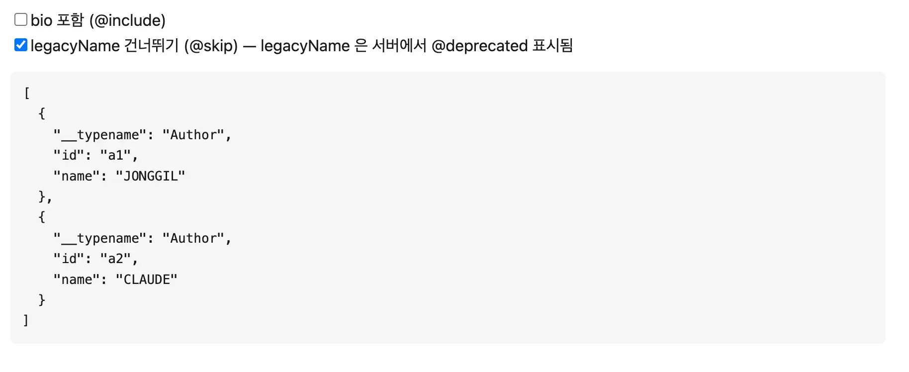
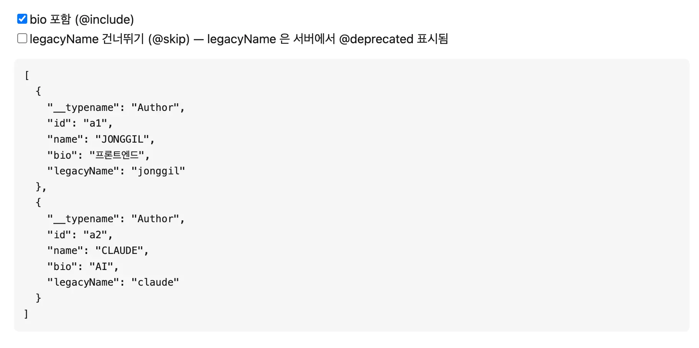
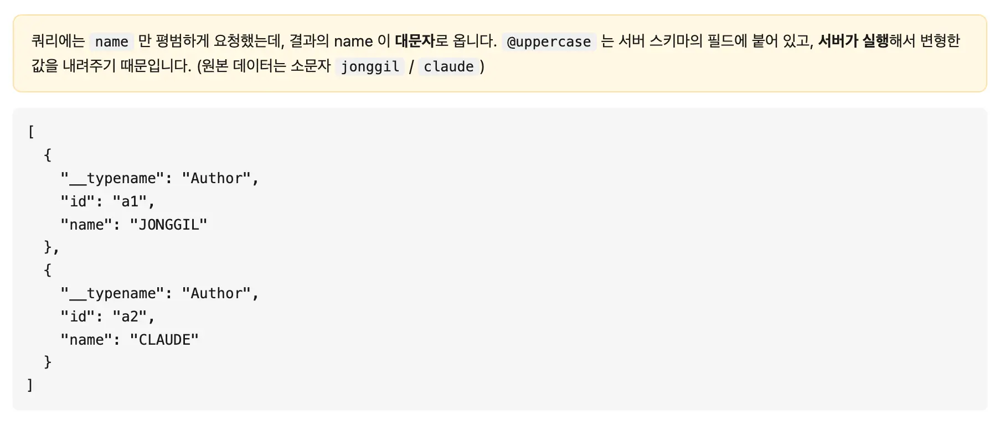
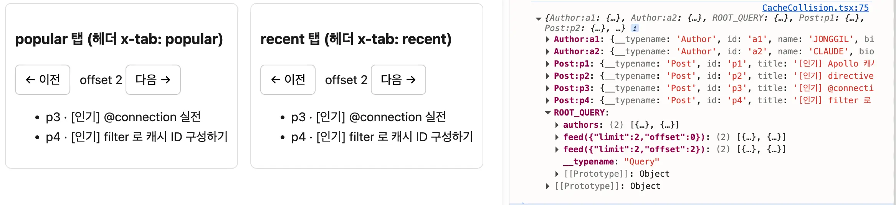
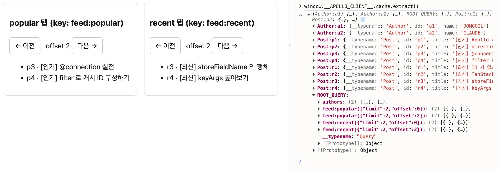

<Callout>백엔드가 빠뜨린 캐시 키, 프론트가 직접 채워 넣기</Callout>

## 탭을 바꿨더니, 옆 탭이 사라졌다

목록을 탭으로 나눠 보여주는 화면이 있었다.
같은 `feed` 데이터를 인기 탭과 최신 탭으로 나누는 동작이다.

그런데 이슈가 생겼다.
인기 탭을 보고 최신 탭으로 옮겼다가 다시 인기 탭으로 돌아오면 인기 탭 자리에 최신 탭의 목록이 들어와 있었다.
분명 다른 탭인데 캐시가 둘을 같은 것으로 취급하면서 나중에 불러온 결과가 앞 결과를 덮어쓴 것이다.

당시 두 탭의 구분은 **HTTP 헤더**로 전달되고 있었다.
두 탭의 쿼리가 완전히 동일했고, 서버가 헤더를 보고 다른 목록을 내려주는 구조였다.

이 과정에서 Apollo는 어떤 기준으로 캐시를 구분하는지 알아볼 필요가 있었다.

TanStack Query를 쓸 때는 이런 고민을 한 적이 없었다.
TanStack Query에서는 `queryKey`를 내가 직접 정한다.
캐시 키의 주도권이 **클라이언트**에 있다.

반면 Apollo에서는 캐시 키가 회색지대처럼 느껴졌다.

해당 글을 통해 Apollo가 캐시를 구분하는 기준이 무엇인지,
나아가 `@connection` directive로 캐시 키를 직접 채워 넣는 방법을 알아보고자 한다.

> 실습 환경: [playground/apollo-directives-and-id](https://github.com/jgjgill/blog/tree/main/playground/apollo-directives-and-id)

## directives가 뭘까?

해결의 열쇠였던 `@connection`은 directive의 하나다.
directive들이 무엇인지부터 가볍게 정리하고자 한다.

**directive는 쿼리나 스키마에 붙이는 `@표식`이다.**
"이 필드를 이렇게 다뤄라"라는 지시를 선언적으로 얹는 것이다.
쿼리 구조 자체를 바꾸거나 코드에서 일일이 분기하지 않고 표식 한 줄로 필드 단위의 동작을 조정한다.

표식 그 자체는 아무 일도 하지 않는다.
그 표식을 보고 실행하는 코드가 존재한다.
기본 제공(built-in) directive로 Apollo나 서버가 그 코드를 이미 갖고 있기도 하고 직접 만드는(custom) directive로 직접 코드를 구성하기도 한다.

이 글에서 알아보는 directive를 정리하면 다음과 같다.

| directive                      | 어디에 붙나 | 무슨 일을 하나                                                 |
| ------------------------------ | ----------- | -------------------------------------------------------------- |
| `@include(if:)` / `@skip(if:)` | 쿼리        | 변수 값으로 특정 필드를 결과에 넣거나 뺀다                     |
| `@deprecated(reason:)`         | 스키마      | "폐기 예정" 표시를 남긴다 (값은 정상 반환)                     |
| `@uppercase` (custom)          | 스키마      | 직접 만든 표식 — 서버가 결과를 가공한다                        |
| `@connection(key, filter)`     | 쿼리        | 클라이언트가 **캐시 칸의 ID를 직접 지정**한다 ← 이 글의 주인공 |

`@include` / `@skip`은 쿼리 문서에서 변수로 필드를 켜고 끈다.
예를 들어 `bio @include(if: $withBio)`는 `$withBio`가 `true`일 때만 `bio`를 결과에 포함한다.
별도의 스키마 선언 없이 바로 쓸 수 있는 built-in이다.





`@deprecated`는 스키마에서 필드에 폐기 표시를 남긴다.
쿼리는 여전히 정상 동작하지만 도구에서 취소선 등으로 보인다.

`@uppercase`는 custom directive다.
스키마 필드에 붙여두면 서버가 그 필드의 결과를 대문자로 바꿔 내려준다.

이처럼 directive는 해당 표식을 보고 결과를 가공하는 코드를 서버에 심을 수 있다.



이러한 directive는 쿼리나 스키마에 붙이는 표식이지만, **Apollo Client의 캐시 키에도 영향을 줄 수 있다.**

다시 문제로 돌아오면 Apollo는 무엇을 기준으로 캐시를 구분할까?

## Apollo가 캐시를 구분하는 기준

Apollo Client는 응답으로 받은 객체를 캐시에 저장할 때, 객체를 `타입이름:id` 형태로 식별한다.
예를 들어 `id`가 `p1`인 `Post`는 `Post:p1`이라는 키로 정규화(normalize)되어 저장된다.

이렇게 **id가 캐시의 근간**이다 보니,
Apollo에서는 캐시 키가 자연스럽게 **백엔드 스키마에서 내려오는 모양**이 된다.
백엔드가 `id`를 잘 채워주면 클라이언트는 별다른 설정 없이도 캐시가 알아서 정규화된다.
TanStack Query에서 `queryKey`를 직접 정하던 것과는 주도권의 위치가 다르다.

그런데 객체 하나하나가 아니라, **쿼리 결과(목록)는 어디에 저장될까?**

목록은 `Post:p1` 같은 객체 키가 아니라, `ROOT_QUERY` 아래 **필드 단위의 칸**에 저장된다.
그리고 이 칸의 이름(`storeFieldName`)을 결정하는 기준이 바로 핵심이다.

같은 필드라도 인자가 다르면 다른 칸에 저장된다.
예를 들어 `feed(offset: 0)`와 `feed(offset: 2)`는 각각 `feed({"offset":0})`, `feed({"offset":2})`라는 별도의 칸을 갖는다.
Apollo가 인자를 칸 이름에 자동으로 끼워 넣어 주기 때문이다.

문제 상황에서 탭 구분은 **쿼리 인자가 아니라 HTTP 헤더**로 전달됐다.
그러니 인기 탭의 `feed`와 최신 탭의 `feed`는 **쿼리가 완전히 동일**했다.
Apollo 입장에서는 인자가 같으니 같은 칸이고, 뒤에 온 응답이 앞 응답을 덮어쓴 것이다.

```graphql
# 두 탭이 보내는 쿼리는 글자 하나 다르지 않다.
# 다른 건 오직 HTTP 헤더(x-tab: popular / x-tab: recent)뿐.
query Feed($offset: Int!, $limit: Int!) {
  feed(offset: $offset, limit: $limit) {
    id
    title
  }
}
```

`ROOT_QUERY` 아래에는 `feed({"offset":0,"limit":2})`라는 칸이 단 하나뿐이다.
`offset`은 쿼리 인자라 칸 이름에 들어갔지만,
탭을 가르는 값은 헤더에 있어 칸 이름에 끼어들지 못했다.
그래서 두 탭이 한 칸을 두고 충돌한다.



만약 탭 구분이 헤더가 아니라 `feed(tab: "popular")`처럼 **쿼리 인자**로 올라갔다면 어땠을까?

그랬다면 Apollo가 `feed({"tab":"popular"})`, `feed({"tab":"recent"})`로 칸을 알아서 구분했을 것이고
애초에 충돌은 일어나지 않았을 것이다.

문제의 본질은 **구분값이 캐시가 볼 수 없는 곳(헤더)에 숨어 있었다는 것**이다.

## 가장 좋은 해결은 백엔드에 있다

Apollo 캐시의 근간은 id다.
이에 가장 근본적인 해결은 **백엔드가 각 목록에 제대로 된 id를 부여해 내려주는 것**이다.
인기 탭과 최신 탭의 목록이 서로 다른 id 체계를 갖는다면, Apollo는 이를 다른 객체로 정규화해 애초에 충돌이 일어나지 않는다.

그게 어렵다면 차선은 **구분값을 쿼리 인자로 받도록 스키마를 바꾸는 것**이다.
`feed(tab: "popular")`처럼 탭을 인자로 올리면, Apollo가 인자를 칸 이름에 끼워 넣어 자동으로 칸을 구분한다.

두 방법 모두 **캐시가 볼 수 있는 곳(쿼리 결과, 쿼리 인자)에 구분값을 드러내는** 것이 핵심이다.
구분값을 캐시가 보이는 곳으로 꺼내주면 된다.

## 백엔드를 못 바꿀 때, @connection으로 직접 채워 넣기

하지만 현실에서는 여러 사정으로 당장 백엔드를 건드리기 어려운 경우가 있다.
이때 프론트에서 캐시 키를 채워 넣는 도구가 `@connection` directive다.
캐시가 헤더 속 구분값을 못 보니, **클라이언트가 직접 칸 이름을 지정해 주는 것**이다.

```graphql
query FeedPopular($offset: Int!, $limit: Int!) {
  feed(offset: $offset, limit: $limit)
    @connection(key: "feed:popular", filter: ["offset", "limit"]) {
    id
    title
  }
}
```

`@connection`은 두 개의 인자로 칸 이름을 구성한다.

- **`key`**: 칸 이름의 기준점
  - `"feed:popular"` / `"feed:recent"`처럼 **탭 구분값을 직접 구성**
  - 쿼리에 드러나지 않던 구분값을 클라이언트가 캐시 키에 주입
- **`filter`**: 칸 이름에 함께 포함할 **인자의 화이트리스트**
  - `["offset", "limit"]`을 넣으면 페이지별로도 칸이 구분되어 각각 따로 보관 가능

따라서 칸 이름이 `feed:popular({...})`와 `feed:recent({...})`로 구분되어 서로 덮어쓰지 않는다.

**백엔드 스키마 작업 없이 가능한 것이다.**



## 마치며

> Apollo는 무엇을 기준으로 캐시를 구분하는가

답은 **쿼리에 드러난 값**이었다.
id, 쿼리 인자 등 쿼리에 드러난 값이 캐시 키의 재료가 된다.
구분값이 헤더처럼 캐시가 볼 수 없는 곳에 숨으면, 캐시는 그 둘을 같은 것으로 취급하게 된다.

TanStack Query에서는 `queryKey`로 캐시 키의 주도권이 처음부터 클라이언트에 있었다.
Apollo에서는 그 주도권이 백엔드 스키마의 id에서 내려오는 듯 느껴졌지만,
`@connection`을 통해 프론트에서도 캐시 키를 통제할 수 있었다.

가장 좋은 해결은 여전히 백엔드가 제대로 된 id를 내려주는 것이다.
하지만 백엔드 수정이 어려운 상황에서 `@connection`은 문제를 해결하기에 좋은 기능이다.

## 참고 문서

- [Apollo Docs - Advanced topics on caching (The `@connection` directive)](https://www.apollographql.com/docs/react/caching/advanced-topics#the-connection-directive)
- [Apollo Docs - Directives (`@connection`)](https://www.apollographql.com/docs/react/data/directives#connection)
