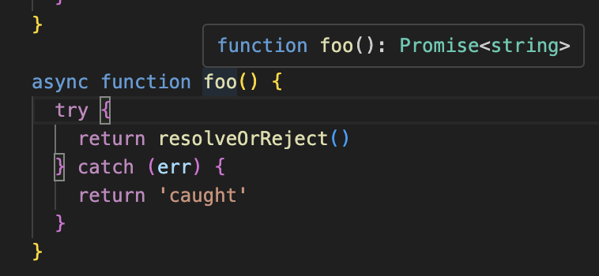

<Callout>
  💡 비동기 함수의 결과를 다루는 방법에 대해 알아봅니다. 피드백은 언제나 환영입니다:)
</Callout>

## 어떻게 비동기 함수를 반환할 것인가


```js
async function foo() {
  return await bar()
}
```

해당 함수에서 이루어지는 비동기에 대한 이해도를 높이고자 한다.

## 예제 코드

이번 글에서는 다음 예제 코드를 사용할 것이다.

```js
async function resolveOrReject() {
  await new Promise((_) => setTimeout(_, 1000))

  const randomResult = Boolean(Math.round(Math.random()))

  if (randomResult) {
    return 'pass'
  } else {
    throw Error('fail')
  }
}
```

- `Promise`를 활용한 비동기로 1초 지연한다.
- 50% 확률로 성공과 실패 가정한다.

### 용어 정리

`resolve`와 `reject`에 대해서는 다음과 같이 사용하고자 한다.

- `resolve` ⇒ 이행하다, 성공하다
- `reject` ⇒ 거부하다, 실패하다

## 들어가기

### 일반적 호출

```js
async function foo() {
  try {
    resolveOrReject() // 아무 작업이 이루어지 않은 상태
  } catch (err) {
    return 'caught'
  }
}
```

<video src="/videos/development/async-function-about-return-await/just-calling.mp4" controls style="max-width:100%;max-height:400px;display:block;margin:1.5rem auto;border-radius:0.5rem;" />

- `Promise`의 비동기 동작, 1초를 기다리지 않는다.
- 호출 결과로 이행/거부와 상관없이 항상 `undefined` 나온다.
- **비동기에 대한 제어권이 없기에 실패에 대한 처리가 불가능**하다.

### await 호출

```js
async function foo() {
  try {
    await resolveOrReject() // await 추가한 상태
  } catch (err) {
    return 'caught'
  }
}
```

<video src="/videos/development/async-function-about-return-await/awaiting.mp4" controls style="max-width:100%;max-height:400px;display:block;margin:1.5rem auto;border-radius:0.5rem;" />

- `Promise`의 비동기 동작, 1초를 기다린다.
- 호출 결과로 이행 시에는 `undefined` 거부 시에는 `caught` 가 나온다.
- `resolveOrReject` 의 결과를 기다리기 때문에 실패에 대한 처리는 가능하다.
- 하지만 **이행되는 값은 받지 못해 성공할 때 `undefined` 가 나오는 상황**이다.

### return 호출

```js
async function foo() {
  try {
    return resolveOrReject() // return 추가한 상태
  } catch (err) {
    return 'caught'
  }
}
```

<video src="/videos/development/async-function-about-return-await/returning.mp4" controls style="max-width:100%;max-height:400px;display:block;margin:1.5rem auto;border-radius:0.5rem;" />

- `Promise`의 비동기 동작, 1초를 기다린다.
- 호출 결과로 이행 시에는 `pass` 거부 시에는 에러가 발생한다.
- 이는 **`resolveOrReject` 결과가 바로 반환**되었기 때문이다.
- `foo` 함수에서 **의도한 실패에 대한 `catch` 가 이루어지지 못하고 있는 상황**이다.

#### async/await은 Promise를 기반으로 한 문법적 설탕

여기서 `return` 으로 동작하는데 `Promise`의 비동기 동작이 가능한 부분이 의문일 수 있다.

**syntactic sugar**

> The term "syntactic sugar" suggests that these language constructs are like sugar-coating on top of the standard syntax,
> making it more palatable or visually appealing.
> The goal is to simplify common tasks and reduce the verbosity of code.

`syntactic sugar` 라는 용어는 표준 구문 위에 설탕을 입힌 것과 같이 더 맛있거나 시각적으로 매력적인 언어 구조를 의미한다.
이를 통해 **작업을 단순화하고 코드를 간결하게 만드는 것**을 목표로 한다.


`async/await`은 `Promise`를 기반 `syntactic sugar` 으로 더 편리하게 사용하기 위해 만들어진 문법이다.
그래서 `async function` 선언으로 하나의 비동기 함수를 정의할 때 **암시적으로 `Promise` 를 사용하여 결과를 반환**한다.



코드로 살펴보자.

다음 두 코드는 동일하게 동작한다.

```js
async function foo() {
  return 1
}
```

```js
function foo() {
  return Promise.resolve(1)
}
```

앞서 `await`만 호출한 경우도 다음과 같다고 볼 수 있다.

```js
async function foo() {
  await 1
}
```

```js
function foo() {
  return Promise.resolve(1).then(() => undefined)
}
```

따라서 `return`만 호출한 `async` 함수에서도 비동기 동작이 가능한 것이다.

### return await 호출

```js
async function foo() {
  try {
    return await resolveOrReject() // return await 추가한 상태
  } catch (err) {
    return 'caught'
  }
}
```

<video src="/videos/development/async-function-about-return-await/return-awaiting.mp4" controls style="max-width:100%;max-height:400px;display:block;margin:1.5rem auto;border-radius:0.5rem;" />

- `Promise`의 비동기 동작, 1초를 기다린다.
- 호출 결과로 **이행 시에는 `pass` 거부 시에는 `caught`** 가 나온다.
- `resolveOrReject` 결과도 기다려서 거부 시 `throw` 가 발생한다.
- 이것이 `catch`로 넘어가 `caught` 까지 정상적으로 호출되는 상황이다.

#### return await이 항상 옳은가?

항상 옳다고는 할 수 없다.
이와 관련해서 [eslint 규칙(no-return-await)](https://eslint.org/docs/latest/rules/no-return-await)을 참고할 수 있다.


앞서 비동기 함수(`async function`)의 동작에서도 알아봤듯이 비동기 함수는 암시적으로 `Promise`를 사용하여 결과를 반환한다.
그래서 대기 중인 프로미스를 해결할 때까지 호출 스택에 현재 함수가 유지된다.
이때 외부 프로미스를 해결하기 전에 추가 마이크로태스크가 필요하게 된다.


하지만 린트 규칙에서 더 이상 사용되지 않는 이유를 살펴봤을 때 성능적인 부분이 개선이 된 것 같다.
이제 자바스크립에서 네이티브 `Promise`가 다르게 처리된다고 한다.
([V8 관련 문서](https://v8.dev/blog/fast-async))

- the removal of two extra microticks
- the removal of the `throwaway` promise.

그래서 대기 상태를 유지하는 것보다 제거하는 것이 더 느려질 수 있는 상황이라고 설명한다.


정리하면 **`return await`은 `try catch` 구문에서 프로미스를 반환하는 다른 함수의 오류를 잡을 때 사용하면 좋다.**

### 마무리

```js
async function foo() {
  return await bar()
}
```

처음과 비교했을 때 이 함수가 굉장히 다르게 느껴질 것이다. 🧐

## 참고 문서

- [await vs return vs return await](https://jakearchibald.com/2017/await-vs-return-vs-return-await/)
- [no return, await, return, await return 의 차이](https://yceffort.kr/2021/02/run-await-return-return-await)
- [no-return-await](https://eslint.org/docs/latest/rules/no-return-await)
- [async function](https://developer.mozilla.org/ko/docs/Web/JavaScript/Reference/Statements/async_function)
