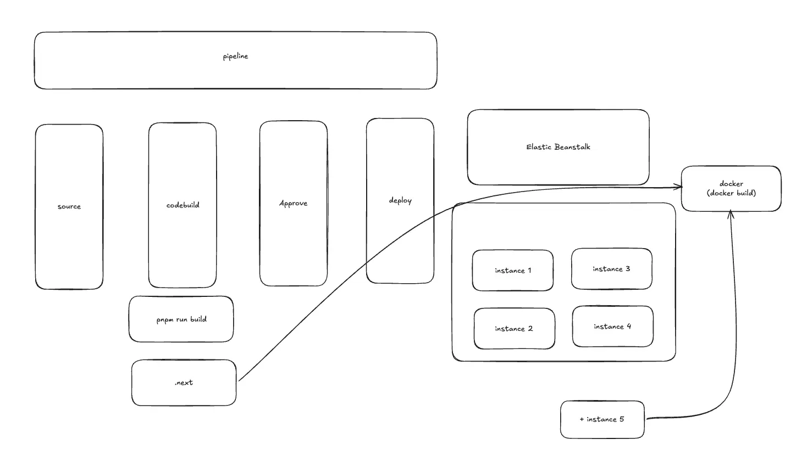
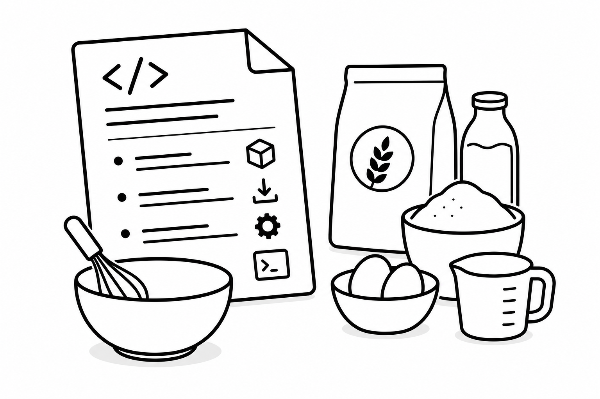
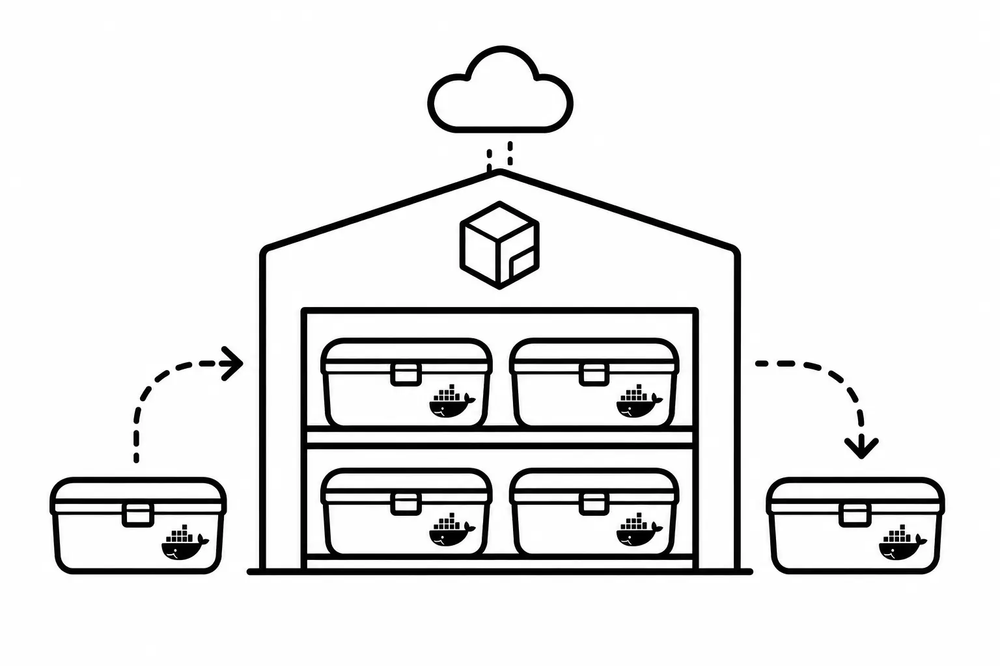
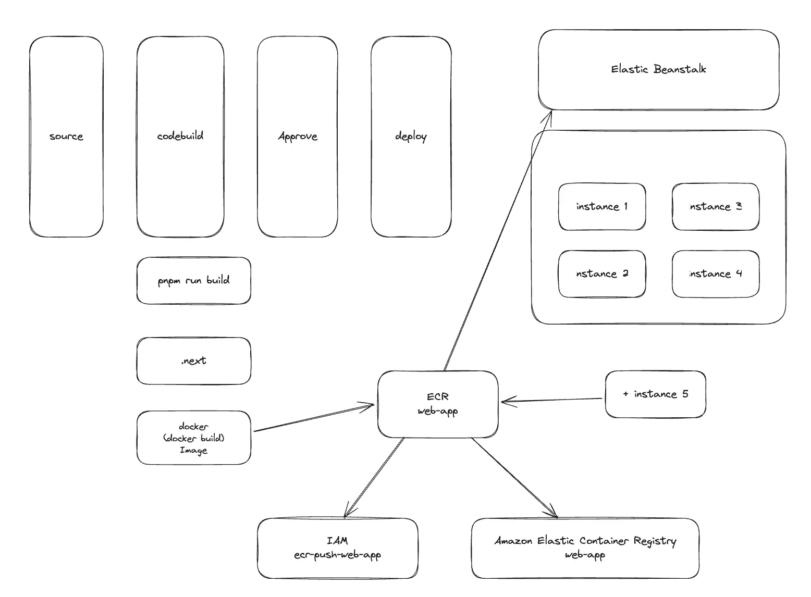

<Callout>build once, run anywhere with ECR</Callout>

## 배포 구조의 문제를 발견하다

모노레포를 준비하다 인프라를 분석하게 되었다.
인프라 구성을 따라가다 보니 배포 흐름에서 한 가지가 걸렸다.



서비스는 여러 대의 인스턴스 위에서 돌아가고 있었다.
그런데 배포가 일어나는 시점에 인스턴스가 개별적으로 빌드를 다시 하고 있었다.

같은 코드인데, 인스턴스마다 그 자리에서 한 번씩 빌드한다.
인스턴스가 4대면 같은 빌드가 4번씩 일어나면서 인스턴스 수만큼 빌드가 반복되는 구조였다.

이렇게 되었을 때 빌드 결과가 인스턴스마다 미묘하게 달라질 여지가 생긴다.
그리고 한 인스턴스에서 빌드가 실패하면 그 인스턴스만 어긋난 상태가 된다.

인스턴스가 늘어날수록 빌드 시간도 함께 늘어난다.
새 인스턴스가 추가되면 그 인스턴스도 처음부터 다시 빌드해야 하므로 그만큼 시간이 더 쌓인다.

빌드는 한 번이면 충분한 일인데, 배포 때마다 인스턴스 수만큼 발생하고 있다.

한 번만 빌드하고 그 결과물을 모두가 나눠 쓸 수는 없었을까?

## Docker 이미지: 레시피가 아니라 완성된 도시락

Docker 이미지가 무엇인지 알아보자.



**소스 코드**는 레시피에 가깝다.
레시피만으로는 먹을 수 없고 누군가 재료를 사서(의존성 설치) 요리를 해야(빌드) 비로소 음식이 된다.


**Docker 이미지**는 요리가 끝난 완성된 도시락이다.
실행에 필요한 환경 — 런타임, 의존성, 빌드 산출물 — 이 통째로 한 덩어리로 동결되어 있다.

|            | 소스 코드                             | Docker 이미지        |
| ---------- | ------------------------------------- | -------------------- |
| 비유       | 레시피                                | 완성된 도시락        |
| 실행하려면 | 직접 요리해야 함 (빌드)               | 열기만 하면 됨       |
| 환경 차이  | 요리하는 사람·주방마다 달라질 수 있음 | 어디서 열어도 똑같음 |

이미지가 "완성된 결과물"이라는 건,
**한 번 만들어두면 어디서 열어도 똑같다**는 뜻이다.

## ECR: 도시락을 보관하는 창고



> ECR(Elastic Container Registry)은 Docker 이미지를 보관하는 AWS의 창고다.

완성된 도시락(이미지)을 만들었으면, 어딘가에 보관해두고 필요할 때 꺼내야 한다.
그 보관 장소가 ECR이다.

- 이미지를 올리는 것: `docker push` (창고에 도시락을 넣는다)
- 이미지를 가져오는 것: `docker pull` (창고에서 도시락을 꺼낸다)

이미지를 한곳에 올려두고 필요한 곳에서 꺼내 쓰는 저장소다.

## 빌드 한 번, 모두가 같은 결과물

ECR을 통해 "빌드 한 번 → 결과물 공유"라는 패턴을 성립시킬 수 있다.

```
[빌드 한 번] → 이미지 → ECR에 보관 → 여러 인스턴스가 같은 이미지를 pull
```

이미지를 ECR이라는 공간에 올려두면 실행하는 인스턴스가 4대든 그 이상이든 모두 똑같은 이미지를 가져다 쓸 수 있다.
모두가 같은 결과물을 바라보게 하는 단일한 기준점이 생기는 것이다.

기존 구조는 인스턴스마다 각자 빌드해서 `build once, run anywhere`와 정반대였다.
이를 ECR을 통해 해결할 수 있는 것이다.

## 작업 사항

실제 다음과 같은 작업이 이루어졌다.
크게 두 군데가 바뀌었다.

### 빌드: 소스를 넘기던 것에서, 이미지를 올리는 것으로

빌드 파이프라인 설정(buildspec)을 비교해 보자.

**AS-IS — 빌드만 하고, 소스 전체를 넘긴다**

```yaml
build:
  commands:
    - pnpm run build
artifacts:
  files:
    - "**/*" # 소스 전체를 번들로 EB에 넘김
```

빌드 단계는 빌드만 한다.
그리고 **소스 전체**를 EB로 넘긴다.
번들을 받은 EB(인스턴스)는 그 소스를 가지고 다시 빌드한다.

**TO-BE — 이미지를 만들어 ECR에 올리고, 쪽지만 넘긴다**

```yaml
build:
  commands:
    - pnpm run build
    - docker build -t ${ECR_URI}:${IMAGE_TAG} .
    - docker push ${ECR_URI}:${IMAGE_TAG} # 이미지를 ECR에 올림
post_build:
  commands:
    - sed -i "s|<ECR_IMAGE>|${ECR_URI}:${IMAGE_TAG}|g" Dockerrun.aws.json
artifacts:
  files:
    - Dockerrun.aws.json # 소스가 아니라 "이미지 주소가 적힌 쪽지"만 넘김
```

빌드 단계가 직접 이미지를 만들어 **ECR에 올린다**(`docker push`).
그리고 EB에 넘기는 것이 소스 전체(`**/*`)가 아니라 `Dockerrun.aws.json` 한 장으로 바뀐다.

해당 변화가 핵심이다.

|       | EB에 넘기는 것                                |
| ----- | --------------------------------------------- |
| AS-IS | `**/*` — 소스 전체 (레시피 한 보따리)         |
| TO-BE | `Dockerrun.aws.json` — 이미지를 가리키는 쪽지 |

### Dockerrun.aws.json

`Dockerrun.aws.json`은 ECR을 도입하면서 새롭게 추가되었다.

```json
{
  "AWSEBDockerrunVersion": "1",
  "Image": {
    "Name": "<ECR_IMAGE>",
    "Update": "true"
  },
  "Ports": [{ "ContainerPort": "3000" }]
}
```

해당 파일을 통해 EB에서 직접 빌드하지 않고 ECR의 이미지를 pull해서 띄울 수 있다.

| 필드                  | 의미                                                                                          |
| --------------------- | --------------------------------------------------------------------------------------------- |
| `Image.Name`          | pull해 올 ECR 이미지 주소. 커밋에는 `<ECR_IMAGE>` 빈칸으로 두고, 빌드 때 실제 주소로 채워진다 |
| `Image.Update`        | `"true"`면 배포할 때마다 최신 이미지를 새로 pull                                              |
| `Ports.ContainerPort` | 컨테이너가 listen하는 포트                                                                    |

EB는 번들에 `Dockerfile`이 있으면 직접 빌드하지만,
`Dockerrun.aws.json`이 있으면 **빌드를 건너뛰고 ECR 이미지를 pull**한다.

## AS-IS / TO-BE — 빌드 위치와 시점이 바뀌다



이번 작업의 본질은 **빌드가 언제, 어디서 일어나는지**가 바뀐 것이다.

|                        | AS-IS (from-source)                     | TO-BE (ECR 이미지)        |
| ---------------------- | --------------------------------------- | ------------------------- |
| **누가 빌드?**         | 각 실행 인스턴스가 저마다 빌드          | 빌드 단계에서 한 번 빌드  |
| **언제 빌드?**         | 배포되는 순간, 인스턴스 위에서          | 배포 이전, 빌드 단계에서  |
| **인스턴스가 받는 것** | 소스 코드 (직접 요리)                   | 완성된 이미지 (도시락)    |
| **결과**               | 빌드 N번 반복 · 환경 편차 · 실패 리스크 | 동일 이미지 보장 · 일관성 |

`AS-IS`에서는 배포 시점에 각 인스턴스가 소스를 받아 그 자리에서 빌드했다.
인스턴스 N대가 각자 요리하니 같은 레시피라도 결과가 미묘하게 달라질 수 있고 빌드도 N번 반복됐다.

`TO-BE`에서는 빌드 전용 단계가 한 번만 빌드해 이미지를 만들고 그 이미지를 ECR에 올린다.
실행 인스턴스는 더 이상 빌드하지 않는다.
ECR에서 **이미 완성된 같은 이미지를 pull해서 실행**만 하면 된다.

빌드라는 작업이 **실행 인스턴스에서 떨어져 나와, 배포 이전의 단계로 옮겨간 것**이다.
실행하는 쪽은 이제 빌드를 알 필요가 없다.

### 참고: 빌드한 곳과 실행되는 곳의 아키텍처가 맞아야 한다

전환을 준비할 때 한 가지 주의점이 존재했다.

빌드와 실행이 분리되면서 **두 곳이 서로 다른 머신**이 될 수 있다.

- **빌드하는 곳**: 빌드 단계가 도는 머신. 여기서 이미지를 만든다.
- **실행되는 곳**: 서비스가 실제로 도는 인스턴스. 여기서 이미지를 돌린다.

문제는 이 두 머신의 **CPU 아키텍처**가 다를 수 있다는 점이다.

ARM과 x86을 예로 들어보자.

**ARM과 x86은 CPU가 명령어를 알아듣는 방식(언어)이 서로 다른 두 종류다.**

- **x86**: 전통적으로 데스크톱·서버에서 쓰던 방식
- **ARM**: 전력 효율이 좋아 모바일에서 출발해 이제 서버·노트북까지 쓰이는 방식 (Apple의 M 시리즈 칩이 ARM이다)

Docker 이미지(도시락)에는 만든 곳의 CPU 언어가 박힌다.
그래서 빌드한 곳과 실행되는 곳의 아키텍처가 어긋나면 이미지를 열지 못한다.

```
빌드하는 곳:  x86  (x86 언어로 도시락을 만듦)
실행되는 곳:  ARM  (ARM 언어만 알아들음)
              ↓
도시락을 열어보니 "못 읽는 언어"
              ↓
exec format error  ← "이 실행 형식을 이해 못하겠다"
```

이번 환경은 실행 인스턴스가 ARM 계열이었다.
따라서 빌드하는 곳도 ARM으로 맞추었다.

## 마치며

**ECR을 도입해 Docker의 `build`와 `run`을 분리**했다.

기존에는 빌드와 실행이 같은 인스턴스에서 배포 시점에 뭉쳐 있었다.
작업 이후에는 빌드를 한 번만 해서 이미지로 만들고 그 이미지를 ECR에 올려두어 실행 인스턴스는 그 이미지를 pull해서 실행만 한다.
빌드와 실행 사이를 ECR이 이어주면서 둘이 비로소 분리됐다.

Docker가 원래 의도한 **build once, run anywhere** 개념을 실현하게 되었다.
