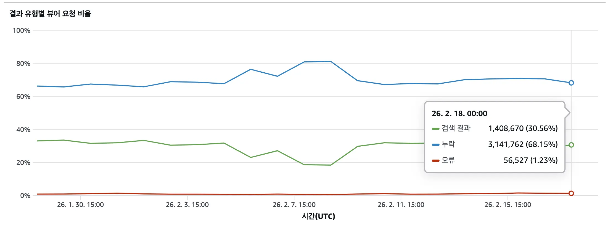
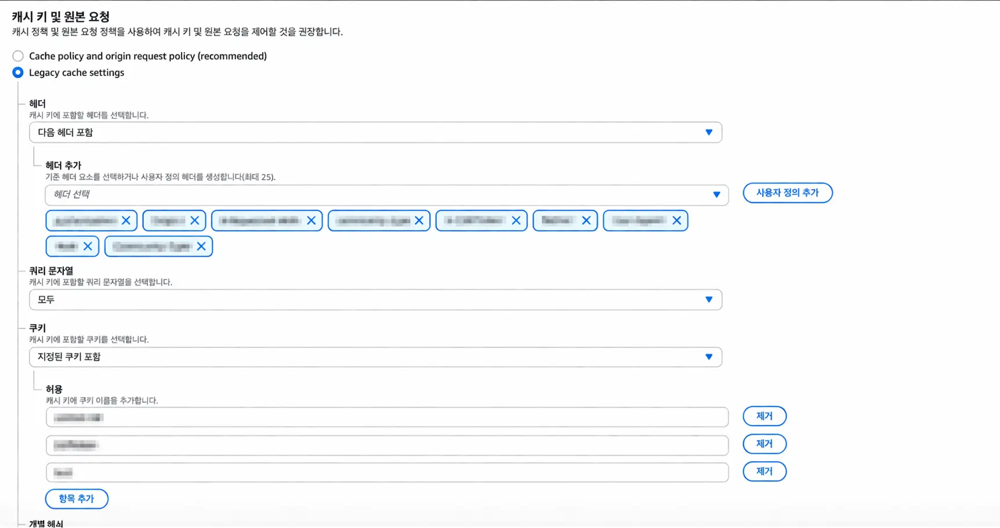
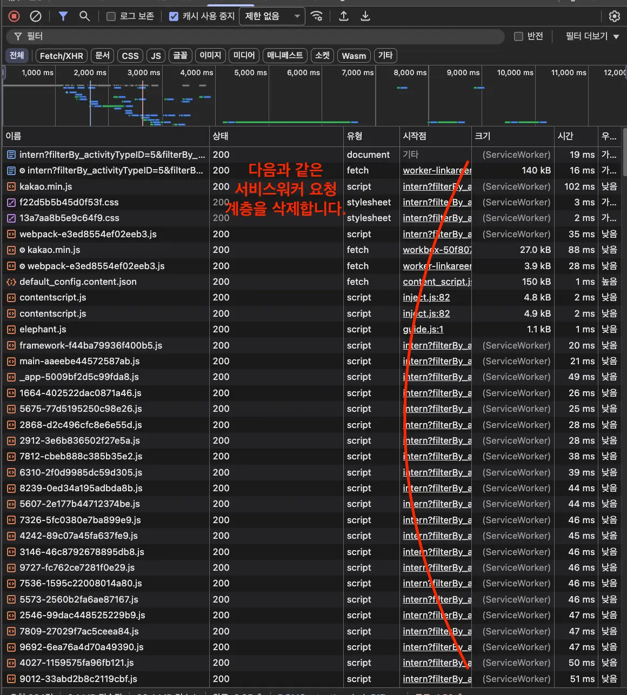
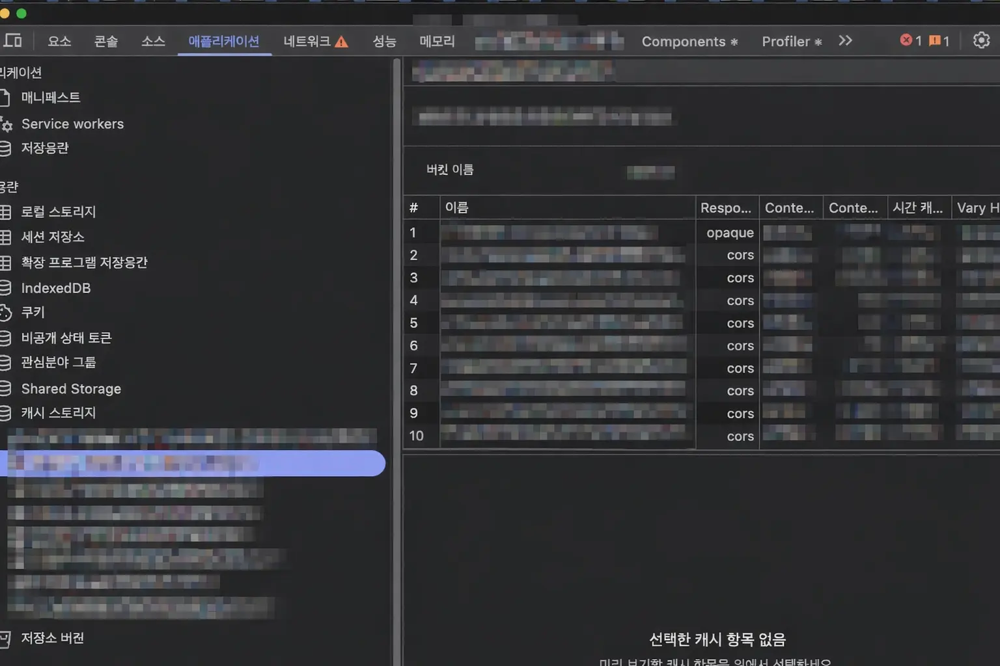
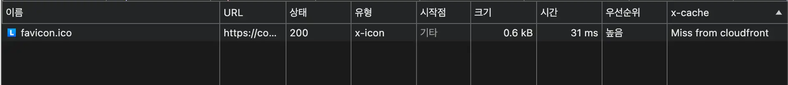
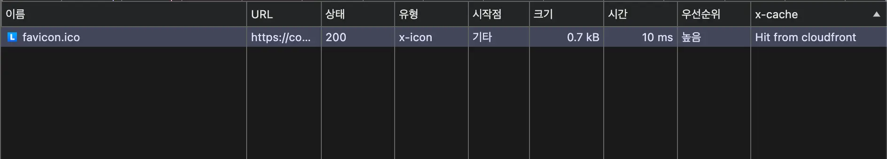
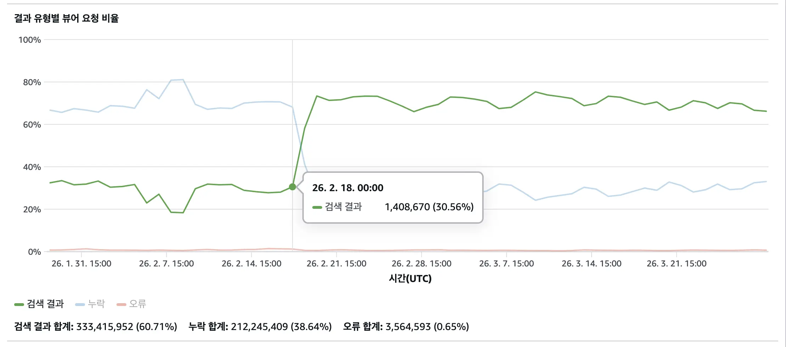
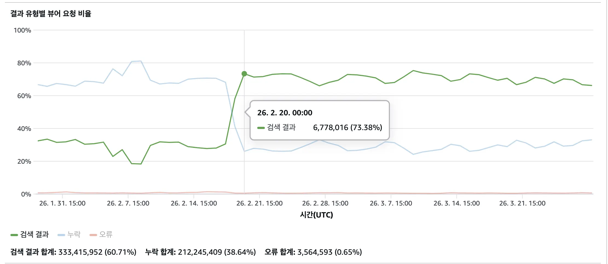
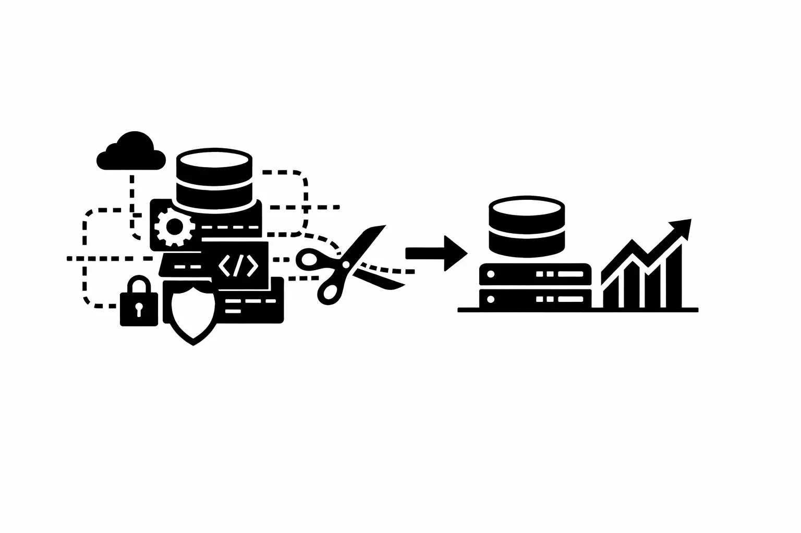

<Callout>
  복잡하게 얽힌 세 레이어를 단순하게 - 캐시 히트율 30%에서 70%로
</Callout>

## 들어가며

CloudFront 캐시 히트율이 30%였다.



숫자에서 의구심이 생겼다. 뭔가를 얻으려고 쌓은 구조인데, 얻는 것보다 잃는 것이 더 많아 보였다.

문제를 파고들수록 원인은 하나가 아니었다.
세 개의 캐싱 레이어가 중첩되어 있었고 시간이 지나면서 히스토리를 아는 사람도 없게 됐다.
아무도 손대지 못하는 구조로 굳어진 것이다.

복잡하게 얽힌 구조를 단순하게 걷어내는 과정을 기록한다.

---

## 세 겹으로 쌓인 캐싱 레이어

당시 서비스의 캐싱 구조는 세 레이어로 구성되어 있었다.

```
요청
 └─ 서비스 워커 (모든 요청 가로챔)
     └─ 브라우저 캐시 (HTTP 헤더 기반)
         └─ CloudFront (CDN Edge 캐시)
             └─ 오리진 서버
```

레이어가 많다고 나쁜 건 아니다. 문제는 **각 레이어가 왜 있는지, 어떻게 동작하는지 아무도 파악하지 못하고 있었다는 점**이다.

- 기존 CloudFront 정책은 도입한 사람도, 히스토리도 남아있지 않았다.
- `_app.tsx`에 모든 페이지에 일괄 적용되는 `Cache-Control: max-age=${10 * 60}` 설정이 있었다.
- 서비스 워커가 모든 네트워크 요청을 가로채고 있었다.

캐시 키에 헤더, 쿠키, 쿼리 문자열이 모두 포함되어 있었다. 같은 리소스라도 요청마다 다른 캐시 키로 인식되어 히트율이 낮을 수밖에 없는 구조였다.



---

## 서비스 워커가 낭비를 만들고 있었다

서비스 워커는 오프라인 지원, 푸시 알림 같은 목적에 활용되는 도구이고 의도적으로 캐싱 레이어로 사용하는 경우도 있다.
하지만 당시 서비스 워커는 모든 네트워크 요청을 가로채고 있었다.



Next.js는 페이지 진입 시 여러 리소스 요청을 발생시킨다. 서비스 워커가 모든 요청을 가로채는 상황에서는 모든 요청이 메인 스레드 → 서비스 워커 → 네트워크 경로를 거치게 된다. 요청 수가 많을수록 이 왕복 오버헤드가 누적됐다.



서비스 워커 내에도 별도 캐시 레이어가 존재했다. CloudFront, 브라우저 캐시, 서비스 워커 캐시로 동일 리소스가 세 번 캐싱될 수 있는 구조였다.

### 서비스 워커 캐시가 만든 탭 간 버그

서비스 워커 캐시는 탭 간에 공유된다. 이로 인해 다음과 같은 현상이 발생했다.

- A 탭에서 모바일 환경으로 접속
- B 탭에서 데스크톱으로 새로고침
- B 탭이 서비스 워커 캐시의 모바일 응답을 그대로 서빙

기존 팀 내에서 논이슈로 알려진 이슈였는데 이번에 서비스 워커를 파악하면서 원인을 알게 됐다.
서비스 워커가 없었다면 발생하지 않았을 버그였던 것이다.

---

## 단순하게 만드는 방향

분석을 마친 뒤 세 가지 방향으로 정리했다.

### 1. 서비스 워커 캐싱 전략 제거

`registerRoute`로 등록된 모든 캐싱 전략을 제거했다. 오프라인 폴백과 FCM 웹 푸시 기능만 남겼다.

```js
// commonSw.js — 변경 후
self.addEventListener("fetch", (event) => {
  // 캐싱 로직 없이 네트워크 요청을 그대로 전달
});
```

서비스 워커가 요청을 가로채지 않으므로 메인 스레드와의 왕복 오버헤드가 사라진다. 탭 간 캐시 공유 문제도 함께 해소된다.

### 2. `_app` 일괄 캐시 헤더 제거

`_app.tsx`에 모든 페이지에 적용되던 `Cache-Control: max-age=${10 * 60}` 설정을 제거했다.

동적인 기능이 많은 서비스에서 모든 페이지를 일괄 캐싱하면 개인화 데이터 처리 복잡도가 크게 올라간다. 캐싱이 필요한 페이지(약관 등 정적 페이지)에서만 개별적으로 설정하는 방향이 적합하다고 판단했다.

### 3. CloudFront 경로별 정책 재설계

가장 핵심적인 변경이다. 기존의 단일 경로 Legacy 정책을 제거하고, 경로별로 정책을 분리했다.

| 경로              | 캐시 정책                | 이유                                   |
| ----------------- | ------------------------ | -------------------------------------- |
| `/_next/static/*` | Managed-CachingOptimized | Next.js 빌드 파일, 해시 기반 불변 파일 |
| `/static/*`       | Managed-CachingOptimized | 커스텀 정적 자산                       |
| `/images/*`       | Managed-CachingOptimized | public 폴더 이미지                     |
| `/fonts/*`        | Managed-CachingOptimized | public 폴더 폰트                       |
| `/*` (Default)    | CachingDisabled          | 동적 HTML 문서                         |

동적 서비스에서 HTML 문서 자체를 캐싱하면 개인화 데이터 처리가 복잡해진다. HTML은 캐싱하지 않고, 모든 사용자에게 동일하게 제공되는 정적 자원만 선택적으로 캐싱했다.

Next.js 빌드 파일(`/_next/static/*`)은 이미 `Cache-Control: public, max-age=31536000, immutable` 헤더가 자동으로 설정된다.

`/images/*`, `/fonts/*` 등 public 폴더 리소스에는 `s-maxage`를 추가해 CloudFront에서 캐싱 무효화(Invalidation)를 통해 제어할 수 있도록 했다.

`Cache-Control` 헤더에는 두 가지 TTL 지시자가 있다.

- **`max-age`**: 브라우저(클라이언트)가 캐시를 유지하는 시간
- **`s-maxage`**: CDN 같은 공유 캐시(shared cache)가 캐시를 유지하는 시간. `max-age`보다 우선 적용된다.

두 값을 분리하면 브라우저와 CDN의 캐싱 동작을 독립적으로 제어할 수 있다.

```js
// next.config.js
headers() {
  return [
    {
      source: '/images/:path*',
      headers: [
        {
          key: 'Cache-Control',
          value: 'public, max-age=0, s-maxage=31536000',
        },
      ],
    },
    // ...
  ]
},
```

`max-age=0`으로 브라우저 캐시를 비활성화하고, `s-maxage=31536000`으로 CloudFront에서만 1년간 캐싱한다. 브라우저는 항상 CloudFront Edge에 요청하지만, Edge에서 캐싱된 응답을 돌려주므로 오리진 서버까지 요청이 전달되지 않는다. 배포 후 필요할 때 CloudFront Invalidation으로 Edge 캐시만 제거할 수 있어 제어권도 유지된다.

---

## 결과: 30% → 70%

### favicon.ico 사례

favicon.ico는 모든 페이지 요청마다 발생하는 작지만 빈번한 요청이다.





적용 전에는 `Miss from cloudfront`로 오리진까지 요청이 전달됐다. 적용 후 `Hit from cloudfront`로 Edge에서 바로 응답이 오면서 응답 시간도 31ms → 10ms로 단축됐다. 이와 같은 개선이 이미지, 폰트, JS/CSS 등 모든 정적 자원에 동일하게 적용된다.

### 캐시 히트율 변화





2월 18일 배포 이후 캐시 히트율이 30%에서 70%대로 올라섰다. 구조를 단순하게 만들면서 실질적인 효과도 함께 따라왔다.

---

## 마치며



레이어가 늘어날수록 이득이 커질 거라 생각했지만, 실제로는 관리 비용만 함께 쌓이고 있었다.
**히스토리가 없는 레이어는 자산이 아니라 부채**였다.

이번 작업의 핵심은 새로운 것을 추가한 게 아니라 **불필요한 것을 걷어낸 것**이었다.

- 서비스 워커 캐시 레이어 제거
- 일괄 적용되던 `Cache-Control` 헤더 제거
- 복잡하게 얽힌 CF 캐시 키 단순화

단순한 구조에서 핵심에 집중하자.
