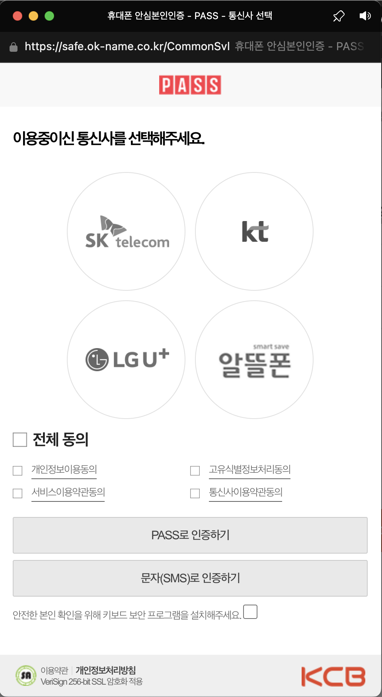
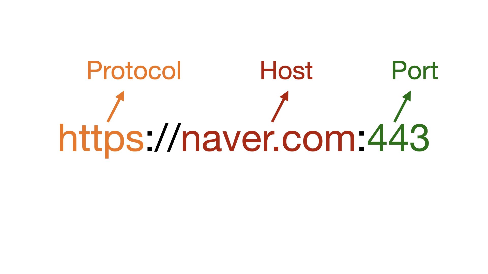
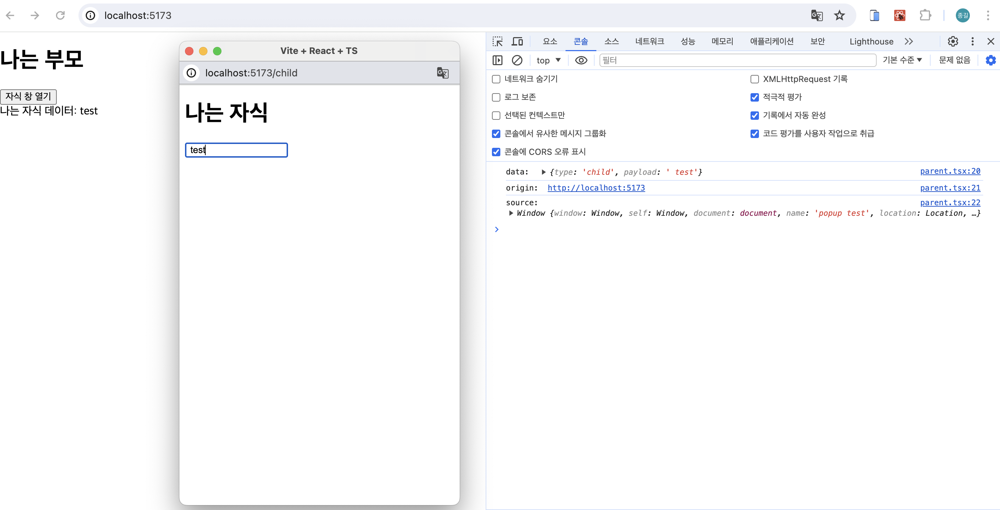
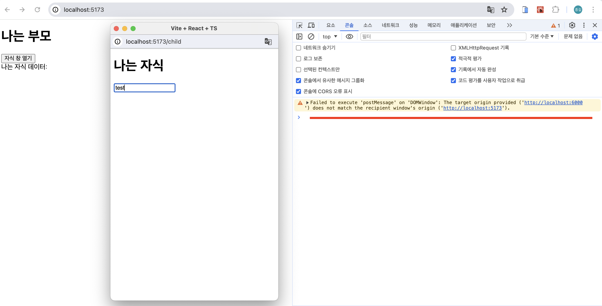

<Callout>
  💡 postMessage로 다른 창에서 통신하는 방법에 대해 알아봅니다. 피드백은 언제나
  환영입니다:)
</Callout>

## 어떻게 서로 다른 창에서 데이터 통신할 수 있을까?

PASS 인증을 구현해야 했다.

보통 PASS 인증 과정에서 다음과 같이 새로운 창이 생겨난다.



새로 생긴 창에서 성공 혹은 실패에 대한 응답을 받아 원래 페이지에서 동작을 처리하는 것이 필요하다.

어떻게 할 수 있을까?

## postMessage

`postMessage`는 `Window` 객체 간에 **교차 출처(cross-origin)통신을 안전하게 지원**한다.

일반적인 상황에서 서로 다른 페이지의 스크립트는 **동일 출처 정책**(SOP)으로 출처 페이지가 **동일한 프로토콜, 포트 번호, 호스트**를 공유하는 경우에만 접근할 수 있다.



여기서 `postMessage`는 SOP를 안전하게 우회하는 제어 메커니즘을 제공한다.


보통 `postMessage`는 다음과 같은 경우에 사용된다.

- 페이지와 페이지가 생성한 팝업
- 페이지와 페이지 안에 삽입한 `iframe`

## 실습 예제

코드로 빠르게 이해해보자.

예제 환경은 `vite (react + ts)` , `react router dom`을 활용해서 진행된다.


**main.tsx**

```tsx
import React from 'react'
import ReactDOM from 'react-dom/client'
import { RouterProvider, createBrowserRouter } from 'react-router-dom'
import Parent from './parent.tsx'
import Child from './child.tsx'

const router = createBrowserRouter([
  { path: '/', element: <Parent /> },
  { path: '/child', element: <Child /> },
])

ReactDOM.createRoot(document.getElementById('root')!).render(
  <React.StrictMode>
    <RouterProvider router={router} />
  </React.StrictMode>,
)
```


두개의 경로를 지정해준다.

- `/` 경로: 자식 창을 생성하는 페이지 역할
- `/child` 경로: 자식 창으로 부모 페이지에 데이터 전송하는 팝업 역할


**parent.tsx**

```tsx
import { useEffect, useState } from 'react'

export default function Parent() {
  const [childData, setChildData] = useState('')

  const onClick = () => {
    window.open(
      'http://localhost:5173/child', // url
      'popup test', // target
      'popup, width=400, height=600, left=100, top=100', // windowFeatures
    )
  }

  useEffect(() => {
    const childMessage = (e: MessageEvent) => {
      if (e.data.type !== 'child') {
        return
      }

      console.log('data: ', e.data)
      console.log('origin: ', e.origin)
      console.log('source: ', e.source)

      setChildData(e.data.payload)
    }

    window.addEventListener('message', childMessage)

    return () => {
      window.removeEventListener('message', childMessage)
    }
  }, [])

  return (
    <div>
      <h1>나는 부모</h1>

      <button onClick={onClick}>자식 창 열기</button>
      <div>나는 자식 데이터: {childData}</div>
    </div>
  )
}
```


`onClick` 함수에는 `window.open()` 메서드를 통해 팝업 창을 생성한다.
`url`, `target`, `windowFeatures`에 적절하게 값을 넣는다.


`useEffect`에서는 이벤트에 대한 동작이 정의된다.
`message`에 대한 이벤트를 대기시켜 `postMessage`로 전송된 이벤트가 전달된다.


**child.tsx**

```tsx
export default function Child() {
  const onChange = (e: React.ChangeEvent<HTMLInputElement>) => {
    window.opener.postMessage({ type: 'child', payload: e.target.value }, '*')
  }

  console.log(window.opener)

  return (
    <div>
      <h1>나는 자식</h1>
      <input onChange={onChange} />
    </div>
  )
}
```


`opener` 속성은 `open()` 혹은 `target` 속성이 있는 링크를 탐색하여 창을 연 창에 대한 참조를 반환한다.

`postMessage` 메서드를 통해 부모 페이지에 데이터를 전송한다.


콘솔 및 동작을 살펴보자.


**콘솔**




- `data`: `postMessage`에서 전송한 데이터가 전송된다.
- `origin`: `postMessage`가 호출될 때 메시지를 보낸 창의 `origin`이 전송된다.
- `soruce`: 메시지를 보낸 `window` 객체의 참조가 전송된다. `window.open()`으로 창을 열 때 설정한 `popup test`가 눈에 띈다.


**동작**

<video src="/videos/development/communicate-from-another-window-with-postmessage/postmessage-example.mp4" controls style="max-width:100%;max-height:400px;display:block;margin:1.5rem auto;border-radius:0.5rem;" />


### 보안 고려하기

비밀번호같이 민감한 정보를 전달하는 경우도 발생할 수 있다.
이때 `targetOrigin`을 제한하는 것이 좋다.

현재 `child.tsx` 코드에서 `postMessage`의 `targetOrigin`을 `*`에서 잘못된 `origin url`인 `http://localhost:6000`으로 변경해보자.


**child.tsx**

```tsx
const onChange = (e: React.ChangeEvent<HTMLInputElement>) => {
  window.opener.postMessage({ type: 'child', payload: e.target.value }, '*')
}
```


그럼 다음과 같이 에러가 발생한다.



올바른 `origin`으로 변경 `*`로 구성했던 처음 동작과 같이 정상적으로 동작한다.

(예제의 경우 `http://localhost:5173`)


민감한 정보의 경우 `targetOrigin`을 명시적으로 정의해주자.


### 부모에서도 자식에 데이터 전송하기

`source`를 활용하여 양방향 통신을 설정해보자.

대문자로 변환해서 자식 창에 전달할 것이다.


**parent.tsx**

```tsx
useEffect(() => {
  const childMessage = (e: MessageEvent) => {
    if (e.data.type !== 'child' || !e.source) {
      return
    }

    setChildData(e.data.payload)

    e.source.postMessage(
      { type: 'parent', payload: e.data.payload.toLocaleUpperCase() },
      { targetOrigin: e.origin },
    )
  }

  window.addEventListener('message', childMessage)

  return () => {
    window.removeEventListener('message', childMessage)
  }
}, [])
```


**child.tsx**

```tsx
useEffect(() => {
  const childMessage = (e: MessageEvent) => {
    if (e.data.type !== 'parent') {
      return
    }

    console.log(e.data.payload)
  }

  window.addEventListener('message', childMessage)

  return () => {
    window.removeEventListener('message', childMessage)
  }
}, [])
```


**동작**

<video src="/videos/development/communicate-from-another-window-with-postmessage/postmessage-two-way-example.mp4" controls style="max-width:100%;max-height:400px;display:block;margin:1.5rem auto;border-radius:0.5rem;" />

양방향 통신도 정상적으로 동작한다.

## 참고 문서

- [Window: open() method](https://developer.mozilla.org/en-US/docs/Web/API/Window/open)
- [Window: opener property](https://developer.mozilla.org/en-US/docs/Web/API/Window/opener)
- [Window: postMessage() method](https://developer.mozilla.org/en-US/docs/Web/API/Window/postMessage)
