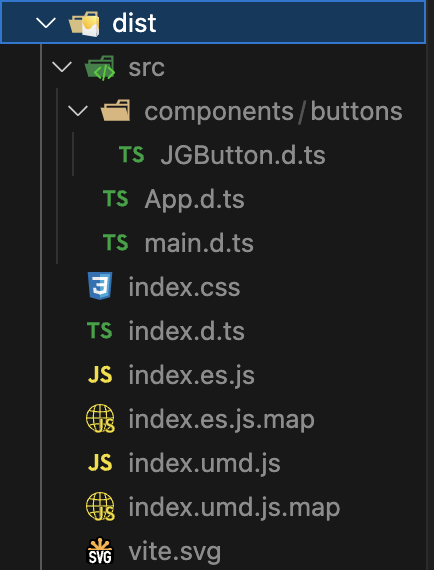
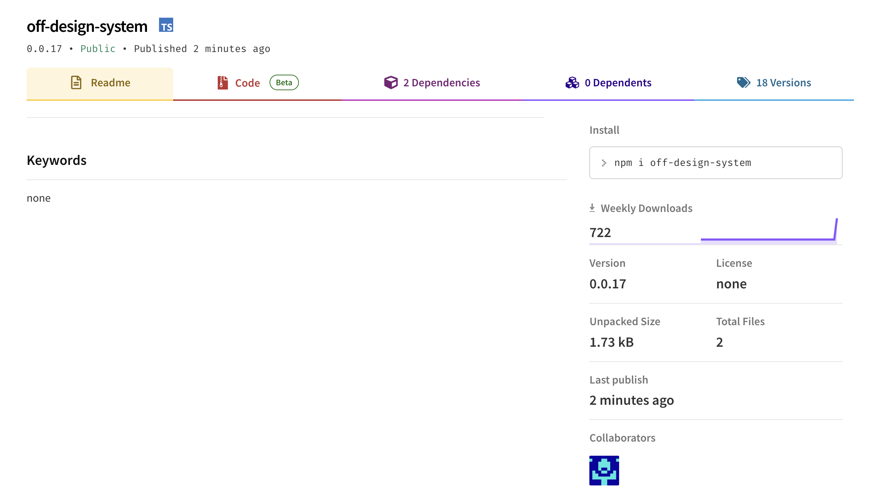
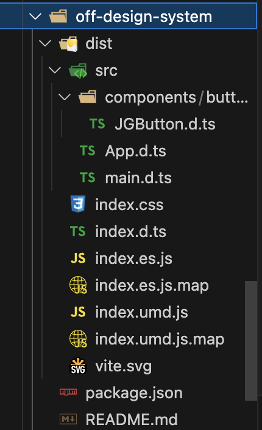

<Callout>
  💡 나만의 컴포넌트 라이브러리를 만들어봅니다. 피드백은 언제나 환영입니다:)
</Callout>

해당 글은 Vite+TypeScript+TailwindCSS 환경에서 npm에 배포하는 과정을 담고 있습니다.

## 기본 환경 세팅

Vite와 관련된 기본 세팅부터 시작하자.
관련 명령어를 실행한다.

```bash
npm create vite@latest
yarn create vite
```

`React+TypeScript` 환경을 선택한다.

`Tailwind` 또한 기본 설치 명령어들을 실행한다.

```bash
npm install -D tailwindcss postcss autoprefixer
npx tailwindcss init -p
```

추가된 파일에서 `tailwind.config.js` 경로를 지정한다.

```js
/** @type {import('tailwindcss').Config} */
export default {
  content: ['./index.html', './src/**/*.{js,ts,jsx,tsx}'],
  theme: {
    extend: {},
  },
  plugins: [],
}
```

`./src/index.css`에 `Tailwind` 스타일을 추가한다.

```css
@tailwind base;
@tailwind components;
@tailwind utilities;
```

스토리북 설치 명령어를 실행한다.

```bash
npx storybook@latest init
```

스토리북 관련된 플러그인들도 안내에 따라 설치하자.

설치된 스토리북 관련 파일들에서 `preview.ts`에 `Tailwind` 스타일을 추가한다.

```tsx
import type { Preview } from '@storybook/react'
// add next line
import '../src/index.css'

const preview: Preview = {
  // ...
}
```

여기까지 진행했으면 기본적인 프로젝트 세팅은 끝난 것이다.

## npm 배포 관련 작업

이제부터 `npm` 배포와 관련된 작업을 진행하자.

현재 하고자 하는 일은 **컴포넌트 라이브러리**를 만드는 것이다.

그래서 컴포넌트를 루트 경로에 내보내는 작업이 필요하다.


`components`폴더에 테스트 버튼을 만들어보고 루트 경로의 `index.ts`로 내보낸다.


**components/buttons/JGButton.tsx**

```tsx
const JGButton = (props: React.ButtonHTMLAttributes<HTMLButtonElement>) => {
  const { className, ...restProps } = props

  return (
    <button {...restProps} className={`${className} bg-blue-400 hover:bg-blue-700`} />
  )
}

export default JGButton
```

**루트 경로**

```tsx
export { default as JGButton } from './src/components/buttons/JGButton'
```

라이브러리에서 타입스크립트가 적용되기 때문에 관련된 설정이 필요하다.

`vite`에서는 이와 관련된 플러그인으로 `vite-plugin-dts`가 존재한다.
이를 설치해주자.

```bash
npm i -D vite-plugin-dts
```

설치된 플러그인을 `vite` 설정에 추가해야 한다.

**vite.config.ts**

```ts
import { defineConfig } from 'vite'
import react from '@vitejs/plugin-react'
import dfs from 'vite-plugin-dts'

// https://vitejs.dev/config/
export default defineConfig({
  plugins: [react(), dfs()],
})
```

이제 라이브러리에 대한 설정이 본격적으로 필요하다.
우선 코드는 다음과 같다.

타입 관련 에러가 뜨는 경우 `@types/node`를 설치해주자.

```ts
import { defineConfig } from 'vite'
import react from '@vitejs/plugin-react'
import dfs from 'vite-plugin-dts'
import path from 'path'

// https://vitejs.dev/config/
export default defineConfig({
  plugins: [react(), dfs()],
  build: {
    lib: {
      entry: path.resolve(__dirname, 'index.ts'),
      name: 'OFF-Desgin-System',
      fileName: (format) => `index.${format}.js`,
    },
    rollupOptions: {
      external: ['react', 'react-dom'],
      output: {
        globals: {
          react: 'React',
          'react-dom': 'ReactDOM',
        },
      },
    },
    sourcemap: true,
    emptyOutDir: true,
  },
})
```

주요 속성을 하나씩 살펴보자.

`build.lib`에서는 `entry`, `name`, `fileName`이 사용된다.

`entry`는 라이브러리같은 경우 `HTML`을 `entry`로 사용할 수 없어 작성이 필요하다.

`name`은 노출된 전역 변수로 형식에 `umd` 혹은 `iife`가 포함되는 경우 필수이다.

`fileName`은 패키지 파일 출력의 이름으로 기본 `fileName`은 `package.json`의 이름 옵션이다.


다음으로 `rollupOptions`이 있는데 현재 작업하고 있는 라이브러리는 무조건적으로 리액트에서 사용된다.
그래서 라이브러리를 사용하는 입장에서도 리액트가 사용되기 때문에 라이브러리에서 해당 패키지들을 번들에 포함시킬 필요가 없다.

즉 불필요한 용량을 차지하는 것을 막기 위한 작업이다.
`react`와 `react-dom`을 번들에 포함시키지 않는다.


다음으로 `tsconfig.json`에서 작업을 진행한다.

**tsconfig.json**

```json
{
  "compilerOptions": {
    // ... other compiler options
    "declaration": true,
    "allowSyntheticDefaultImports": true
  },
  "include": ["index.ts", "src"]
}
```

`declaration` 속성은 프로젝트 내 ts, js 파일에 대한 `.d.ts` 파일을 생성한다.
`true`로 설정되면 다음과 같이 컴파일러가 실행된다.


해당 코드가

```ts
export let helloWorld = 'hi'
```

아래와 같은 `index.ts` 파일의 생성과 함께

```ts
export let helloWorld = 'hi'
```

`helloWorld.d.ts` 파일이 생성된다.

```ts
export declare let helloWorld: string
```

`allowSyntheticDefaultImports` 속성은 `import`와 관련된 작업이다.

해당 `import`를

```tsx
import React from 'react'
```

다음과 같이 사용하는 것을 허용한다.

```tsx
import * as React from 'react'
```

다음으로 `package.json`에서 작업이 진행된다.
우선 간략하게 요약하면 다음과 같은 코드가 추가된다.

```json
{
  "name": "my-lib",
  "type": "module",
  "files": ["dist"],
  "main": "./dist/my-lib.umd.cjs",
  "module": "./dist/my-lib.js",
  "exports": {
    ".": {
      "import": "./dist/my-lib.js",
      "require": "./dist/my-lib.umd.cjs"
    }
  }
}
```

현재 프로젝트에 맞게 적용하면 다음과 같다.
`main`, `types`, `exports`, `files`, `module`을 추가한다.

```json
{
  "name": "off-design-system",
  "private": false,
  "version": "0.0.0",
  "type": "module",
  "main": "dist/index.es.js",
  "types": "dist/index.d.ts",
  "exports": {
    ".": {
      "import": "./dist/index.es.js",
      "require": "./dist/index.umd.js",
      "types": "./dist/index.d.ts"
    },
    "./package.json": "./package.json",
    "./dist/*": "./dist/*"
  },
  "files": ["/dist"],
  "publishConfig": {
    "access": "public"
  },
  "scripts": {
    // ...
  },
  "dependencies": {
    // ...
  },
  "devDependencies": {
    // ...
  }
}
```

스크립트와 관련해서 `Tailwind`와 관련된 명령어도 추가해주자.
라이브러리를 사용할 때 스타일 코드가 있어야 하기 때문에 필요하다.

```json
"scripts": {
  // ...
  "build": "tsc && vite build && npm run tailwind",
  "tailwind": "npx tailwindcss -o ./dist/index.css --minify",
  // ...
},
```

여기까지 했으면 모든 작업을 마무리한 것이다.


npm 배포는 쉽게 할 수 있다.

우선 `npm login`으로 터미널에서 npm 로그인을 진행한다.

```bash
npm login
```

해당 정보를 입력한다.

```plain text
Username: ID
Password: PW
Email: 회원가입 한 이메일
OTP: 이메일을 입력하고 난 다음 해당 메일에 OTP 번호를 입력하면 됩니다.
```

`npm run build`를 통해 라이브러리에 사용될 파일들을 생성한다.



그 다음 `npm publish`를 입력하면 배포가 진행된다.
여기서 주의할 점은 새롭게 npm에 배포할 때는 이전 버전보다 높아야 한다.


잘 배포가 되었다면 다음과 같이 npm에서 확인할 수 있다.



라이브러리는 다음과 같이 사용할 수 있다.

```bash
npm install off-design-system
yarn add off-design-system
```

라이브러리가 설치되면 `node_modules`에서 라이브러리 내용을 확인할 수 있다.



여기서 만들어진 `index.css`를 사용하기 위해 프로젝트에 해당 스타일을 추가하는 코드가 필요하다.

```tsx
import 'off-design-system/dist/index.css'
```

이제 다음과 같이 사용할 수 있다.


현재 작업은 정말 기본적인 라이브러리 배포와 관련된 내용임을 참고하시길...

빠르게 만들어봤으니 점점 그럴듯한 라이브러리로 만들어나가자..! 😇

[off-design-system](https://www.npmjs.com/package/off-design-system)

## 참고 문서

- [serif-ui-components](https://github.com/serifcolakel/serif-ui-components)
- [DOCUMENTATION](https://github.com/serifcolakel/serif-ui-components/blob/main/DOCUMENTATION.md)
- [Library Mode](https://vitejs.dev/guide/build.html#library-mode)
- [Build Options](https://vitejs.dev/config/build-options.html#build-options)
