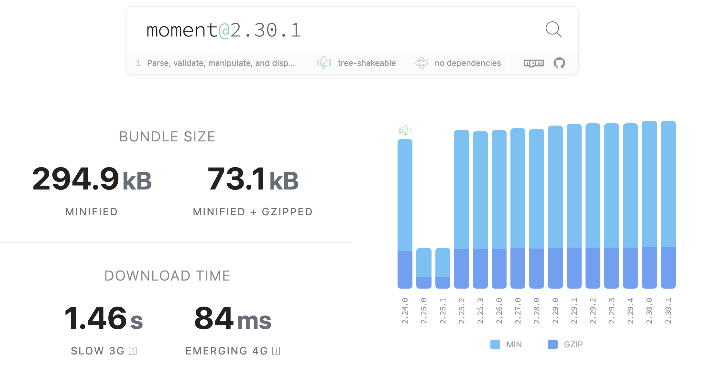
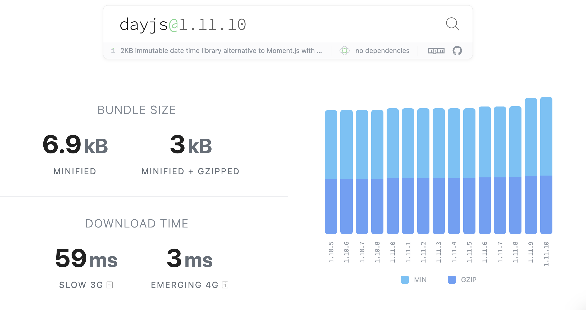

<Callout>
  💡 혼용해서 쓰이고 있던 날짜 라이브러리들을 Antd V5 마이그레이션을 통해 개선합니다.
  피드백은 언제나 환영입니다:)
</Callout>

## 리팩터링의 냄새

어드민 프로젝트에서 여러 날짜 라이브러리가 혼용해서 사용되고 있는 상황이었다.

주로 `moment` 와 `dayjs` 가 쓰이고 있었고 심지어는 현재 설치되어 있지도 않은 `date-fns` 라이브러리의 잔재가 남아있기도 했다.

<br />

이렇게 날짜 라이브러리에서 여러 라이브러리 코드가 섞이다보니 다음과 같은 문제점이 발생했다.

- **불필요한 번들 사이즈 포함**
- **코드 이해 및 사용 단계에서 불필요한 비용 초래**

<br />

하나의 날짜 라이브러리로 통일시킬 필요성을 느꼈다.

빠르고 효율적으로 리팩터링을 해보자.

## 왜 이런 일이 발생했을까?

우선 현재 상황을 분석하는 것이 중요하다.

사용되지 않는 `date-fns` 관련 코드는 삭제하면 해결된다.

문제는 `moment`와 `dayjs`를 하나로 통일시키는 것이다.

<br />

그렇다면 왜 `moment`와 `dayjs`가 같이 쓰이게 된 것일까?

### Ant Design V4

원인은 `Ant Design` 때문이었다.

현재 프로젝트에서는 UI 라이브러리로 `Ant Design`를 사용하고 있다.
여기서 사용되는 버전이 V4였다.

`Antd` V4에서는 라이브러리 내부적으로 `moment`를 사용한다.
그래서 `moment`가 필수적으로 사용되는 상황이었다.

<br />

따라서 현재 상황에서 가장 보수적인 방법으로 접근하면 `moment`를 계속 사용하는 것이다.

<br />

하지만 `moment`를 계속 사용하고 `dayjs`를 없애는 것이 과연 정답일까?

### dayjs, moment

두 라이브러리의 비교는 꽤 오래 전부터 이루어져 왔고 관련된 정보들도 쉽게 파악할 수 있다.

아무래도 가장 크게는 **번들 크기와 유지보수** 측면을 들 수 있을 것이다.

#### Bundle Size

[Bundlephobia](https://bundlephobia.com/)에서 두 라이브러리의 번들 크기를 확인해보자.

<br />

**moment 크기**



약 73KB가 사용된다.

<br />

**dayjs 크기**



3KB가 사용된다.
눈에 띄게 차이가 난다.

<br />

또한 크롬 개발자 도구에서는 [단순히 크기만으로도 moment를 교체할 것을 권장](https://web.archive.org/web/20210828024054/https://twitter.com/addyosmani/status/1304676118822174721)하고 있다.

#### Maintenance

`moment`에서는 다음 문구를 확인할 수 있다.

> We now generally consider Moment to be a legacy project in maintenance mode. It is not dead, but it is indeed done.

<br />

이와 비교해서 `dayjs`에서는 다음과 같이 소개한다.

> Fast 2kB alternative to Moment.js with the same modern API

> If you use Moment.js, you already know how to use Day.js.

<br />

여러 부분에서 `moment` 사용을 지양하는 신호들을 접할 수 있다.

<br />

그렇다면 `Antd`에서는 이 문제를 어떻게 다루고 있을까?

## Antd V5, moment로의 해방

`Antd` v4에서의 `moment` 사용은 [많은 개발자들에게 라이브러리 교체를 요청](https://github.com/ant-design/ant-design/issues/16911#issuecomment-497887824)받고 있었다.

그래서 `Antd` V5에서 `moment`가 `dayjs`로 교체되었다.

<br />

그러면서 V4같은 경우 2023년을 끝으로 버그 수정 및 새 기능 요청이 받아들여지지 않는다고 한다.

> v4 will continue to be maintained for 1 year,
> and patches will still be released for bugs,
> but no new Feature Requests will be accepted after that.
> The deadline is the end of 2023.

<br />

따라서 더 이상의 `Antd` V4의 유지는 부정적으로 느껴진다.

<br />

V5로 마이그레이션을 진행해보자.

### V4 to V5

[Antd 공식 문서(V4 to V5)](https://ant.design/docs/react/migration-v5)에서 자세히 설명하고 있고 매우 간단하게 진행할 수 있다.

<br />

다음 내용들은 프로젝트에 맞게 진행되었다.

따라서 여기서 설명하지 않은 자세한 내용들은 공식 문서를 참고하길 바란다.

#### 버전 업그레이드

우선 기존 프로젝트에 설치된 `Antd`를 버전 업그레이드시킨다.

```bash
npm install --save antd@5.x
```

#### less 제거

CSS파일을 더 이상 패키지에 포함시키지 않기에 프로젝트에 불러왔던 관련 CSS 파일들은 제거한다.

따로 less 변수들을 사용하고 있었다면 [추가 설정 작업](https://ant.design/docs/react/migration-v5#less-migration)이 필요하다.

<br />

#### dayjs로 전환

이미 알고 있듯이 `dayjs`는 `moment`와 동일한 API를 사용한다.

<br />

그래서 기존 코드에서 `moment`를 `dayjs`로 바꾸기만 해도 큰 문제없이 잘 교체된다.
만약 에러가 발생하면 [dayjs 플러그인 문서](https://day.js.org/docs/en/plugin/plugin)를 참고하자.

<br />

#### 컴포넌트 API 수정

몇몇 컴포넌트 [API 수정](https://ant.design/docs/react/migration-v5#component-api-adjustment)이 이루어졌다.

해당하는 경우 찾아서 수정해주자.

<br />

#### 디자인

V5에서는 몇몇 디자인이 변경된다.
크게 눈에 띄는 부분은 다음과 같다.

<br />

- **버튼 테두리: 2px에서 6px로 수정**
- **주요 색상: `#1890ff`에서 `#1677ff`으로 변경**

<br />

해당 프로젝트는 어드민이기에 디자인과 관련된 수정은 따로 이루어지지 않았다.

## 마무리

### 목적 달성

이렇게 `Ant Design` V5으로 마이그레이션을 진행하면서 날짜 라이브러리를 `dayjs`를 통일시킬 수 있었다.

하나의 날짜 라이브러리만을 사용하면서 **불필요한 번들 사이즈 및 개발 비용을 없애나갈 수 있었다.**

<br />

### 리팩터링을 대하는 자세

확실히 리팩터링 작업은 기존에 잘 돌아가는 코드를 수정 및 제거하는 것이기에 참으로 어려운 것 같다.

<br />

팀원들에게는 작업의 필요성을 어필하기 위해 관련 내용들을 정리하면서 설득의 과정을 거쳐야 했다.
작업 과정에서는 기존 코드에 에러없이 성공적으로 적용하고자 꼼꼼하게 작업을 해야 했다.

<br />

하지만 점점 복잡해지는 프로젝트를 개선시키는 작업은 필수적이라고 생각한다.
이러한 부분이 개발자의 역량이 아닌가 싶다.
지금처럼 내가 할 수 있는 선에서 천천히 해결해 나가자..! 😇

## 참고 문서

- [Moment.js Documentation - Project Status](https://momentjs.com/docs/#/-project-status/)
- [Ant Design 5.0 is released!](https://github.com/ant-design/ant-design/issues/38671)
- [V4 to V5](https://ant.design/docs/react/migration-v5)
