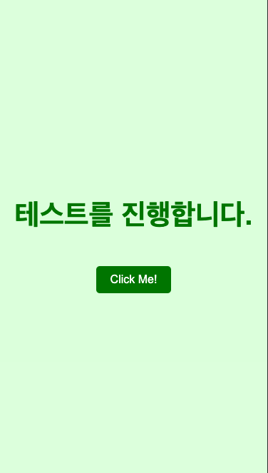
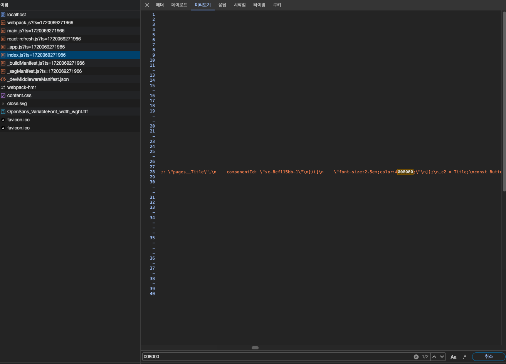
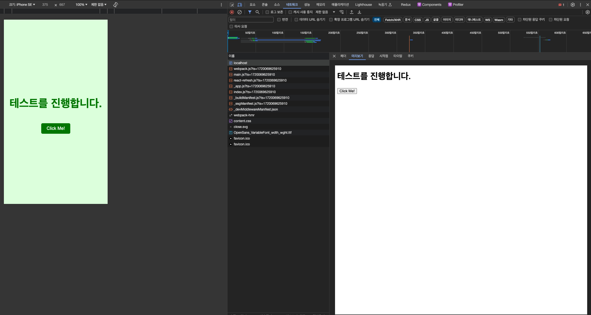
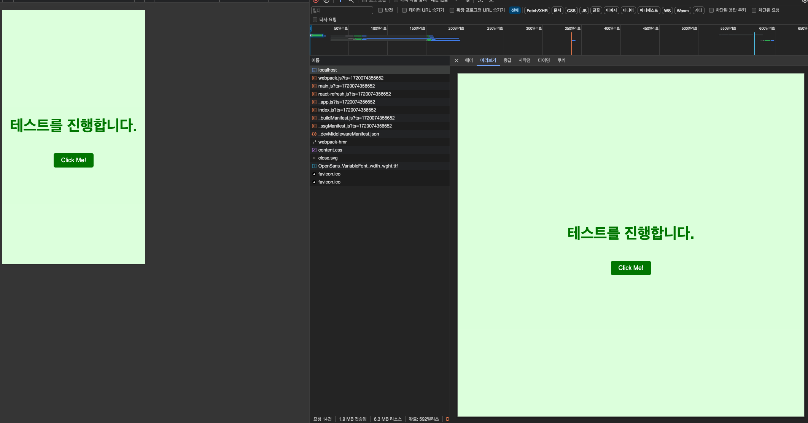
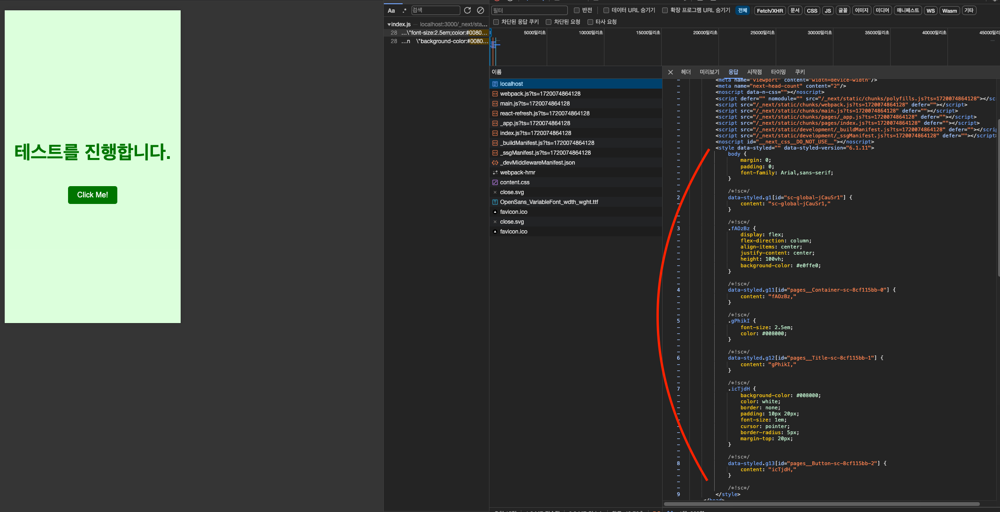

<Callout>
  💡 Next.js에서 styled-components을 활용하는 과정을 분석합니다. 피드백은 언제나
  환영입니다:)
</Callout>

> 해당 글의 버전은 Next.js v14(Page Router), styled-components v6으로 진행됩니다.


프로젝트에서 `Next.js`와 `styled-omponents`를 사용하고 있다.

근데 `Next.js`를 사용할 때 `CSS-in-JS`을 쓰면 문제가 많다는 것을 듣기만 했지 자세히 살펴보지는 않았었다.

이번 기회에 한 번 알아보고자 한다. 🧐

## 문제 접근하기

기본 환경 세팅은 `npx create-next-app@latest`으로 진행했다.


예제 코드는 다음과 같다.

**pages/index.tsx**

```tsx
import styled from 'styled-components'

export default function Home() {
  return (
    <>
      <Container>
        <Title>테스트를 진행합니다.</Title>
        <Button>Click Me!</Button>
      </Container>
    </>
  )
}

const Container = styled.div`
  display: flex;
  flex-direction: column;
  align-items: center;
  justify-content: center;
  height: 100vh;
  background-color: #e0ffe0;
`

const Title = styled.h1`
  font-size: 2.5em;
  color: #008000;
`

const Button = styled.button`
  background-color: #008000;
  color: white;
  border: none;
  padding: 10px 20px;
  font-size: 1em;
  cursor: pointer;
  border-radius: 5px;
  margin-top: 20px;
`
```


우선 `next.config.js`에서 `styledComponents: true`로 설정한다.

```js
/** @type {import('next').NextConfig} */
const nextConfig = {
  reactStrictMode: true,
  compiler: { styledComponents: true },
}

export default nextConfig
```


이거만 해도 화면에서는 제대로 스타일이 적용되는 것을 볼 수 있다.

<div style={{ display: 'flex', justifyContent: 'center' }}>
  
</div>


하지만 현재 상황은 클라이언트에서만 스타일을 받아오는 상황이다.

`styled-components`는 `CSS-in-JS` 방식으로 `JavaScript`를 통해 스타일을 구성된다. (일반 `CSS`로 직렬화하는 과정이 필요하다.)

예제 코드에서 사용된 `#00800`을 네트워크 탭에서 검색하면 `index.js` 번들에 포함된 것을 확인할 수 있다.


**index.js 번들에 스타일이 포함된 모습**




따라서 지금과 같은 상황에서 `styled-components`는 클라이언트에서만 스타일을 받아오게 된다.

하지만 `Next.js`와 같이 미리 서버에서 렌더링이 일어나는 경우 **깜빡이는 문제와 스타일이 적용되지 않은 문서**를 볼 수 있다.


**깜빡이는 문제**

<video src="/videos/development/exploring-styled-components-in-nextjs/sc-problem-1.mp4" controls style="max-width:100%;max-height:400px;display:block;margin:1.5rem auto;border-radius:0.5rem;" />


**스타일이 적용되지 않은 문서**



## 문제 해결하기

감사하게도 관련 [예제](https://github.com/vercel/next.js/tree/canary/examples/with-styled-components)를 제공해주고 있다.

**pages/\_documents.tsx**

```tsx
import Document, { DocumentContext, DocumentInitialProps } from 'next/document'
import { ServerStyleSheet } from 'styled-components'

export default class MyDocument extends Document {
  static async getInitialProps(ctx: DocumentContext): Promise<DocumentInitialProps> {
    const sheet = new ServerStyleSheet()
    const originalRenderPage = ctx.renderPage

    try {
      ctx.renderPage = () =>
        originalRenderPage({
          enhanceApp: (App) => (props) => sheet.collectStyles(<App {...props} />),
        })

      const initialProps = await Document.getInitialProps(ctx)
      return {
        ...initialProps,
        styles: [initialProps.styles, sheet.getStyleElement()],
      }
    } finally {
      sheet.seal()
    }
  }
}
```


세부적인 내용은 나중에 살펴보고 결과부터 보면 기대하는 바와 일치한다.


더 이상 깜빡거리지 않는다.

<video src="/videos/development/exploring-styled-components-in-nextjs/sc-solution-1.mp4" controls style="max-width:100%;max-height:400px;display:block;margin:1.5rem auto;border-radius:0.5rem;" />


처음 문서에도 스타일이 적용된 상태로 오는 것을 확인할 수 있다.




## styled-components는 어떻게 해결했을까?

`_documents.tsx` 코드를 다시 살펴보자.

크게 3가지 부분으로 나눌 수 있을 것 같다.


우선 서버 시트를 생성한다.

```tsx
const sheet = new ServerStyleSheet()
```


해당 로직에서는 `sheet.collectStyles`을 통해 컴포넌트에서 작성했던 스타일들을 수집한다.

```tsx
// Next.js에서 제공하는 기본 페이지 렌더링 메서드
ctx.renderPage = () =>
  // Next.js 기본 렌더링 로직을 참조하는 변수
  originalRenderPage({
    // Next.js 전체 react tree(App 컴포넌트)를 감싸기 위한 고차 컴포넌트(HOC)
    enhanceApp: (App) => (props) => sheet.collectStyles(<App {...props} />), // 스타일 수집
  })
```


`html`에 스타일 태그를 추가한다.

여기서 `sheet.getStyleElement`을 통해 수집했던 스타일을 `React` `Element`로 반환하게 해준다.

```tsx
return {
  ...initialProps,
  styles: [initialProps.styles, sheet.getStyleElement()], // 수집된 스타일을 React Element로 반환
}
```


**추가된 스타일 태그**



### styled-components 코드 살펴보기

동작을 좀 더 이해해보자.

[ServerStyleSheet 코드](https://github.com/styled-components/styled-components/blob/770d1fa2bc1a4bfe3eea1b14a0357671ba9407a4/packages/styled-components/src/models/ServerStyleSheet.tsx)


시작점인 `ServerStyleSheet`을 통해 생성된 인스턴스에서 앞서 살펴본 2가지 동작이 발생한다.

- `collectStyles`: 스타일 수집
- `getStyleElement`:수집된 스타일을 `React` `Element`로 반환


`collectStyles`의 코드는 다음과 같다.

[collectStyles 코드](https://github.com/styled-components/styled-components/blob/770d1fa2bc1a4bfe3eea1b14a0357671ba9407a4/packages/styled-components/src/models/ServerStyleSheet.tsx#L37-L43)


**collectStyles**

```tsx
collectStyles(children: any): JSX.Element {
  if (this.sealed) {
    throw styledError(2);
  }

  return <StyleSheetManager sheet={this.instance}>{children}</StyleSheetManager>;
}
```


`StyleSheetManager`가 등장한다.

[StyleSheetManager 코드](https://github.com/styled-components/styled-components/blob/770d1fa2bc1a4bfe3eea1b14a0357671ba9407a4/packages/styled-components/src/models/StyleSheetManager.tsx)


**StyleSheetManager**

```tsx
export function StyleSheetManager(props: IStyleSheetManager): JSX.Element {
  const [plugins, setPlugins] = useState(props.stylisPlugins);
  const { styleSheet } = useStyleSheetContext();

  const resolvedStyleSheet = 스타일 시트를 설정하는 함수

  const stylis = 스타일 코드로 만들어주는 함수

  ...

  const styleSheetContextValue = useMemo(
    () => ({
      shouldForwardProp: props.shouldForwardProp,
      styleSheet: resolvedStyleSheet,
      stylis,
    }),
    [props.shouldForwardProp, resolvedStyleSheet, stylis]
  );

  return (
    <StyleSheetContext.Provider value={styleSheetContextValue}>
      <StylisContext.Provider value={stylis}>{props.children}</StylisContext.Provider>
    </StyleSheetContext.Provider>
  );
}
```

해당 컨텍스트를 통해 스타일을 수집 및 변환해서 `StyleSheetManager`에서 주입한 `sheet`에 반영될 것으로 예상된다.


다음으로 `getStyleElement` 코드이다.

[getStyleElement 코드](https://github.com/styled-components/styled-components/blob/770d1fa2bc1a4bfe3eea1b14a0357671ba9407a4/packages/styled-components/src/models/ServerStyleSheet.tsx#L53-L73)


**getStyleElement**

```tsx
getStyleElement = () => {
  if (this.sealed) {
    throw styledError(2)
  }

  const props = {
    [SC_ATTR]: '',
    [SC_ATTR_VERSION]: SC_VERSION,
    dangerouslySetInnerHTML: {
      __html: this.instance.toString(),
    },
  }

  const nonce = getNonce()
  if (nonce) {
    ;(props as any).nonce = nonce
  }

  // v4 returned an array for this fn, so we'll do the same for v5 for backward compat
  return [<style {...props} key="sc-0-0" />]
}
```

`dangerouslySetInnerHTML`가 눈에 띈다.

`this.instance.toString()`을 통해 앞서 시트에 수집한 스타일들을 문자열로 반환한다.

그 다음 `dangerouslySetInnerHTML`을 통해 `DOM`에 주입하는데 `style` 태그에 반환하는 것을 알 수 있다.

## 마무리

이전까지는 서버 렌더링이 이루어질 때 `CSS-in-JS`가 문제가 많다고 듣기만 했지 깊게 파고들지는 못했다.

이번 기회에 직접 코드를 구성해보면서 어떠한 경우에 문제가 발생하고 어떻게 해결하는지 알게 되었다.

그리고 직접 `styled-components` 코드도 살펴보면서 흥미롭게 학습한 시간이 되었던 것 같다.

## 참고 문서

- [styled-components(Advanced Usage - server-side-rendering)](https://styled-components.com/docs/advanced#server-side-rendering)
- [Example app with styled-components](https://github.com/vercel/next.js/tree/canary/examples/with-styled-components)
