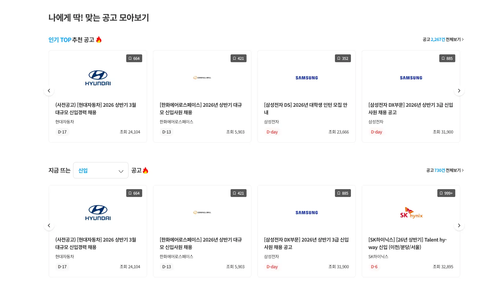

<Callout>다르게 받아도, 같은 방식으로 흐른다.</Callout>

글에서 다루는 예제는 [playground](https://github.com/jgjgill/blog/tree/main/playground/generic-render-prop-with-constrained-generics)에서 직접 실행해볼 수 있습니다.

## 상황



공고 목록을 Swiper로 렌더링하는 `SwiperCards` 컴포넌트가 여러 화면에서 공통으로 사용되고 있었다.

```tsx
interface Props {
  data: ActivityFragment[];
}

const SwiperCards = ({ data }: Props) => {
  return (
    <Swiper>
      {data.map((activity) => (
        <SwiperSlide key={activity.id}>
          <ActivityCard activity={activity} />
        </SwiperSlide>
      ))}
    </Swiper>
  );
};
```

그런데 두 가지 요구사항이 동시에 생겼다.

1. **특정 화면만 광고 API로 교체**되어야 했고, 이 API의 응답 타입이 기존과 달랐다.
2. **광고 공고는 노출·클릭 시 별도 이벤트를 발생**시켜야 했다. 이를 위해 광고 ID(`campaignId`)가 필요했다.

광고 API의 응답은 일반 공고와 광고 공고가 **섞인 배열**로 온다.
광고 공고만 따로 오는 게 아니라 아래처럼 섞여있다.

```
[일반 공고, 광고 공고, 일반 공고, 일반 공고, 광고 공고, ...]
```

그 차이가 타입에 반영되어 있다.

```ts
// 기존 타입 — 공고 데이터 직접 접근
type ActivityFragment = {
  id: string;
  title: string;
  // ...
};

// 새 타입 — 일반 공고면 ad가 없고, 광고 공고면 ad가 포함된다
type ActivityWithAdFragment = {
  activity: ActivityFragment; // activity가 중첩된 구조
  ad?: {
    campaign?: {
      id: string; // 광고 공고일 때만 존재하는 광고 ID
    };
  };
};
```

`ad` 필드가 optional인 이유이다.
배열 안에서 일반 공고는 `ad`가 없고,
광고 공고만 `ad`를 포함한다.

핵심 차이는 **기존은 `activity.id`로 직접 접근**하지만,
**새 타입은 `item.activity.id`로 한 단계 더 들어가야** 한다는 것이다.

최종 목표 데이터(공고)는 동일하지만,
중간 구조가 다르다.

---

## 시행착오

기존 `SwiperCards`의 Swiper 구조(loop 처리, navigation, 슬라이드 복제 로직 등)는 어디서나 동일하다.
이 로직을 중복으로 두고 싶지 않았다.

### 1안: union 타입으로 data를 받는다

`data` prop을 union 타입으로 받으면 두 타입을 모두 수용할 수 있다.

```tsx
interface Props {
  data: ActivityFragment[] | ActivityWithAdFragment[];
}
```

하지만 `SwiperCards` 내부에서 `item`이 어느 타입인지 직접 분기해야 한다.

```tsx
const SwiperCards = ({ data }: Props) => {
  return (
    <Swiper>
      {data.map((item, index) => {
        if ("activity" in item) {
          // ActivityWithAdFragment 분기
          return (
            <SwiperSlide key={`${item.activity.id}-${index}`}>
              <ActivityCard
                activity={item.activity}
                campaignId={item.ad?.campaign?.id}
              />
            </SwiperSlide>
          );
        }
        // ActivityFragment 분기
        return (
          <SwiperSlide key={`${item.id}-${index}`}>
            <ActivityCard activity={item} />
          </SwiperSlide>
        );
      })}
    </Swiper>
  );
};
```

`SwiperCards`가 두 타입의 구조를 모두 알아야 하고,
광고 이벤트 처리 판단까지 여기서 해야 한다.
관심사가 섞인다.

### 2안: 전용 컴포넌트를 별도로 만든다

`SwiperAdCards`를 따로 만들어 각자 담당하게 한다.

```tsx
// SwiperCards — 기존 그대로
const SwiperCards = ({ data }: { data: ActivityFragment[] }) => { ... };

// SwiperAdCards — 광고용 신규
const SwiperAdCards = ({ data }: { data: ActivityWithAdFragment[] }) => { ... };
```

내부 분기는 없어진다.
하지만 두 컴포넌트의 Swiper 구조 로직이 완전히 같다.

```tsx
// SwiperCards 내부
<Swiper>
  {data.map((item, index) => (
    <SwiperSlide key={`${item.id}-${index}`}>
      {/* 렌더링 */}
    </SwiperSlide>
  ))}
</Swiper>

// SwiperAdCards 내부 — 동일한 구조가 또 있다
<Swiper>
  {data.map((item, index) => (
    <SwiperSlide key={`${item.activity.id}-${index}`}>
      {/* 렌더링 */}
    </SwiperSlide>
  ))}
</Swiper>
```

늘어난 관심사로 슬라이드 관련 스펙이 바뀌면 두 파일을 모두 수정해야 한다.

### 3안: 렌더링을 외부에서 주입한다 (Render Prop + Generic)

`SwiperCards`는 Swiper 구조만 담당하고,
각 아이템을 어떻게 그릴지는 호출부가 결정한다.

```tsx
// SwiperCards는 구조만, 렌더링은 모른다
const SwiperCards = <T extends ActivityFragment | ActivityWithAdFragment>({
  data,
  renderItem,
}: {
  data: T[];
  renderItem: (item: T, index: number) => React.ReactNode;
}) => { ... };

// 호출부가 렌더링을 결정한다
<SwiperCards
  data={activities}         // T = ActivityFragment로 결정
  renderItem={(item) => (  // item은 ActivityFragment로 추론됨
    <ActivityCard activity={item} />
  )}
/>

<SwiperCards
  data={adActivities}      // T = ActivityWithAdFragment로 결정
  renderItem={(item) => (  // item은 ActivityWithAdFragment로 추론됨
    <ActivityCard activity={item.activity} campaignId={item.ad?.campaign?.id} />
  )}
/>
```

`SwiperCards`는 데이터 타입을 전혀 몰라도 된다.
`data`에 넘기는 타입에 따라 `renderItem`의 `item` 타입이 자동으로 결정된다.

---

## Render Prop과 제약된 제네릭

두 가지 개념이 활용된다.

### Render Prop 패턴

컴포넌트가 **무엇을 렌더링할지**를 prop으로 전달받는 패턴이다.
컴포넌트는 구조(배치, 반복)만 담당하고,
내용(아이템 UI)은 호출부에서 주입한다.

```tsx
<List renderItem={(item) => <Card data={item} />} />
```

`List`는 몇 개를 어떤 순서로 배치할지만 알고,
각 아이템을 어떻게 그릴지는 호출부가 결정한다.

### Constrained Generics (제약된 제네릭)

TypeScript의 제네릭에 `extends`로 허용 범위를 제한하는 방식이다.

```ts
// T에 제약 없음 → 어떤 타입이든 들어올 수 있어 타입 안전성이 낮음
function foo<T>(item: T) {}

// T를 union으로 제한 → 명시된 두 타입만 허용
function foo<T extends A | B>(item: T) {}
```

`T extends A | B`로 제한하면,
`data: T[]`를 넘기는 순간 `T`가 결정되고,
`renderItem: (item: T) => ...`의 `item` 타입도 자동으로 같이 추론된다.

---

## 해결 방법

`renderItem` prop을 추가하고,
`data`의 타입 `T`를 제네릭으로 열되 허용 범위를 union으로 제한한다.

```tsx
interface Props<T extends ActivityFragment | ActivityWithAdFragment> {
  data: T[];
  renderItem: (item: T, index: number) => React.ReactNode;
  getItemKey: (item: T, index: number) => string;
}

const SwiperCards = <T extends ActivityFragment | ActivityWithAdFragment>({
  data,
  renderItem,
  getItemKey,
}: Props<T>) => {
  return (
    <Swiper>
      {data.map((item, index) => (
        <SwiperSlide key={getItemKey(item, index)}>
          {renderItem(item, index)}
        </SwiperSlide>
      ))}
    </Swiper>
  );
};
```

`SwiperCards`는 배치만 한다.
타입도, 렌더링도 관심을 가지지 않는다.

호출부에서 어떤 타입의 배열을 `data`에 넘기느냐에 따라 `renderItem`의 `item` 타입이 자동으로 달라진다.

**일반 공고 (`ActivityFragment[]`)**

```tsx
<SwiperCards
  data={activities}
  renderItem={(item) => (
    // item은 ActivityFragment로 추론됨
    <ActivityCard activity={item} />
  )}
  getItemKey={(item, index) => `${item.id}-${index}`}
/>
```

**광고 공고 (`ActivityWithAdFragment[]`)**

```tsx
<SwiperCards
  data={adActivities}
  renderItem={(item) => (
    // item은 ActivityWithAdFragment로 추론됨
    <ActivityCard activity={item.activity} campaignId={item.ad?.campaign?.id} />
  )}
  getItemKey={(item, index) => `${item.activity.id}-${index}`}
/>
```

광고 이벤트 로직은 `ActivityCard` 내부에서 `campaignId` 유무로 처리한다.

```tsx
const ActivityCard = ({ activity, campaignId }: Props) => {
  useEffect(() => {
    if (campaignId) {
      trackAdEvent({ event: "impression", campaignId });
    }
  }, [campaignId]);

  const handleClick = () => {
    if (campaignId) {
      trackAdEvent({ event: "click", campaignId });
    }
    router.push(`/activity/${activity.id}`);
  };

  return <div onClick={handleClick}>...</div>;
};
```

`campaignId`가 없으면 일반 공고로, 있으면 광고 공고로 동작한다.
같은 `ActivityCard`를 그대로 쓸 수 있다.

---

## 확장성

새로운 타입이 추가될 때 유연하게 대처할 수 있다.

세 번째 요구사항으로 배지가 붙은 공고 타입이 생겼다고 가정해보자.

```tsx
type ActivityWithBadgeFragment = {
  activity: ActivityFragment;
  badge?: string;
};
```

`SwiperCards`는 수정하지 않는다.
union에 타입만 추가하고 새 호출부만 작성하면 끝이다.

```tsx
// SwiperCards는 그대로 — union에 타입만 추가
interface Props<
  T extends
    | ActivityFragment
    | ActivityWithAdFragment
    | ActivityWithBadgeFragment  // 추가
> { ... }

// 새 호출부만 작성
<SwiperCards
  data={badgeActivities}         // T = ActivityWithBadgeFragment로 결정
  renderItem={(item) => (        // item은 ActivityWithBadgeFragment로 추론됨
    <ActivityCard activity={item.activity} badge={item.badge} />
  )}
  getItemKey={(item, index) => `${item.activity.id}-${index}`}
/>
```

---

## 마무리

- **중복 제거**: Swiper 구조, loop 처리, navigation 로직 한 곳에만 존재 → 변경사항 한 파일만 수정
- **관심사 분리**: `SwiperCards`는 배치만 알고, 호출부는 Swiper를 몰라도 되는 상황
- **타입 안전성**: 제네릭 제약 덕분에 호출부에서 타입 추론이 정확하게 동작 (`ActivityFragment`, `ActivityWithAdFragment`)
