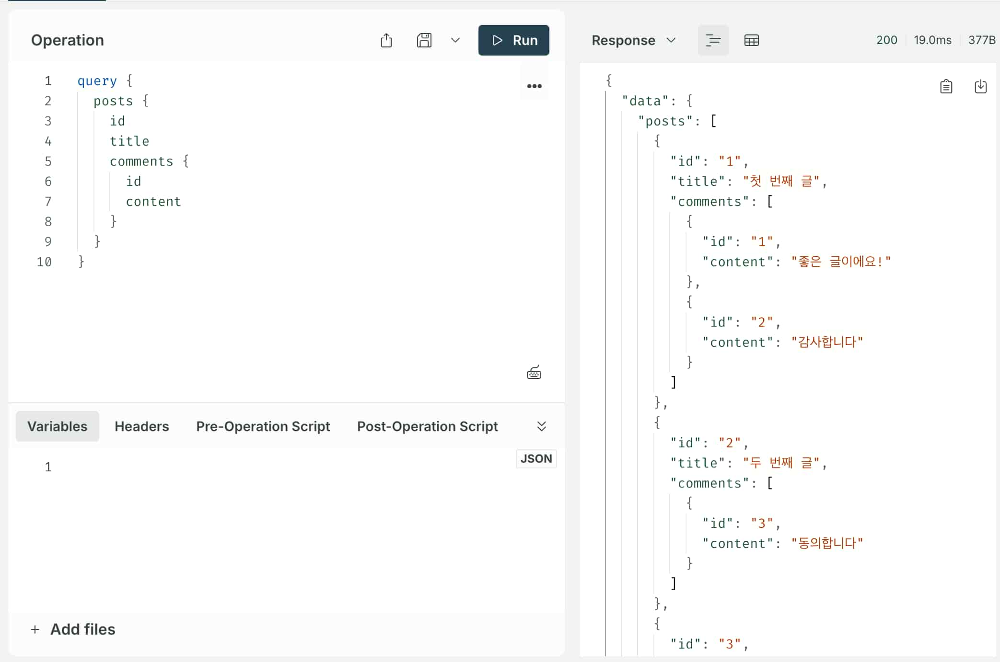
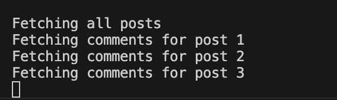
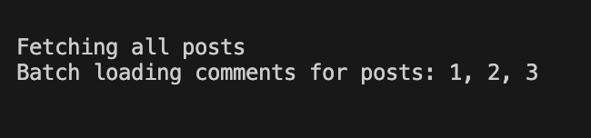

<Callout>
  💡 GraphQL에서 N+1를 해결하기 위해 사용된 dataloader에 대해 알아봅니다. 피드백은 언제나
  환영입니다:)
</Callout>

## GraphQL에서의 N+1 문제 알아보기

### N+1 문제란?

N+1은 관계형 데이터를 조회할 때 발생할 수 있는 대표적인 성능 이슈이다.

이름에서 알 수 있듯이 하나의 쿼리 이후 N개의 추가 쿼리가 발생하는 패턴을 의미하는데..


코드로 보는게 이해가 가장 빠를 것 같다..! 😂

간단한 환경을 구성해서 직접 확인해보자. ([관련 코드](https://github.com/jgjgill/jgjgill-weapons/tree/main/apps/graphql-playground))


다음 라이브러리들을 설치한다.


**package.json**

```bash
pnpm i @apollo/server better-sqlite3 graphql graphql-tag
```


**index.js**

```js
import { ApolloServer } from '@apollo/server'
import { startStandaloneServer } from '@apollo/server/standalone'
import gql from 'graphql-tag'
import db from './database.js'

const typeDefs = gql`
  type Post {
    id: ID!
    title: String!
    content: String!
    comments: [Comment!]!
  }

  type Comment {
    id: ID!
    content: String!
    post: Post!
  }

  type Query {
    posts: [Post!]!
    post(id: ID!): Post
  }
`

const resolvers = {
  Query: {
    posts: () => {
      console.log('Fetching all posts')

      return db.prepare('SELECT * FROM posts').all()
    },
  },
  Post: {
    comments: (post) => {
      console.log(`Fetching comments for post ${post.id}`)

      return db.prepare('SELECT * FROM comments WHERE post_id = ?').all(post.id)
    },
  },
}

const server = new ApolloServer({
  typeDefs,
  resolvers,
})

const { url } = await startStandaloneServer(server, {
  listen: { port: 4001 },
})

console.log(`🚀  Server ready at: ${url}`)
```


**database.js**

```js
import { existsSync } from 'node:fs'
import Database from 'better-sqlite3'

const dbPath = 'blog.db'
const db = new Database(dbPath)

if (!existsSync(dbPath)) {
  db.exec(`
    DROP TABLE IF EXISTS posts;
    DROP TABLE IF EXISTS comments;
    
    CREATE TABLE posts (
      id INTEGER PRIMARY KEY,
      title TEXT,
      content TEXT
    );
    
    CREATE TABLE comments (
      id INTEGER PRIMARY KEY,
      post_id INTEGER,
      content TEXT,
      FOREIGN KEY (post_id) REFERENCES posts (id)
    );
    
    -- 샘플 데이터 삽입
    INSERT INTO posts (title, content) VALUES 
      ('첫 번째 글', '안녕하세요'),
      ('두 번째 글', '반갑습니다'),
      ('세 번째 글', '날씨가 좋네요');
      
    INSERT INTO comments (post_id, content) VALUES 
      (1, '좋은 글이에요!'),
      (1, '감사합니다'),
      (2, '동의합니다'),
      (3, '멋진 글이네요'),
      (3, '잘 보고 갑니다');
  `)
}

export default db
```


**Operation**

`posts` 내 `comments`를 불러온다.

```GraphQL
query {
  posts {
    id
    title
    comments {
      id
      content
    }
  }
}
```





**결과**

4번의 호출(N+1)이 발생하는 것을 확인할 수 있다.




## dataloader

이러한 N+1 문제를 해결하기 위해 `GraphQL`은 `dataloader`라는 도구를 활용한다.


`dataloader`를 설치한다.

```bash
pnpm i dataloader
```


**index-dataloader.js**

```js
import { ApolloServer } from '@apollo/server'
import { startStandaloneServer } from '@apollo/server/standalone'
import DataLoader from 'dataloader'
import gql from 'graphql-tag'
import db from './database.js'

const typeDefs = gql`
  type Post {
    id: ID!
    title: String!
    content: String!
    comments: [Comment!]!
  }

  type Comment {
    id: ID!
    content: String!
    post: Post!
  }

  type Query {
    posts: [Post!]!
    post(id: ID!): Post
  }
`

// Comments를 배치로 로딩하는 DataLoader 생성
function createCommentsLoader() {
  return new DataLoader(async (postIds) => {
    console.log(`Batch loading comments for posts: ${postIds.join(', ')}`)

    const comments = db
      .prepare(
        `SELECT * FROM comments WHERE post_id IN (${postIds.map(() => '?').join(',')})`,
      )
      .all(...postIds)

    // postId별로 comments 그룹화하여 반환
    return postIds.map((postId) =>
      comments.filter((comment) => comment.post_id === Number.parseInt(postId)),
    )
  })
}

const resolvers = {
  Query: {
    posts: () => {
      console.log('Fetching all posts')
      return db.prepare('SELECT * FROM posts').all()
    },
  },
  Post: {
    comments: (post, _, context) => {
      return context.commentsLoader.load(post.id)
    },
  },
}

const server = new ApolloServer({ typeDefs, resolvers })

const { url } = await startStandaloneServer(server, {
  listen: { port: 4000 },
  context: () => ({
    commentsLoader: createCommentsLoader(),
  }),
})

console.log(`🚀 Server ready at: ${url}`)
```


**Operation**

동일한 쿼리를 호출한다.


**결과**

이전과 달리 2번의 호출만 발생한다.




어떻게 이러한 동작이 가능해진걸까?

### 내부 코드 분석

`dataloder`는 약 500줄로 이루어진 라이브러리다.


내부 코드를 살펴보면 배칭과 캐싱 기능이 적용되는데,

이번 글에서는 캐싱과 관련된 내용은 다루지 않고 배칭에 대해서만 알아보고자 한다.

### batching

여러 개별 데이터 요청을 단일 요청으로 모아서 처리한다.

이를 통해 네트워크 왕복을 줄이고 성능을 개선시키고자 한다.


크게 다음 코드들을 핵심으로 잡고 살펴볼 것이다.

임의로 생략한 부분들이 많기에 참고하시길..😇 ([원본 코드](https://github.com/graphql/dataloader/blob/main/src/index.js))

#### 주요 타입 정의

```ts
// 배치 로딩 함수 타입 - 키 배열을 받아 Promise 배열 반환
export type BatchLoadFn<K, V> = (keys: Array<K>) => Promise<Array<V | Error>>

// 배치 관련 옵션
export type Options<K, V, C = K> = {
  batch?: boolean // 배칭 활성화 여부
  maxBatchSize?: number // 최대 배치 크기
  batchScheduleFn?: (callback: () => void) => void // 배치 실행 스케줄러
  // 기타 캐싱 관련 옵션들...
}

// 배치 상태 추적 구조
type Batch<K, V> = {
  hasDispatched: boolean // 처리 상태
  keys: Array<K> // 수집된 키들
  callbacks: Array<{
    // 각 키별 콜백
    resolve: (value: V) => void
    reject: (error: Error) => void
  }>
  cacheHits?: Array<() => void> // 캐시 동작 콜백
}
```


`BatchLoadFn` 타입은 `dataloader`의 핵심 함수 타입이다.

여러 개의 키를 한 번에 처리하고자 사용된다.


예제에서는 `createCommentsLoader` 내 `DataLoader`로 넘긴 함수 부분이다.


**예시 코드**

```ts
function createCommentsLoader() {
  return new DataLoader(async (postIds) => {
    console.log(`Batch loading comments for posts: ${postIds.join(', ')}`)

    const comments = db
      .prepare(
        `SELECT * FROM comments WHERE post_id IN (${postIds.map(() => '?').join(',')})`,
      )
      .all(...postIds)

    // postId별로 comments 그룹화하여 반환
    return postIds.map((postId) =>
      comments.filter((comment) => comment.post_id === Number.parseInt(postId)),
    )
  })
}
```


`Batch` 타입에서는 현재 진행 중인 배치의 상태 구조를 표현한다.

- `hasDispatched`: 이 배치가 이미 처리됐는지 여부를 표시
- `keys`: 이 배치에 수집된 모든 키의 배열
- `callbacks`: 각 키에 대응하는 비동기 함수 배열


#### DataLoader 클래스

```ts
class DataLoader<K, V, C = K> {
  constructor(batchLoadFn: BatchLoadFn<K, V>, options?: Options<K, V, C>) {
    this._batchLoadFn = batchLoadFn;
    this._maxBatchSize = getValidMaxBatchSize(options);
    this._batchScheduleFn = getValidBatchScheduleFn(options);
    this._batch = null;
    // 기타 초기화...
  }

  _batchLoadFn: BatchLoadFn<K, V>;        // 사용처에 제공되는 배치 로드 함수
  _maxBatchSize: number;                  // 최대 배치 크기
  _batchScheduleFn: (() => void) => void; // 배치 스케줄링 함수
  _batch: Batch<K, V> | null;             // 현재 활성 배치
  // 기타 필드들...

  load(key: K): Promise<V> {
    if (key === null || key === undefined) {
      throw new TypeError(
        'The loader.load() function must be called with a value, ' +
          `but got: ${String(key)}.`,
      );
    }

    const batch = getCurrentBatch(this); // 현재 배치 가져오기

    // 캐시 체크 코드 생략...

    batch.keys.push(key); // 배치에 키 추가
    const promise = new Promise((resolve, reject) => {
      batch.callbacks.push({ resolve, reject });
    });

    // 캐시 저장 코드 생략...

    return promise;
  }
}
```


`DataLoader` 클래스를 통해 배치 로딩 기능의 인터페이스를 파악할 수 있다.


`_batchScheduleFn`는 배치 처리 시점을 결정하는 함수이다.

이 함수를 통해 언제 배치를 실행할지 제어한다.

밑에 살펴보겠지만 해당 함수에는 `enqueuePostPromiseJob` 함수가 사용된다.


`load` 메서드에서는 하나의 키에 대한 데이터 로드를 요청한다.

내부적으로 `getCurrentBatch` 함수를 통해 현재 활성화된 배치를 가져온다.

가져온 배치에서 `keys`, `callbacks` 배열에 키와 함수를 추가한다.


- 처음 `load` 호출 시 새 배치 생성
- 같은 이벤트 루프 `tick` 내 후속 `load` 호출은 동일 배치에 누적
- 배치가 이미 처리 중이거나 최대 크기에 도달하면 새 배치 생성


#### 배치 관리 핵심 함수들

```ts
// 현재 배치 가져오기 또는 새 배치 생성
function getCurrentBatch<K, V>(loader: DataLoader<K, V, any>): Batch<K, V> {
  const existingBatch = loader._batch

  // 재사용 가능한 배치가 있으면 사용
  if (
    existingBatch !== null &&
    !existingBatch.hasDispatched &&
    existingBatch.keys.length < loader._maxBatchSize
  ) {
    return existingBatch
  }

  // 새 배치 생성
  const newBatch = { hasDispatched: false, keys: [], callbacks: [] }
  loader._batch = newBatch

  // 이벤트 루프의 다음 틱에 배치 처리 예약
  loader._batchScheduleFn(() => {
    dispatchBatch(loader, newBatch)
  })

  return newBatch
}

// 배치 실행 함수
function dispatchBatch<K, V>(loader: DataLoader<K, V, any>, batch: Batch<K, V>) {
  // 배치 상태 업데이트
  batch.hasDispatched = true

  // 빈 배치는 바로 종료
  if (batch.keys.length === 0) return

  // 사용자 정의 배치 함수 호출
  let batchPromise
  try {
    batchPromise = loader._batchLoadFn(batch.keys)
  } catch (e) {
    // 에러 처리...
  }

  // 기타 에러 처리...

  // 결과 처리
  batchPromise
    .then((values) => {
      // 각 키에 대한 결과 분배
      for (let i = 0; i < batch.callbacks.length; i++) {
        const value = values[i]
        if (value instanceof Error) {
          batch.callbacks[i].reject(value)
        } else {
          batch.callbacks[i].resolve(value)
        }
      }
    })
    .catch((error) => {
      failedDispatch(loader, batch, error)
    })
}
```


`_batchScheduleFn`이 이해하기 까다로웠는데 핵심 부분이라고 생각된다..! 🧐


`_batchScheduleFn`의 호출 시점은 다음과 같다.

- `getCurrentBatch`가 새로운 배치를 생성할 때마다 호출
- 보통 한 이벤트 루프 `tick` 내에서 첫 번째 `load` 호출 시에만 발생
- 배치가 이미 존재하고 재사용 가능하면 호출되지 않음


`dispatchBatch`는 앞서 `load` 메서드에서 구성한 `keys`, `callbacks`에 대한 처리가 이루어진다고 보면 될 것 같다.


#### 배치 스케줄링 메커니즘

```ts
// 배치 스케줄링 함수 검증
function getValidBatchScheduleFn(options): (() => void) => void {
  // 옵션에 명시되지 않았으면 기본값 사용
  if (!options || options.batchScheduleFn === undefined) {
    return enqueuePostPromiseJob;
  }
  return options.batchScheduleFn;
}

// 환경에 따른 스케줄링 선택
const enqueuePostPromiseJob =
  // Node.js 환경
  typeof process === 'object' && typeof process.nextTick === 'function'
    ? function(fn) {
        Promise.resolve().then(() => process.nextTick(fn));
      }
    // setImmediate 지원 환경
    : typeof setImmediate === 'function'
    ? function(fn) {
        setImmediate(fn);
      }
    // 기타 환경
    : function(fn) {
        setTimeout(fn);
      };
```


`getValidBatchScheduleFn`은 초기화 과정에서 `_batchScheduleFn`에 사용되는 함수이다.

(`_batchScheduleFn`은 `getCurrentBatch` 함수 내부에서 사용된다.)


일반적으로 `enqueuePostPromiseJob`을 사용하게 된다.

여기에서의 비동기 동작으로 `load`에서 수집한 동작을 한 번에 처리할 수 있게 해준다.


**process.nextTick**

처음 접한 코드여서 추가로 정리해본다. 😅

`Node.js` 이벤트 루프에서 제공하는 비동기 실행 메커니즘이다.


`process.nextTick`에 함수를 전달하면 이벤트 루프에서 현재 실행 코드가 완료된 직후,

다음 단계로 이동하기 전에 함수를 실행하도록 지시한다.


> It's the way we can tell the JS engine to process a function asynchronously (after the current function),
> but as soon as possible,
> not queue it.


`JS` 엔진에 함수를 대기열에 넣지 않고 가능한 빠르게 비동기적으로 처리할 수 있는 방법이라고 한다.


```js
setTimeout(() => {
  console.log('setTimeout 콜백')
}, 0)

setImmediate(() => {
  console.log('setImmediate 콜백')
})

process.nextTick(() => {
  console.log('nextTick 콜백')
})

console.log('동기 코드')

// 동기 코드
// nextTick 콜백
// setImmediate 콜백
// setTimeout 콜백
```

## 참고 문서

- [GraphQL Why & How](https://mentoring.fromundefined.com/sessions/wi-241015)
- [dataloader](https://github.com/graphql/dataloader)
- [GraphQL N+1 Problem](https://www.youtube.com/watch?v=uCbFMZYQbxE)
- [Batching GraphQL Requests with DataLoader](https://www.youtube.com/watch?v=-uSDpEp5uJc)
- [Understanding process.nextTick()](https://nodejs.org/en/learn/asynchronous-work/understanding-processnexttick#understanding-processnexttick)
