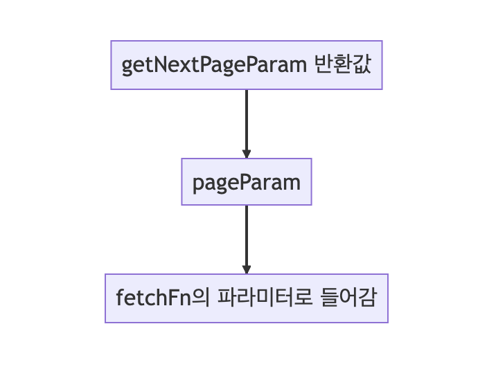
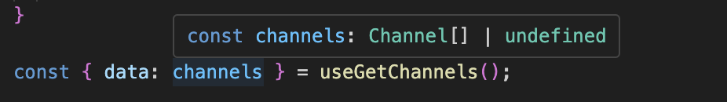
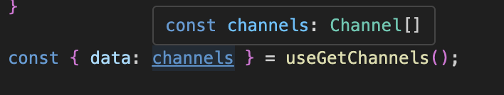
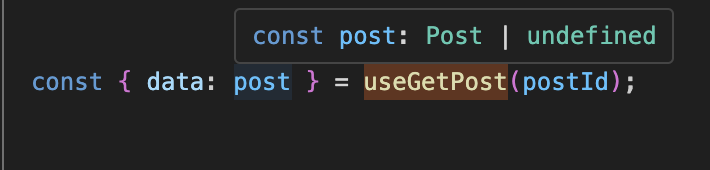
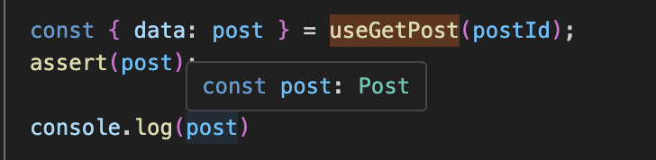
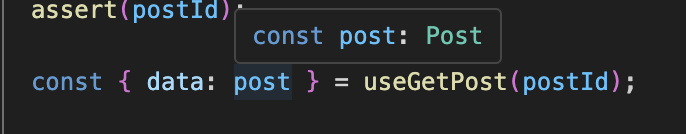

<Callout>
  💡 혼콕 서비스에서 사용되고 있는 React Query의 전반적인 기능에 대해 알아봅니다. 피드백은
  언제나 환영입니다:)
</Callout>

## React Query

`React Query`는 서버 데이터를 클라이언트에서 편리하게 관리할 수 있도록 도와준다.
패칭, 캐싱, 업데이트, 에러 처리 등 비동기 통신에서 발생할 수 있는 여러 기능들을 간편하게 처리할 수 있게 해준다.

이처럼 편리한 `React Query`는 혼콕 서비스 전반적으로 활발하게 사용되고 있다.
이에 이번 글에서는 혼콕에서 `React Query`가 어디에 쓰이고 어떻게 적용해서 쓰였는지 살펴보고자 한다.

## 컨벤션 구축하기

`React Query`를 처음 접한 팀원뿐만 아니라 `React Query`를 사용해본 경험이 있는 팀원 사이에서도 각자 사용하는 방식이 달랐다.
그래서 처음에는 기본적으로 라이브러리를 사용하는 방식에 대해서 컨벤션을 맞출 필요가 있었다.

이를 위해 [위키(React Query)](https://github.com/prgrms-fe-devcourse/FEDC4_HONKOK_JunilHwang/wiki/%EA%B8%B0%EC%88%A0-%EC%8A%A4%ED%83%9D#-react-query)에 문서화를 하면서 팀 내부적으로 사용하는 `React Query`를 사용하는 방식을 하나로 맞춰나갔다.

우선 `React Query`에서 중요하게 다루어지는 **쿼리 키**에 대해서 정리를 진행했다.

가장 눈에 띄는 위치로 **파일 상단에 사용하는 키들을 객체로 관리**하고자 했다.

```ts
const channelKeys = {
  all: ['channels'] as const,
  detail: (id: number) => [...channelKeys.all, id] as const,
  ...
};
```

네이밍과 관련해서는 크게 두 부분으로 나누고자 했다.

`React Query`의 역할이 **API 함수를 감싸서 관련된 기능을 제공하는 훅**의 느낌이 들기 때문에 다음과 같이 네이밍을 통일시켰다.

- API 관련 함수 이름은 `동사+명사`로 통일한다.
- 쿼리 관련 함수 이름은 `use+API 관련 함수`로 통일한다.

그래서 이를 `useQuery`와 `useMutation`에서 사용된 예시를 살펴보면 다음과 같이 사용된다.

**useQuery 예시**

```ts
const getChannels = async (): Promise<Channel[]> => {
  const response = await axios.get('/channels')

  return response.data
}

export const useGetChannels = () => {
  return useQuery({ queryKey: [channelKeys.all], queryFn: getChannels, initialData: [] })
}
```

**useMutation 예시**

```ts
const createChannel = async ({ authRequired, description, name }: Create) => {
  return await axios.post('/channels/create', {
    ...관련 코드
  });
};

export const useCreateChannel = () => {
  return useMutation({ mutationFn: createChannel });
};
```

이렇게 기본적인 구축을 하면 사용하는 쪽에서는 다음과 같이 간편하게 사용하고자 했다.

```tsx
const { data: channels } = useGetChannels();
const { data: posts } = useGetPosts();
...

const { mutate: createChannel } = useCreateChannel();
const { mutate: createPost } = useCreatePost();
...
```

여기서 `useQuery`를 생각해보면 **데이터를 가져오는 함수**이다.
따라서 `data`의 이름을 변경할 때 `명사`만을 사용하는 것이 자연스럽게 느껴진다.

`useMutation`의 경우 말그대로 뮤테이션이 발생하는, 즉 **변경이 발생하는 함수**이다.
그래서 `mutation`의 이름은 `동사+명사`로 사용하는게 자연스럽다.


이를 정리해서 다음과 같은 규칙을 만들었다.

- useQuery관련 훅, useMutation 관련 훅 순서대로 배치한다.
- useQuery의 경우 훅의 이름에서 명사만을 사용한다.
- useMutation의 경우 훅의 이름에서 동사+명사만을 사용한다.

## 무한 스크롤 적용하기


혼콕에서는 채널마다 게시물이 여러 개가 나오는 방식이다.
효율적인 성능을 위해서는 모든 게시물을 한 번에 불러오는 것이 아닌 일정 게시물 개수만 호출하는 기능이 필요했다.

### useInfiniteQuery

`React Query`에서는 이와 관련된 기능으로 [useInfiniteQuery](https://tanstack.com/query/v4/docs/react/reference/useInfiniteQuery)를 제공한다.
혼콕에서는 API를 수정하는데 한계가 있기에 사용되는 부분에 적절하게 변경할 필요가 있었다.


우선 하나씩 사용되는 부분들을 살펴보자.

사용되는 인자는 크게 세 가지로 첫 번째 `queryKey`, 두 번째 `queryFn`, 세 번째 `options`으로 정리하고자 한다.

반환값으로는 `data`, `fetchNextPage`, `fetchPreviousPage`, `hasNextPage` 등을 반환한다.

세 번째 인자로 들어가는 주요 옵션에서 `getNextPageParam`, `getPreviousPageParam`가 있는데 이를 활용하여 `pageParam`값을 변경한다.

반환된 `pageParam` 값을 이용해 다시 `queryFn`가 실행되는 방식이다.

구조도로 간단하게 표현하면 다음과 같다.



여기서 `getNextPageParam`은 첫 번째 인자로 `lastPage`, 두 번째 인자로 `allPage`를 받는다.
그래서 내부에서 인자값을 활용하여 반환된 값에 따라 `pageParam`이 결정되는데 `undefined`를 반환하면 다음 페이지가 없는 경우가 된다.

이러한 개념적인 흐름을 토대로 코드를 구성하면 다음과 같은 방식이 된다.

**useInfiniteScroll.ts**

```ts
interface UseInfiniteScrollProps<T> {
  fetchData: (pageParam: number) => Promise<T[]>;
  queryKey: string;
}

const useInfiniteScroll = <T>({ fetchData, queryKey }: UseInfiniteScrollProps<T>) => {
  const { data = { pages: [], pageParams: [] }, hasNextPage, fetchNextPage } = useInfiniteQuery(
    ['posts', queryKey],
    ({ pageParam = 0 }) => fetchData(pageParam),
    {
      getNextPageParam: (lastPage, allPages) => {
        return lastPage.length === 0 ? undefined : allPages.reduce((total, page) => total + page.length, 0);
      },
      suspense: true
    }
  );
  ...IntersectionObserver 관련 코드
}
```

**사용 예시**

```tsx
const fetchApi = async ({ limit, offset }: Props): Promise<Data[]> => {
  const response = await snsApiClient.get(`/api/temp`, { params: { limit, offset } })

  return response.data
}

export const useFetchApi = ({ channelId, limit }: Omit<Props, 'offset'>) => {
  return useInfiniteScroll({
    fetchData: (pageParam) => fetchApi({ channelId, limit, offset: pageParam }),
  })
}

const { data } = useGetApi({ limit: 5 })

return (
  <div>
    {data.pages.map((pageData, pageIndex) => (
      <ul key={pageIndex}>
        {pageData.map((item) => (
          <li key={item.id}>{item.title}</li>
        ))}
      </ul>
    ))}
  </div>
)
```

## 채팅 기능 구현하기


혼콕에서 제공하고 있는 채팅 기능에서도 `React Query`가 사용되고 있다.

### polling

제한된 API 환경에서 채팅 기능을 구현하기 위해 **폴링 방식**으로 방향을 잡았다.
일정한 주기를 가지고 서버와 응답을 주고 받는 방식으로 실제 채팅과 같은 느낌을 주고자 했다.

물론 지속적으로 API 호출이 발생하기에 비효율적인 측면이 있지만 일정 및 제한된 환경인 현 상황에서는 폴링 방식이 적절하다는 생각이 들었다.


`React Query`에서는 폴링과 관련해서 `refetchInterval`와 `refetchIntervalInBackground`을 이용해서 구현할 수 있다.
각각은 다음과 같은 기능을 제공한다.

- **`refetchInterval`**: 시간(ms)를 값으로 일정 시간마다 자동으로 `refetch` 실행
- **`refetchIntervalInBackground`**: `refetchInterval`와 함꼐 사용되는 옵션, 탭/창이 백그라운드에 있는 동안 브라우저에 포커스하지 않아도 `refectch` 실행

그래서 코드로 적용하면 다음과 같다.

```ts
export const useGetConversations = () => {
  return useQuery({
    queryKey: messageKeys.conversations,
    queryFn: getConversations,
    refetchInterval: 3000,
    refetchIntervalInBackground: true,
    suspense: true,
  })
}
```

이렇게 하면 채팅과 관련된 API가 일정 시간마다 호출이 된다.

### 쿼리 무효화

이때 채팅을 보내는 유저의 입장도 생각해볼 필요가 있다.
채팅을 보낼 때는 폴링 방식에서 정한 3초도 길게 느껴진다.
자신이 보낸 채팅이 바로 화면에 나타나는 것이 자연스럽다.

그래서 **쿼리 무효화**를 적용하는 것이 좋다.
`invalidateQueries`를 통해 쿼리 키에 해당하는 쿼리를 무효화시키면서 최신 상태로 유지하는 것이다.

채팅이 성공적으로 보내졌을 때 실행시키는 것을 목적으로 간편하게 코드에 적용할 수 있다.

```ts
export const useCreateMessage = () => {
  const queryClient = useQueryClient()

  return useMutation({
    mutationFn: createMessage,
    onSuccess: ({ data }) => {
      return queryClient.invalidateQueries({
        queryKey: messageKeys.chat(data.receiver._id),
      })
    },
  })
}
```

## undefined를 없애기 위한 과정

처음 `React Query`를 사용하다 보면 초기 데이터가 `undefined`가 포함되는 경우를 많이 접하게 된다.



이에 대한 처리를 하지 않고 `undefined`를 포함시키면서 코드를 구성해도 문제는 없다.
하지만 그렇게 되면 해당 데이터를 사용할 때마다 `?`나 `&&`과 같은 분기 처리를 해야 해서 코드가 굉장히 지저분해진다.

### 배열 데이터에서의 빈 배열 활용

처음 접근한 방식은 `channels`과 같은 배열 데이터에서 기본값으로 빈 배열을 넣는 방식이다.

```ts
export const useGetChannels = () => {
  return useQuery({ queryKey: channelKeys.all, queryFn: getChannels, initialData: [] })
}
```

이렇게 하면 배열 데이터에 한해서 `undefined`가 없어지는 것을 확인할 수 있다.



당연히 이러한 방식은 객체와 같은 단일 데이터 형식에서는 적용할 수 없어 문제가 발생했다.

그래서 사용한지 얼마 지나지 않아 변경이 필요했다.

### suspense의 활용

다시 돌아와서 `React Query`에서 `undefined`가 발생한 이유에 대해 생각해 볼 필요가 있다.
비동기 동작이기에 `undefined`를 고려하는 것은 어찌보면 당연한 측면이다.

하지만 코드를 작성하는 입장에서 데이터가 없는 상황을 고려할 필요가 있을까?

우리가 작성하는 코드 내부에서는 데이터가 성공적으로 온 결과만을 생각하는 것이 편리하다.


이를 위해 `suspense`, `error boundary`를 적용할 수 있다.
로딩과 실패에 대한 고려는 코드를 작성하는 내부에서 우리의 관심사가 아니다.
이는 외부에서 처리하도록 한다.

코드 내부에서는 오직 데이터가 있는 성공한 상황만을 가정하여 선언적인 형태의 코드를 구성할 수 있도록 하는 것이다.


`React Query`에서는 간단하게 `suspense`를 적용할 수 있다.

```ts
export const useGetPost = (postId: string) => {
  return useQuery({
    queryKey: postKeys.post(postId),
    queryFn: () => getPost(postId),
    suspense: true,
  })
}
```

하지만 이렇게 `suspense`를 사용해도 `useGetPost`를 통해 가져온 데이터를 확인했을 때 아직 `undefined`가 있게 된다.



이는 아직 `React Query` (버전4) 에서 `suspense`에 대해 타입적으로 지원을 하지 않아서 발생한 것이다.

이에 대한 해결 방안으로 관련 자료를 찾아봤을 때 대표적으로 두 가지 방법을 적용할 수 있었다.

- `useQuery`를 활용하여 `undefined`를 없애는 커스텀 훅 만들기
- 타입적으로 `undefined`를 없애는 `assert` 구문 사용하기


여기서 어떤 방식을 택할까 고민이 되었는데 다음과 같은 이유들로 혼콕에서는 `assert` 구문을 사용하기로 결정했다.

- 촉박한 일정에서 `React Query` 내부 코드를 학습하고 예기치 못한 상황을 대처하기에는 부족한 시간
- `React Query`가 낯선 팀원들에게 가장 빠르고 쉽게 설명하면서 적용할 수 있는 방법

### assert 구문

`assert` 구문은 가장 빠르면서도 쉽게 적용할 수 있는 방법으로 보여졌다.
타입적으로만 처리하면 되기에 `React Query`에 대한 이해 없이도 사용이 가능해서 어디에 어떻게 쓰이는지만 서로 신경쓰면 되었다.

`assert` 함수는 다음과 같이 만들었다.

```ts
function assert(condition: unknown, errorMessage?: string): asserts condition {
  if (!condition) {
    console.log(condition)
    throw new Error(errorMessage || 'condition 조건이 true가 아닙니다.')
  }
}

export default assert
```

사용할 때는 다음과 같이 `assert`에 데이터를 넣으면 된다.
그러면 `undefined`가 없어지는 것을 확인할 수 있다.



### useSuspenseQuery

`assert` 구문만으로 처리하기에는 아쉬움이 남아서 혼콕 프로젝트 일정이 끝나고 추가적으로 학습을 진행했다.

간단하게 `useSuspenseQuery`를 만들어보면 다음과 같이 쓸 수 있을 것이다.

우선 기본적으로 `useQuery`에 대한 타입을 받아 새로운 쿼리 훅을 만들자.

`Omit`을 통해 에러와 패칭에 대한 고려는 제외하고 성공과 로딩에 대한 상황만을 고려하도록 한다.

```ts
interface BaseUseSuspenseQueryResult<TData = unknown>
  extends Omit<UseQueryResult<TData>, 'error' | 'isError' | 'isFetching'> {
  status: 'success' | 'loading'
}
```

다음으로 성공과 로딩에 대한 타입을 구성한다.

```ts
interface UseSuspenseQueryResultOnSuccess<TData>
  extends BaseUseSuspenseQueryResult<TData> {
  data: TData
  isLoading: false
  isSuccess: true
  status: 'success'
}
interface UseSuspenseQueryResultOnLoading extends BaseUseSuspenseQueryResult {
  data: undefined
  isLoading: true
  isSuccess: false
  status: 'loading'
}
```

`suspense`를 기본적으로 사용하도록 하는 커스텀 훅이기 때문에 쿼리 옵션에서 `suspense`를 제거한 타입을 정의한다.

```ts
type UseSuspenseQueryOptions<
  TQueryFnData = unknown,
  TError = unknown,
  TData = TQueryFnData,
  TQueryKey extends QueryKey = QueryKey,
> = Omit<UseQueryOptions<TQueryFnData, TError, TData, TQueryKey>, 'suspense'>
```

이제 `useSuspenseQuery`에 대한 타입을 정의하면 된다.

여기서 타입스크립트 개념으로 **함수 오버로딩**이 적용된다.
동일한 이름에 매개 변수만 다른 여러 버전의 함수를 만드는 것이다.

또한, 쿼리 옵션에서 `enabled`가 `false`일 때는 쿼리가 실행되지 않는 상황도 고려해주어야 한다.
반대로 `enabled`가 `true`이면 성공한 상황만 가정하면 된다.

```ts
// enabled를 true로 가정했기 때문에 성공
function useSuspenseQuery<
  TQueryFnData = unknown,
  TError = unknown,
  TData = TQueryFnData,
  TQueryKey extends QueryKey = QueryKey,
>(
  options: Omit<
    UseSuspenseQueryOptions<TQueryFnData, TError, TData, TQueryKey>,
    'enabled'
  > & { enabled?: true },
): UseSuspenseQueryResultOnSuccess<TData>

// enabled를 false로 가정했기 때문에 로딩
function useSuspenseQuery<
  TQueryFnData = unknown,
  TError = unknown,
  TData = TQueryFnData,
  TQueryKey extends QueryKey = QueryKey,
>(
  options: Omit<
    UseSuspenseQueryOptions<TQueryFnData, TError, TData, TQueryKey>,
    'enabled'
  > & { enabled: false },
): UseSuspenseQueryResultOnLoading

// 성공 혹은 로딩
function useSuspenseQuery<
  TQueryFnData = unknown,
  TError = unknown,
  TData = TQueryFnData,
  TQueryKey extends QueryKey = QueryKey,
>(
  options: UseSuspenseQueryOptions<TQueryFnData, TError, TData, TQueryKey>,
): UseSuspenseQueryResultOnSuccess<TData> | UseSuspenseQueryResultOnLoading
```

마지막으로 사용하는 커스텀훅을 정의하면 된다.

```ts
function useSuspenseQuery<
  TQueryFnData = unknown,
  TError = unknown,
  TData = TQueryFnData,
  TQueryKey extends QueryKey = QueryKey,
>(
  options: UseSuspenseQueryOptions<TQueryFnData, TError, TData, TQueryKey> & {
    enabled?: boolean
  },
) {
  const useQueryResult = useQuery({ ...options, suspense: true })

  return useQueryResult as
    | UseSuspenseQueryResultOnSuccess<TData>
    | UseSuspenseQueryResultOnLoading
}

export default useSuspenseQuery
```

이렇게 커스텀훅을 구현하고 사용하면 다음과 같이 `undefined`가 제거되는 것을 확인할 수 있다.

```ts
export const useGetPost = (postId: string) => {
  return useSuspenseQuery({
    queryKey: postKeys.post(postId),
    queryFn: () => getPost(postId),
  })
}
```



이러한 `useSuspenseQuery`는 `React Query` [버전5](https://tanstack.com/blog/announcing-tanstack-query-v5)에서 공식적으로 지원하고 있다.

이제 버전5가 주요 버전이 되었으니 향후에는 공식적으로 지원하는 훅을 사용하자.

## 참고 문서

- [TanStack](https://tanstack.com)
- [TkDodo's blog](https://tkdodo.eu/blog)
- [assertion-functions](https://www.typescriptlang.org/docs/handbook/release-notes/typescript-3-7.html#assertion-functions)
- [Suspensive](https://suspensive.org)
- [Function Overloads](https://www.typescriptlang.org/docs/handbook/2/functions.html#function-overloads)
