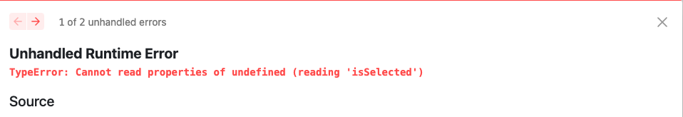
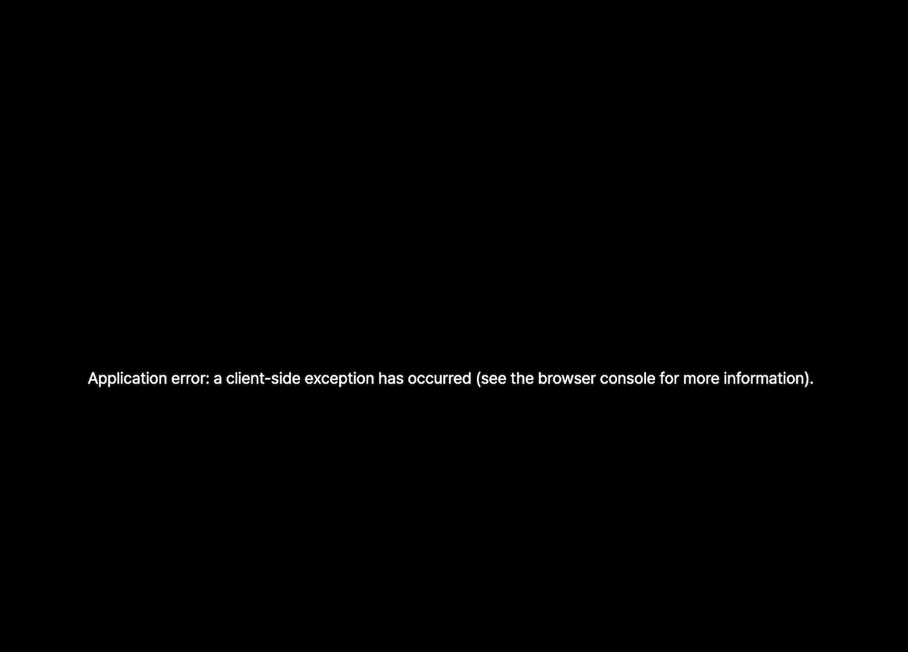
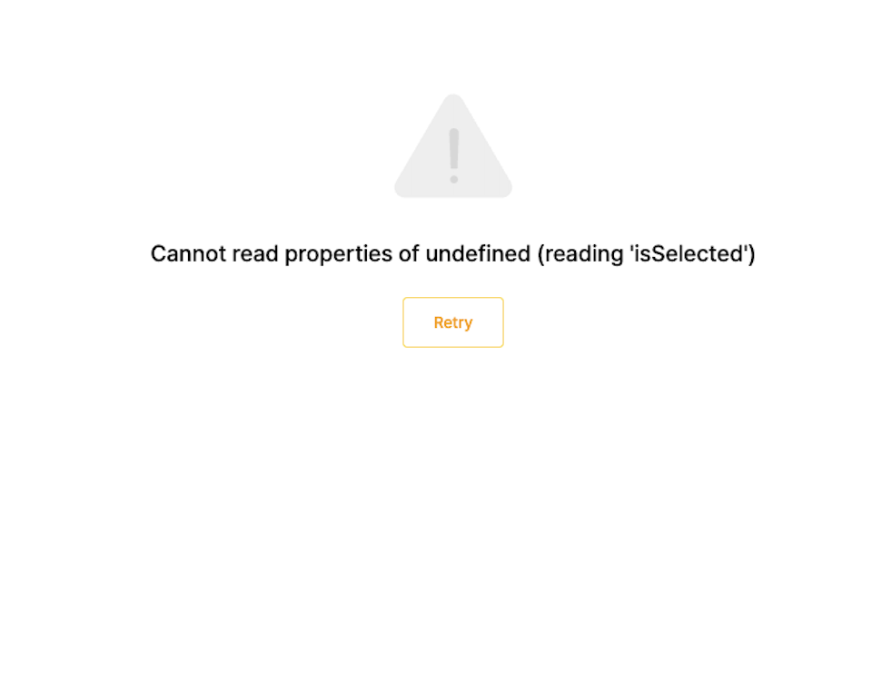

<Callout>💡 ErrorBoundary를 통해 서비스의 안전성을 더한 경험을 공유합니다.</Callout>

프로젝트 특성상 여러 커뮤니티를 관리하다 보니 외부 개발자가 프로젝트 코드에 작업하는 경우도 빈번하게 발생한다.

그래서 항상 예상하지 못한 에러 상황을 마주하게 된다.

## 문제 상황

> `Next.js Pages Router` 방식과 관련된 글입니다.


현재 `Next.js` 를 사용하고 있기 때문에 일반적인 에러 상황에 대해서는 [\_error.tsx](https://nextjs.org/docs/pages/building-your-application/routing/custom-error#more-advanced-error-page-customizing) 로 대처하고 있었다.


**\_error.tsx**

```tsx
function Error({ statusCode }) {
	... // statusCode에 따라 에러 화면을 구성합니다.
}

Error.getInitialProps = ({ res, err }) => {
  const statusCode = res ? res.statusCode : err ? err.statusCode : null
  return { statusCode }
}

export default Error
```

하지만 `_error.tsx` 로도 처리하지 못하는 상황이 발생할 수 있는데 **런타임 에러**가 해당된다.


대표적으로 다음과 같은 타입 에러가 발생할 수 있다.



이 코드가 배포 환경까지 반영되면 다음과 같은 상황이 초래된다.



배포 과정에서 빌드는 잘 되었지만 예상치 못한 에러 화면이 등장해서 처음 접하게 되면 많이 당황스럽다. 😵

오류에 대한 내용도 화면에 포함되어 있지 않다. 그래서 어디가 잘못 되었는지 화면만 봤을 때 찾기 힘들다.

결국 로컬 환경에서 다시 확인해야 하는 상황이 발생하는데 이 과정이 굉장히 많은 시간을 소요하게 만든다.

이러한 상황을 막기 위해 **최소한의 안전 장치**라도 필요하다는 생각을 하게 되었다.

## ErrorBoundary

> Fault tolerance is the property that enables a system to continue operating properly in the event of the failure of some (one or more faults within) of its components.


`React`에서는 렌더링 도중 에러가 발생할 때 최소한의 UI를 표시할 수 있는 도구로 `ErrorBoundary`를 사용할 수 있다.
공식 문서에서는 다음과 같은 코드를 제공한다.


**ErrorBoundary 예제 코드**

```jsx
class ErrorBoundary extends React.Component {
  constructor(props) {
    super(props)

    // Define a state variable to track whether is an error or not
    this.state = { hasError: false }
  }
  static getDerivedStateFromError(error) {
    // Update state so the next render will show the fallback UI

    return { hasError: true }
  }
  componentDidCatch(error, errorInfo) {
    // You can use your own error logging service here
    console.log({ error, errorInfo })
  }
  render() {
    // Check if the error is thrown
    if (this.state.hasError) {
      // You can render any custom fallback UI
      return (
        <div>
          <h2>Oops, there is an error!</h2>
          <button type="button" onClick={() => this.setState({ hasError: false })}>
            Try again?
          </button>
        </div>
      )
    }

    // Return children components in case of no error

    return this.props.children
  }
}

export default ErrorBoundary
```


`ErrorBoundary`의 주요 코드를 한 번 알아보자.

### getDerivedStateFromError

오류에 대한 응답으로 상태를 업데이트하거나 사용자에게 오류 메시지를 표시할 수 있는 역할을 한다.
렌더링 도중 자식 컴포넌트에서 오류가 발생하면 호출되는 흐름으로 이를 통해 에러 메시지를 표시할 수 있게 된다.


파라미터로 `error`를 받으며 일반적으로는 `Error`의 인스턴스이지만,
문자열이나 `null`을 포함한 모든 값을 받을 수 있다.
반환 값은 컴포넌트에 에러 메시지를 표시할 상태를 반환하면 된다.


주의할 점으로 `static getDerivedStateFromError`은 순수 함수이어야 한다.
사이드 이펙트가 필요하면 `componentDidCatch`를 활용할 수 있다.


### componentDidCatch

에러 발생 시 추가 로직을 구성할 수 있는 역할을 한다.
예를 들어 에러를 로깅할 때 사용할 수 있다.


파라미터로 `error`와 `info`를 받는다.

`error`는 `getDerivedStateFromError`의 `error`처럼 일반적으로는 `Error`의 인스턴스이지만,
문자열이나 `null`을 포함한 모든 값을 받을 수 있다.

`info`는 오류에 대한 추가 정보가 포함된 객체이다.
`componentStack` 필드의 경우에는 오류가 발생한 컴포넌트의 스택 추적, 상위 컴포넌트의 이름 및 소스 위치 포함된다고 한다.


`componentDidCatch`에서는 어느 것도 반환하지 않는다.


## 커스텀하게 사용하기

예제 코드를 봤을 때 그대로 쓰기에는 아쉽다.
**재사용성을 높이고 타입을 적용**할 필요가 있다.

관련 라이브러리들([react-error-boundary](https://github.com/bvaughn/react-error-boundary), [suspensive](https://github.com/toss/suspensive))도 존재하지만 우선 가볍게 쓰고 싶었다.
프로젝트에 새로운 의존성이 추가되는게 부담스러운 상황이었다.
따라서 오픈 소스에서 구현된 코드를 참고하여 현재 요구 상황에 맞게 간단한 `ErrorBoundary`를 만들어보자.


크게 다음과 같은 기능을 추가할 것이다.

- `fallback`: 에러가 발생했을 때 보여줄 컴포넌트
- `reset`: 재실행 함수
- `onError`: 에러가 발생했을 때 실행시키는 함수


코드로 구성하면 다음과 같다.


**ErrorBoundary 코드**

```tsx
import React, { Component, ErrorInfo, FunctionComponent, ReactNode } from 'react'

interface ErrorBoundaryFallbackProops<TError extends Error = Error> {
  error: TError
  reset: () => void
}

interface ErrorBoundaryProps {
  children?: ReactNode
  onError?(error: Error, info: ErrorInfo): void
  onReset?(): void
  fallback: ReactNode | FunctionComponent<ErrorBoundaryFallbackProops>
}

type ErrorBoundaryState<TError extends Error = Error> =
  | { isError: true; error: TError }
  | { isError: false; error: null }

const initialErrorBoundaryState: ErrorBoundaryState = {
  isError: false,
  error: null,
}

class ErrorBoundary extends Component<ErrorBoundaryProps, ErrorBoundaryState> {
  static getDerivedStateFromError(error: Error): ErrorBoundaryState {
    return { isError: true, error }
  }

  state: ErrorBoundaryState = initialErrorBoundaryState

  componentDidUpdate(
    prevProps: Readonly<ErrorBoundaryProps>,
    prevState: Readonly<ErrorBoundaryState<Error>>,
    snapshot?: any,
  ) {
    const { isError } = this.state

    if (isError && prevState.isError) {
      this.reset() // 재실행 함수
    }
  }

  componentDidCatch(error: Error, into: ErrorInfo) {
    console.error('Uncaught error:', error, into) // 에러 로깅
    this.props.onError?.(error, into) // 에러 발생 시 호출할 수 있는 함수
  }

  reset = () => {
    this.props.onReset?.()
    this.setState(initialErrorBoundaryState)
  }

  render() {
    const { children, fallback } = this.props
    const { error, isError } = this.state

    let childrenOrFallback = children

    if (isError) {
      if (typeof this.props.fallback === 'undefined') {
        if (process.env.NODE_ENV === 'development') {
          console.error('ErrorBoundary requires a defined fallback.')
        }

        throw error
      }

      if (typeof fallback === 'function') {
        const FallbackComponent = fallback
        childrenOrFallback = <FallbackComponent error={error} reset={this.reset} /> // 에러 발생 시 표시할 컴포넌트
      } else {
        childrenOrFallback = fallback
      }
    }

    return childrenOrFallback
  }
}

export default ErrorBoundary
```


이렇게 구성한 코드를 프로젝트에 적용해보자.

**\_app.tsx**

```tsx
<ErrorBoundary
  fallback={({ error, reset }) => (
    <GlobalErrorContainer errorMessage={error.message} onReset={reset} />
  )}
>
  ...
  <Components {...pageProps} />
</ErrorBoundary>
```


이제 다음과 같이 화면을 구성할 수 있게 된다.



### 마무리

이번에 `ErrorBoundary` 를 도입하면서 다음과 같은 효과를 기대할 수 있을 것 같다.

- 최소한의 안전 장치 마련
- QA 과정에서 빠른 원인 파악
- 에러를 선언적으로 관리해서 코드 내 관심사 분리


좀 더 알아보니 `app router` 방식의 [error-handling](https://nextjs.org/docs/app/building-your-application/routing/error-handling)에서는 `error.tsx` `global-error.tsx` 방식으로 대처가 가능해서 더 편리하게 적용할 수 있어 보인다. 🧐

## 참고 문서

- [Catching rendering errors with an error boundary](https://react.dev/reference/react/Component#catching-rendering-errors-with-an-error-boundary)
- [static getDerivedStateFromError(error)](https://react.dev/reference/react/Component#static-getderivedstatefromerror)
- [componentDidCatch(error, info)](https://react.dev/reference/react/Component#componentdidcatch)
