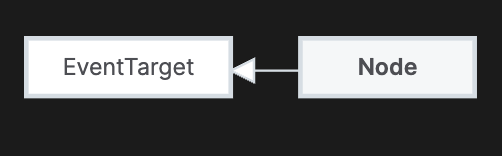
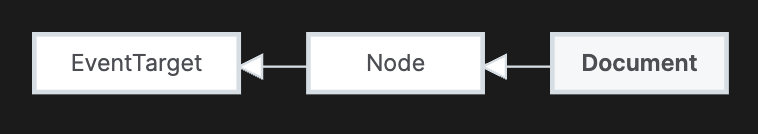
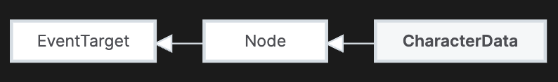
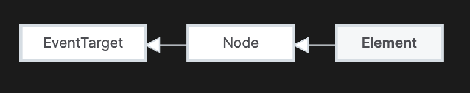
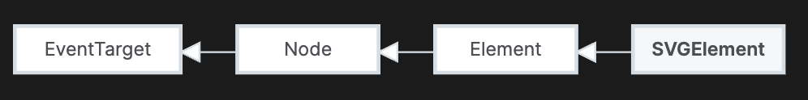
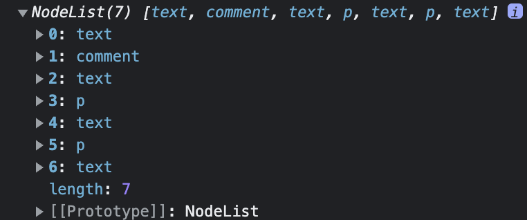
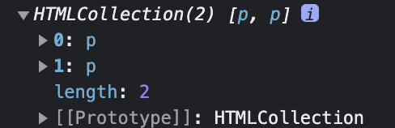

<Callout>
  💡 DOM과 관련된 용어들로 Node와 Element를 중심으로 정리합니다. 피드백은 언제나
  환영입니다:)
</Callout>

## Node, Element 정리하기

DOM과 관련된 코드를 작성하면서 **Element**, **Node**와 같은 단어들을 많이 접하게 되었다.
하지만 정확히 어떤 용도로 사용되는지 알지 못한 채 그냥 사용하니깐 사용한다는 느낌으로 용어를 써왔다.
그래서 이 둘을 무분별하게 혼용해서 사용하는 느낌을 받았다.
이번 기회에 모호했던 용어의 개념을 명확하게 정리하고자 한다.

## Node



> The DOM Node interface is an abstract base class upon which many other DOM API objects are based, thus letting those object types to be used similarly and often interchangeably.
> As an abstract class, there is no such thing as a plain Node object.
> All objects that implement Node functionality are based on one of its subclasses.

MDN의 정의를 간략하게 정리하면 **DOM Node 인터페이스는 여러 DOM API 객체들의 기반이 되는 추상적인 기본 클래스**이다.
그래서 이러한 객체 타입은 비슷하게, 상호 교환적으로 사용된다.

HTML을 구성하는 노드는 여러 가지가 존재한다. **`Element`는 `Node`의 유형 중 하나의 타입**이다.
가장 많이 사용되는 `Element`는 다음 단락에서 따로 살펴보고 이번 단락에서는 나머지 대표적인 노드로 3가지만 간략하게 알아보고자 한다.

### Document



`Document` 인터페이스는 DOM 트리 같은 페이지 컨텐츠의 시작점으로 브라우저가 불러온 웹 페이지를 나타낸다.
페이지의 URL을 얻거나 문서에 새로운 요소를 생성하는 기능을 제공한다.

`Document`와 관련해서 [DocumentFragment](https://developer.mozilla.org/en-US/docs/Web/API/DocumentFragment) 인터페이스도 존재하는데,
`DocumentFragment`는 **Document의 경량화 버전**으로 보면 좋을 것 같다. 주요 차이점으로 `DocumentFragment`는 **활성화된 문서 트리 구조의 부분이 아니라는 점**이다.
그래서 `DocumentFragment`에 변화가 생겨도 문서에 영향을 주지 않는다.

다음과 같이 사용한다고 한다.

```js
const ul = document.querySelector('ul')
const fruits = ['Apple', 'Orange', 'Banana', 'Melon']

const fragment = new DocumentFragment()

for (const fruit of fruits) {
  const li = document.createElement('li')
  li.textContent = fruit
  fragment.append(li)
}

ul.append(fragment)
```

### Attr


`Attr` 인터페이스는 요소의 속성을 객체로 나타낸다. **Attribute**로도 혼용해서 사용하는 것 같다.
일반적으로 생각하는 태그에 대한 속성 값과 관련된 노드이다.

### CharacterData



`CharacterData` 인터페이스는 문자들을 포함하는 `Node` 객체를 나타낸다.
텍스트뿐만 아니라 주석도 노드에 포함된다. (Text, Comments)

## Element

가장 많이 사용하고 접하게 되는 용어이다.



`Element`는 **`Document` 안의 모든 객체가 상속하는 제일 범용적인 기반 클래스**이다.
공통 메서드와 속성만 가지고 있으며,
특정 요소를 상세하게 표현하는 클래스가 `Element`를 상속한다.

그래서 `HTMLElement`는 HTML 요소의 기반 인터페이스이고 `SVGElement`는 모든 SVG 요소의 기반 인터페이스이다.

<div style={{display: 'flex', gap: '50px'}}>
<div style={{width: '50%'}}>
**HTMLElement**


</div>

<div style={{width: '50%'}}>
**SVGElement**


</div>
</div>

## 많이 하는 실수

앞선 내용들을 통해 `Node`와 `Element`에 대해 구분할 수 있었다.
다음으로 `Node`와 `Element`에서 헷갈리는 부분을 짚고 넘어가고자 한다.

### Node: childNodes

`childNodes`는 동적인(live) `NodeList`를 반환한다.

<br />

잠시 `NodeList`를 알아보면 `NodeList`는 **노드들의 집합**이다.
근데 `NodeList`는 정적(static)과 동적(live)인 `NodeList`로 구분된다.

`Node.childNodes`의 경우 DOM에서 발생하는 변화에 자동적으로 업데이트하는 동적 `NodeList`이다.
반면, `document.querySelectorAll()` 메서드는 정적 `NodeList`로 DOM에서 발생하는 변화에 영향을 받지 않는다.

<br />

다시 돌아와서 `childNodes`는 **모든 자식 노드들을 포함**한다.
그래서 `Element Node`가 아닌 `Text Node`, `Comment Node`인 텍스트와 주석도 포함하는 것이다.

다음 코드를 `childNodes`를 통해 살펴보면 결과는 다음과 같다.

```html
<div>
  <!-- 주석 -->
  <p>첫 번째 문장</p>
  <p>두 번째 문장</p>
</div>
```

```js
document.querySelector('div').childNodes
```



### Element: children

`children`은 `HTMLCollection`을 반환한다.
`HTMLCollection`은 **요소들의 집합**으로 동적(live)이다.
`childNodes`와 달리 `children`는 오직 **요소 노드**(Element Node)만 가져온다.
따라서 앞선 코드와 비교했을 때 다음과 같은 결과가 나온다.

```html
<div>
  <!-- 주석 -->
  <p>첫 번째 문장</p>
  <p>두 번째 문장</p>
</div>
```

```js
document.querySelector('div').children
```



이에 대부분의 경우 우리가 원하는 동작, 요소에 접근하기 위해서는 `children`을 사용하는 것이 좋다.😚

## 출처

- [Node](https://developer.mozilla.org/en-US/docs/Web/API/Node)
- [Element](https://developer.mozilla.org/en-US/docs/Web/API/Element)
- [Node: childNodes property](https://developer.mozilla.org/en-US/docs/Web/API/Node/childNodes)
- [NodeList](https://developer.mozilla.org/en-US/docs/Web/API/NodeList)
- [Element: children property](https://developer.mozilla.org/en-US/docs/Web/API/Element/children)
- [HTMLCollection](https://developer.mozilla.org/en-US/docs/Web/API/HTMLCollection)
