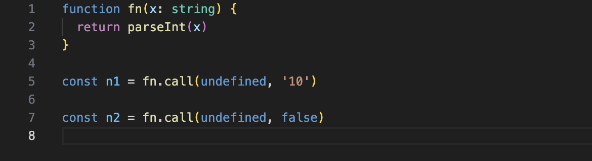
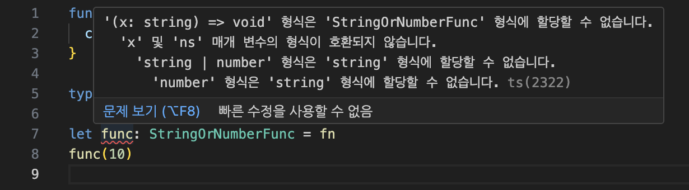
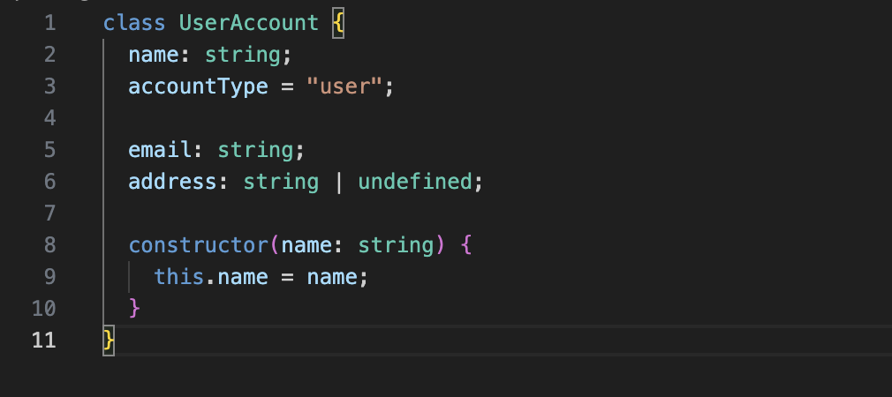
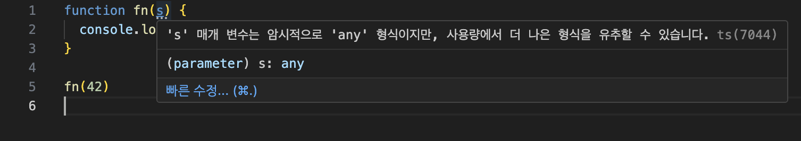
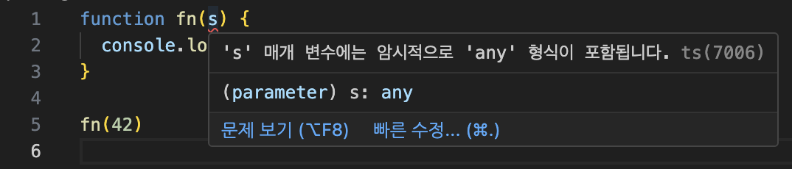
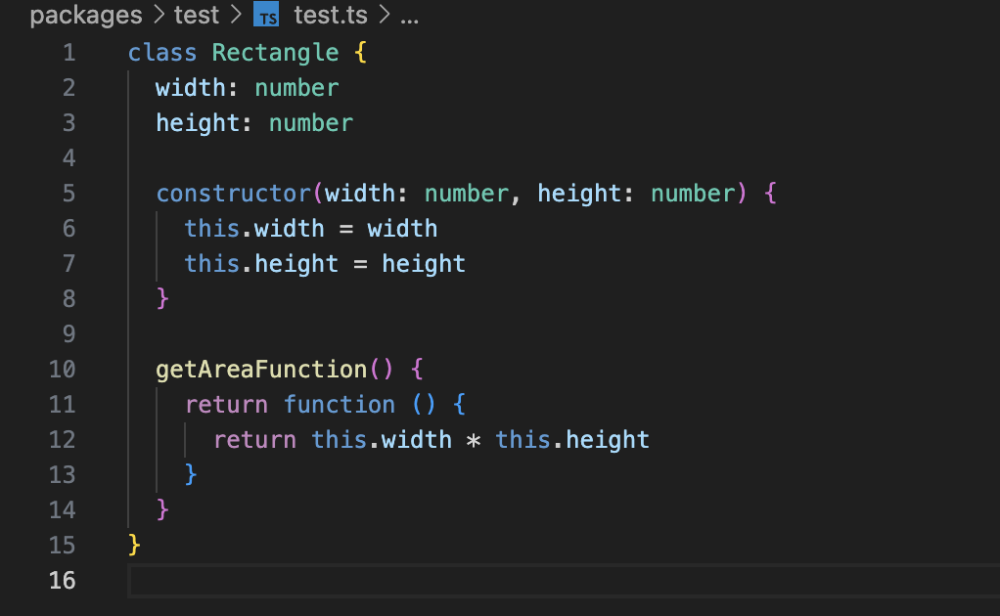
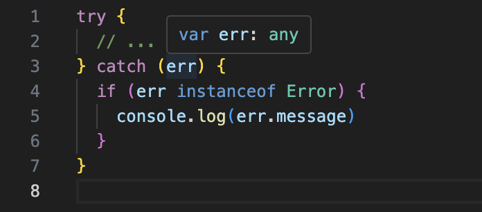

<Callout>
  💡 TypeScript Strict 속성에 대해 알아봅니다. 피드백은 언제나 환영입니다:)
</Callout>

## TypeScript - Strict

그동안 타입스크립트를 사용하면서 strict 옵션을 키는 것을 당연하게 생각했었다.

관성적으로, 아무런 의문을 품지 않으며 true로 설정한 채로 사용했다.

<br />

하지만 누군가는 `strict` 옵션을 `false`로 끄기도 한다.

이때 어떻게 `strict` 옵션의 필요성을 잘 설명하면서 설득할 수 있을까?

단순히 '그냥'이라는 이유로 치부할 수는 없을 것이다.

<br />

당연하게 여겨졌던 `strict` 옵션이 무엇을 하는지 알아보자.

## Strict이란?

`strict` 플래그는 **광범위한 타입 검사 동작을 활성화**시켜준다.

여기서 `strict` 옵션은 개별의 엄격 모드 검사가 모여 구성된 것이다.

따라서 다음 옵션들을 이해하면 `strict` 옵션을 이해할 수 있다.

### alwaysStrict

파일들이 [ECMAScript 엄격 모드](https://developer.mozilla.org/en-US/docs/Web/JavaScript/Reference/Strict_mode)에서 파싱되고 각 소스 파일에 대해 `use strict`을 내보내도록 보장한다.

### strictNullChecks

`strictNullChecks`가 `false`이면 `null`과 `undefined`가 효과적으로 무시된다.
이로 인해 예기치 못한 런타임 에러가 발생할 수 있게 된다.

`strictNullChecks`가 `true`이면 `null`과 `undefined`가 고유한 타입을 가진다.
이에 구체적인 값이 예상되는 곳에서 사용하려고 할 때 타입 에러가 발생하게 된다.

<br />

```ts
declare const loggedInUsername: string

const users = [
  { name: 'Oby', age: 12 },
  { name: 'Heera', age: 32 },
]

const loggedInUser = users.find((u) => u.name === loggedInUsername)
console.log(loggedInUser.age)
```

<br />

**`strictNullChecks` false**


<br />

**`strictNullChecks` true**


<br />

이외에도 **비동기 작업**에서 초기값이 `undefined`도 고려해야 할 때 해당 타입이 무시되어 예상치 못한 런타임 에러가 발생하는 경우를 많이 접할 수 있을 것이다.

### strictBindCallApply

함수의 내장 메서드인 `call`, `bind`, `apply`가 기본 함수에 올바른 인수를 사용하여 호출되는지 확인한다.

```ts
function fn(x: string) {
  return parseInt(x)
}

const n1 = fn.call(undefined, '10')

const n2 = fn.call(undefined, false)
```

<br />

**`strictBindCallApply` false**



<br />

**`strictBindCallApply` true**


### strictFunctionTypes

함수 매개변수를 더 정확하게 확인한다.

```ts
function fn(x: string) {
  console.log('Hello, ' + x.toLowerCase())
}

type StringOrNumberFunc = (ns: string | number) => void

let func: StringOrNumberFunc = fn
func(10)
```

<br />

**`strictFunctionTypes` false**


<br />

**`strictFunctionTypes` true**



<br />

#### 함수에만 적용 가능

> During development of this feature, we discovered a large number of inherently unsafe class hierarchies, including some in the DOM. Because of this, the setting only applies to functions written in function syntax, not to those in method syntax:

<br />

이 기능을 개발하는 동안 `DOM`의 일부를 포함하여 본질적으로 안전하지 않은 클래스 계층 구조가 많이 발견되었다고 한다.
따라서 메서드 구문으로 작성된 함수에는 적용되지 않는다.

<br />

```ts
type Methodish = {
  func(x: string | number): void
}

function fn(x: string) {
  console.log('Hello, ' + x.toLowerCase())
}

// 안전하지 않은 매개변수이지만 감지되지 않는다.
const m: Methodish = {
  func: fn,
}
m.func(10)
```

<br />

### strictPropertyInitialization

클래스 속성은 선언되었지만 생성자에서 설정되지 않은 경우 오류를 발생시킨다.

```ts
class UserAccount {
  name: string // 구체적으로 설정
  accountType = 'user' // 기본적으로 설정

  email: string // 설정되지 않는 경우
  address: string | undefined // 잠재적으로 undefined로 선언되어 설정할 필요가 없는 경우

  constructor(name: string) {
    this.name = name // 구체적으로 설정
  }
}
```

<br />

**`strictPropertyInitialization` false**



<br />

**`strictPropertyInitialization` true**


### noImplicitAny

타입 어노테이션이 없는 경우 타입을 유추할 수 없는 변수에 대해 `any` 타입으로 설정된다.

`noImplicitAny`가 설정되면 오류가 발생한다.

```ts
function fn(s) {
  console.log(s.subtr(3))
}

fn(42)
```

<br />

**`noImplicitAny` false**



<br />

**`noImplicitAny` true**



<br />

### noImplicitThis

암시적 `any` 타입이 있는 `this` 표현식에 에러를 발생시킨다.

<br />

```ts
class Rectangle {
  width: number
  height: number

  constructor(width: number, height: number) {
    this.width = width
    this.height = height
  }

  getAreaFunction() {
    return function () {
      return this.width * this.height // 해당 컨텍스트는 Rectangle의 인스턴스가 아니다.
    }
  }
}
```

<br />

**`noImplicitThis` false**



<br />

**`noImplicitThis` true**


<br />

### useUnknownInCatchVariables

`strict` 옵션 중 가장 최근에 추가된 옵션이다. (TypeScript 4.4)

`catch` 절의 변수 타입을 `any`에서 `unknown`으로 변경할 수 있도록 한다.

```ts
try {
  // ...
} catch (err) {
  if (err instanceof Error) {
    console.log(err.message)
  }
}
```

<br />

**`useUnknownInCatchVariables` false**



<br />

**`useUnknownInCatchVariables` true**


## 마무리

`strict`의 개별 옵션들을 전체적으로 살펴볼 수 있었다.

<br />

아마 `strictNullChecks`와 `noImplicitAny`은 다른 옵션에 비해 상대적으로 많이 접하는 경우여서 익숙할 것이다.

비록 나머지 옵션은 많이 접해보지 않았지만 유용한 기능이라는 생각이 든다.

### 알고 쓰는 것과 모르고 쓰는 것은 천지차이

`useUnknownInCatchVariables`같은 경우에는 에러 처리할 때 `unknown`으로 타입이 잡히는 것을 본 기억이 있었는데,
이것이 `strict` 옵션 때문인지 몰랐었다.
이번 기회에 지식의 빈구멍을 채우면서 새롭게 배우는 시간이 되었다.

<br />

앞으로의 타입스크립트 버전에서도 `strict`에 더 많은 플래그들이 추가될 수도 있기에 한 번씩 살펴보면 좋겠다는 생각이 든다. 🧐

## 참고 문서

- [Strict - strict](https://www.typescriptlang.org/tsconfig#strict)
