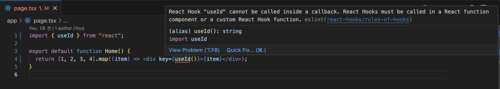
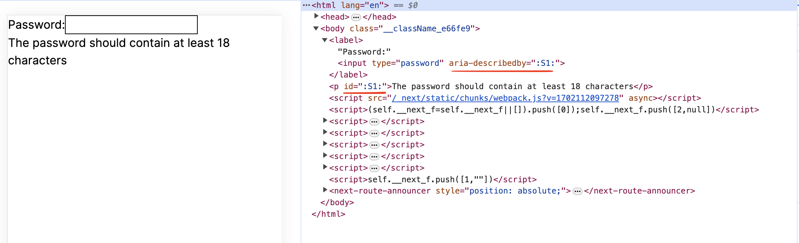

<Callout>💡 useId와 관련된 개념들을 이해합니다. 피드백은 언제나 환영입니다:)</Callout>

## useId

> useId is a React Hook for generating unique IDs that can be passed to accessibility attributes.

`useId`에 대한 정의를 살펴봤을 때 **접근성 속성에 전달할 수 있는 고유한 Id를 생성하기 위한 훅**이라고 한다.

`useId` 자체의 사용법은 매우 간단하다.

컴포넌트 최상단에서 `useId`를 호출하면 끝이다.
그러면 문자열로 고유한 id를 반환해준다.

```tsx
import { useId } from 'react'

function PasswordField() {
  const passwordHintId = useId()
  // ...
}
```

## 주의할 점

> useId should not be used to generate keys in a list.
> Keys should be generated from your data.

처음 `useId`를 접했을 때 고유한 id를 생성할 수 있으니 '`uuid`처럼 사용하면 되겠구나'라고 생각했다.

하지만 공식 문서에서는 리스트에 `key`값으로 사용하는 것은 지양한다고 안내한다.
`key`는 데이터에서 생성하는 것을 권장한다.

그리고 `useId`는 훅이다 보니 다음과 같은 에러를 발생시킨다.



## 올바르게 사용하기

그러면 어디에 `useId`를 사용해야 할까?

여기서 중요한 부분은 `accessibility attributes`이다.
**접근성 속성**과 관련해서 사용하는 것이다.

### id 충돌의 위험 방지

다음과 같은 상황을 보자.

```tsx
<label>
  Password:
  <input
    type="password"
    aria-describedby="password-hint"
  />
</label>
<p id="password-hint">
  The password should contain at least 18 characters
</p>
```

id를 하드코딩하는 것은 좋지 못한 습관이다.

이때 고유한 id로 `useId`를 사용할 수 있는 것이다.

```tsx
const passwordHintId = useId()

return (
  <>
    <label>
      Password:
      <input type="password" aria-describedby={passwordHintId} />
    </label>
    <p id={passwordHintId}>The password should contain at least 18 characters</p>
  </>
)
```



폼과 같이 내부에 여러 요소가 사용되는 경우에는 다음과 같이 사용한다.

```tsx
const formId = useId()

return (
  <form>
    <label htmlFor={formId + '-firstName'}>First Name:</label>
    <input id={formId + '-firstName'} type="text" />
    <hr />
    <label htmlFor={formId + '-lastName'}>Last Name:</label>
    <input id={formId + '-lastName'} type="text" />
  </form>
)
```

### SSR 환경에서의 활용

> With server rendering, useId requires an identical component tree on the server and the client.
> If the trees you render on the server and the client don’t match exactly, the generated IDs won’t match.

SSR 환경에서도 `useId`가 유용하게 쓰인다.

`uuid`와 같은 라이브러리를 SSR 환경에서 사용할 시 서버와 클라이언트에서 다른 id를 생성한다.

테스트 환경은 Next.js에서 진행했다.

```tsx
const uuidValue = uuidv4()

console.log('uuid:', uuidValue)

return (
  <div>
    <div>uuid: {uuidValue}</div>
  </div>
)
```


`Warning: Text content did not match. Server: "서버에서 생성된 ID값" Client: "클라어인트에서 생성된 ID값"`

다음과 같은 에러가 발생하고 콘솔 값도 다르게 찍히는 것을 확인할 수 있다.


하지만 `useId`는 동일한 id를 생성해 서버와 클라이언트 환경에서 렌더링하는 트리를 정확히 일치시킬 수 있다.

```tsx
const useIdValue = useId();

console.log("useId: ", useIdValue);

return (
  <div>
    <div>useId: {useIdValue}</div>
  </div>
);
}
```


## App이 여러 개인 상황에서는?

한 페이지에서 여러 개의 독립적인 React 애플리케이션을 렌더링하는 상황이 발생할 수도 있다.
(아직 한 번도 경험해보지 못했지만... 😇)

이때 `identifierPrefix`를 `createRoot` 혹은 `hydrateRoot`에 사용하면 된다.

```jsx
// index.js

const root1 = createRoot(document.getElementById('root1'), {
  identifierPrefix: 'my-first-app-',
})
root1.render(<App />)

const root2 = createRoot(document.getElementById('root2'), {
  identifierPrefix: 'my-second-app-',
})
root2.render(<App />)

// App.js
const useIdValue = useId()
console.log('Generated identifier:', useIdValue)
// Generated identifier: :my-first-app-r0:
// Generated identifier: :my-second-app-r1:
```

## 참고 문서

- [useId](https://react.dev/reference/react/useId)
