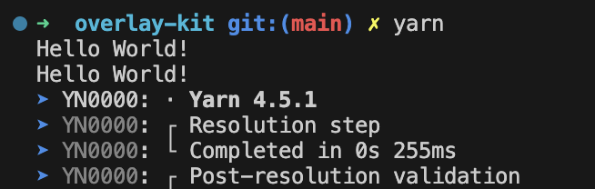
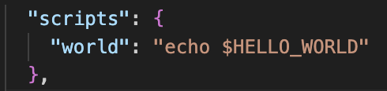

<Callout>💡 yarn과 관련된 개념들을 이해합니다. 피드백은 언제나 환영입니다:)</Callout>

개발 공부하다보면 강의나 자료에 따라 yarn을 쓰는 경우를 많이 만나게 된다.

이때 yarn과 관련된 지식이 명확하게 정리되지 않는 상태로 학습을 진행했었다.

그래서 매번 몇몇 부분에서 멈칫하는 부분들이 생겨났다.

<br />

이에 공식 문서를 기반으로 헷갈렸던 키워드와 개념들을 알아보고자 한다.

## yarn Classic (1.x)과 다른 점이 무엇일까?

문서에서는 기존 1버전의 yarn과 비교했을 때 장점으로 다음 키워드들을 제시한다.

<br />

- 안정성 (Stability): yarn Classic을 유지보수한 경험을 토대로 안정적 소프트웨어 제공
- 새로운 기능 (New features): PnP, Zero-Installs, workspaces 등 현대적인 개발 환경에 필요한 기능들을 제공
- 유연성 (Flexibility): PnP, node_modules, pnpm 스타일 등 다양한 설치 전략 지원하여 최적의 방식 선택 가능
- 확장성 (Extensibility): 플러그인 시스템을 통해 필요한 기능을 직접 구축 및 확장할 수 있는 유연한 아키텍처 제공
- 미래 대비 (Future proof): Yarn Classic의 복잡함 해결
- 효율성 (Efficiency): 최적화된 캐싱 시스템과 설치 프로세스를 통해 빠른 설치 속도와 디스크 공간 효율성 제공

<br />

## Corepack

> Start by enabling Corepack, if it isn't already; this will add the yarn binary to your PATH:

<br />

처음 yarn을 설치할 때 다음 명령어를 입력하라고 한다.

<br />

```bash
corepack enable
```

<br />

`Corepack`이라는 키워드가 등장하는데 매번 '그냥 이거를 설치해야 하는구나' 하고 넘어갔다. 😅

또한, 문서에서는 `npm install -g yarn` 을 실행하지 말라고 안내하며 권장하지도 않는다. (몰랐던 사실…)

이유는 **프로젝트 종속성을 잠가야 하는 것처럼 패키지 관리자 자체도 잠가야 한다고 한다.**

<br />

만약 yarn을 글로벌 바이너리로 설치하면 항상 최신 버전을 사용한다.

그래서 릴리즈 사항에 따라 프로젝트에 영향을 줄 수 있다.

<br />

이에 프로젝트의 `dependencies`에 대한 `lockfile`처럼 프로젝트별로 사용할 패키지 관리자 버전을 정의할 수 있도록 공식 `Node.js` 도구인 `Corepack`을 활용하는 것이다.

<br />

즉 `Corepack`은 **패키지 관리자의 버전을 관리하는 도구**로 정리할 수 있다.

Corepack 활성 여부는 `yarn exec env` 명령어를 통해 확인할 수 있다.

<br />


<br />

## 설치 구성 단계

`yarn install`을 하면 크게 다음 3가지 단계가 발생한다.

### Resolution (의존성 해결 단계)

**프로젝트에 필요한 패키지의 버전을 결정하고 의존성 트리를 구성**한다.

`lockfile`에서 기존의 의존성 정보를 로드하고, `package.json` 파일을 읽어 현재 프로젝트의 상태를 파악한다.
이를 통해 아직 설치되지 않은 패키지들을 식별한다.

### Fetch (패키지 다운로드 단계)

`Resolution` 단계에서 구성된 패키지를 바탕으로 실제 패키지를 다운로드한다.

### Link (패키지 연결 단계)

**패키지를 실제로 사용 가능한 상태로 만드는 단계**로, 각 런타임 환경에 맞게 패키지를 설치하고 연결한다.

성능 측면에서 중요한 역할을 한다.

## 성능

`Link` 단계의 차이에서 알 수 있듯이 **Yarn PnP은 선택 사항**이다.

`yarnrc.yml` 파일에 `nodeLinker: node-modules` 설정하면 언제든지 `node_modules`로 이동 가능하다.

<br />

**node_modules 방식**


<br />

**PnP 방식**


### 공식 벤치마크

yarn은 [Official benchmarks](https://yarnpkg.com/features/performances#official-benchmarks)에서 한 주 동안 주요 패키지 관리자에서의 설치 시간을 비교해서 알려준다.

### yarn의 우선순위는 workspaces

> We prioritized workspaces because we felt like monorepos were providing significant value.


큰 속도 개선이 존재하지만,

[문서](https://yarnpkg.com/getting-started/qa#is-yarn-faster-than-other-package-managers)에서 yarn은 모노레포가 상당한 가치를 제공한다고 생각하여 모노레포에 우선순위를 둔다고 한다.

<br />

> Speed is relative and a temporary state. Processes, roadmaps and core values are what stick.

'**속도는 상대적이고 일시적인 상태이다. 프로세스, 로드맵, 핵심 가치가 지속되는 것이다.**'라는 문구가 인상적이다.

## PnP

> 일반적인 `node_modules` 디렉터리를 생성하는 대신 하나의 파일(.pnp.cjs)을 생성한 다음 `Node`에 주입하여 설치된 패키지 위치를 알려주는 설치 전략

<br />

yarn의 핵심 기능으로 `node_modules` 없이 `JavaScript Map` 객체를 활용해 의존성을 엄격하고 빠르게 관리하는 접근하고자 한다.

<br />

`node_modules` 대신 단일 `Node.js` 로더 파일인 `.pnp.cjs`가 생성되는데 다음 역할을 한다.

- 프로젝트의 의존성 트리에 대한 모든 정보 포함
- 디스크에 있는 패키지의 위치를 도구에 제공
- `require`, `import` 호출을 해결하는 방법 제공

<br />

PnP 기능을 통해 다음과 같은 장점을 얻을 수 있다고 한다.

- 설치 공간 최소화 (Minimal install footprint)
- 디스크 간 공유 설치 (Shared installs across disks)
- 완벽하고 정확한 호이스팅 (Perfect and correct hoisting)
- 유령 의존성 보호(Ghost dependencies protection)
- 시멘틱 오류(Semantic erroring)

### npm / pnpm 과도 잘 호환된다.

yarn PnP는 구현 세부 사항에는 차이가 있지만 다른 패키지 관리자와 동일한 `public interface`를 사용하도록 설계되었다.

프로젝트가 PnP과 함께 작동한다면 어디서나 작동한다. ex) yarn PnP → npm ✅

<br />

하지만 반대는 아니다. 에러가 발생하는 경우도 존재한다. ex) npm → yarn PnP ❎

다른 패키지 관리자는 적절한 의존성 목록을 강제하지 않아서 유령 의존성 문제에 취약할 수 있다.

<br />

**PnP는 가장 엄격하고 정확한 설치 방식**이다.

### ghost dependencies 해결 방식

`packageExtensions`을 통해 종속성의 패키지 정의 확장하여 `third-party` 이슈를 해결할 수 있다.

예를 들면 다음과 같다.

<br />

**.yarnrc.yml**

```yaml
yarnPath: .yarn/releases/yarn-4.6.0.cjs

packageExtensions:
  "@fastify/autoload@*":
    peerDependencies:
      fastify: "^5"
  "@fastify/cors@*":
    peerDependencies:
      fastify: "^5"
  "@fastify/env@*":
    peerDependencies:
      fastify: "^5"

  "fastify-plugin@*":
    peerDependencies:
      fastify: "^5"
  "fastify-graceful-shutdown@*":
    peerDependencies:
      fastify: "^5"
```

## Zero-installs

yarn의 주요 캐싱 전략으로 `Zero-installs`가 존재한다.

이 기능을 활용하면 브랜치 변경 시 `yarn install`을 실행할 필요가 없게 된다.

<br />

`.pnp.*` 과 `.yarn/cache`(Offline mirror)을 커밋하면 적용된다.

(대부분의 경우 `.pnp*` 로더 파일만 추가해도 된다고 한다.)

## 플러그인

확장성과 관련해서 튜토리얼을 통해 직접 플러그인을 적용해볼 수 있다.

<br />

`plugin-hello-world.js` 파일을 추가한다.

<br />

```js
module.exports = {
  name: `plugin-hello-world`,
  factory: (require) => {
    console.log('Hello World!');
    return {};
  },
};
```

<br />

추가한 플러그인을 yarn이 찾을 수 있도록  `.yarnrc.yml`에 등록한다.

<br />

```yml
plugins:
  - ./plugin-hello-world.js
```

<br />



<br />

### command 추가

자체 커맨드를 추가해보자.

`yarn` 에서는 [clipanion](https://github.com/arcanis/clipanion)를 활용한다.

<br />

**plugin-hello-world.js**

```js
module.exports = {
  name: `plugin-hello-world`,
  factory: (require) => {
    const { BaseCommand } = require(`@yarnpkg/cli`);

    class HelloWorldCommand extends BaseCommand {
      static paths = [[`hello`]];

      async execute() {
        this.context.stdout.write(`This is my very own plugin 😎\n`);
      }
    }

    return {
      commands: [HelloWorldCommand],
    };
  },
};
```

<br />

`yarn hello`를 실행하면 추가한 메시지가 나온다.

<br />


<br />

### hooks 사용

yarn 생명주기 내에서 다양한 이벤트들도 등록할 수 있다.

이때 `hooks` 속성을 활용할 수 있다.

<br />

```js
module.exports = {
  name: `plugin-hello-world`,
  factory: require => ({
    hooks: {
      setupScriptEnvironment(project, scriptEnv) {
        scriptEnv.HELLO_WORLD = `my first plugin!`;
      },
    },
  })
};
```



<br />


## 참고 문서

- [yarn](https://yarnpkg.com/)
- [node_modules로부터 우리를 구원해 줄 Yarn Berry](https://toss.tech/article/node-modules-and-yarn-berry)
- [패키지 매니저의 과거, 토스의 선택, 그리고 미래](https://toss.tech/article/lightning-talks-package-manager)
- [How Yarn PnP can save your space-time - Burak Yiğit Kaya](https://www.youtube.com/watch?v=AFBYxQPq-2c)
- [How Yarn Actually Works](https://www.youtube.com/watch?v=L4gNYmlPCc4)
- [How Yarn PnP solved the node_modules problem](https://www.youtube.com/watch?v=LUykz1etOo0)
