<Callout>
  💡 직접 라이브러리를 만들어 사용해보면서 겪은 의존성 이슈에 관한 내용을 다룹니다.
  피드백은 언제나 환영입니다:)
</Callout>

## 불과 하루 사이에 라이브러리 에러 발생?!

글또 활동을 하면서 three 관련 스터디를 해나가고 있다.

<br />

스터디 목표로 React Three Fiber을 활용한 인터렉션 컴포넌트 라이브러리를 만들어보고 싶었다.

어찌저찌 컴포넌트를 구성해서 배포까지 성공했다. 🎉 [(@jgjgill/interaction](https://www.npmjs.com/package/@jgjgill/interaction))

<br />

**주사위 컴포넌트 🎲**

<video src="/videos/development/learning-dependency-issues-with-my-library/dice-component.mp4" controls style="max-width:100%;max-height:400px;display:block;margin:1.5rem auto;border-radius:0.5rem;" />

<br />

그런데 개발 환경에서 테스트(모노레포 `workspace` 방식)했을 때는 정상적으로 동작하던 컴포넌트가

이상하게 `@jgjgill/interaction` 라이브러리를 외부 프로젝트에서 불러와서 사용할 때는 에러가 발생하는 것이다. 🤔

```bash
pnpm i @jgjgill/interaction // 배포 라이브러리
pnpm i three @types/three @react-three/fiber @react-three/drei // 기타 의존 라이브러리
```

<br />

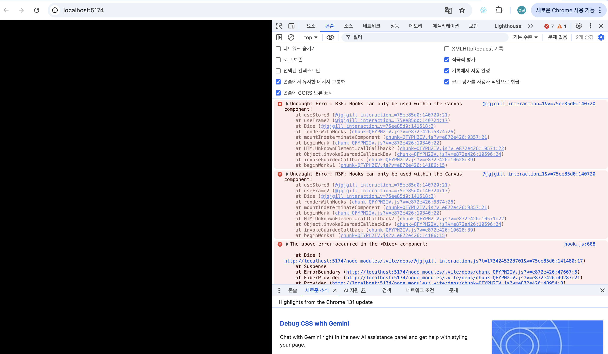

<br />

코드에서는 전혀 달라지는 부분이 존재하지 않았다.

<br />

```tsx
import { Canvas } from '@react-three/fiber'
import { Dice } from '@jgjgill/interaction'
import './App.css'

function App() {
  return (
    <Canvas>
      <Dice />
      <ambientLight intensity={0.5} />
    </Canvas>
  )
}

export default App
```

<br />

그래서 더더욱 문제의 원인이 짐작되지 않았는데..

아무리 생각해도 코드는 문제가 없다고 판단했다.

좀 더 근원적인 부분이 문제라고 여겨졌다.

## 내가 만든 라이브러리는 의존하는 라이브러리들이 존재한다.

개발 환경에서의 테스트와 새롭게 구성한 프로젝트에서 차이가 발생하는 부분을 하나씩 파악해 나갔을 때 `package.json`이 눈에 띄었다.

<br />

**개발 환경 테스트로 `workspace`에서 설치된 버전**

<br />

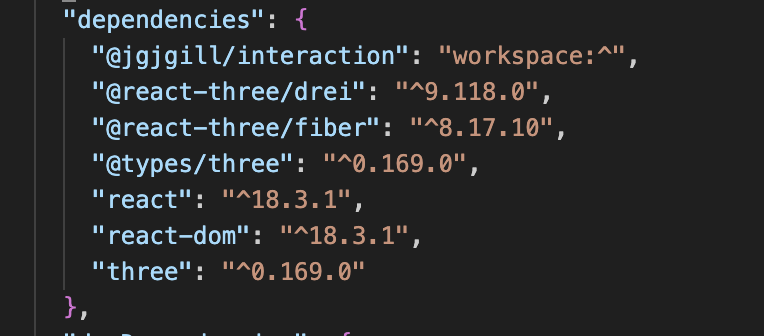

<br />

**새롭게 구성한 프로젝트에서 설치된 버전**

<br />

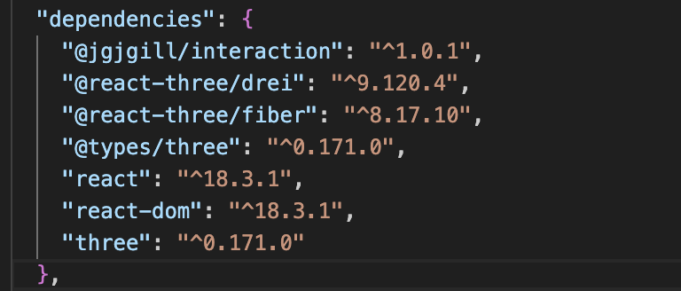

<br />

여기서 three와 `@types/three`의 버전이 달라진다. (`^0.169.0` → `^0.171.0`)

새로운 환경에서 관련 라이브러리를 설치할 때는 최신 버전으로 설치되는 것이다.

<br />

그래서 정말 단순하게 접근했을 때는 변경된 라이브러리의 버전들을 `@jgjgill/interaction`에 설치된 라이브러리의 버전과 강제로 일치시킬 수 있다.

그러면 다음과 같이 정상적으로 동작한다.

```json
"@react-three/drei": "^9.118.0",
"@react-three/fiber": "^8.17.10",
"@types/three": "^0.169.0", // ^0.171.0 ➡️ ^0.169.0 🔄
"react": "^18.3.1",
"react-dom": "^18.3.1",
"three": "^0.169.0"// ^0.171.0 ➡️ ^0.169.0 🔄
```

<br />

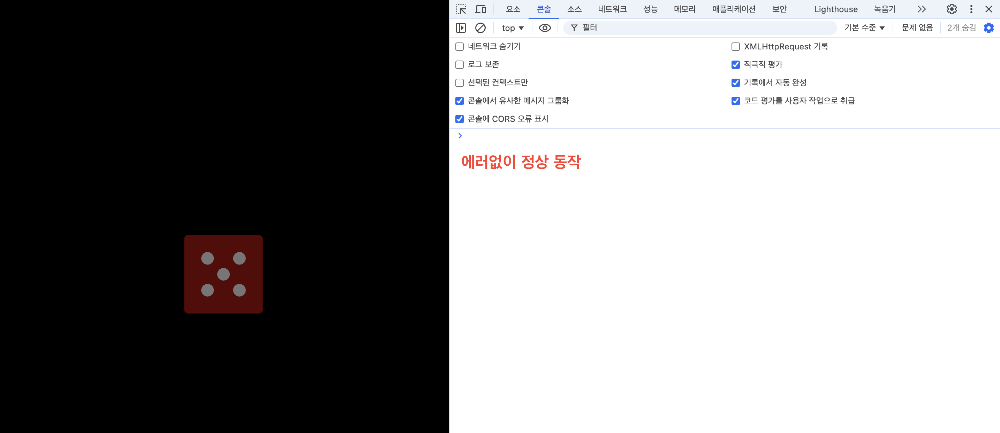

## peerDependencies 활용하기

근데 라이브러리를 사용할 때마다 매번 사용자가 라이브러리 버전을 맞추는 것은 이상하게 느껴진다.

우선 해당 문제는 어딘가 의존성이 꼬여서 발생한 문제로 추측된다.

<br />

`peerDependencies`를 적용해보자.

`peerDependencies`는 "이 라이브러리를 사용하려면 이런 버전의 다른 라이브러리가 필요해요” 라고 선언하는 방식이다.
그래서 라이브러리를 사용하는 프로젝트에서 관련 의존성을 설치하도록 요구할 수 있다.

### v1.0.1 (기존 코드)

기존 문제가 발생했던 코드에서 따로 `peerDependencies`를 명시하지 않으면

라이브러리 내 `three` 버전을 따라 `0.169.0`으로 구성된다.

<br />

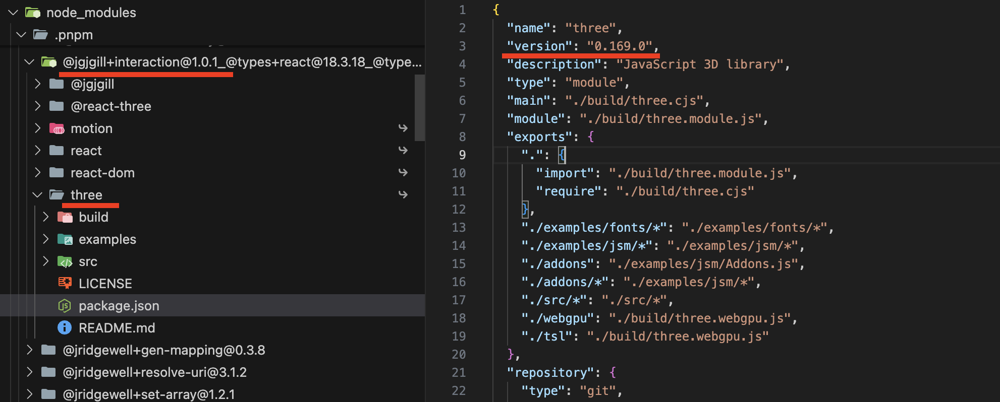

<br />

여기서 `three`를 설치하면 최신 버전인 `0.171.0`로도 구성되어 '의존성이 꼬이는 문제가 발생하는 것인가?'라고 의심된다.

<br />

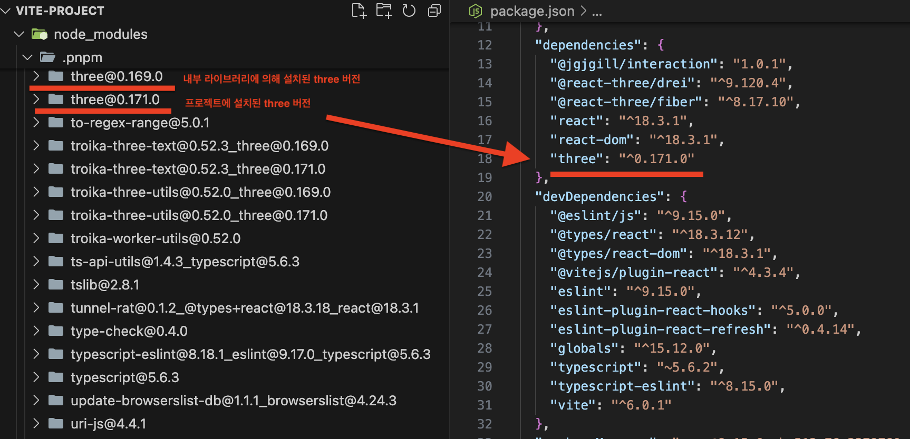

### v.1.0.2 (peerDependencies 적용 코드)

`peerDependencies`에 3개의 라이브러리를 추가한다.

```json
"peerDependencies": {
  "react": "^18",
  "react-dom": "^18",
  "three": "^0.169.0"
},
```

다시 배포해서 확인해보면 이번에는 `three` 버전이 `0.169.0`이 아닌 `^0.169.0`에서 호환되는 최신 버전 `0.171.0`로 구성된다.

<br />


<br />

동일하게 `three`를 설치해도 `0.171.0`만 존재한다.

<br />

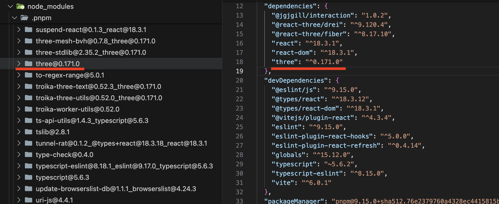

<br />

또한 `peerDependencies` 관련 버전이 맞지 않다고 경고(`unmet peer`)로 알려주기도 한다.

<br />

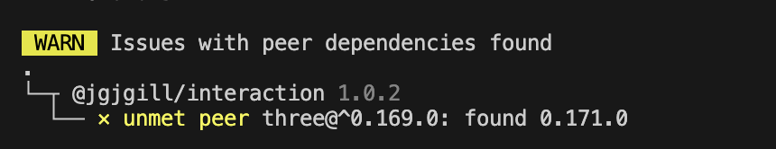

<br />

## 패키지 매니저에 따라 동작이 달라진다.

### npm (v10.9.0)

재밌게도 `npm`으로 `v1.0.1`에서 동일하게 진행하면 처음 겼었던 에러가 발생하지 않는다.

<br />


<br />

구성된 구조를 보면 `node_modules`가 점점 깊게 들어가는 형태가 눈에 띈다.

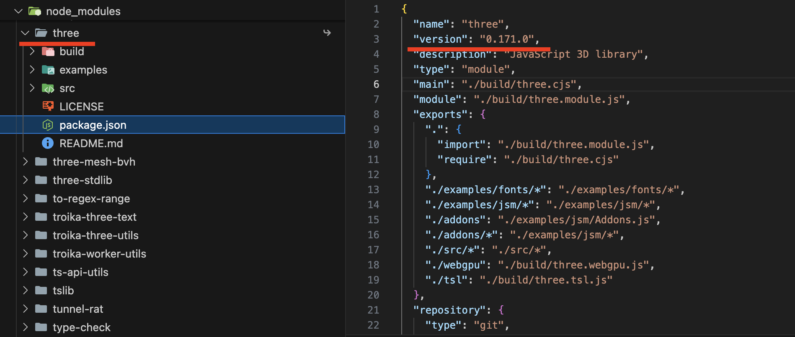

<br />

구조를 봤을 때 라이브러리 내 중복된 패키지들이 계속 설치될 수 있겠다는 문제가 예상된다.

### yarn (v4.4.1)

`yarn`으로 진행했을 때는 `pnpm`과 동일하게 에러가 발생한다.

나아가 `yarn`에서는 더 엄격하게 `three`를 설치하지 않은 상태에서 로컬을 실행했을 때에도 의존성 관련 에러가 발생한다.

<br />

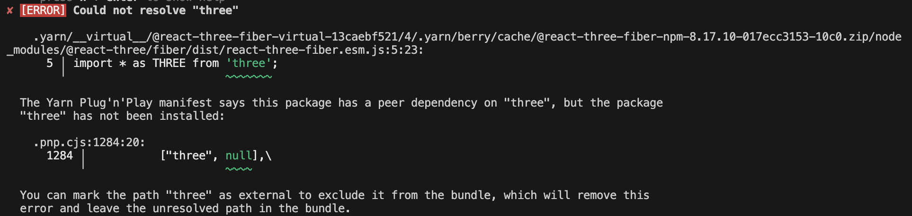

<br />

`interaction`만 설치했을 때는 다음과 같다.


<br />

`three`를 설치하면 다음과 같이 구성된다.


<br />

`yarn`의 경우에서도 `v1.0.2`로 진행했을 때 정상적으로 동작은 하지만,

`peerDependencies` 경고가 나타난다.

<br />

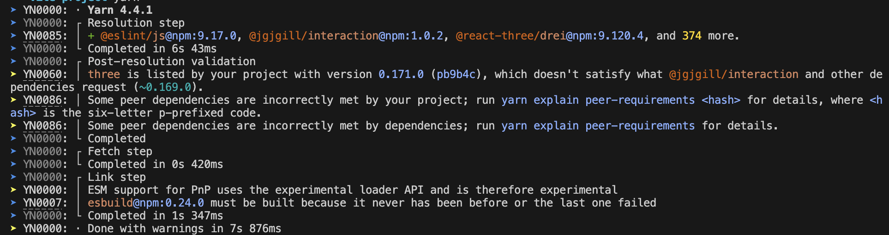

<br />

## Link 단계에서의 차이

세 패키지 매니저가 차이가 발생하는 이유는 **Link 단계를 접근하는 방식**에서 차이가 존재하기 때문이다.

이 부분은 [토스 글(패키지 매니저의 과거, 토스의 선택, 그리고 미래)](https://toss.tech/article/lightning-talks-package-manager)에서 워낙 잘 설명해주어서 참고하면 좋을 것 같다.

<br />

## 복잡한 의존성 세계를 마주하며

직접 라이브러리를 만들어 사용해보면서 그동안 내가 모르는 세계에서 마법처럼 일어났던 의존성 문제를 경험할 수 있는 시간이었다.

물론 이렇게 눈으로 마주해봐도 여전히 마법처럼 느껴지기는 한다. 😇

그래도 이번 경험을 통해 `peerDependencies`의 중요성과 패키지 매니저별 특성을 어렴풋이 이해할 수 있었다.

앞으로도 라이브러리를 이것저것 만져보면서 다양한 문제를 경험할 수 있었으면 한다. 🧐

## 참고 문서

- [peerDependencies](https://docs.npmjs.com/cli/v10/configuring-npm/package-json#peerdependencies)
- [패키지 매니저의 과거, 토스의 선택, 그리고 미래](https://toss.tech/article/lightning-talks-package-manager)
