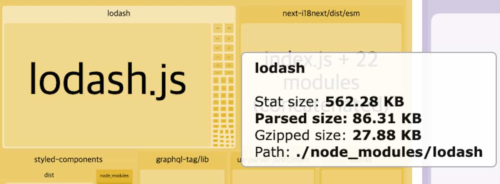
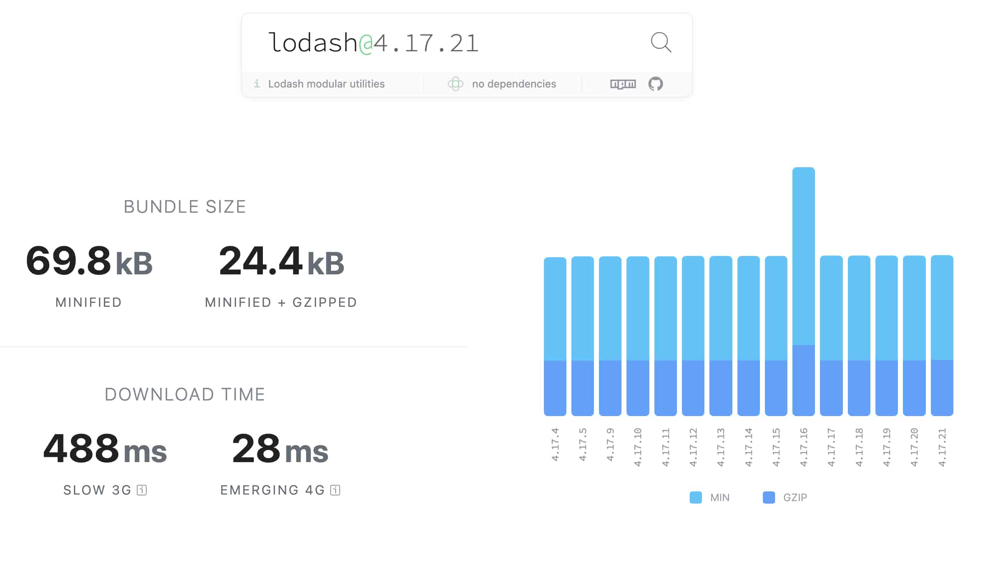
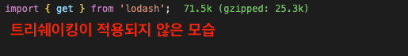
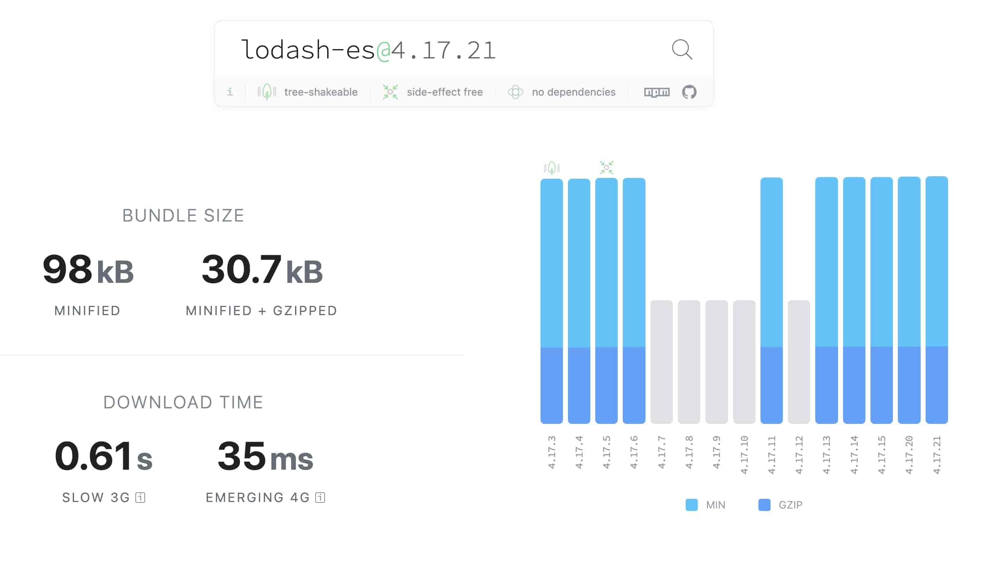
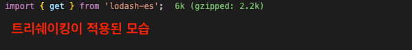
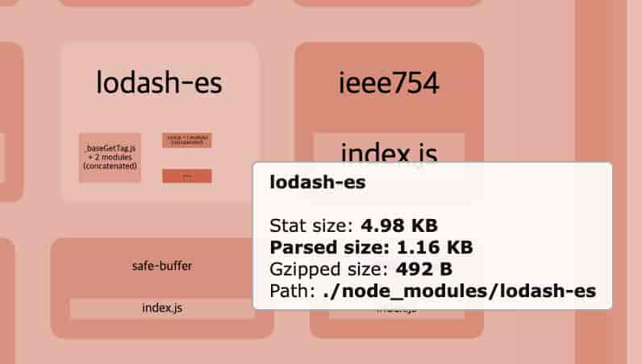
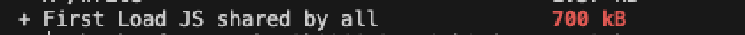
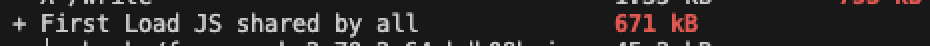
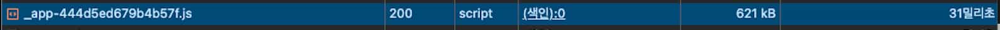

<Callout>
  💡 lodash에서 lodash-es로 마이그레이션하는 과정에서 학습한 내용을 다룹니다. 피드백은
  언제나 환영입니다:)
</Callout>

## bundle-analyzer로 본 lodash

프로젝트에 `bundle-analyzer`을 적용하면서 번들 관련 지표를 얻을 수 있었다.

(관련 글: [최적화 첫걸음 내딛기](https://jgjgill-blog.netlify.app/road/2024-12-25/))


이때 프로젝트 내 많은 번들 사이즈를 차지하는 것 중 `lodash`가 눈에 띄었다.




처음 봤을 때 지표가 굉장히 불편하게 느껴졌다. 🤔

프로젝트에서 `lodash`를 매우 가볍게 사용하고 있었던 상황인데, (3개의 함수만 호출)

측정된 사이즈가 무려 562KB로 잡히는 것이다. 😵‍💫


마치 `lodash`의 모든 함수를 불러오는 느낌이 들었다.

내가 사용한 함수만을 번들에 포함시킬 수는 없었을까?

## Tree Shaking


트리쉐이킹은 사용하지 않는 코드(`dead code`)를 제거하는 최적화 기법이다.

빌드 과정에서 사용하지 않는 모듈은 번들에 포함하지 않는다.

### 정적 모듈 구조에서의 차이

기존 `CommonJS`는 정적 구조로 이루어지지 않는다.

다음 2개의 예시는 `CommonJS`에서 **코드를 실행해야지 무엇을 `import`하고 `export`하는지 알 수 있는 내용**이다.


```ts
var logger

if (Math.random()) {
  logger = require('winston')
} else {
  logger = require('pino')
}
```


```ts
if (Math.random()) {
    exports.baz = ···;
}
```


즉 동적 구조로 런타임에서도 언제든지 변경될 가능성이 존재한다는 것이다.


반면 `ES Modules` 방식에서는 **정적 구조를 통해 컴파일 시점에 `import`, `export`를 결정**할 수 있다.

조건부로 로드되는 모듈을 고려할 필요가 없다.

그리고 `import`는 `export`를 복사할 필요 없이 직접 참조가 가능해진다고 한다.


```js
// lib.js
export function foo() {}
export function bar() {}

// main.js
import { foo } from './lib.js'
console.log(foo())
```


```js
function foo() {}

console.log(foo())
```


그래서 번들 과정에서 사용되지 않는 코드를 손쉽게 제거할 수 있는 것이다.


### Next.js에서 트리쉐이킹 적용

프로젝트의 경우 `Next.js`를 활용하고 있다.

`Next.js`에서는 `optimizePackageImports`를 통해 특정 패키지들의 `import`를 자동으로 최적화한다.


여기서 `lodash-es`는 최적화 대상 라이브러리 중 하나로,

별도의 설정 없이도 트리쉐이킹이 효과적으로 동작한다.

([기본 최적화 라이브러리 목록](https://nextjs.org/docs/pages/api-reference/config/next-config-js/optimizePackageImports))


## lodash와 lodash-es 비교

두 라이브러리는 **모듈 포맷이 다르다는 것**이 가장 큰 차이점이다.

라이브러리 교체에 앞서 두 라이브러리를 비교해보자.

### lodash

- 단일 파일로 패키징
- 모듈 시스템에 대한 걱정없이 프로젝트에 쉽게 포함
- `CommonJS`, `AMD`와 모두 호환되어 다양한 환경에서 폭넓게 사용

  

([Bundlephobia 기준 lodash 지표](https://bundlephobia.com/package/lodash@4.17.21))




(import 시 파악되는 `lodash` 지표)


### lodash-es

- `ES Modules`로 설계
- 빌드 과정에서 보다 효율적인 트리쉐이킹 가능
- 임포트하는 함수만 최종 번들에 포함



([Bundlephobia 기준 lodash-es 지표](https://bundlephobia.com/package/lodash-es@4.17.21))




(import 시 파악되는 `lodash-es` 지표)


## 적용하기

```bash
npm uninstall lodash
npm install lodash-es
npm install -D @types/lodash-es
```


`lodash-es`에서 불러오기만 하면 된다.

```ts
import { 함수 } from 'lodash-es'
```


## AS-IS / TO-BE

### Bundle Analyzer 기준

<div style={{ display: 'flex', justifyContent: 'center', gap: '10px' }}>
  <div style={{ display: 'flex', flexDirection: 'column', alignItems: 'center' }}>
    <span>lodash</span>
    
  </div>

  <div style={{ display: 'flex', flexDirection: 'column', alignItems: 'center' }}>
    <span>lodash-es</span>
    
  </div>
</div>

- `Stat size` 기준 562.28 KB → 4.98 KB 개선
- `Parsed size` 기준 86.31 KB → 1.16 KB 개선
- `GZipped size` 기준 27.88 KB → 492 B 개선


### next build 기준

<div style={{ display: 'flex', justifyContent: 'center', gap: '10px' }}>
  <div style={{ display: 'flex', flexDirection: 'column', alignItems: 'center' }}>
    <span>lodash</span>
    
  </div>

  <div style={{ display: 'flex', flexDirection: 'column', alignItems: 'center' }}>
    <span>lodash-es</span>
    
  </div>
</div>

- `First Load JS shared by all` 기준 700KB → 671KB 개선 (29KB, 4% 감소)


### 네트워크 환경 기준

<div style={{ display: 'flex', justifyContent: 'center', gap: '10px' }}>
  <div style={{ display: 'flex', flexDirection: 'column', alignItems: 'center' }}>
    <span>lodash</span>
    
  </div>

  <div style={{ display: 'flex', flexDirection: 'column', alignItems: 'center' }}>
    <span>lodash-es</span>
    
  </div>
</div>

- `JS` 크기 기준 621KB → 596KB 개선 (26KB, 4% 감소)


여러 지표들이 개선된 것을 볼 수 있다.

정말 간단한 작업이지만 큰 개선 효과를 누릴 수 있다. 🧐

## 참고 문서

- [Webpack - Tree Shaking](https://webpack.js.org/guides/tree-shaking/)
- [Patterns - Tree Shaking](https://www.patterns.dev/vanilla/tree-shaking/)
- [트리 쉐이킹으로 자바스크립트 페이로드 줄이기](https://web.dev/articles/reduce-javascript-payloads-with-tree-shaking?hl=ko)
- [What is Tree Shaking and Why Would I Need It?](https://stackoverflow.com/questions/45884414/what-is-tree-shaking-and-why-would-i-need-it)
- [Static module structure](https://exploringjs.com/es6/ch_modules.html#static-module-structure)
- [Optimizing package imports](https://nextjs.org/docs/pages/building-your-application/optimizing/package-bundling#optimizing-package-imports)
- [How we optimized package imports in Next.js](https://vercel.com/blog/how-we-optimized-package-imports-in-next-js)
- [lodash vs lodash-es](https://npm-compare.com/lodash,lodash-es)
