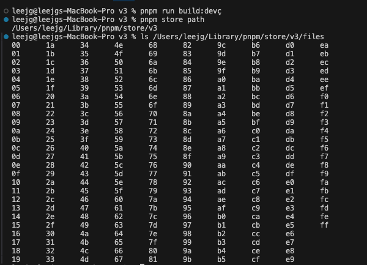
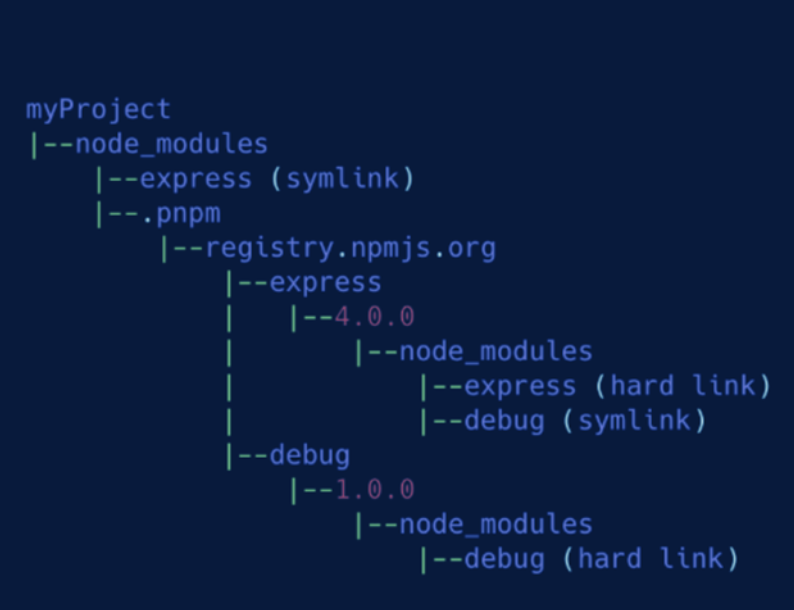
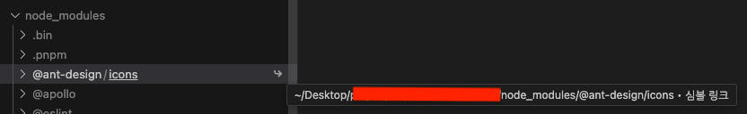
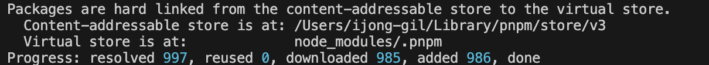
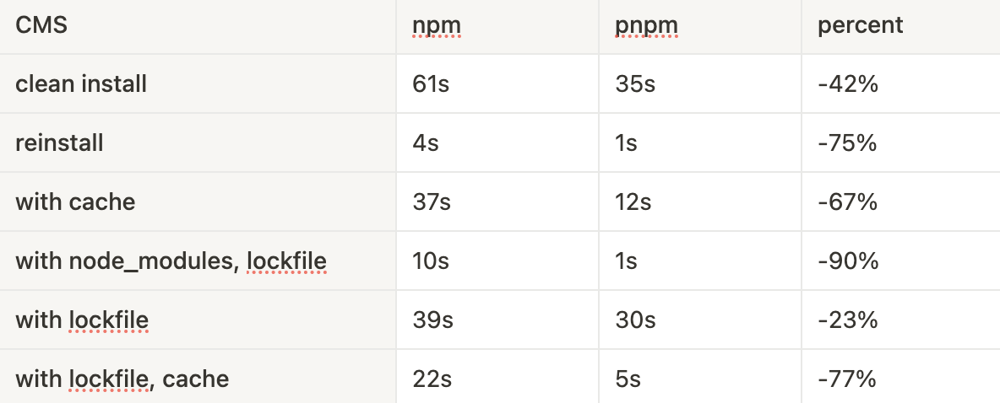
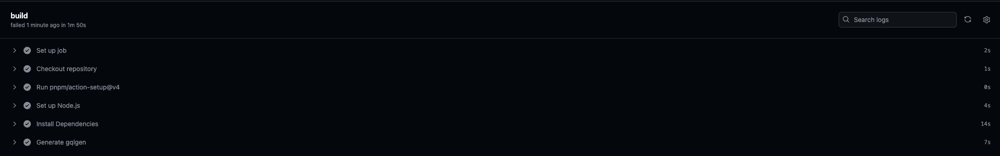

<Callout>💡 npm에서 pnpm으로 마이그레이션 하는 과정을 기록합니다.</Callout>

## npm은 무엇이 문제일까?


### npm 3 이전

초기 npm은 모든 종속성을 중첩된 방식으로 설치한다.
이러한 방식은 다음과 같은 문제점을 유발한다.

- 의존성이 점점 중첩되면서 트리가 깊어지고 불필요한 중복이 발생한다.
- 윈도우의 경우 너무 깊은 의존성 트리가 생성되어 디렉터리 경로가 길어지면 문제가 발생한다.
- 다른 종속성에 필요할 때마다 여러 번 복사 붙여넣기를 해야 해서 용량 문제를 일으킨다.

<br />

### npm 3 이후

npm 3에서는 `flat node_modules` 라는 구조 개선을 통해 기존 의존성 관련 문제들을 해결하고자 한다.

<br />

방식은 다음과 같다.

- `/node_modules` 경로에 평평하게 모듈들이 설치된다.
- 중복된 라이브러리(top-level에 존재하는 경우)에서 다른 버전이 필요한 경우 이를 필요로 하는 모듈 아래에 다른 버전의 의존성을 중첩한다.

<br />

### 남아있는 이슈들

npm의 개선된 구조에서도 여전히 문제점들이 존재한다.

- `package.json`에 설치하지 않는 모듈에 접근할 수 있어 잘못된 코드를 작성할 위험이 존재한다. (`ghost dependency`)
- 의존성 트리를 평평하게 만드는 알고리즘이 복잡하다.
- 몇몇 패키지(같은 패키지에서 버전이 다른 경우)는 다른 패키지의 `node_modules` 안에 복사되어 일관성을 해친다.

<br />

npm이 가지고 있는 문제점들을 pnpm은 어떻게 해결했을까?

## pnpm 알아보기

> pnpm은 Performant NPM을 의미합니다.

### pnpm은 왜 빠른가?

pnpm은 개선된 npm처럼 의존성 트리를 평평하게 만들려고 하지 않는다. (`flat node_modules` 방식을 따르지 않는다.)

그렇다고 초기 npm처럼 트리가 중첩된 형태로 깊지도 않다.

pnpm은 모든 의존성을 평평하게 유지하면서 **심볼릭 링크**(symlink)를 활용하여 그룹화시킨다.

### global store

> Yarn copies files from cache whereas pnpm just links them from the global store.
>
> pnpm is capable of quickly linking to the already existing files rather than downloading and extracting them again.

<br />

pnpm에서는 `global store`라는 개념을 사용한다.
여기서 `linking` 이라는 키워드가 등장하는데 **하나의 복사본만 배치하고 하드 링크를 통해 참조하는 방식**이다.

`copy`하는 방식이 아닌 `linking`하는 방식으로 pnpm은 이미 존재하는 파일을 빠르게 접근하고자 한 것이다.

<br />

```bash
pnpm store path // 스토어 경로
```

<br />



여기에 설치된 패키지들의 원본이 저장되는 것이다.

<br />

### virtual store

pnpm의 `node_modules`의 대략적인 구조는 다음과 같다.

하나씩 살펴보자.



최상단 `node_modules`에 `.pnpm` 폴더와 `package.json`에 설치한 모듈들이 나타난다.

여기서 모듈들은 심볼릭 링크를 가르킨다.



pnpm에서는 `.pnpm` 폴더를 가상 저장소(`virtual store`)라고 지칭한다.

<br />

**virtual store**

```bash
node_modules/.pnpm // 해당 경로에 패키지 하드 링크가 생성
```

<br />

가상 저장소에는 설치한 패키지와 버전를 기록한 폴더가 생성된다.

<br />

**virtual store directory**

```bash
.pnpm/<name>@<version>/node_modules/<name>
```

<br />

이미 동일한 패키지가 존재해도 버전에 따라 구분지어 구성된다.

`bar`가 2개의 버전이 존재하지만 심볼릭 링크를 통해 깊게 중첩되지 않으면서 평평한 구조를 유지시켜 준다.

```bash
node_modules
├─ foo -> .pnpm/foo/1.0.0/node_modules/foo // symlink
├─ bar -> .pnpm/bar/3.0.0/node_modules/bar // symlink
└─ .pnpm
   ├─ foo/1.0.0/node_modules
   |  ├─ bar -> ../../bar/2.0.0/node_modules/bar // symlink
   |  └─ foo (actual package) // hard link
   ├─ bar/2.0.0/node_modules
   |  └─ bar (actual package) // hard link
   └─ bar/3.0.0/node_modules
   |  └─ bar (actual package) // hard link
```

<br />

> That’s why it is possible that only 1 developer could keep pace with the dozens of contributors of Yarn

<br />

이러한 구조를 통해 훨씬 간단한 알고리즘을 활용하면서 pnpm은 한 명의 개발자가 다수의 yarn 기여자 속도를 따라잡을 수 있었다.

## hard link, symlink

> a hard link is a different reference to the same file. In soft link, you create a new file, and the contents of the file point to another path.

<br />

link라는 키워드와 관련해서 `hard link` , `symlink` 를 좀 더 정리하자.

### hard link

- 디스크의 실제 데이터를 직접 참조한다.
- 하나의 파일에 대해 여러 하드 링크가 동일한 데이터를 가리키며 동일한 `inode`이다.
- 하드 링크를 통해 파일이 변경되면 모든 하드 링크에 반영된다.

<br />

### symlink

- 다른 파일 또는 경로에 대한 포인터이다.
- 바로 가기와 유사하다.
- 원본 파일이 삭제되면 심볼릭 링크가 끊어지고 원본 파일의 데이터가 포함되지 않는다.

<br />

## 디스크 공간의 장점

적절하게 링크 방식을 적용하면서 pnpm은 디스크 공간을 최적화한다.

<br />

`global store`에서 콘텐츠 주소에 따라 패키지와 종속성을 디스크에 저장한다.
하드 링크를 통해 특정 모듈이 여러 프로젝트에 사용되어도 디스크에서 하나의 공간만 사용하게 한다.
그 다음 `node_modules` 경로에서 해당 하드 링크에 대한 심볼릭 링크를 만든다.
이를 통해 동일한 패키지가 중복해서 설치되는 현상을 막는 것이다.

<br />

예를 들어 `temp@v1`에 500개 파일이 있고 `temp@v2`에 1개의 추가된 파일이 있다.
이때 pnpm은 기존 500개 파일에 대한 하드 링크를 생성하고 새 파일만 작성한다.
반면 npm은 `temp@v2`도 기존 500개의 파일을 복사하고 로드해서 디스크 공간의 효율성이 차이난다.

<br />

## 엄격한 의존성 관리

> [left pad](https://www.theregister.com/2016/03/23/npm_left_pad_chaos/) 와 같은 이슈를 막아줍니다.

<br />

pnpm은 최상단 `node_modules`에 모든 것을 이동시키지 않는다.
오로지 `package.json`에 설치한 모듈(심볼릭 링크)만을 추가한다.
이를 통해 사용자는 `package.json`를 신뢰하면서 작업을 진행할 수 있게 된다.

<br />

엄격한 의존성 관리와 겪은 개인적인 사례는 `antd` 버전을 4 → 5로 마이그레이션할 때 경험했다.

(관련 작성글: [날짜 라이브러리 리팩터링 (Antd V5 migration)](https://jgjgill-blog.netlify.app/post/date-library-refactoring/))

<br />

이때 날짜 라이브러리 `moment`가 제거되었는데 빌드 에러가 발생했다.
원인은 `package.json`에 설치하지 않고 `antd` 4버전에 `moment` 의존성을 참조하여 사용하고 있었던 것이다.

## 마이그레이션 진행하기

npm에서 pnpm으로 마이그레이션은 굉장히 간단한다.

<br />

- [pnpm](https://pnpm.io/installation)을 설치한다.
- `node_modules`를 제거한다.
- `lockfile`이 존재하면 `pnpm import`를 실행해서 `pnpm-lock.yaml`을 생성한다.
- `pnpm install`을 실행해서 `node_modules`를 새로 구성한다.

<br />

## Benchmark 테스트해보기

pnpm에서의 [benchmarks](https://pnpm.io/benchmarks) 방식처럼 프로젝트에 테스트를 진행해봤다.

<br />

비교 기준은 `time` 명령어에서 체크된 시간으로 진행했다.

```bash
time pnpm install
```

<br />

npm에서는 다음 명령어를 통해 캐시를 제거했다.

```bash
npm cache clean -f
```

<br />

pnpm에서는 다음 명령어를 통해 캐시를 제거할 수 있다.

```bash
pnpm store prune
```

<br />

혹은 스토어의 경로를 찾아가 저장된 파일들을 제거하면 된다.

```bash
pnpm store path
```

<br />

대표적으로 2개의 경우만 이미지를 첨부하고자 한다.

나머지도 동일한 방식으로 진행되어 테이블에서 결과를 확인할 수 있다.

### clean install (42% 감소)

<div style={{ display: 'flex', justifyContent: 'center', gap: '10px' }}>
  <div style={{ display: 'flex', flexDirection: 'column', alignItems: 'center' }}>
    <span>npm clean install</span>
    .png)
    <span>61초 소요</span>
  </div>
  <div style={{ display: 'flex', flexDirection: 'column', alignItems: 'center' }}>
    <span>pnpm clean install</span>
    
    .png)
    <span>35초 소요</span>
  </div>
</div>

<br />

### with lockfile (23% 감소)

<div style={{ display: 'flex', justifyContent: 'center', gap: '10px' }}>
  <div style={{ display: 'flex', flexDirection: 'column', alignItems: 'center' }}>
    <span>npm with lockfile</span>
    .png)
    <span>39초 소요</span>
  </div>
  <div style={{ display: 'flex', flexDirection: 'column', alignItems: 'center' }}>
    <span>pnpm witch lockfile</span>
    .png)
    <span>30초 소요</span>
  </div>
</div>

<br />

### 결과 테이블



<br />

### actions 비교 (54% 감소)

<div style={{ display: 'flex', justifyContent: 'center', gap: '10px' }}>
  <div style={{ display: 'flex', flexDirection: 'column', alignItems: 'center' }}>
    <span>npm install</span>
    
    <span>31초 소요</span>
  </div>
  <div style={{ display: 'flex', flexDirection: 'column', alignItems: 'center' }}>
    <span>pnpm install</span>
    
    <span>14초 소요</span>
  </div>
</div>

<br />

## 마무리

확실히 npm과 비교했을 때 굉장히 빠르다는 것을 체감할 수 있다.

더욱이 해당 마이그레이션은 큰 비용없이 작업을 진행할 수 있어 간편하게 pnpm의 효과를 누릴 수 있다.

<br />

## 참고 문서

- [Flat node_modules is not the only way](https://pnpm.io/blog/2020/05/27/flat-node-modules-is-not-the-only-way)
- [Why should we use pnpm?](https://www.kochan.io/nodejs/why-should-we-use-pnpm.html)
- [pnpm’s strictness helps to avoid silly bugs](https://medium.com/pnpm/pnpms-strictness-helps-to-avoid-silly-bugs-9a15fb306308)
- [How npm3 Works](https://npm.github.io/how-npm-works-docs/npm3/how-npm3-works.html)
- [Why I Switched From NPM/Yarn to PNPM And Why You Should Too!](https://www.youtube.com/watch?v=d1E31WPR70g)
- [pnpm](https://jeonghwan-kim.github.io/2023/10/20/pnpm)
- [Why you should prefer using pnpm over npm and yarn?](https://refine.dev/blog/pnpm-vs-npm-and-yarn/)/
