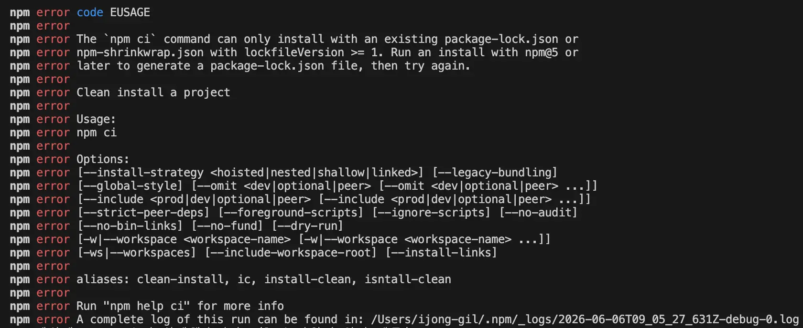
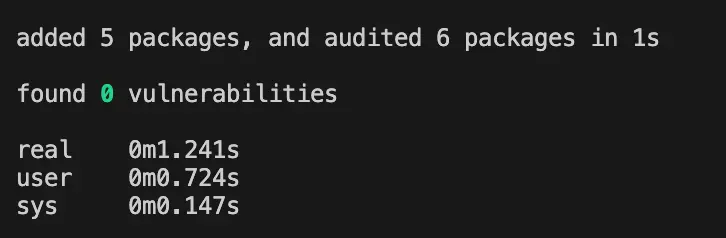
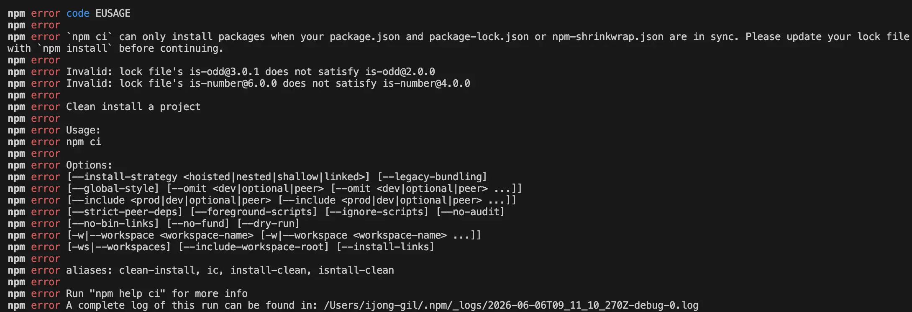
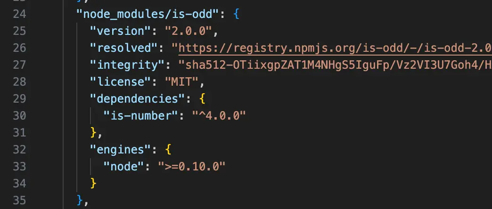
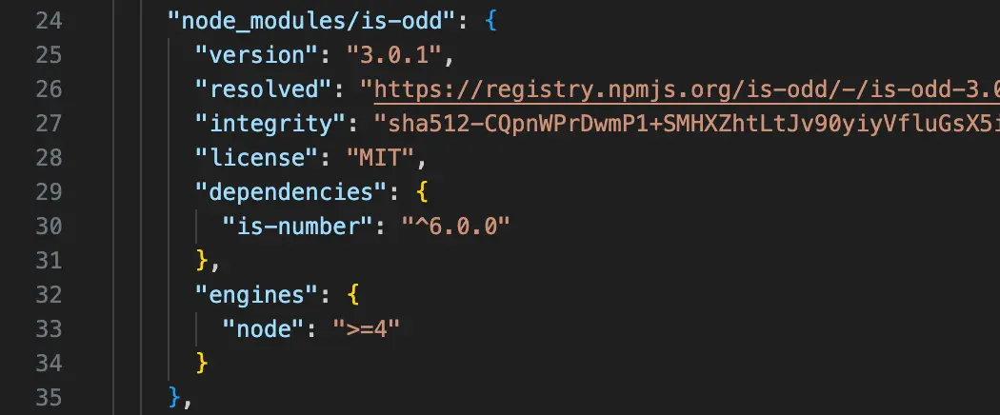

<Callout>Actions가 가끔 깨졌다 — 코드는 한 줄도 안 바꿨는데</Callout>

## 들어가며

최근 프로젝트에서 패키지 추가와 lock 파일 변경이 빈번하게 일어났다.

그러던 중 GitHub Actions 단계가 불규칙적으로 통과하지 못하는 일이 발생했다.
같은 코드인데 어떤 경우에는 통과하고 어떤 경우에는 실패했다.

AI를 통해 원인을 분석했을 때 워크플로우 yml의 설치 명령이 `npm i`로 구성되어 있는 점,
이를 `npm ci`로 수정하는 것을 제안해주었다.

코드는 변경되지 않았지만 **설치되는 의존성 버전이 달라질 수 있었던 상황**이다.

여기서 `npm i`와 `npm ci`는 이름은 비슷하지만 다르게 동작한다.

이 과정에서 알아본 관련 개념들을 정리하고자 한다.

> 실습 환경: [playground/npm-i-vs-ci](https://github.com/jgjgill/blog/tree/main/playground/npm-i-vs-ci)

---

## 등장인물 셋: package.json, lock, node_modules

차이를 이해하려면 세 가지의 관계부터 잡아야 한다.

| 파일                | 역할                                           | 비유                                   |
| ------------------- | ---------------------------------------------- | -------------------------------------- |
| `package.json`      | 내가 **원하는 버전의 범위**를 선언 (`^3.0.0`)  | "우유 1~2L"라고 적은 쇼핑 리스트       |
| `package-lock.json` | 실제로 **설치된 정확한 버전**을 기록 (`3.0.1`) | "이 우유, 정확히 이거"라고 박힌 영수증 |
| `node_modules/`     | 실제로 **설치된 실물** 패키지                  | 장바구니에 담긴 실물                   |

`package.json`의 `^`, `~`는 정확한 버전이 아니라 범위다.

- `^3.0.0` → `3.x.x` 중 최신 (major 고정)
- `~7.5.0` → `7.5.x` 중 최신 (major, minor 고정)

그래서 같은 `package.json`이라도 **언제 설치하느냐**에 따라 실제로 깔리는 버전이 달라질 수 있다.
이 범위 안에서 "정확히 어떤 버전이 깔렸는지"를 못박아 기록하는 것이 lock 파일이다.

## npm install — 유연한 설치

`npm install`(줄여서 `npm i`)은 **일반적인 개발에서 패키지를 관리할 때** 쓴다.

- lock 파일이 없으면 `package.json`을 해석해 버전을 정하고, lock 파일을 새로 생성한다.
- lock 파일이 있는데 `package.json`과 어긋나면, lock을 고쳐가며 설치한다.

즉 `npm i`는 상황에 맞춰 lock 파일을 만들거나 수정한다. 패키지를 새로 추가하거나 버전을 올리는 작업에는 이 유연함이 필요하다.

## npm ci — lock 기준의 엄격한 설치

`npm ci`(clean install)는 **자동화 환경을 위해 엄격하게 설계된 명령**이다.
CI/CD처럼 "재현 가능한, 완전히 동일한 빌드"가 필요한 곳을 위한 것이다.

- lock 파일이 반드시 있어야 한다. 없으면 에러로 멈춘다.
- lock 파일에 적힌 정확한 버전 그대로 설치한다.
- `package.json`과 lock이 어긋나면 고치지 않고 에러로 멈춘다.
- 기존 `node_modules`를 통째로 지우고 처음부터 설치한다.

`npm i`가 "상황에 맞춰 조정"한다면, `npm ci`는 "lock에 적힌 대로만, 그대로" 설치한다.

## node_modules와의 관계

`node_modules`는 의존성의 실물이 설치되는 디렉토리다.

두 명령이 이 디렉토리를 다루는 방식이 다르다.

`npm i`는 기존 `node_modules`를 보고 **필요한 부분만 갱신**한다. 반면 `npm ci`는 매번 **통째로 지우고 재설치**한다.

왜 굳이 지울까?

부분 갱신은 빠르지만, 이전 설치의 잔재나 의도치 않은 상태가 남아 있을 수 있다.

`npm ci`는 항상 백지에서 시작해 lock과 100% 일치하는 상태를 보장한다.

---

실제 동작을 확인해보자.

의존성은 다음과 같이 구성했다.

```json
"dependencies": {
  "is-odd": "^3.0.0",
  "semver": "~7.5.0"
}
```

## lock이 없을 때

완전히 깨끗한 상태(lock 없음, node_modules 없음)에서 `npm ci`를 먼저 실행해봤다.

```bash
npm ci
```

```
npm error code EUSAGE
npm error The `npm ci` command can only install with an existing
npm error package-lock.json or npm-shrinkwrap.json ...
```



`npm ci`는 lock 파일이 없으면 **아예 동작하지 않는다.**
lock을 신뢰의 기준으로 삼기 때문에 기준이 없으면 시작조차 하지 않는 것이다.

lock이 없을 때 만들어주는 쪽은 `npm i`다.
`package.json`을 해석해 `package-lock.json`을 **새로 생성**한다.



## package.json과 lock이 어긋날 때

누군가 `package.json`의 버전을 바꿨는데 lock 갱신을 깜빡하고 커밋한 경우를 가정해보자.

lock은 그대로 둔 채 `package.json`의 `is-odd`만 `^3.0.0 → ^2.0.0`으로 낮춰 둘을 어긋나게 만든다.

이 상태에서 `npm ci`를 실행하면 에러가 발생한다.

```
npm error `npm ci` can only install packages when your package.json
npm error and package-lock.json ... are in sync.
npm error Invalid: lock file's is-odd@3.0.1 does not satisfy is-odd@2.0.0
```



`lock file's is-odd@3.0.1 does not satisfy is-odd@2.0.0` — 불일치로 인해 에러가 발생하며 동작이 멈춘다.

반면 같은 상태에서 `npm i`를 실행하면, 에러 없이 설치가 진행되고 lock의 `is-odd`가 `2.0.0`으로 조용히 수정된다.



같은 불일치 상황에서 둘의 동작은 정반대다.

| 명령     | 불일치 시 동작                             |
| -------- | ------------------------------------------ |
| `npm i`  | lock을 `package.json`에 맞춰 수정하고 설치 |
| `npm ci` | 에러로 멈춤                                |

## 버전 범위가 lock에 박히는 과정

`^3.0.0`, `~7.5.0` 같은 범위가 실제로 어떤 버전으로 정해지는지 관찰했다.

깨끗한 상태에서 `npm i`로 설치한 뒤 lock에 박힌 버전을 확인하면 다음과 같다.

```
is-odd : 3.0.1   (^3.0.0 범위에서 선택됨)
semver : 7.5.4   (~7.5.0 범위에서 선택됨)
```



`package.json`의 선언은 범위였지만, lock에는 **정확히 한 버전**으로 구성된다.
이후 `node_modules`를 지우고 `npm ci`를 돌려도 lock에 박힌 그 버전이 그대로 재현된다.

같은 `package.json`이라도 lock을 커밋해 두면 모두가 동일한 버전을 받지만,
lock 없이 `npm i`만 쓰면 설치 시점에 따라 범위 내 다른 버전이 깔릴 수 있다.

상황에 따라 `3.0.1`이 설치될 수도, `3.0.2`가 설치될 수도 있는 것이다.

## 차이점 정리

### 진실의 원천

- `npm i`: `package.json`을 우선해 lock을 맞춰간다. 필요하면 lock을 고친다.
- `npm ci`: **lock이 단일 진실(single source of truth)**이다. lock에 적힌 그대로만 설치한다.

### 파일 안정성

- `npm i`: `package.json`과 lock을 수정할 수 있다.
- `npm ci`: 두 파일을 건드리지 않는다. 읽기 전용처럼 동작한다.

### 환경 핸들링

- `npm i`: 기존 `node_modules`를 부분 갱신한다.
- `npm ci`: `node_modules`를 통째로 지우고 재설치해 깨끗한 상태를 보장한다.

## 언제 무엇을 쓸까

- **`npm i` — 로컬 개발**: 패키지를 추가하거나 버전을 올리는, lock을 바꿔야 하는 작업
- **`npm ci` — CI / 배포**: 커밋된 lock을 한 글자도 바꾸지 않고 모두가 똑같이 설치해야 하는 작업

## 마치며

`npm i`와 `npm ci`는 **누구를 진실로 삼는가**의 차이가 있다.

`npm i`는 `package.json`을 보며 유연하게 맞춰가고,
`npm ci`는 lock을 기준으로 삼아 그대로 재현한다.

로컬과 CI라는 정반대의 요구를 각각 책임지는 도구다.
