<Callout>
  💡 Search Console 지표 자동화를 통해 개발자의 의존성을 없앤 경험을 공유합니다.
</Callout>

사내에서 SEO 관련된 이슈들이 많이 발생하면서 SEO 작업의 중요성이 높아졌다.

이에 관련 지표로 Search Console 수치를 일주일에 한 번씩 공유하면 좋겠다는 요구 상황이 생겼다.


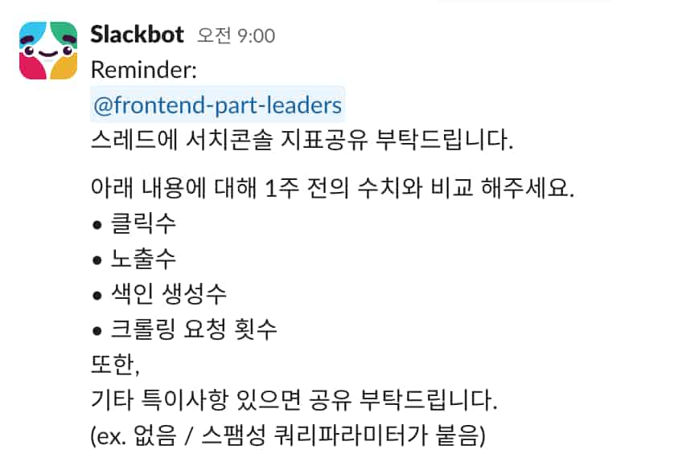


SEO를 중요하게 다루는 프로젝트에서는 다음과 같이 프론트엔드 개발자들이 지표를 파악해서 스레드에서 정보를 공유했다.

<div style={{ display: 'flex', justifyContent: 'center', gap: '10px' }}>
  <div>
    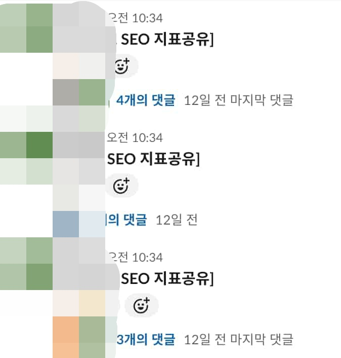
  </div>
  <div>
    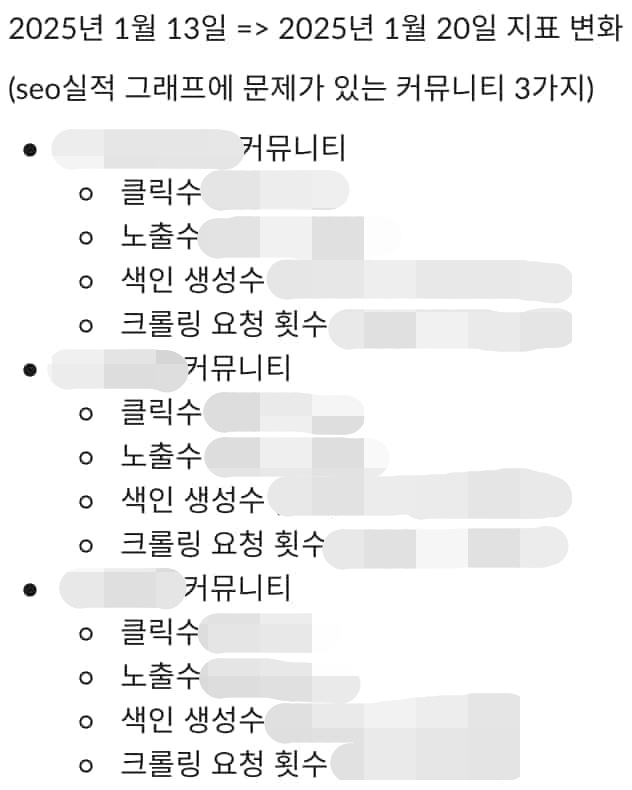
  </div>
</div>


해당 과정을 겪어보니 다음과 같은 점들을 느끼게 되었다.


- 개발자가 의존할 필요가 없는 작업이다. 해당 작업을 반드시 개발자가 해야할까?
- 해당 지표를 수집하고 비교하는 작업에서 소요되는 비용이 아쉽게 다가온다.
- 사람이 하나씩 지표를 확인하기에 실수할 확률이 높아 보인다.


이에 해당 플로우를 자동화시킬 수 있는 방안을 빠르게 마련하고자 했다.

## Google Search Console API 세팅하기

블로그를 실험 대상으로 삼자..! 😇

현재 우리의 관심사는 Search Console 관련 지표로 실적 항목에 4개의 주요 지표가 존재한다.


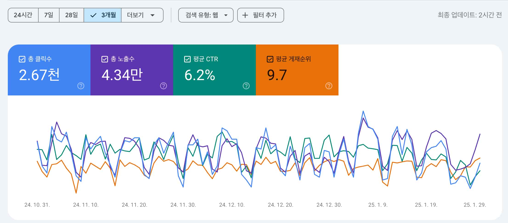


- 총 클릭수: 사용자가 클릭을 통해 사이트로 연결된 횟수
- 총 노출수: 사용자가 검색결과에서 사이트로 연결되는 링크를 본 횟수
- 평균 CTR: 클릭으로 이어진 노출수의 비율
- 평균 게재순위: 사이트가 검색결과에 표시되는 평균적인 순위


이 지표를 어떻게 가져올 수 있을지 고민했을 때 구글에서 관련 API([Search Console API](https://developers.google.com/webmaster-tools?hl=ko))를 제공해준다.

해당 API는 무료로 사용할 수 있다.

사용량 한도가 존재하지만 일주일에 한 번씩만 호출할 것이기에 걱정없이 사용할 수 있다.

### 서비스 계정 생성하기

API에 대한 접근을 활성화하기 위해 서비스 계정을 생성하자.


해당 과정 자체는 [자바스크립트로 구글 스프레드시트 활용하기](https://jgjgill-blog.netlify.app/post/google-spreadsheet-with-javascript/)와 유사하다.

[**Google Developers Console**](https://console.developers.google.com/)에서 새 프로젝트를 생성한다.


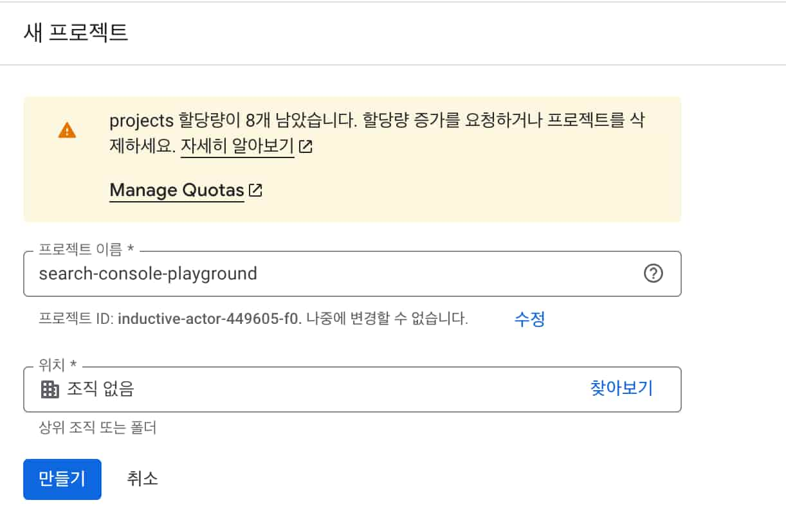


Google Search Console API를 사용 설정한다.


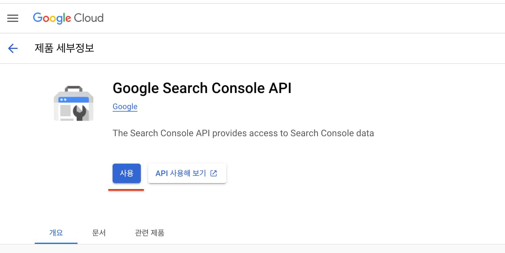


`IAM 및 관리자 / 서비스 계정` 경로에서 서비스 계정을 만든다.


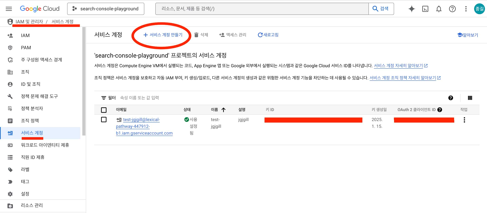


생성된 계정에서 키를 추가해준다.

생성된 값들로 코드에서 서비스 계정으로 Search Console API를 접근할 수 있다.


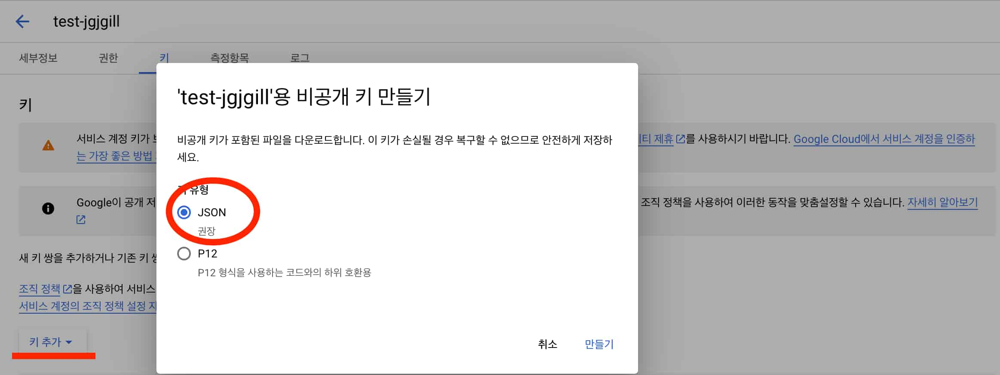


### 서치 콘솔에 서비스 계정 추가하기

서비스 계정을 서치 콘솔에 추가하자.

`설정 → 사용자 및 권한` 에서 사용자 추가를 클릭해서 생성한 서비스 계정을 추가해준다.


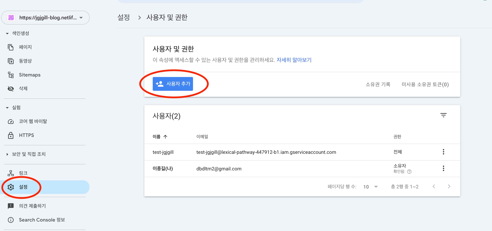


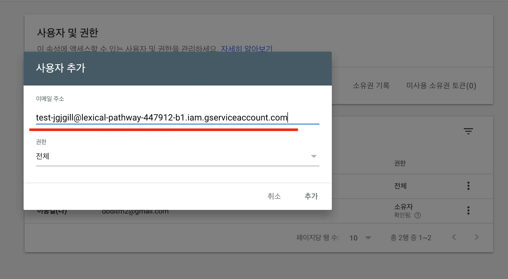


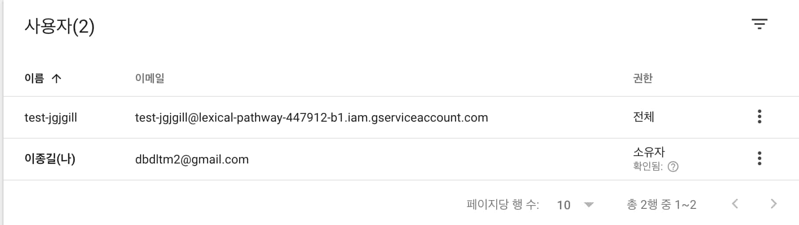


여기까지 마무리하면 구글 관련 세팅 작업은 끝이 난다.

## 프로젝트 구성하기

가장 간단한 형태로 빠르게 구현해보자.

다음 라이브러리들을 설치해준다.


```bash
pnpm i -D @slack/webhook @types/node dayjs dotenv google-auth-library googleapis ts-node typescript
```


- Google Search Console 관련 라이브러리: `google-auth-library`, `googleapis`
- Slack 관련 라이브러리: `@slack/webhook`

### Search Console API 호출하기

`google-auth-library`를 통해 계정의 권한을 얻는다.


```ts
import dotenv from 'dotenv'

const clientEmail = process.env.GOOGLE_CLIENT_EMAIL // 앞서 생성한 서비스 계정 이메일
const privateKey = process.env.GOOGLE_PRIVATE_KEY // 앞서 생성한 서비스 계정 키

const auth = new JWT({
  email: clientEmail,
  key: privateKey,
  scopes: ['https://www.googleapis.com/auth/webmasters.readonly'],
})
```


해당 계정으로 `googleapis`에서 Search Console API 지표를 얻을 수 있다.


```ts
import { google } from 'googleapis'
import { JWT } from 'google-auth-library'

const siteUrl = 'https://jgjgill-blog.netlify.app'

const searchconsole = google.searchconsole({ version: 'v1', auth })

const searchAnalytics = await searchconsole.searchanalytics.query({
  siteUrl,
  requestBody: {
    startDate: startDate.format('YYYY-MM-DD'),
    endDate: endDate.format('YYYY-MM-DD'),
    dimensions: ['date'],
    type: 'web',
  },
})
```


이제부터는 요구 사항에 맞게 코드를 구성하면 된다.


현재 우리의 요구 사항은 일주일간의 지표 비교이다.

구현 코드는 다음과 같다.


```ts
import { google } from 'googleapis'
import { JWT } from 'google-auth-library'
import dayjs from 'dayjs'
import dotenv from 'dotenv'

dotenv.config()

const clientEmail = process.env.GOOGLE_CLIENT_EMAIL
const privateKey = process.env.GOOGLE_PRIVATE_KEY
const siteUrl = 'https://jgjgill-blog.netlify.app'
const searchConolseUrl =
  'https://search.google.com/search-console?resource_id=https%3A%2F%2Fjgjgill-blog.netlify.app%2F'
const projectName = 'jgjgill'

async function fetchSearchData(startDate: dayjs.Dayjs, endDate: dayjs.Dayjs) {
  const auth = new JWT({
    email: clientEmail,
    key: privateKey,
    scopes: ['https://www.googleapis.com/auth/webmasters.readonly'],
  })

  const searchconsole = google.searchconsole({ version: 'v1', auth })

  const searchAnalytics = await searchconsole.searchanalytics.query({
    siteUrl,
    requestBody: {
      startDate: startDate.format('YYYY-MM-DD'),
      endDate: endDate.format('YYYY-MM-DD'),
      dimensions: ['date'],
      type: 'web',
    },
  })

  return searchAnalytics.data.rows || []
}

export async function testSearchConsole() {
  // 이번 주 데이터 (3일 전부터 9일 전까지)
  const currentEndDate = dayjs().subtract(3, 'day')
  const currentStartDate = currentEndDate.subtract(6, 'day')

  // 지난 주 데이터 (10일 전부터 16일 전까지)
  const previousEndDate = currentStartDate.subtract(1, 'day')
  const previousStartDate = previousEndDate.subtract(6, 'day')

  const [currentWeekData, previousWeekData] = await Promise.all([
    fetchSearchData(currentStartDate, currentEndDate),
    fetchSearchData(previousStartDate, previousEndDate),
  ])

  // 주간 합계 계산
  const currentWeekSummary = { clicks: 0, impressions: 0, ctr: 0, position: 0 }
  const previousWeekSummary = {
    clicks: 0,
    impressions: 0,
    ctr: 0,
    position: 0,
  }

  currentWeekData.forEach((row) => {
    currentWeekSummary.clicks += row.clicks || 0
    currentWeekSummary.impressions += row.impressions || 0
    currentWeekSummary.ctr += row.ctr || 0
    currentWeekSummary.position += row.position || 0
  })

  previousWeekData.forEach((row) => {
    previousWeekSummary.clicks += row.clicks || 0
    previousWeekSummary.impressions += row.impressions || 0
    previousWeekSummary.ctr += row.ctr || 0
    previousWeekSummary.position += row.position || 0
  })

  // 평균값 계산
  currentWeekSummary.ctr = currentWeekSummary.ctr / currentWeekData.length
  currentWeekSummary.position =
    (currentWeekSummary.position ?? 0) / currentWeekData.length
  previousWeekSummary.ctr = previousWeekSummary.ctr / previousWeekData.length
  previousWeekSummary.position = previousWeekSummary.position / previousWeekData.length

  // 증감률 계산
  const changes = {
    clicks: (
      ((currentWeekSummary.clicks - previousWeekSummary.clicks) /
        previousWeekSummary.clicks) *
      100
    ).toFixed(1),
    impressions: (
      ((currentWeekSummary.impressions - previousWeekSummary.impressions) /
        previousWeekSummary.impressions) *
      100
    ).toFixed(1),
    ctr: (
      ((currentWeekSummary.ctr - previousWeekSummary.ctr) / previousWeekSummary.ctr) *
      100
    ).toFixed(1),
    position: (
      ((previousWeekSummary.position - currentWeekSummary.position) /
        previousWeekSummary.position) *
      100
    ).toFixed(1),
  }

  return {
    currentStartDate,
    currentEndDate,
    previousEndDate,
    previousStartDate,
    currentWeekSummary,
    previousWeekSummary,
    changes,
    searchConolseUrl,
    projectName,
  }
}

testSearchConsole()
```


대략 다음과 같은 데이터들을 확인할 수 있다.

<div style={{ display: 'flex', justifyContent: 'center', gap: '10px' }}>
  <div>
    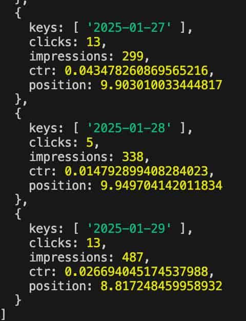
  </div>
  <div>
    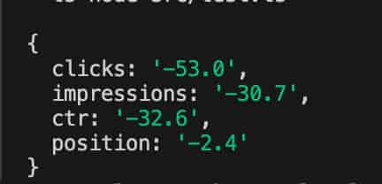
  </div>
</div>


### Slack Webhook 활용하기

데이터를 슬랙과 연동하는 것이 필요하다.

역시나 가장 간단한 형태로 구현할 것이다.


`@slack/webhook` 을 통한 Incoming Webhook 방식으로 구현해보자.

[api.slack](https://api.slack.com/apps)에서 앱 (From scratch)을 생성한다.


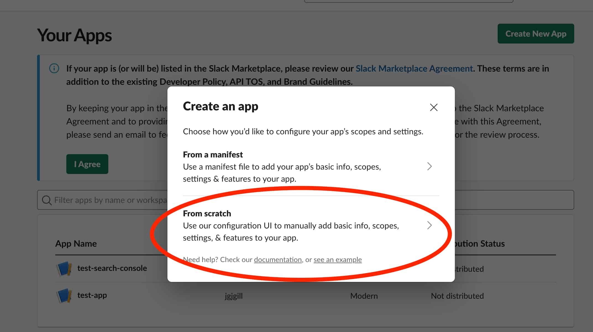


`Features → Incoming Webhooks` 경로에서 해당 기능을 활성화시켜주면 웹훅 URL이 구성된다.


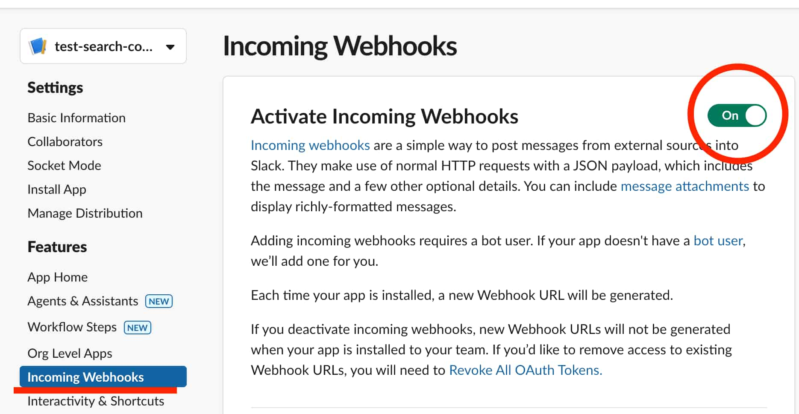


코드는 다음과 같다.


```ts
import { IncomingWebhook } from '@slack/webhook'
import { testSearchConsole } from './test'
import dotenv from 'dotenv'
import dayjs from 'dayjs'

dotenv.config()

const webhook = new IncomingWebhook(process.env.SLACK_WEBHOOK_URL!)

async function sendWebhook() {
  try {
    const {
      currentEndDate,
      currentStartDate,
      previousEndDate,
      previousStartDate,
      currentWeekSummary,
      previousWeekSummary,
      changes,
      searchConolseUrl,
      projectName,
    } = await testSearchConsole()

    await webhook.send({
      blocks: [
        {
          type: 'header',
          text: {
            type: 'plain_text',
            text: `📊 Search Console 주간 리포트 - ${projectName}`,
            emoji: true,
          },
        },
        {
          type: 'section',
          text: {
            type: 'mrkdwn',
            text: `🔍 <${searchConolseUrl}|Search Console에서 보기>`,
          },
        },
        {
          type: 'section',
          text: {
            type: 'mrkdwn',
            text: `*측정 기간*\n이번 주: ${currentStartDate.format(
              'YYYY-MM-DD',
            )} ~ ${currentEndDate.format(
              'YYYY-MM-DD',
            )}\n지난 주: ${previousStartDate.format(
              'YYYY-MM-DD',
            )} ~ ${previousEndDate.format('YYYY-MM-DD')}`,
          },
        },
        {
          type: 'section',
          fields: [
            {
              type: 'mrkdwn',
              text: `*총 클릭수*\n이번 주: ${currentWeekSummary.clicks}회\n지난 주: ${
                previousWeekSummary.clicks
              }회\n변화량: ${changes.clicks}% ${
                Number(changes.clicks) > 0 ? '📈' : '📉'
              }`,
            },
            {
              type: 'mrkdwn',
              text: `*총 노출수*\n이번 주: ${
                currentWeekSummary.impressions
              }회\n지난 주: ${previousWeekSummary.impressions}회\n변화량: ${
                changes.impressions
              }% ${Number(changes.impressions) > 0 ? '📈' : '📉'}`,
            },
          ],
        },
        {
          type: 'section',
          fields: [
            {
              type: 'mrkdwn',
              text: `*평균 CTR*\n이번 주: ${(currentWeekSummary.ctr * 100).toFixed(
                2,
              )}%\n지난 주: ${(previousWeekSummary.ctr * 100).toFixed(2)}%\n변화량: ${
                changes.ctr
              }% ${Number(changes.ctr) > 0 ? '📈' : '📉'}`,
            },
            {
              type: 'mrkdwn',
              text: `*평균 검색순위*\n이번 주: ${currentWeekSummary.position.toFixed(
                1,
              )}위\n지난 주: ${previousWeekSummary.position.toFixed(1)}위\n변화량: ${
                changes.position
              }% ${Number(changes.position) > 0 ? '⬆️' : '⬇️'}`,
            },
          ],
        },
        {
          type: 'section',
          fields: [
            {
              type: 'mrkdwn',
              text: `*평균 CTR*\n${(currentWeekSummary.ctr * 100).toFixed(2)}% (${
                changes.ctr
              }% ${Number(changes.ctr) > 0 ? '📈' : '📉'})`,
            },
            {
              type: 'mrkdwn',
              text: `*평균 검색순위*\n${currentWeekSummary.position.toFixed(1)}위 (${
                changes.position
              }% ${Number(changes.position) > 0 ? '⬆️' : '⬇️'})`,
            },
          ],
        },
        {
          type: 'context',
          elements: [
            {
              type: 'mrkdwn',
              text: `🕒 생성: ${dayjs().format('YYYY-MM-DD HH:mm:ss')}`,
            },
          ],
        },
      ],
    })

    console.log('Search Console 리포트가 성공적으로 전송되었습니다.')
  } catch (error) {
    console.error('메시지 전송 중 오류 발생:', error)
    throw error
  }
}

sendWebhook()
```


해당 함수를 실행시키면 슬랙에서 다음 메시지가 생성된다.


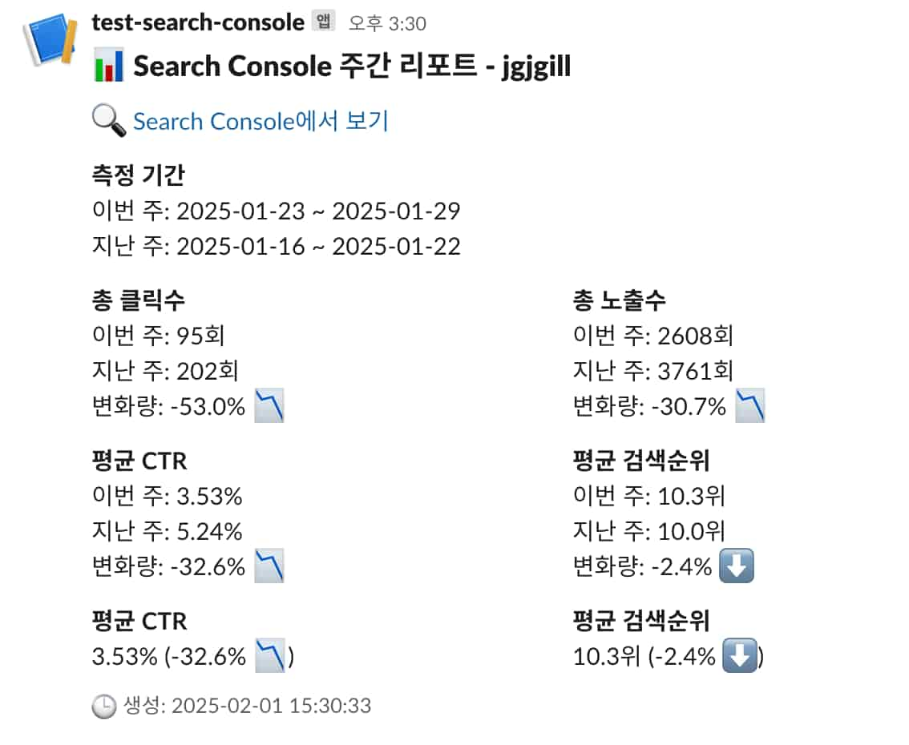


### 자동화 적용하기

모든 플로우가 마무리되었다.

이제 해당 스크립트를 일정 시기마다 자동으로 실행시켜주면 된다.


`Github Actions`을 활용하자.

코드는 다음과 같다.


```YAML
name: Search Console Weekly Report

on:
  schedule:
    - cron: "30 16 * * 3" # 한국 시간(KST): 매주 목요일 오전 1시 30분
  workflow_dispatch: # 수동 실행 옵션 추가

jobs:
  send-report:
    runs-on: ubuntu-latest

    steps:
      - name: Checkout repository
        uses: actions/checkout@v4

      - name: Setup Node.js
        uses: actions/setup-node@v4
        with:
          node-version: "20"

      - name: Setup pnpm
        uses: pnpm/action-setup@v2
        with:
          version: 8
          run_install: false

      - name: Get pnpm store directory
        shell: bash
        run: |
          echo "STORE_PATH=$(pnpm store path --silent)" >> $GITHUB_ENV

      - name: Setup pnpm cache
        uses: actions/cache@v3
        with:
          path: ${{ env.STORE_PATH }}
          key: ${{ runner.os }}-pnpm-store-${{ hashFiles('**/pnpm-lock.yaml') }}
          restore-keys: |
            ${{ runner.os }}-pnpm-store-

      - name: Install dependencies
        run: pnpm install

      - name: Run report script
        env:
          SLACK_WEBHOOK_URL: ${{ secrets.SLACK_WEBHOOK_URL }}
          GOOGLE_CLIENT_EMAIL: ${{ secrets.GOOGLE_CLIENT_EMAIL }}
          GOOGLE_PRIVATE_KEY: ${{ secrets.GOOGLE_PRIVATE_KEY }}
        run: pnpm tsx webhook-test.ts
```


#### actions 타임존 이슈

`GitHub Actions`는 기본적으로 UTC 타임존에서 실행된다.

그래서 `dayjs`를 사용할 때 예상과 다른 시간이 나올 수 있다.


`dayjs.tz.setDefault("Asia/Seoul")`을 통해 KST 타임존을 명시적을 설정해야 한다.

다음과 같이 코드를 추가해주자.


```ts
import utc from 'dayjs/plugin/utc'
import timezone from 'dayjs/plugin/timezone'

dayjs.extend(utc)
dayjs.extend(timezone)
dayjs.tz.setDefault('Asia/Seoul')

dayjs().tz().subtract(3, 'day')
```


## 확장성 고려하기

이렇게 정말 간단한 형태로 구현을 마무리할 수 있었다.

작업 내용을 스크럼에 공유하면서 자동화 작업의 필요성을 확인받고자 했다.


현재 구현은 빠른 검증과 실험을 위해 하나의 프로젝트만을 타겟으로 만들었다.

따라서 자연스럽게 확장성을 고려한 설계도 필요해졌다.

### 최종 코드

해당 작업에서 큰 틀은 변경되지 않기에 관련 저장소만 공유하고자 한다. 😇

[google-search-console-playground](https://github.com/jgjgill/google-search-console-playground)


크게 변경된 부분으로 다음 2가지이다.


- 프로젝트별로 정보를 구성할 수 있는 스키마 구성
- 프로젝트별 스레드를 구성하기 위해 슬랙 관련 라이브러리 교체 (`@slack/webhook` → `@slack/web-api`)
  - `Features → OAuth & Permissions` 에서 OAuth Tokens 및 Scopes 구성
  - 채널에 앱 추가


**스키마 형식**

```ts
export const schema = [
  {
    serviecName: '서비스명을 입력해주세요',
    clientEmail: process.env.GOOGLE_CLIENT_EMAIL!,
    privateKey: process.env.GOOGLE_PRIVATE_KEY!,
    projects: [
      {
        siteUrl: '프로젝트 주소를 입력해주세요',
        searchConsoleUrl: '서치 콘솔 URL을 입력해주세요',
        projectName: '프로젝트명을 입력해주세요',
      },
      {
        siteUrl: '프로젝트 주소를 입력해주세요',
        searchConsoleUrl: '서치 콘솔 URL을 입력해주세요',
        projectName: '프로젝트명을 입력해주세요',
      },
    ],
  },
  {
    serviecName: '서비스명을 입력해주세요',
    clientEmail: process.env.GOOGLE_CLIENT_EMAIL!,
    privateKey: process.env.GOOGLE_PRIVATE_KEY!,
    projects: [
      {
        siteUrl: '프로젝트 주소를 입력해주세요',
        searchConsoleUrl: '서치 콘솔 URL을 입력해주세요',
        projectName: '프로젝트명을 입력해주세요',
      },
      {
        siteUrl: '프로젝트 주소를 입력해주세요',
        searchConsoleUrl: '서치 콘솔 URL을 입력해주세요',
        projectName: '프로젝트명을 입력해주세요',
      },
    ],
  },
]
```


**슬랙 변경 과정**

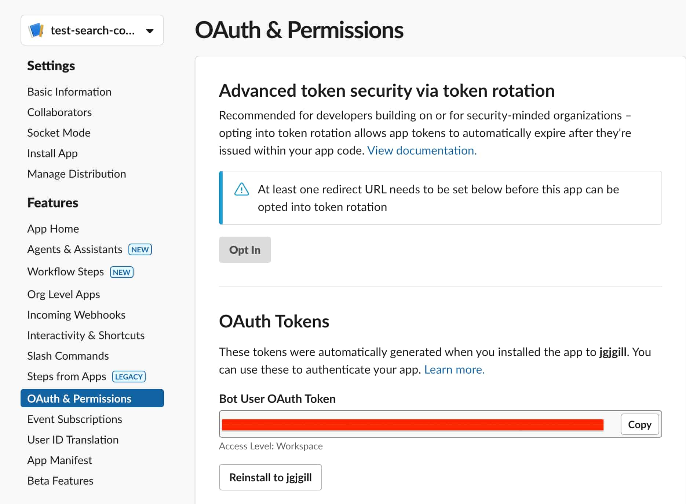


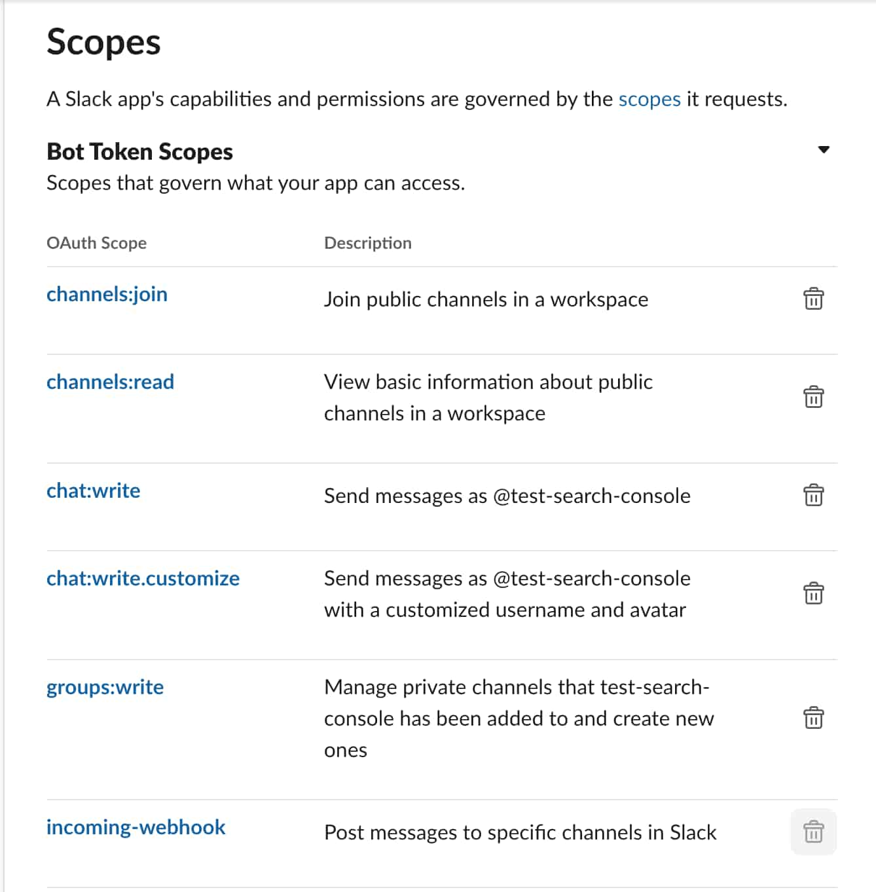


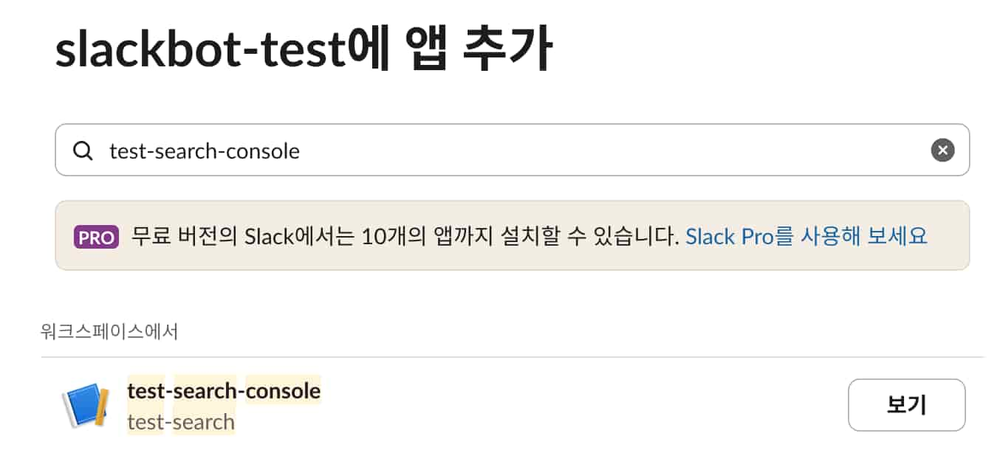


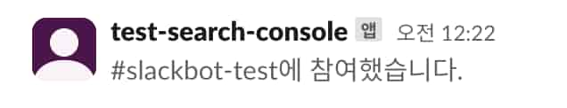


다음과 같이 스레드 내에서 지표들이 구성된다.


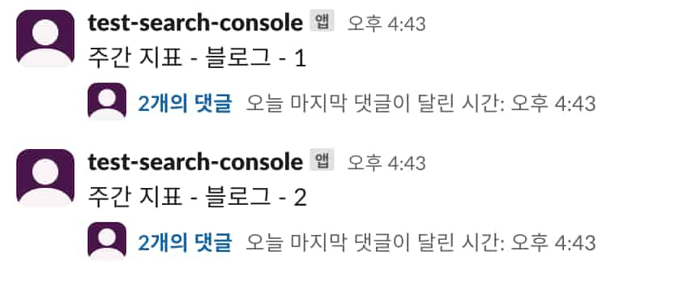


다른 프로젝트에서도 쉽게 사용할 수 있도록 관련 문서도 구성했다.


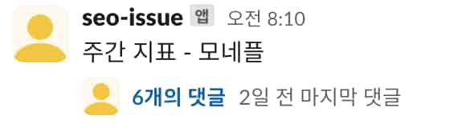


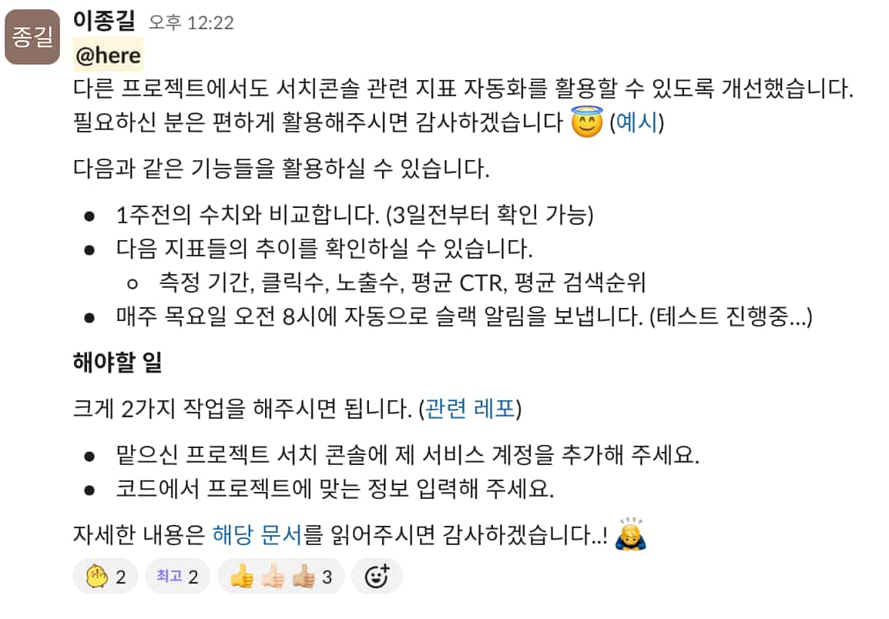

## 마무리

단순한 자동화 작업이었지만 이를 통해 세 가지 효과를 얻을 수 있었다.


- **개발자의 시간 절약**
- **데이터의 정확성 향상**
- **확장 가능한 시스템 구축**


앞으로도 사내에 존재하는 불필요한 의존성을 하나씩 줄여나가보자. 🧐
