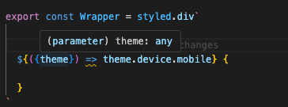
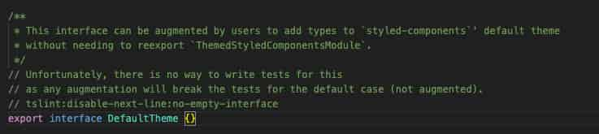
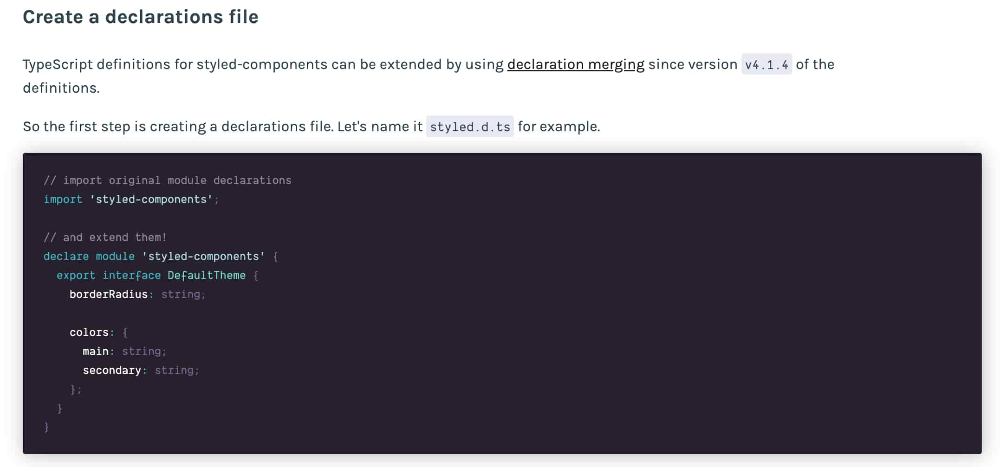
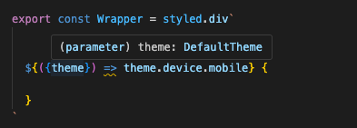
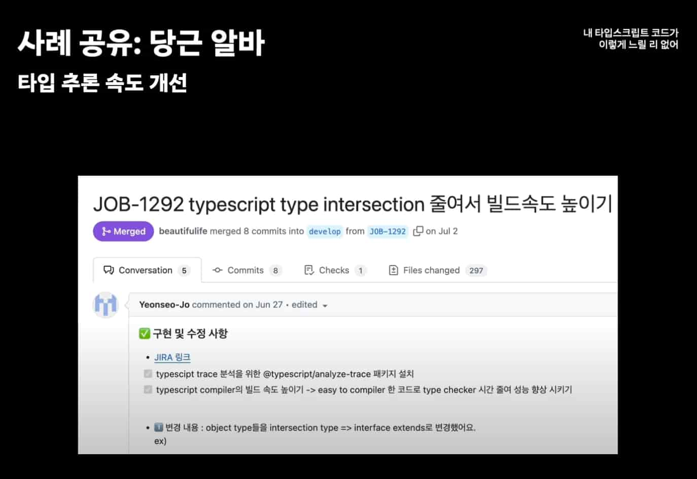

<Callout>
  💡 styled-components의 theme 타입과 관련된 Type과 Interface 이슈 상황을 다룹니다.
  피드백은 언제나 환영입니다:)
</Callout>

스타일 작업을 하던 어느 날 갑자기 styled-components의 theme 타입이 자동 완성으로 불러올 수 없게 되었다.



처음에는 VSCode 설정이 잘못되었나.. styled-components 버전과 styled-components 플러그인 버전이 맞지 않아서 발생한 건가.. 등등.. 여러 삽질을 했지만 원인을 찾지 못했었다.. 🫠

## 범인은 선언 병합을 고려하지 못한 DefaultTheme 정의

더 과거로 돌아가서...

기존 코드에서 별다른 컨벤션 없이 interface와 type이 혼용해서 사용되고 있었다.

(누구는 interface, 누구는 type, ...)


이에 코드 일관성을 위해 [consistent-type-definitions](https://typescript-eslint.io/rules/consistent-type-definitions/) 린트 규칙을 추가했다.

interface와 type 중 어느 것을 사용할지 팀원들과 논의한 뒤 type으로 정해졌다.


린트 명령어를 통해 일괄적으로 코드 수정을 진행했는데,

이 과정에서 다음 선언 파일이 type으로 변경되었다.


**AS-IS**

```tsx
declare module 'styled-components' {
  export interface DefaultTheme extends IFCustomTheme {
    darkMode: boolean
  }
}
```


**TO-BE**

```tsx
declare module 'styled-components' {
  export type DefaultTheme = {
    darkMode: boolean
  } & IFCustomTheme
}
```


styled-components 모듈의 `DefaultTheme` 코드 부분을 살펴보면 다음과 같다.




```ts
/**
 * This interface can be augmented by users to add types to `styled-components`' default theme
 * without needing to reexport `ThemedStyledComponentsModule`.
 */
// Unfortunately, there is no way to write tests for this
// as any augmentation will break the tests for the default case (not augmented).
// tslint:disable-next-line:no-empty-interface
export interface DefaultTheme {}
```


> 이 인터페이스는 사용자가 '스타일 컴포넌트'의 기본 테마에 유형을 추가하기 위해 보강할 수 있습니다.


### What is Declaration Merging?

styled-components `DefaultTheme` 문서에서 관련 정보를 찾을 수 있었다.

([styled-components: Create a declarations file](https://styled-components.com/docs/api#create-a-declarations-file))




선언 병합은 **같은 이름을 가진 두 개 이상의 개별 선언이 자동으로 하나의 정의로 결합해주는 기능**이다.

해당 기능을 활용하면 현재 styled-components의 경우처럼 라이브러리의 타입도 확장해서 사용 가능하다.

주의할 점으로 선언 병합은 type에서는 불가능하고 오직 interface에서만 가능하다.

그래서 type으로 변경된 뒤 타입이 제대로 확장되지 못했던 것이다... 😖


코드로 돌아가서 린트 규칙을 끄고 interface로 설정하니 다시 정상 동작하게 되었다.. 😇

(해당 과정에서 interface 로 규칙을 바꿀까 고민도 했었는데.. 변경이 적고 기존 규칙을 유지하는 방향이 더 적절하다는 생각을 했다.)

```ts
declare module 'styled-components' {
  // eslint-disable-next-line @typescript-eslint/consistent-type-definitions
  export interface DefaultTheme {
    device: {
      mobile: string
      pc: string
    }
  }
}
```




## Type과 Interface 뭐가 다를까?

수정 작업 이후 다시 한 번 Type과 Interface 개념을 정리할 필요성을 느꼈다.

다음 글을 참고해서 정리한 내용이다. ([Type vs interface: Which Should You Use?](https://www.totaltypescript.com/type-vs-interface-which-should-you-use))

### interface의 extends는 캐싱이 가능하다.

`extends`를 사용하여 interface를 생성하면 타입스크립트는 내부 레지스트리에 해당 interface를 이름으로 캐싱한다.

향후 interface를 더 빠르게 확인 가능하게 해준다.


반면 `&`를 사용하는 교차(intersection) 타입은 이름을 통해 캐싱할 수 없이 매번 계산이 필요하다.


#### 당근에서의 개선 사례

관련해서 intersection 타입을 interface 타입으로 변경해서 타입 추론 속도를 개선한 당근에서의 사례도 존재한다.



(출처: [내 타입스크립트 코드가 이렇게 느릴 리 없어! | 2024 당근 테크 밋업](https://www.youtube.com/watch?v=g9FL8hKoNqE))


### interface는 declaration merging (선언 병합)이 가능하다.

앞서 살펴본 내용과 동일하다.

```ts
// interface는 병합 가능
interface Person {
  name: string
}

interface Person {
  age: number
}

// 결과: Person은 { name: string; age: number; }

// type은 병합 불가능
type Animal = {
  name: string
}

// 오류 발생: 식별자 'Animal'이 중복되었습니다.
type Animal = {
  age: number
}
```


### 인덱스 시그니처에서 다르게 동작한다.

인덱스 시그니처는 객체의 키와 값의 타입을 동적으로 정의할 수 있게 해주는 기능이다.

여기서 type과 interface는 다르게 동작하게 된다.


type은 `암시적인 (implicit) 인덱스 시그니처`를 가진다.


반면 interface는 나중에 확장될 가능성이 존재한다.

그래서 `명시적인 (explicit) 인덱스 시그니처`를 추가해주어야 한다.


**type 예시**

```ts
type User = {
  name: string
  age: number
}

const user: User = { name: '김철수', age: 30 }

// 정상 동작 (암시적 호환)
const stringDict: Record<string, unknown> = user
```


**interface 예시**

```ts
interface Person {
  name: string
  age: number
}

const person: Person = { name: '홍길동', age: 25 }

// 오류 발생
const stringDict: Record<string, unknown> = person
// 오류: 'Person' 타입에는 'string' 타입의 인덱스 시그니처가 없습니다.

// 명시적 인덱스 시그니처 추가
interface PersonWithIndex {
  name: string
  age: number
  [key: string]: unknown
}

const personWithIndex: PersonWithIndex = { name: '홍길동', age: 25 }

// 정상 작동
const stringDict2: Record<string, unknown> = personWithIndex
```

## 참고 문서

- [Type vs Interface: Which Should You Use?](https://www.totaltypescript.com/type-vs-interface-which-should-you-use)
- [내 타입스크립트 코드가 이렇게 느릴 리 없어! | 2024 당근 테크 밋업](https://www.youtube.com/watch?v=g9FL8hKoNqE)
