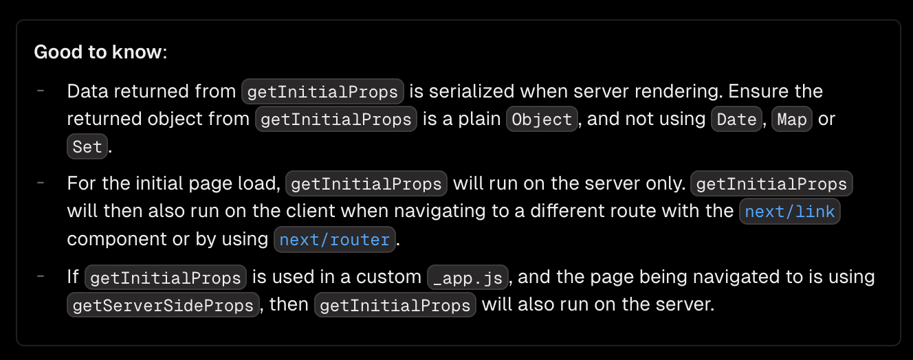
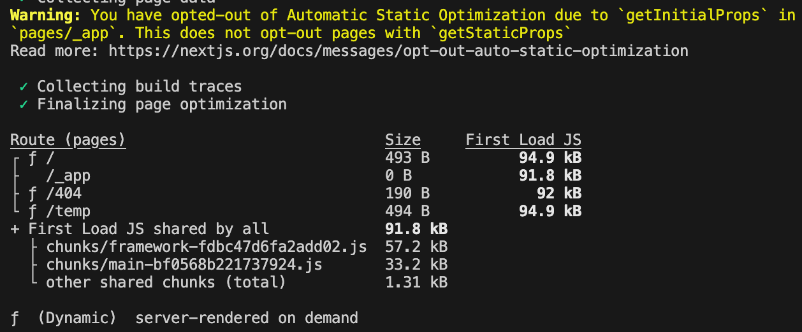

<Callout>
  💡 Next.js의 getInitialProps에 대해 알아봅니다. 피드백은 언제나 환영입니다:)
</Callout>

## getInitialProps는 도대체 뭐야?

> Good to know **getInitialProps** is a legacy API.
> We recommend using **getStaticProps** or **getServerSideProps** instead.


`getInitialProps` 을 알아보기 위해 페이지에 들어가면 바로 `legacy API` 라고 안내해서 문서를 보는 것부터 꺼려진다. 😓


하지만 현재 프로젝트의 핵심적인 여러 기능이 `getInitialProps` 에 의존하면서 영향을 받고 있다.
더욱이 커스텀하게 쓰는 경우가 많다보니 어떤 사이드이펙트가 발생할지 몰라 해당 로직은 불가침영역으로 존재하게 되었다.


그래서 해당 API의 동작을 이해할 필요성을 크게 느꼈다.
또한 한편으로는 어떠한 이유로 레거시 API가 되었는지 궁금하기도 했다.


하나씩 어떻게 동작하는지 알아보자. 🧐

## 어떻게 동작할까?

> 해당 글의 코드는 `npx create-next-app@latest`으로 구성됩니다.
>
> 버전: `page router` / `15.0.3`


`getInitialProps` 을 한 문장으로 소개하면 **페이지 컴포넌트가 서버와 클라이언트에서 초기 데이터를 불러올 수 있게 해주는 데이터 패칭 함수**로 표현할 수 있다.


> It will run on both the server-side and again on the client-side during page transitions.


하지만 처음 해당 함수를 접하고 공식 문서를 찾아봤을 때 해당 문구에서 많은 착각을 하게 된다.
내가 그랬다.

(하나의 동작 안에서 서버와 클라이언트가 2번 호출되는건가? 😵‍💫)


이 부분이 문서를 대충 읽으면 놓치기 쉬운 부분인 것 같다.

`Good to know`에는 다음과 같이 추가로 안내해준다.




밑에 2개의 부분을 봤을 때 다음과 같이 동작할 것으로 예상된다.


**2번째 내용**

- **초기 페이지 로드 시**, `getInitialProps` 은 오직 **서버에서만 실행**
- **페이지 이동 시**, `getInitialProps` 는 **클라이언트에서 실행**


**3번째 내용**

- 커스텀하게 구성된 `_app.js` 내 `getInitialProps` 가 사용
- 페이지 이동 시 해당 페이지에서 `getServerSideProps` 사용
- 이때 `getInitialProps` 는 **서버에서 실행**


동작이 굉장히 특이하다.

관련된 동작들을 직접 눈으로 확인해 볼 필요가 있을 것 같다.

### 각 페이지에서의 getInitialProps

기본적인 동작부터 알아보자.

`index.tsx`와 `temp.tsx` 페이지에서 코드를 구성했다.


**index.tsx**

```tsx
import { isServer } from '@/utilts'
import { NextPageContext } from 'next'
import Link from 'next/link'

export default function Home({ temp }: any) {
  console.log(isServer() ? '나는 서버,' : '나는 클라이언트,', `Home에서 호출, ${temp}`)

  return (
    <div>
      <h2>getInitialProps에 대해 알아보기</h2>
      <Link href={'/temp'}>Temp 페이지로 이동합니다.</Link>
    </div>
  )
}

Home.getInitialProps = async (ctx: NextPageContext) => {
  console.log(isServer() ? '나는 서버' : '나는 클라이언트', 'Home - getInitialProps 호출')

  return {
    temp: 'homeData',
  }
}
```


**temp.tsx**

```tsx
import { isServer } from '@/utilts'
import { NextPageContext } from 'next'
import Link from 'next/link'

export default function Temp({ temp }: any) {
  console.log(isServer() ? '나는 서버,' : '나는 클라이언트,', `Temp에서 호출, ${temp}`)

  return (
    <div>
      <h2>getInitialProps에 대해 알아보기</h2>
      <Link href={'/'}>Home 페이지로 이동합니다.</Link>
    </div>
  )
}

Temp.getInitialProps = async (ctx: NextPageContext) => {
  console.log(isServer() ? '나는 서버' : '나는 클라이언트', 'Temp - getInitialProps 호출')

  return {
    temp: 'tempData',
  }
}
```


<video src="/videos/development/the-great-legacy-getinitialprops/page-getinitialprops-example.mp4" controls style="max-width:100%;max-height:400px;display:block;margin:1.5rem auto;border-radius:0.5rem;" />


앞서 문서에서 설명했던 대로 **초기 페이지 진입 시에는 서버에서 실행**,
**페이지 이동의 경우에는 클라이언트에서 실행되는 것**을 확인할 수 있다.


커스텀하게 `_app`을 다루는 3번째 내용도 알아보자.

## \_app에서의 getInitialProps

우선 기존 `index.tsx`, `temp.tsx` 코드는 유지한 채 `_app`에만 `getInitialProps`을 추가해보자.


**\_app.tsx**

```tsx
import { isServer } from '@/utilts'
import type { AppContext, AppInitialProps, AppProps } from 'next/app'
import App from 'next/app'

export default function MyApp({ Component, pageProps }: AppProps) {
  return <Component {...pageProps} />
}

MyApp.getInitialProps = async (context: AppContext): Promise<AppInitialProps> => {
  console.log(isServer() ? '나는 서버' : '나는 클라이언트', 'App - getInitialProps 호출')

  const ctx = await App.getInitialProps(context)
  console.log('각 페이지의 getInitialProps에서 주입된 context', ctx)

  return { ...ctx }
}
```


이때의 동작을 보면 페이지 이동 시 `_app`의 `getInitialProps` 호출 이후 `App.getInitialProps`을 통해 각 페이지의 `getInitialProps`가 호출되는 것을 볼 수 있다.


그리고 `ctx`에서는 각 페이지의 `getInitialProps`에서 추가한 데이터를 받을 수 있다.

<video src="/videos/development/the-great-legacy-getinitialprops/app-getinitialprops-example-1.mp4" controls style="max-width:100%;max-height:400px;display:block;margin:1.5rem auto;border-radius:0.5rem;" />


이제 `index.tsx`, `temp.tsx` 내 코드를 `getServerSideProps`로 바꿔보자.


**index.tsx**

```tsx
import { isServer } from '@/utilts'
import Link from 'next/link'

export default function Home({ temp }: any) {
  console.log(isServer() ? '나는 서버,' : '나는 클라이언트,', `Home에서 호출, ${temp}`)

  return (
    <div>
      <h2>getInitialProps에 대해 알아보기</h2>
      <Link href={'/temp'}>Temp 페이지로 이동합니다.</Link>
    </div>
  )
}

// 변경 코드 🧐
export async function getServerSideProps() {
  console.log(
    isServer() ? '나는 서버' : '나는 클라이언트',
    'Home - getServerSideProps 호출',
  )

  return { props: { temp: 'homeData' } }
}
```


**temp.tsx**

```tsx
import { isServer } from '@/utilts'
import Link from 'next/link'

export default function Temp({ temp }: any) {
  console.log(isServer() ? '나는 서버,' : '나는 클라이언트,', `Temp에서 호출, ${temp}`)

  return (
    <div>
      <h2>getInitialProps에 대해 알아보기</h2>
      <Link href={'/'}>Home 페이지로 이동합니다.</Link>
    </div>
  )
}

// 변경 코드 🧐
export async function getServerSideProps() {
  console.log(
    isServer() ? '나는 서버' : '나는 클라이언트',
    'Temp - getServerSideProps 호출',
  )

  return { props: { temp: 'tempData' } }
}
```


이제 `getInitialProps`의 동작이 변경된다.


`_app`의 `getInitialProps` 은 페이지 이동 시에도 **클라이언트가 아닌 서버에서 호출**된다.

`getInitialProps` 의 동작이 **초기 페이지 진입과 페이지 이동 모두 서버의 동작으로 변경되는 것**이다.


<video src="/videos/development/the-great-legacy-getinitialprops/app-getinitialprops-example-2.mp4" controls style="max-width:100%;max-height:400px;display:block;margin:1.5rem auto;border-radius:0.5rem;" />


> If you have a custom App with getInitialProps then this optimization will be turned off in pages without [Static Generation](https://nextjs.org/docs/pages/building-your-application/data-fetching/get-static-props).


또한, `_app`에서 `getInitialProps`을 사용하게 되면 페이지 관련된 최적화가 자동으로 이루어지지 않게 된다.


`index.tsx`와 `temp.tsx`에서 `getInitialProps`, `getServerSideProps`와 같은 함수를 제거하고 `next build`를 실행시켰을 때 **모든 페이지가 동적(Dynamic)으로 렌더링**된다.





Next.js에서 제공해주는 최적화의 이점을 얻을 수 없게 되면서 서버의 부하가 증가하게 된다.

### \_document 에서의 getInitialProps

추가적으로 [\_document에서도 getInitialProps을 활용](https://nextjs.org/docs/pages/building-your-application/routing/custom-document#customizing-renderpage)할 수 있다.

코드는 다음과 같다.


**\_document.tsx**

```tsx
import { isServer } from '@/utilts'
import Document, {
  Html,
  Head,
  Main,
  NextScript,
  DocumentContext,
  DocumentInitialProps,
} from 'next/document'

class MyDocument extends Document {
  static async getInitialProps(ctx: DocumentContext): Promise<DocumentInitialProps> {
    const originalRenderPage = ctx.renderPage

    console.log(
      isServer() ? '나는 서버' : '나는 클라이언트',
      'Document - getInitialProps 호출',
    )

    // React 렌더링 로직을 동기적으로 실행
    ctx.renderPage = () =>
      originalRenderPage({
        // 전체 React 트리를 감싸는 데 유용
        enhanceApp: (App) => (props) => <App {...props} />,
        // 페이지별로 감싸는 데 유용
        enhanceComponent: (Component) => Component,
      })

    // 부모의 `getInitialProps`를 실행합니다. 이제 커스텀 `renderPage`를 포함
    const initialProps = await Document.getInitialProps(ctx)

    return { ...initialProps }
  }

  render() {
    return (
      <Html lang="en">
        <Head />
        <body>
          <Main />
          <NextScript />
        </body>
      </Html>
    )
  }
}

export default MyDocument
```


> `getInitialProps` in `_document` is not called during client-side transitions.


`_document`는 `HTML` 구조를 정의하는데에만 사용하기에 오직 **페이지 로드 시 서버에서만 동작**한다.


<video src="/videos/development/the-great-legacy-getinitialprops/document-getinitialprops-example.mp4" controls style="max-width:100%;max-height:400px;display:block;margin:1.5rem auto;border-radius:0.5rem;" />


## 호출 순서

전체적으로 `getinitialProps`가 호출되는 방식에 대해 알아봤다.


`getinitialProps`가 서버와 클라이언트를 혼용해서 사용하다보니 많이 복잡하게 느껴진다.

호출 순서를 구분해서 정리해보자.


### 서버에서의 호출 순서

`getinitialProps`와 `getServersideProps`가 섞어서 사용된 경우이다.


`_app getinitialProps` → `page getinitialProps`(페이지 로드시) → `page getServersideProps` → `_document getInitialProps`(페이지 로드시)


### 클라이언트에서의 호출 순서

`getinitialProps`의 동작만 확인하면 된다.


`_app getinitialProps` → `page getinitialProps`


## 왜 getInitialProps는 legacy API가 되었을까?

### 최적화의 한계

> If you have a custom App with getInitialProps then this optimization will be turned off in pages without [Static Generation](https://nextjs.org/docs/pages/building-your-application/data-fetching/get-static-props).


앞서 살펴봤듯이 `_app`에서 `getInitialProps` 사용하면 `getStaticProps`가 없는 페이지에서는 자동으로 최적화가 안된다.


### 복잡한 사용 패턴

알아보면서 느낀 점은 복잡하다.

> 어떠한 경우에는 서버에서 실행되어요.
>
> 어떠한 경우에는 클라이언트에서 실행되어요.
>
> 아 근데 이때는 또 서버에서 실행되어요.
>
> 🫠🫠🫠


반면 `getStaticProps`나 `getServerSideProps`는 비교적으로 명확하다는 느낌을 받는다.


- `getStaticProps`: 빌드 시점에 로직 수행
- `getServerSideProps`: 매 요청마다 로직 수행


그리고 `getInitialProps` 함수에서 서버와 클라이언트가 혼재되어 있다는 점도 사용에 있어서 어려움을 가져오게 된다고 생각된다.


해당 로직이 어떻게 구성되고 활용되는지 알아갈수록 친절하지 않다는 느낌을 받았다. 😠

## 어떻게 덜어낼 수 있을까?

다국어 기능이 도입되면서 프로젝트의 서버 동작이 많아지고 있는 상황이다.
그래서 `getInitialProps`와 `getServerSideProps`가 혼재되어 있다.
여기서 `getInitialProps`로 불필요한 서버의 호출이 발생하고 있다고 생각한다.


여기서 `app router`로의 전환을 해야 할지, `getInitialProps`에 구성된 로직을 `getServerSideProps`로 이동시켜야 할지,
아니면 내가 놓치고 있는 Best Practice가 있는지 등등…
어떻게 하면 해당 문제를 적절하게 대처할 수 있을지 고민되는 요즘이다. 🤔

## 참고 문서

- [getInitialProps](https://nextjs.org/docs/pages/api-reference/functions/get-initial-props)
- [getInitialProps with App](https://nextjs.org/docs/pages/building-your-application/routing/custom-app#getinitialprops-with-app)
- [Automatic Static Optimization](https://nextjs.org/docs/pages/building-your-application/rendering/automatic-static-optimization)
- [Customizing renderPage](https://nextjs.org/docs/pages/building-your-application/routing/custom-document#customizing-renderpage)
