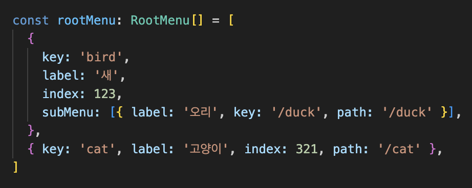
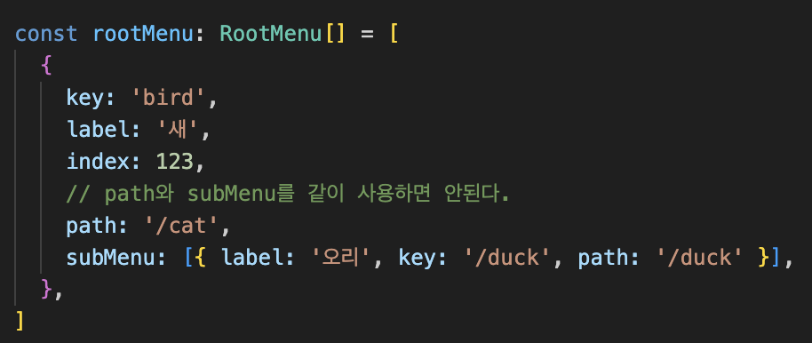
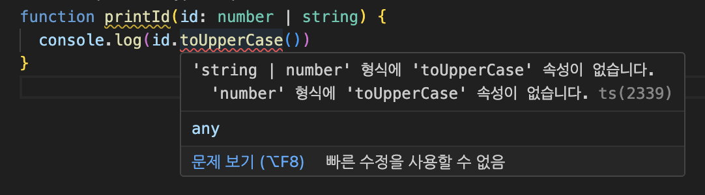
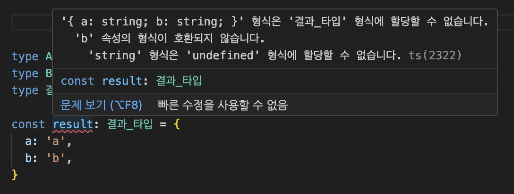
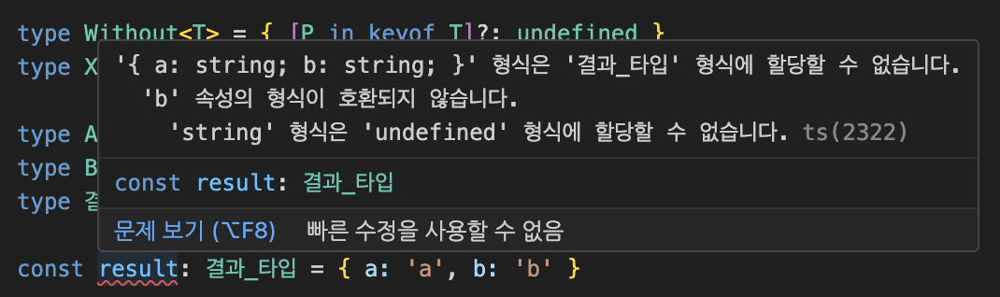

<Callout>
  💡 TypeScript XOR 타입을 활용해서 리팩터링한 과정을 공유합니다. 피드백은 언제나
  환영입니다:)
</Callout>

## 타입스크립트를 활용한 리팩터링

다음과 같은 문제 상황에 직면했다.

```ts
// 코드의 세부 내용들은 임의로 변경했다.

const rootMenu = [
  {
    key: 'bird',
    label: '새',
    index: 123,
    subMenu: [{ label: '오리', key: '/duck', path: '/duck' }],
  },
  { key: 'cat', label: '고양이', index: 321, path: '/cat' },
	...
]
```

변수명인 `rootMenu`를 보면 알 수 있듯이 메뉴에 대한 데이터를 구성한다.
이 배열을 처음 봤을 때 **타입의 필요성**을 크게 느꼈다.

메뉴를 생성하는 부분이기에 계속해서 데이터가 추가될 가능성이 크다.
이때 타입이 정의되어 있지 않다보니 실수할 확률이 매우 높아지게 된다.
해당 배열에 데이터를 추가할 때마다 오타나 잘못된 데이터 구조를 추가할 수 있게 되는 것이다.

**리팩터링의 필요성**이 생겼다.
코드를 고쳐 나가보자.

## 문제 정의

우선 `rootMenu`에서 사용되고 있는 타입들을 정의해보자.

공통적으로는 `key`, `label`, `index`이 사용되고 있다.
차이가 발생하는 부분은 `path`와 `subMenu`이다.

요구 사항에 따라 타입을 정리하면 다음과 같다.

```ts
// 공통적으로 사용되는 타입
type RootMenuBase = { key: string; label: string; index: number }

// path 타입
type RootMenuPath = { path: string }

// subMenu 타입
type RootMenuSubMenu = { subMenu: SubMenu[] }
type SubMenu = { label: string; key: string; path: string }
```

이를 어떻게 적절하게 사용할 수 있을까?

### 옵셔널 프로퍼티

우선 하나씩 접근하자.

처음에 떠오른 방식은 **옵셔널 프로퍼티**였다.

```ts
// 공통적으로 사용되는 타입
type RootMenuBase = { key: string; label: string; icon: JSX.Element }

// subMenu 타입
type SubMenu = { label: string; key: string; path: string }

type RootMenu = RootMenuBase & {
  path?: string
  subMenu?: SubMenu[]
}
```



일단 에러가 뜨지 않는다.
일차적인 목표는 달성했다.

하지만 사용하는 입장에서는 다음과 같이 `path`와 `subMenu`를 같이 사용하는 경우가 발생할 수 있다.



다른 방안을 떠올려보자.

## 유니온 타입

그 다음으로 떠오른 것은 **유니온 타입**이다.

유니온 타입은 두 개 이상의 다른 타입으로 구성된 타입으로, 이러한 타입 중 **하나가 될 수 있는 값을 나타내고자 할 때** 사용한다.

현재 문제가 되는 부분은 `subMenu`와 `path` 영역이다.
여기서 **이 두 값 중에 하나만 받고 싶어서 발생한 문제**이다.


유니온 타입으로 구성해보자.

```ts
// 공통적으로 사용되는 타입
type RootMenuBase = { key: string; label: string; index: number }

// path 타입
type RootMenuPath = { path: string }

// subMenu 타입
type RootMenuSubMenu = { subMenu: SubMenu[] }
type SubMenu = { label: string; key: string; path: string }

// 유니언 타입 활용
type RootMenu = RootMenuBase & (RootMenuPath | RootMenuSubMenu)
```


하지만 결과는 이전과 똑같이 원하는 대로 나오지 않는다.

왜 그럴까?

### 유니언 타입으로 작업하기

타입스크립트는 유니언의 모든 멤버에 대해 유효한 경우에만 연산을 허용한다고 한다.
그래서 다음과 같이 `number | string`이 있는 경우 문자열에서만 접근할 수 있는 메서드를 사용할 수 없다.



따라서 현재 상황에서도 `subMenu`와 `path`가 모두 고려된 것이다.

이러한 경우 일반적으로 [Narrowing](https://www.typescriptlang.org/docs/handbook/2/narrowing.html#assertion-functions)을 활용하여 타입을 좁혀 나간다.
하지만 우리의 문제는 **배열과 객체에서 발생**해서 마땅히 적용할 수 없다.


그렇다면 현재 상황을 어떻게 해결할 수 있을까?

어떻게 현재 문제를 검색해서 실마리를 찾을 수 있을까?

## 문제를 단순화시키기

다시 문제 상황을 곰곰이 생각해보자.
키워드를 도출하기 위해 문제 상황에서 불필요한 부분들을 제거해서 단순화시키면 좋을 것 같다.

`key`, `label`, `index`을 없애자.
그리고 `subMenu`, `path`도 어렵게 접근하지 말고 `a`와 `b`로 대입하자.

문제가 되는 상황에 집중하면 다음과 같이 단순화시킬 수 있다.

```ts
type A = { a: string }
type B = { b: string }

type 결과_타입 = ???

const result: 결과_타입 = {
  // A 혹은 B 둘 중에 하나만 나와야 한다.
  // A가 나오면 B가 나오면 안된다.
  // B가 나오면 A가 나오면 안된다.
}
```

이렇게 문제가 단순해지니 검색을 해야할 키워드와 어떤 문제를 해결하고자 했는지 명확해진다.

우리가 하고자 하는 것은 **두 개중에 하나만 받는 경우,즉 `XOR`인 경우**였다.

해당 키워드로 다시 문제를 접근하자.

## XOR 타입 만들기

`XOR`타입을 만들어보자.

```ts
type A = { a: string; b?: never }
type B = { b: string; a?: never }
type 결과_타입 = A | B

const result: 결과_타입 = { a: 'a', b: 'b' } // 에러 발생
```



제대로 에러를 발생시킨다.

### 추상화시키기

조금 더 나아가서 추상화를 시켜보자.

```ts
type Without<T> = { [P in keyof T]?: undefined }
type XOR<T, U> = (Without<T> & U) | (Without<U> & T)

type A = { a: string }
type B = { b: string }
type 결과_타입 = XOR<A, B>

const result: 결과_타입 = { a: 'a', b: 'b' } // 에러 발생
```



## 문제 해결하기

이를 적용하여 다시 문제를 해결하자.

```ts
type Without<T> = { [P in keyof T]?: undefined }
type XOR<T, U> = (Without<T> & U) | (Without<U> & T)

// 공통적으로 사용되는 타입
type RootMenuBase = { key: string; label: string; index: number }

// path 타입
type RootMenuPath = { path: string }

// subMenu 타입
type RootMenuSubMenu = { subMenu: SubMenu[] }
type SubMenu = { label: string; key: string; path: string }

// XOR 타입 활용
type RootMenu = (RootMenuBase & XOR<RootMenuPath, RootMenuSubMenu>)[]

const rootMenu: RootMenu = [
  {
    key: 'bird',
    label: '새',
    index: 123,
    subMenu: [{ label: '오리', key: '/duck', path: '/duck' }],
  },
  { key: 'cat', label: '고양이', index: 321, path: '/cat' },
]
```


에러도 제대로 체크한다..! 😆

## 참고 문서

- [Union Types](https://www.typescriptlang.org/docs/handbook/2/everyday-types.html#union-types)
- [Why does A | B allow a combination of both, and how can I prevent it?](https://stackoverflow.com/questions/46370222/why-does-a-b-allow-a-combination-of-both-and-how-can-i-prevent-it)
- [Proposal: Add an "exclusive or" (^) operator](https://github.com/Microsoft/TypeScript/issues/14094)