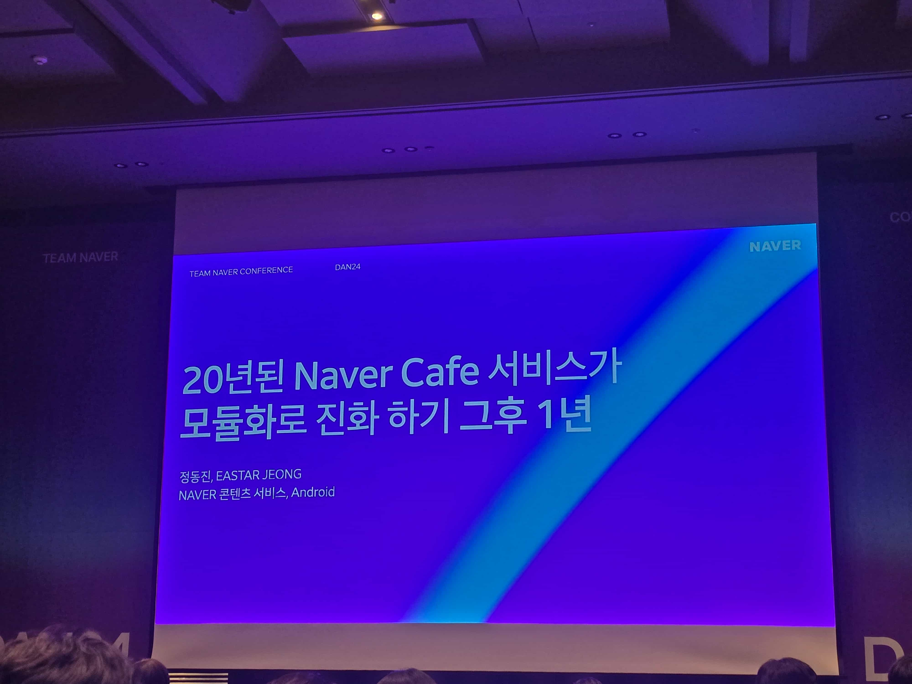
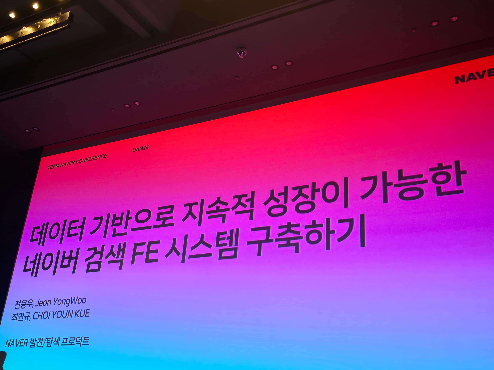

<Callout>💡 2024 네이버 개발자 컨퍼런스(DAN)를 다녀왔습니다.</Callout>

## 이번에도 티켓팅 성공?!

네이버 컨퍼런스 DAN 티켓팅에 성공했다! 😤

## 세션 참여!

1일차에 프론트엔드 관련 세션들이 구성되어 있어 월요일 오전에 일을 마치고 오후 세션들을 들으러 갔다.

 

이번 컨퍼런스에서는 오후에 급하게 간 것이어서 세션을 듣는 거 말고는 부스들을 많이 둘러보지는 못했다.

그래서 기념풀들을 많이 챙겨오지는 못한 부분이 아쉽게 느껴진다.. 😂

 

맨 처음 티켓 확인과 함께 고급스러운 담요를 받았다.

 

이번 행사에서 유일하게 받은 기념품이다.

(TMI: 저는 네이버 웨일을 사용합니다. 🐳)

 

그래도 이번 DAN24 세션에서 내가 맡은 업무와 관련이 많은 세션들로 구성되어 있었다.

(모듈화, SEO, 웹 성능, ...)

 

많은 인사이트를 얻을 수 있을 것 같은 기대감에 매우 집중하면서 들었다.

오후에 들었던 4개의 세션에 대해 정리해보자.

### 20년된 Naver Cafe 서비스가 모듈화로 진화 하기 그후 1년

- [발표 자료](https://dan.naver.com/data/deview/session/attach/20%E1%84%82%E1%85%A7%E1%86%AB%E1%84%83%E1%85%AC%E1%86%AB%20NAVER%20CAFE%20%20%E1%84%89%E1%85%A5%E1%84%87%E1%85%B5%E1%84%89%E1%85%B3%E1%84%80%E1%85%A1%20%E1%84%86%E1%85%A9%E1%84%83%E1%85%B2%E1%86%AF%E1%84%92%E1%85%AA%E1%84%85%E1%85%A9%20%E1%84%8C%E1%85%B5%E1%86%AB%E1%84%92%E1%85%AA%20%E1%84%92%E1%85%A1%E1%84%80%E1%85%B5%20%E1%84%80%E1%85%B3%E1%84%92%E1%85%AE%201%E1%84%82%E1%85%A7%E1%86%AB.pdf)

(발표 영상은 올라오면 링크 첨부하겠습니다. 😇)

 

- 아키텍처 목표
  - 모범 사례 만들기: 일관된 설계로 다른사람에 코드도 쉽게 이해
- 모듈화
  - 유지 가능한 작은 코드 만들기, 규격화하기, Bus factor 높이기
- 레거시 공략하기
  - 문서화는 기본 (던전을 공략할 때 지도는 기본)
  - 문서가 필요없는 경우는 존재하지 않음
  - Mermaid 도구
- 어려운 코드 쉽게 바꾸기 혹은 지우기
  - 핑계 없는 무덤이 없다 → 핑계 없는 코드는 없다.
- 리팩토링과 과제는 분리
  - 한 번에 하나에 모자만 쓰기, refactoring 후 feature 하는 것이 더 좋음
- 대규모 변화 vs 점진적 변화
  - 조금만 고쳐도 오류 발생? 배포 후에 핫픽스로 고생?
  - 코드의 수명이 다된 것..!
- Know-how & Tips
  - Stacked PR
  - 고립 전략: 지우지 못할 경우 고립시기고 제한적 접근

 

내가 맡은 업무에서 내부적인 목표가 네이버 카페였는데 운좋게도 이번 세션을 들을 수 있었다.

세션 자체는 모바일이 주제였지만 가장 와닿은 세션이었다.

 

문서화, `Stacked PR`, 고립 전략, 모듈화 등등 많은 키워드들이 들어왔다.

알게 모르게 적용된 부분도 있는 것 같고 우리한테는 어떻게 적용할 수 있을지 고민하면서 재밌게 들었다. 🧐

### 데이터 기반으로 지속적 성장이 가능한 네이버 검색 FE 시스템 구축하기

- [발표 자료](https://dan.naver.com/data/deview/session/attach/%E1%84%83%E1%85%A6%E1%84%8B%E1%85%B5%E1%84%90%E1%85%A5_%E1%84%80%E1%85%B5%E1%84%87%E1%85%A1%E1%86%AB%E1%84%8B%E1%85%B3%E1%84%85%E1%85%A9_%E1%84%8C%E1%85%B5%E1%84%89%E1%85%A9%E1%86%A8%E1%84%8C%E1%85%A5%E1%86%A8_%E1%84%89%E1%85%A5%E1%86%BC%E1%84%8C%E1%85%A1%E1%86%BC%E1%84%8B%E1%85%B5_%E1%84%80%E1%85%A1%E1%84%82%E1%85%B3%E1%86%BC%E1%84%92%E1%85%A1%E1%86%AB_%E1%84%82%E1%85%A6%E1%84%8B%E1%85%B5%E1%84%87%E1%85%A5_%E1%84%80%E1%85%A5%E1%86%B7%E1%84%89%E1%85%A2%E1%86%A8_FE_%E1%84%89%E1%85%B5%E1%84%89%E1%85%B3%E1%84%90%E1%85%A6%E1%86%B7_%E1%84%80%E1%85%AE%E1%84%8E%E1%85%AE%E1%86%A8%E1%84%92%E1%85%A1%E1%84%80%E1%85%B5.pdf)

(발표 영상은 올라오면 링크 첨부하겠습니다. 😇)

 

- 문제점
  - 비슷한 개발 → Server Driven UI
  - 중복 개발 → Design System
  - 데이터 부족 → Data
  - 긴 피드백 - 꼭 마지막에 해야 하는가? → Design To Code
- Flexible Render
  - 템플릿 및 컴포넌트 기반의 한계
  - Sweet Spot 찾기 → 모듈 컨셉, 데이터를 기반으로 따라 모듈 구성
- Design System
  - 왜 디자인 시스템은 실패하는가? → 협업의 부족
  - 협업 이슈를 줄이고 적용에 비용을 낮추기 → 완벽보다 지속적 업데이트
  - 디자인 시스템 구축 VS 서비스 개발: 무엇이 먼저인가? → 필요한 요소에 적용, 잘 운영하는 것에 집중
- Developer eXperience
  - 디자인 시스템을 만드는 자, 사용하는 자, 처음 접하는 자
  - 경험은 Data로부터 나옴
  - Meta: 모든 정보
  - 디자인과 개발은 1:1 매칭, Design To Code

 

발표에서 나온 `meta`라는 키워드의 데이터 정보가 정말 궁금해진 세션이었다. 🤔

모듈 개념, `meta` 등 팀에 맞게 적절한 개념을 정의해서 사용한 부분이 좋게 느껴졌다.

### 네이버 검색에서 웹 성능 관리하는 방법: web-vitals 수집부터 개선까지

- [발표 자료](https://dan.naver.com/data/deview/session/attach/%E1%84%82%E1%85%A6%E1%84%8B%E1%85%B5%E1%84%87%E1%85%A5%20%E1%84%80%E1%85%A5%E1%86%B7%E1%84%89%E1%85%A2%E1%86%A8%E1%84%8B%E1%85%A6%E1%84%89%E1%85%A5%20%E1%84%8B%E1%85%B0%E1%86%B8%20%E1%84%89%E1%85%A5%E1%86%BC%E1%84%82%E1%85%B3%E1%86%BC%20%E1%84%80%E1%85%AA%E1%86%AB%E1%84%85%E1%85%B5%E1%84%92%E1%85%A1%E1%84%82%E1%85%B3%E1%86%AB%20%E1%84%87%E1%85%A1%E1%86%BC%E1%84%87%E1%85%A5%E1%86%B8.pdf)

(발표 영상은 올라오면 링크 첨부하겠습니다. 😇)

 

- 웹 성능이란?
  - 얼마나 빠르게 보이는가? 얼마나 빠르게 반응하는가?
- 과거 성능 측정 방식
  - load 이벤트, 페이지의 모든 리소스의 로드 완료 시점
  - 사용자 체감 성능과 차이가 발생해서 문제
- 새로운 성능 측정 방식 (web-vitals)
  - TTFB, FCP, FID (FID는 deprecated)
  - Core Web Vitals → LCP, INP, CLS (발표에선 LCP 다룸)
- LCP
  - 화면에서 가장 큰 이미지, 텍스트 블록, 동영상의 렌더링 시간
  - 사용자 인터렉션 발생 시 종료
  - 사용자 75%가 2.5초 이하되는 것을 권장, 4초 이상이면 비상
- LCP를 대표 지표로 선정한 이유
  - 수치화, 비교, 임계값 설정 가능
- 성능 개선 사례
  - load 이벤트 발생 시점으로부터 150ms 뒤에 JavaScript를 로드
  - JavaScript 로드 시점을 DCL(DOMContentLoaded)로 변경
- 성능 지표는 데이터 기반 의사결정을 할 수 있는 지표

 

네이버 검색이라는 특수한 환경에서 웹 성능을 어떻게 다루는지 알게 된 것 같다.

우리 서비스에서는 어떻게 웹 성능을 개선해야 할 지 고민을 더 하게 되었다. 😇

### 여러분의 웹서비스에는 꼭 필요한 것만 있나요? 번들사이즈 최소화를 통한 웹 성능 개선

- [발표 자료](https://dan.naver.com/data/deview/session/attach/%E1%84%8B%E1%85%A7%E1%84%85%E1%85%A5%E1%84%87%E1%85%AE%E1%86%AB%E1%84%8B%E1%85%B4%20%E1%84%8B%E1%85%B0%E1%86%B8%E1%84%89%E1%85%A5%E1%84%87%E1%85%B5%E1%84%89%E1%85%B3%E1%84%8B%E1%85%A6%E1%84%82%E1%85%B3%E1%86%AB%20%E1%84%81%E1%85%A9%E1%86%A8%20%E1%84%91%E1%85%B5%E1%86%AF%E1%84%8B%E1%85%AD%E1%84%92%E1%85%A1%E1%86%AB%20%E1%84%80%E1%85%A5%E1%86%BA%E1%84%86%E1%85%A1%E1%86%AB%20%E1%84%8B%E1%85%B5%E1%86%BB%E1%84%82%E1%85%A1%E1%84%8B%E1%85%AD.pdf)

(발표 영상은 올라오면 링크 첨부하겠습니다. 😇)

 

- 사용 중인 코드를 알 수 있는 크롬 개발자 모드의 Coverage 메뉴
  - 어떠한 상황에서도 사용되지 않는 자바스크립트 리소스 식별
- 은탄환은 없다.
  - 브라우저 지원 범위 → browserlist-config
  - lottie 내부 이미지 압축 (sharp)
  - SVG 리소스 최적화 → optimize-svg-component
  - 네이티브 기능 적극 사용 → DomParser, fetch, lodash 자체 구현, 자체 상태관리 구현
- NPM 라이브러리의 효율적인 관리
  - 듀얼 패키지 환경
- 성능 개선 결과
  - 리소스 크기, 응답 속도 감소
- 결론 및 향후 과제
  - 같은 실수를 반복하지 않기
  - 패키지의 크기를 지속적으로 파악 → actions 활용
  - 정적 분석 도구 활용
  - 패키지의 설치 자동화
- 성능 개선 작업 회고
  - 답은 브라우저 리소스에 있다.
  - 불필요한 코드와의 전쟁
  - 브라우저 최소 지원 버전 수립
  - npm 패키지는 만능이 아니다.
  - 웹 서비스 기술 스택 업데이트

자체로 구현한 라이브러리들이 많아 경외심이 들었다. 😵

대단한 사람들이 너무나도 많은 것 같다.. 😂

## 마무리

이번에도 역시 녹초가 되었다.. 🫠

그래도 유익한 세션들이 많았다.

우리 프로젝트에 어떻게 잘 녹여낼 수 있을까? 우리 코드는 어떤 상황이지? 등등 여러 생각들이 든다.
