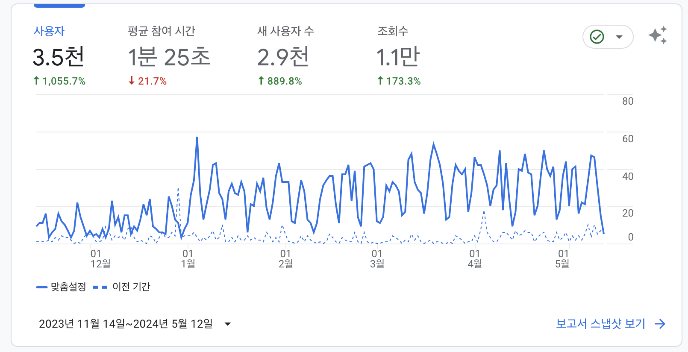
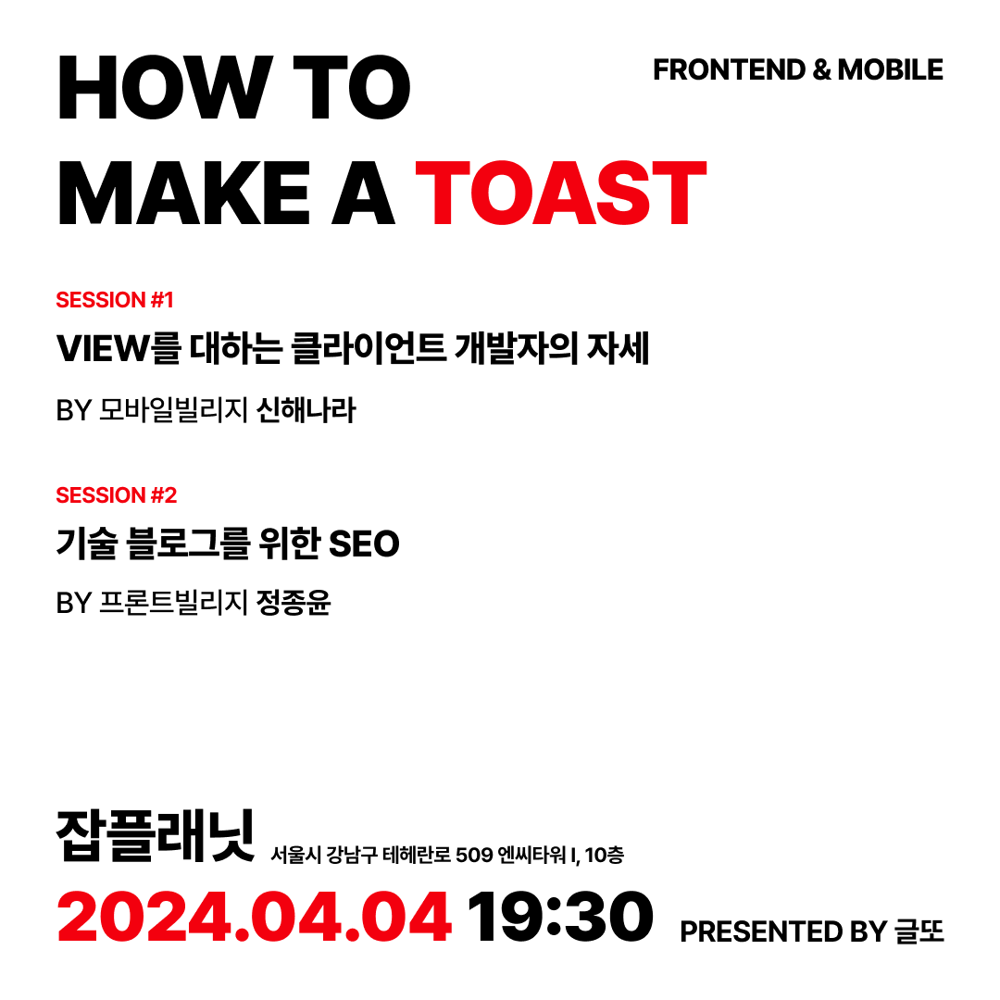
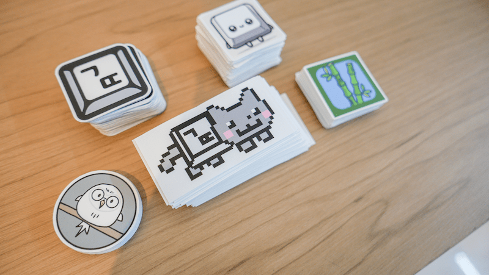
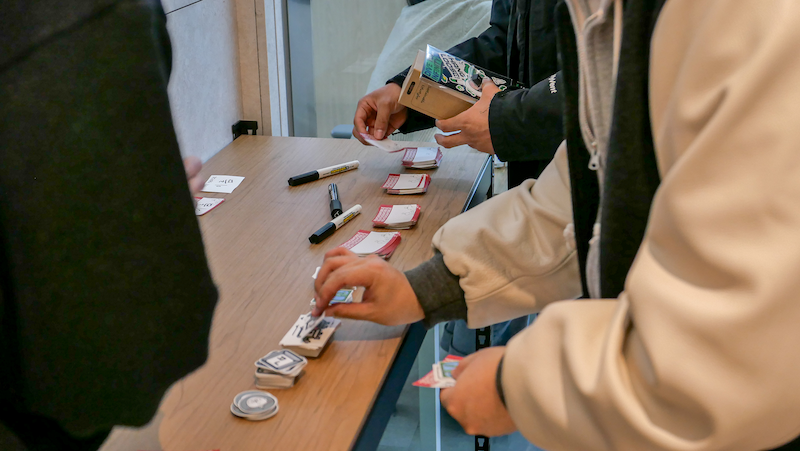
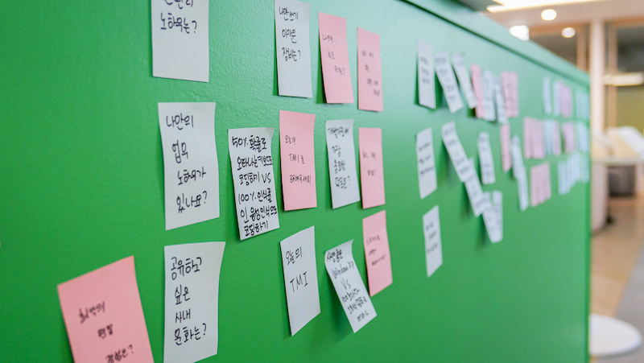
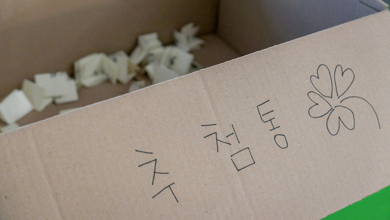
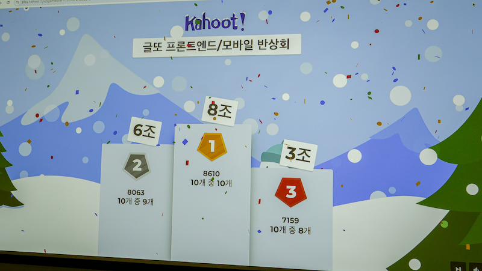

<Callout>💡 글또 9기에서의 활동들을 되돌아봅니다.</Callout>

## 글또 9기를 돌아보며

2023년 12월부터 시작해서 2024년 5월까지 진행된 글또 9기 활동이 마무리되었다.

글또 9기 동안 어떤 활동들을 했는지 회고해보자.

## 목표 설정

본격적인 활동에 앞서 글또 9기에서 달성하고자 한 목표를 정했는데,
**꾸준하게 글을 쓰는 것**과 **양질의 글을 작성**하고 싶어서 다음과 같이 설정했다.

 

- **PASS 사용없이 모든 회차 글 작성하기**
- **큐레이션 1회 이상 선정되기**

## 글쓰기 활동

(원래 9기의 경우 5개월로 진행될 예정이었지만 1개월이 연장되어 총 12회차로 구성되었다.)

처음 목표했던 총 10회차(+2)의 글을 빠짐없이 작성했다.

바쁜 일정 속에서도 기억이 휘발되기 전에 업무 관련 글들을 블로그에 작성할 수 있어서 뿌듯하다.

2주에 최소 1개씩 글을 작성하는 습관을 앞으로도 지켜나가자!

### 의식적으로 행동하기

확실히 회차가 후반후로 갈수록 글감이 떨어지는 것을 느꼈다.

이와 관련해서 중요하게 생각하게 된 부분은 **의식적으로 행동하는 것**이었다.

 

내가 느꼈던 어려움은 오랜 시간동안 꾸준히 개발 관련 글을 쓰고 있는 개발자들도 당연히 겪는 문제점이다.
하지만 그들의 특별한 점은 글을 쓰는데 있어서 대단한 결심을 하는 것이 아닌 **일상 속에서 계속 자연스럽게 만들어 나간다**는 점일 것이다.

 

항상 의식적으로 삶을 살도록 노력하자!

### 큐레이션

[React 동시성에 대해 알아보기](https://jgjgill-blog.netlify.app/post/learn-about-react-concurrent/)

 

하나의 글이라도 큐레이션에 선정되고 싶었는데 정말 선정이 되었다. 😆

해당 글이 큐레이션으로 선정된 이유를 스스로 분석해봤을 때 우선 내용적으로 작성한 글들 중에서 가장 오랜 시간 공을 들여서 쓴 글이었다.

그리고 동시성이라는 매력적으로 보이는 키워드와 해당 글을 쓰는 시점이 연말이어서 주로 회고 관련 글들이 많이 올라와서 내 글이 차별점으로 보이지 않았나 싶다.

 

확실히 단순히 내용적인 측면뿐만 아니라 전략적으로 글을 쓰는 것도 중요한 것 같다. 🧐

### 데이터로 바라보기

글또 관련해서 첫 번째로 작성한 글인 [삶의 지도](https://jgjgill-blog.netlify.app/post/map-of-life/)부터 현재 시점(2024.5.12)을 기준으로 `Google Analytics` 데이터를 살펴봤다.

확실히 그래프가 글또를 시작한 기점으로 증가한 것을 볼 수 있다.

 

`MAU`같은 경우에는 600여명에서 800여명으로 늘어났다.

이제는 MAU 1000명을 달성해보자!

## 커뮤니티 활동

### 반상회 준비 위원회 참여

개발 관련 커뮤니티 행사를 직접 만들어 나가는 경험을 하고 싶었다.

그래서 모집글이 올라왔을 때 바로 신청을 했고 덕분에 개발 행사가 어떻게 진행되고 운영되는지를 가까이에서 경험할 수 있었다.

 

**프론트엔드 반상회 포스터**

 

**반상회 굿즈**

 

반상회에서 내가 주로 맡은 업무는 네트워킹과 관련된 활동을을 구성하는 것이었다.

여기서 중요하게 생각한 부분은 **처음 보는 사람끼리 자연스럽게 대화를 시작할 수 있는 장치들을 마련**하는 것이었다.

그래서 미리 참여자들로부터 받은 질문과 밸런스 게임같은 질문들을 포스트잇에 적어 행사장에 배치했다.

 

이외에도 준비 위원회 모두가 의미있는 반상회를 구성하기 위해 노력한 덕분에 잘 마무리했던 것 같다.

### 커피챗

커피챗 활동을 먼저 주도적으로 나서서 하지는 못한 점이 아쉽게 느껴진다.

코어 채널 기반으로 커피챗을 진행한 한 번 빼고는 따로 커피챗을 진행하지 않았다.

아직까지는 처음 보는 사람과 선뜻 이야기를 나누는 것이 조금 어색하게 느껴지는 것 같다. 😅

다음 10기가 운영되면 먼저 커피챗 제안을 보내기도 하면서 커피챗 횟수를 늘려보고자 한다.

 

**Action Item**

- 먼저 커피챗 제안 보내기
- 3회 이상 커피챗 진행하기

## 앞으로

특별한 일이 없으면 글또 10기에도 참여할 것 같다.

글또 덕분에 꾸준한 글쓰기 습관 및 환경을 형성할 수 있었고 새로운 인연들을 만나는 시간이 되었다.

10기에서도 다양한 사람들과 좋은 관계들을 만들어 나갔으면 한다.

 

마지막으로 좋은 커뮤니티를 운영해주신 모든 분들에게 감사드린다.
