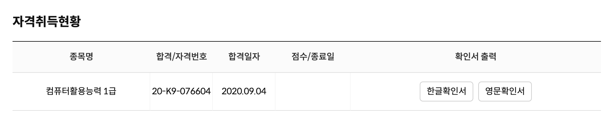
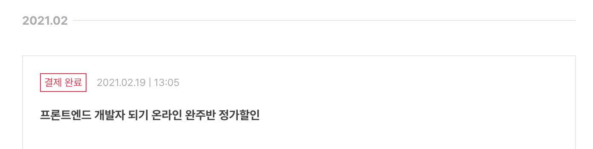
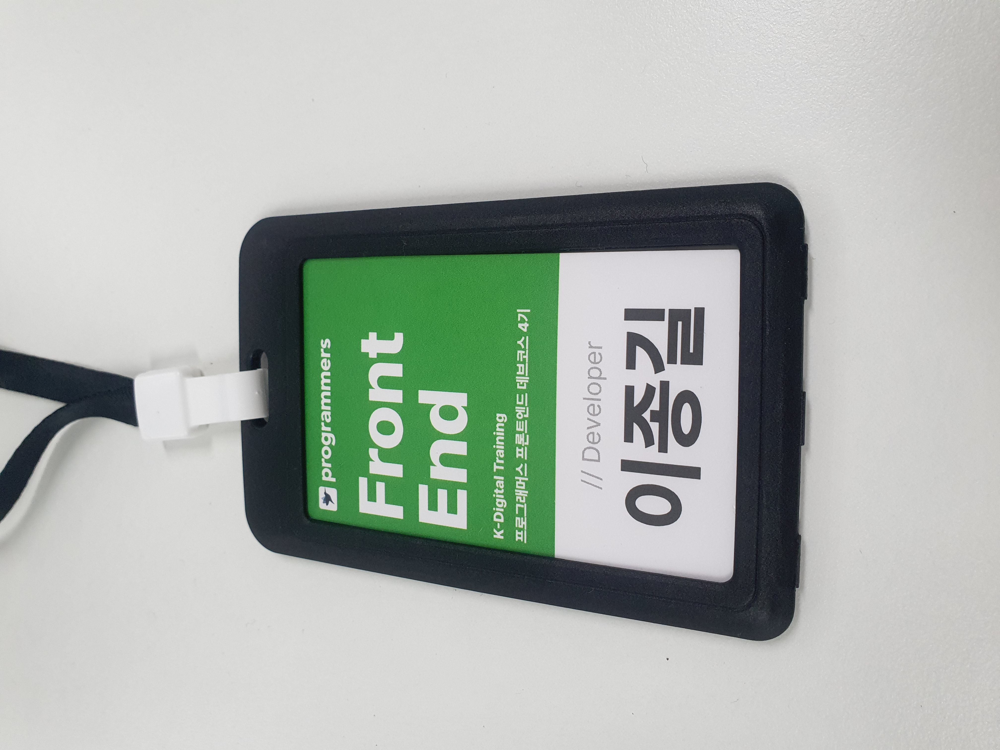

<Callout>💡 나는 어떻게 살아왔는지, 앞으로는 어떻게 살아갈 것인가?</Callout>

## 개발을 접하다

처음 개발을 접하게 된 건 군대를 전역하고 복학한 코로나 시기로 거슬러 올라간다.

수업들이 비대면으로 이루어지면서 나는 전공에 대한 흥미가 전혀 생기지 않았고 단순히 좋은 학점을 받기 위해 수업을 듣는 것에 불과했다.
(어찌저찌 지금은 4점대를 넘기게 되었지만 크게 의미는 없는 것 같다.. 😇)

### 뭐라도 해야지...

그러면서 '뭐라도 해야지'라는 생각으로 전공 과목 이외에 여러 공부를 하게 된 것 같다.
많이들 준비하는 한국사검정능력시험과 컴퓨터활용능력과 같은 시험에 응시해서 자격증을 취득하기도 하고 유튜브에 올라온 강의들을 보며 포토샵을 끄적여보기도 했다.

### 나도 한다 개발..!

이렇게 '뭐라도 해봐야지'라는 생각으로 처음 개발을 접하게 된 것 같다.
처음엔 뭣도 모르고 프론트엔드라는 말이 흥미롭게 느껴져서 강의를 듣게 되었다.

물론 쉬운 난이도의 초반을 넘어선 중반부터는 코드를 이해하기는 커녕 외우기도 벅찼던 것 같다. 😂

하지만 전공 수업과는 다른 색다른 재미를 얻을 수 있었다.
프론트엔드 분야에서는 **시각화**라는 매력과 개발을 통해서는 새로운 무언가를 만든다는 **창조의 가치**가 좋았다.

이렇게 전공과는 별개로 개발 공부를 본격적으로 시작하게 되었다.

## 겁많은 자존심, 존대한 수치심

지금까지도 유지하고 있는 생각으로 개발에 있어서 **두려움**이 가장 큰 문제인 것 같다.

이 시기에 특히 많이 겪었고 나 자신을 많이 해치게 되었다.

아무래도 비전공자로 주변에 나와 같은 길을 걸어가는 동료가 없다보니 어려움을 많이 겪었다.

함께 학습한다는 것에 대한 두려움으로 스스로를 고립시켰다.

 

그리고 개발에 대해 너무나도 잘못된 생각과 환상을 가지고 있었다.

> "코드를 작성하는 것에 있어서 완벽해야해!"

> "훌륭한 개발자는 시니컬하고 고독한 천재야!"

 

그래서 독학으로 기나긴 시간을 혼자서 공부하게 되었다.

물론 이 과정에서 여러 삽질을 하며 많은 것들을 배우기도 하고 혼자서 깊게 생각하는 시간을 가진 것 같기도 하다.

하지만 지금 돌이켜보면 **더 효율적인 방법**이 있었다는 아쉬움이 남는다.

그러면서 한편으로는 '이렇게 공부하는데 취업은 할 수 있겠지'라는 안일한 생각을 하게 되었다.

전혀 나 자신을 어필하는 셀프 브랜딩이 되지 않았는데도..

## 나를 되돌아보다

모든 학기를 마치고 본격적으로 취업에 나섰지만 당연히 결과는 처참했다.

서류와 과제를 힘겹게 통과해도 나만의 무기는 커녕 셀프 브랜딩이 전혀 되지 않아서 면접에서 '나'라는 존재를 다른 사람에게 설득시킬 수 없었다.

반복된 실패를 겪다보니 나 자신을 성찰하는 시간을 가지게 된 것 같다.

### 함께 자라기를 읽고

책을 통해 나를 인정하게 되었다.

**메타인지, 피드백, 공유**의 진정한 힘을 이해할 수 있었고 많은 배움을 얻었다.

여태까지 내가 잘못된 생각을 가지고 있었다는 것을 깨닫게 해주었다.

### 환경을 바꾸자

**함께 학습하는 환경**에 들어갔다.

성장을 위해 왔다는 목적을 잊지 않고 **주도적으로 학습**하며 팀원들과 **적극적으로 공유**하고 있다.

학습하면서 내가 어려움을 겪었던 내용에 대해서는 남들 앞에서 발표를 진행하기도 했다.

과정의 막바지를 향하고 있는 지금까지도 치열하게 후회없이,

성장을 목표로 앞으로 나아가고 있다.

## 앞으로 나는

다시 새로운 환경에 나를 내던질 시기가 왔다.
성장을 위한 좋은 루틴들을 쌓아 올리도록 하자.
