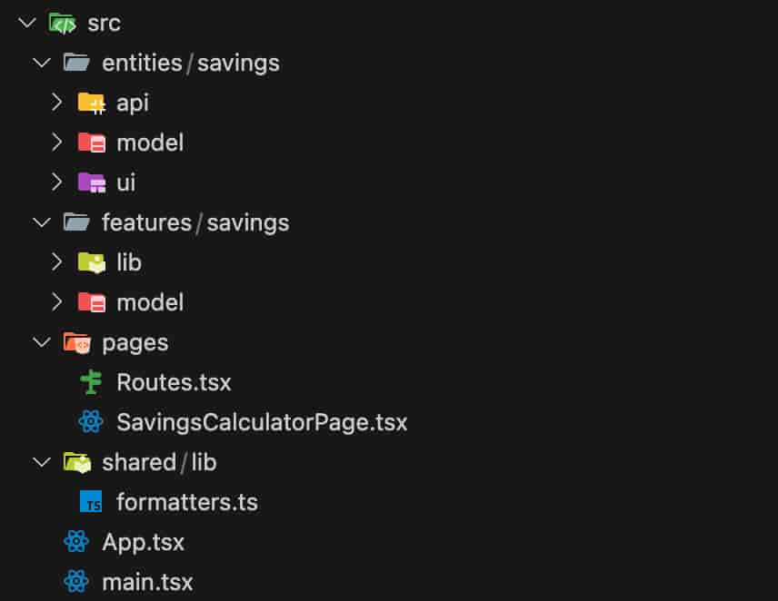

<Callout>💡 "토스 Frontend Fundamentals 모의고사 1회에 참가했습니다.</Callout>

## 과제 - 적금 계산기

### 시간을 지키자

> 문제를 푸는 시간이 제한되어 있습니다. 기한 안에 과제를 제출할 수 있도록 시간에 유의해주세요.

<br />

개인적으로 이번 모의고사를 하는 의미를 실제 과제를 본다고 생각하면서 임하고 싶었다.

그래서 주어진 2시간 안에 모든 요구 사항을 구현하는 것을 최우선 목표로 삼았다.

<br />

> 화려한 방법보다는 평소에 하던 가장 익숙한 방법으로 문제를 해결할 것을 권장해요.

<br />

안내 사항에는 익숙한 방법으로 진행하는 것을 권장해서 클로드 코드와 함께 과제를 임하기로 했다.

<br />

### 확장성과 추상화에 대해 고민하자

> 서비스의 유지보수나 장기적인 확장성을 고려한 설계, 추상화 관점에 집중해서 기능을 구현해주세요

<br />

이번 과제의 핵심 목표이자 평가원의 출제 의도(like 수능?!)로 가장 중요한 부분이다.

그래서 유지보수, 확장성, 추상화 3개의 키워드를 계속 머릿속에 되새겼다.

스스로에게 질문하면서 요구 사항을 해결해 나갔다.

<br />

### 작업 접근 방식

우선 프로젝트를 전체적으로 빠르게 이해하고 싶었다.

그래서 클로드 코드 `/init` 명령어로 `CALUDE.md` 를 생성하여 전체적은 프로젝트 구조를 파악했다.

<br />

다음으로 요구 사항을 올바르게 이해하는 것을 중요하게 생각했다.

체크리스트로 재정립해서 프롬프트로 작성했다.

<br />

작업 단계는 크게 단계별로 접근해서 각 단계마다 계획 모드로 작업 방식 점검 및 개선 이후 작업 진행해나갔다.

그리고 맥락을 쌓기 위해 하나의 단계가 마무리되면 `IMPLEMENTATION.md`에 작업 내용을 반영하고자 했다.

<br />

2시간 동안 과제를 진행한 뒤 PR은 나중에 코드를 다시 살펴보면서 천천히 작성했다.

<br />

[과제 제출 PR](https://github.com/toss-fe-interview/frontend-fundamentals-mock-exam-1/pull/16)

<br />

## 작업 회고

과제를 마무리하고 복기하는 과정에서는 크게 2가지를 신경썼던 것 같다.

- **커스텀훅을 관심사별로 잘 사용하기**
- **폴더 구조로 빠르게 원하는 코드 찾기**

<br />

`useSavingsForm` , `useFilteredProducts` 와 같은 커스텀훅을 구성해서 역할에 맞는 관심사 위임하고자 했다.

- `useSavingsForm`: 폼과 관련된 관심사 집중
- `useFilteredProducts`: 서버 데이터 처리에 집중

<br />


<br />

폴더 구조로 FSD를 활용해봤다.

일관된 폴더 구조로 빠르게 원하는 영역을 찾을 수 있으면 좋을 것 같다는 생각을 했다.

<br />



<br />

## 해설 강의를 듣고

### 왜 하게 되었는가?

토스 과제에 대해 잘못된 정보와 소문을 바로잡고 싶어서 이번 모의고사를 기획하게 되었다고 한다.

ex) README 자세하게, 테스트 코드 빡세게, …

해설 강의는 라이브 코딩 + PR 및 Discussion을 같이 살펴보는 방식으로 진행되었다.

<br />

### diff를 캐치하기

> 간극을 줄여나가기

<br />


<br />

라이브코딩 과정에서는 직접 사고의 과정을 하나씩 보여주셨다.

코드 작성에 바로 들어가지 않고 우선 과제의 요구사항을 살펴본다.

그러면서 과제에서 제공해준 코드와 요구사항을 보면서 상상했던 구조 사이에 발생한 간극(diff)을 빠르게 캐치한다.

이를 통해 구현해야할 것이 무엇인지 명확하게 알게 되면서 세부 구현에 잡아먹히는 것을 방지할 수 있는 것이다.

<br />

작업을 시작하는 포인트가 굉장히 인상깊었다.

### 지도를 그려나가자

> UI와 코드를 1:1 매핑시키면서 랜드마크 건설하기

<br />


<br />

다음으로 페이지와 코드를 1:1 매핑시키는 것을 강조한다.

다음 화면을 봤을 때 어떤 구조가 떠오를까?

<br />


<br />

매핑 과정에서 ‘**텍스트**’를 잘 드러내는 것이 중요하다.

2개의 코드를 비교해보자.

<br />

```ts
export function page() {
  return (
    <main>
      <Title>적금 계산기</Title>
      <Input label="목표 금액" placeholder="목표 금액을 입력하세요" suffix="원" />
      <Input label="월 납입액" placeholder="희망 월 납입액을 입력하세요" suffix="원" />
      <SelectSheet label="저축 기간" title="저축 기간을 선택해주세요">
        <SelectSheet.Option>6개월</SelectSheet.Option>
        <SelectSheet.Option>12개월</SelectSheet.Option>
        <SelectSheet.Option>24개월</SelectSheet.Option>
      </SelectSheet>

      <Tab>
        <Tab.Item selected={true}>적금 상품</Tab.Item>
        <Tab.Item>계산 결과</Tab.Item>
      </Tab>

      {selectedTab === 'products' && <ProductList />}
      {selectedTab === 'results' && <ProductList />}
    </main>
  )
}
```

<br />

UI와 코드가 1:1로 매핑이 되는 느낌이다.

마치 텍스트가 이정표 역할을 하면서 코드를 자연스럽게 읽게 도와주는 역할을 한다.

<br />

다음 코드도 살펴보자.

```ts
export function page() {
  return (
    <main>
      <SavingsCalculatorHeader />
      <SavingsForm />
      <SavingsTabs />
    </main>
  )
}
```

<br />

(조금 억지로 구성한 느낌도 있지만.. 느낌만 잡아보자..)

<br />

전과 비교했을 때 무엇을 의미하는지 한눈에 들어오지 않는다.

텍스트들이 컴포넌트에 숨겨져 있으면서 예측을 어렵게 만든다.

<br />

해당 부분에서 컴포넌트를 어떻게 다루어야 할 지 다시 고민해보고 생각이 넓혀지는 지점이 되었다.

- 자연스럽게 읽히는 코드가 유지보수하기 쉽다.
- 텍스트를 랜드마크처럼 다루자.

<br />

> Q: 데스크탑과 같은 복잡한 화면 구성에서는 어떻게 접근해야 할까?
>
> A: 계층을 구성하자. 지도의 축적을 생각해보면 좋을 것 같다. ex) 서울 → 한국 → 동아시아 → 세계

<br />

### 이상적인 인터페이스를 떠올려보자

> 인터페이스를 상상할 때 창의력은 없애기

<br />


<br />

```ts
const [view, setView] = useView('products')
```

<br />

인터페이스를 구성할 때 일반적인 표준을 따라야 한다.

HTML에서 제공하는 기본 인터페이스와 같이 모두가 예측 가능한 코드를 작성하면 좋다.

<br />

- 자연스러운 코드를 작성하자.
- 각각의 역할에 맞게 인터페이스 디자인하자.
- 적절하게 드러내고 숨기자.
- data를 추상화하지말고 스타일과 같은 요소를 추상화하자.

<br />

### 추출과 추상화에 대해

> 의존성과 관심사에 대한 고민

<br />


<br />

추출과 추상화를 구분해서 생각할 줄 알아야 한다.

<br />

#### 추출

- 이미 존재하는 중복된 코드나 로직을 찾아서 별도의 함수나 모듈로 분리하는 것
- 기존에 작동하던 것을 재구조화하는 리팩터링 기법
- 특별한 기준없이 단순히 밖으로 끌어내는 것을 의미

<br />

#### 추상화

- 구체적인 구현 세부사항을 감추고 핵심 개념이나 인터페이스만 드러내는 것
- 복잡성을 단순한 인터페이스 뒤에 숨기는 설계 기법
- 어떤 대상의 중요한 요점들을 재해석하여 정리

<br />

다음과 같은 괴물 훅을 만들지 말자.

<br />

```ts
function SavingsCalculatorPage() {
  const {
    targetAmount,
    monthlyAmount,
    savingPeriod,
    selectedProductId,
    selectedTab,
    filteredProducts,
    handleTargetAmountChange,
    handleMonthlyAmountChange,
    handleProductSelect,
    handleTabChange,
  } = useSavingsCalculator()
  // ...
}
```

<br />

### 재사용성은 따라오는 것

> 책임 단위로 추상화해나가기

<br />


<br />

라이브 코딩 과정에서 재사용성에 대한 언급은 하지 않았다는 것을 강조한다.

책임 단위로 추상화를 해나가면 재사용성은 자연스럽게 따라오는 것이다.

### 컴포넌트의 존재

> 컴포넌트에게 책임 부여하기

<br />


<br />

단순히 렌더링만 하는 컴포넌트의 의미는 어떻게 될까?

그냥 렌더링만 하는 역할이면 그대로 드러내는 것이 좋지 않을까?

컴포넌트의 존재 이유에 대해 고민해보자.

<br />

**AS-IS**

```ts
export function ProductList({ products, ... }: ProductListProps) {
  return (
    <>
      {products.map(product => <ListRow ... />})}
    </>
  );
}

function SavingsCalculatorPage() {
  const filteredProducts = useFilteredProducts(...);

  return (
    <ProductList products={filteredProducts} ... />
  );
}
```

<br />

**TO-BE**

```ts
function ProductList({ filter }) {
  const { data: products } = useSuspenseQuery({
    queryKey: ['products'],
    queryFn: fetchProducts,
    select: (data) => filter ? data.filter(filter) : data,
  });

  return (
    <>
      {products.map(product => <ListRow ... />)}
    </>
  );
}

function SavingsCalculatorPage() {
  const { formState, ... } = useSavingsForm();

  const filter = (product) =>
    product.minAmount <= formState.monthlyAmount &&
    product.periods.includes(formState.savingPeriod);

  return (
    <Suspense fallback={<Loading />}>
      <ProductList filter={filter} ... />
    </Suspense>
  );
}
```

<br />

### 간접적으로 나온 내용들

#### Props Drilling

- 전역 상태 관리가 필요한 경우가 존재하긴 한다.
- Props Drilling을 해결하기 위해 무조건 전역 상태를 도입하는 것은 좋지 않다.
- Props Drilling은 상태가 제대로 역할에 따라 분리되지 않았을 때 많이 발생한다.
- 컴포넌트 위계 계층과 역할에 대해 고민해보자.
- 역할을 잘 분리하면 해결된다. → 합성

<br />

#### FSD

- 방법론에 매몰되지 말자.
- 폴더 분리 규칙을 엄격하게 지키는 것에 연연하지 말자.
- 유지보수 용이성을 목적으로 나아가자.

<br />

과제부터 해설 강의까지 너무나도 의미있는 시간이 되었다.

<br />

## 참고 문서

- [좋은 코드란 무엇일까](https://jbee.io/articles/etc/%EC%A2%8B%EC%9D%80%20%EC%BD%94%EB%93%9C%EB%9E%80%20%EB%AC%B4%EC%97%87%EC%9D%BC%EA%B9%8C)
- [토스ㅣSLASH 22 - Effective Component 지속 가능한 성장과 컴포넌트](https://www.youtube.com/watch?v=fR8tsJ2r7Eg)
