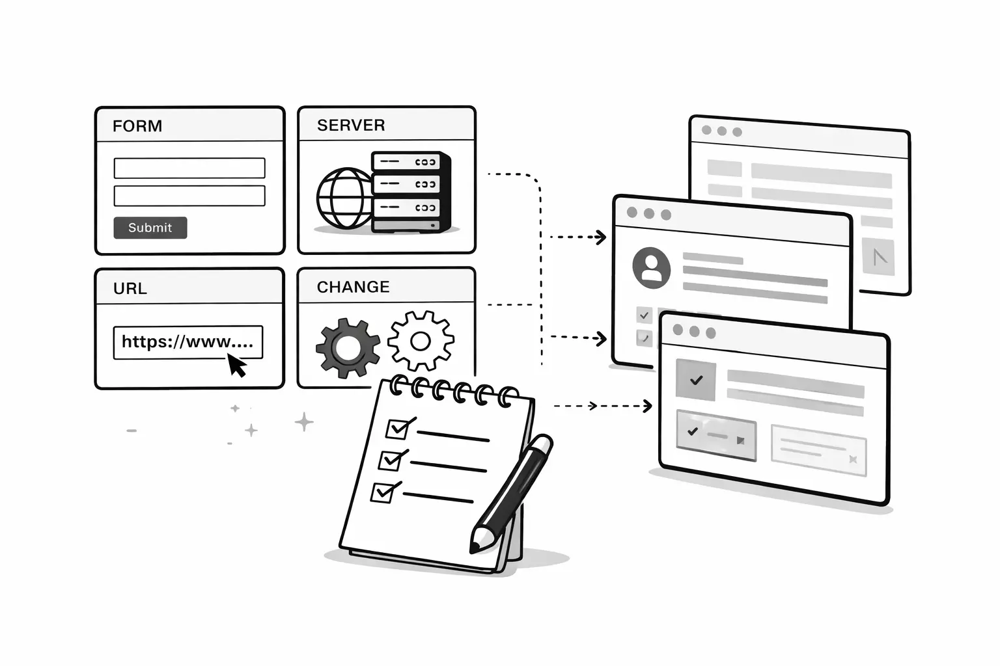
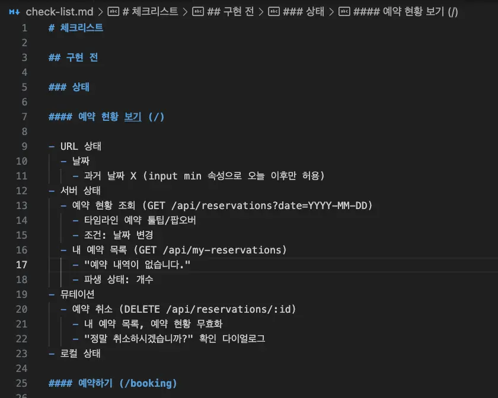
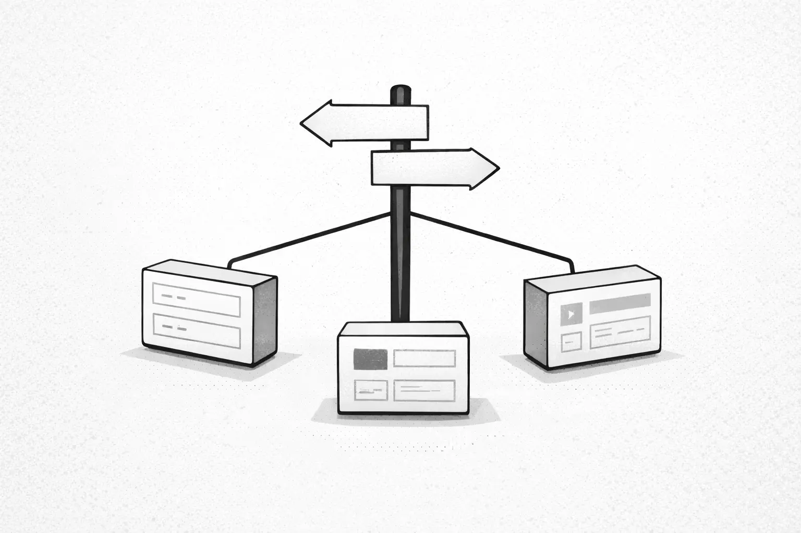
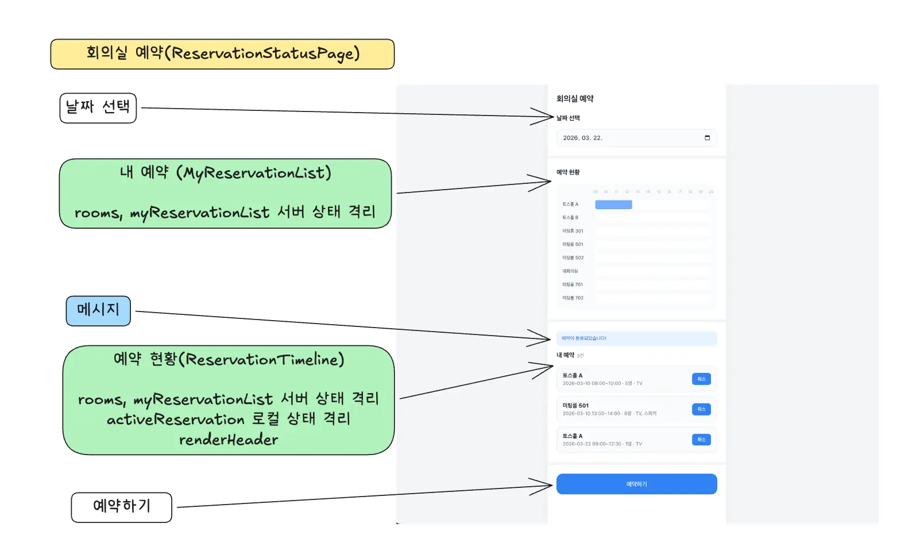
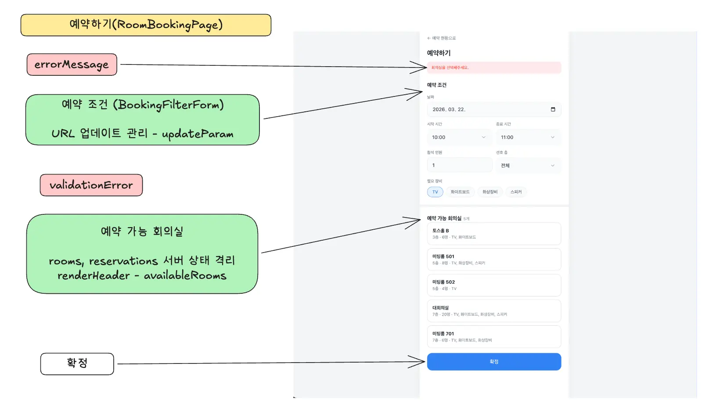
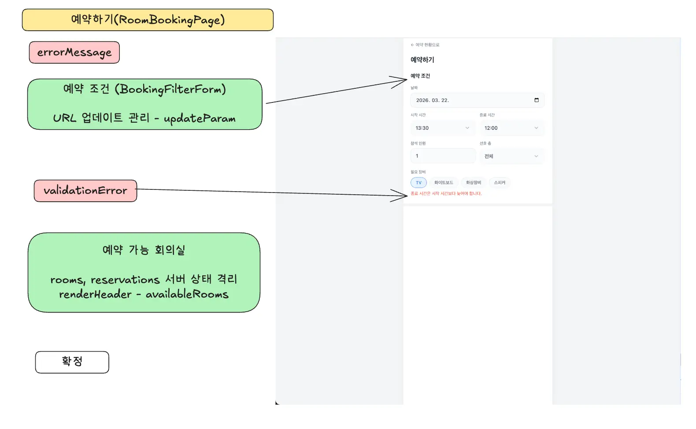
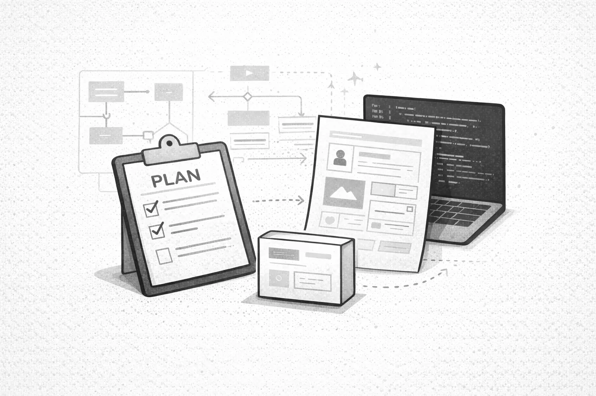
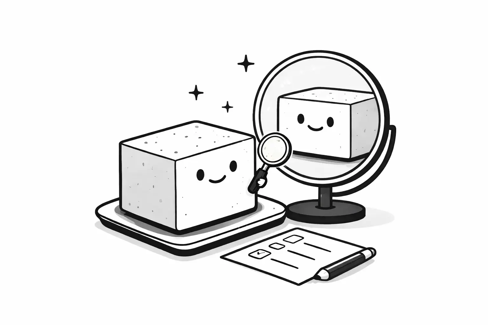

<Callout>
  예측 가능성, 적절한 추상화, 관심사 분리, 자기 점검, 의식적 훈련
</Callout>

## 과제 - 회의실 예약

> 이번 모의고사는 구현 그 자체보다,
> 토스의 방식과 참가자분들이 어떤 관점으로 추상화와 유지보수성을 바라보는 시각을 보다 직접적으로 비교하기 위해 이미 기능은 동작하도록 코드가 들어가 있는 과제를 제공해드려요.

[토스 Frontend Fundamentals 모의고사 2회](https://github.com/toss-fe-interview/frontend-fundamentals-mock-exam-2603)에도 참여하게 되었다.

모의고사 2회에서는 이미 동작하는 코드를 개선하는 과제가 출제되었다.
굉장히 지저분한 레거시 형태의 코드들로 어떻게 하면 적절하게 추상화와 유지보수성을 가져갈 수 있을지를 학습하는 것을 목표로 한다.

대부분의 과제와 달리 이미 완성된 코드를 이해하며 개선 지점을 찾는 과제라서 실제 업무에서 코드 리뷰하는 감정이 들기도 했다.
한편으로 역시 남이 작성한 코드를 이해하는 것은 쉽지 않다는 것을 다시 한 번 느꼈다.

[과제 제출 PR](https://github.com/toss-fe-interview/frontend-fundamentals-mock-exam-2603/pull/24)

## 나는 무엇이 달라졌나

- [1회 제출 PR](https://github.com/toss-fe-interview/frontend-fundamentals-mock-exam-1/pull/16)
- [1회 후기 글](https://jgjgill.com/post/toss-frontend-fundamentals-mock-exam-1-review/)

### 상태를 보는 시점이 달라졌다

> 결국 문제는 상태이다.

나만의 언어로 상태를 구분한다.
대략적으로 요구 사항을 내가 보는 시점으로 분해한다.

이를 통해 미리 상태와 컴포넌트에 대한 모습을 그려보고 머릿 속에서 관심사를 분리해나간다.
구현에 잡아먹히는 것을 막아준다.

[check-list.md](https://github.com/jgjgill/frontend-fundamentals-mock-exam-2603/blob/feature/check-list.md)

### 언제 컴포넌트를 구분할까? - 이정표를 중심으로

> 이 코드는 어떤 책임을 갖는가?

컴포넌트를 보는 시점이 달라졌다.

어떻게 하면 자연스럽게 코드를 드러내고 숨길 수 있을지를 중심으로 생각하게 되었다.
코드를 처음 보는 사람도 쉽게 코드를 찾을 수 있도록 노력한다.

  회의실 예약
  

  

    예약하기 - errorMessage
    
  

{' '}

  

    예약하기 - validationError
    
  

## 과제를 마무리하고

과제를 다 끝내고 나서는 2가지가 떠올랐다.

### 테스트 코드의 중요성

> 과감한 결정을 가능하게

과제에 구성된 테스트 코드 덕분에 리팩터링 작업을 훨씬 과감하게 진행할 수 있었다.
대부분의 작업은 코드 위치 이동에 불과했지만 아무래도 많은 부분이 휙휙 바뀌다 보니 불안감이 생겼다.

테스트 코드가 없었으면 작업을 마무리하지 못했을 것이다.
심리적 안정 장치 역할을 해주어 과감한 작업을 해나갈 수 있었다.

### 기획의 중요성

> 일관된 흐름이 코드를 이끈다

요구 사항이 일관되고 화면 구성이 명확할수록, 작업 단위와 컴포넌트의 경계가 자연스럽게 드러난다는 걸 느꼈다.

코드만 들여다보다 보면 어느새 구현에 매몰된다. 가끔은 시선을 코드 바깥으로 넓혀, 요구 사항과 기획서를 함께 바라보는 습관이 필요한 것 같다.

## 해설 강의를 듣고

### UI를 어떻게 인터페이스로 표현할 것인가

1부에서는 지난 1회차 내용의 복습이었다.

코드와 함께 핵심 주제를 직접 보여주셨다.

그만큼 해당 개념들이 중요하게 느껴진 시간이었다.

- 우리가 추구하는 인터페이스의 모습을 고민하자.
- 코드를 먼저 보면 구현에 매몰되고 이해심이 생기게 된다.
- 적절한 추상화, 컴포넌트의 존재

### 우리는 코드를 읽는 것이 아니라 예측한다

2부에서도 결은 비슷하게 진행되었다.

여러 표현들에 빗대어 설명해주셨다.

- 뇌는 모든 것을 입력받고 해석하는게 아니라 어느 정도는 예측한다.
- 동그란 돼지코는 220v
- 전화기의 수화부가 있는 곳이 위쪽이다.
- 일요일이 끝나지도 않았는데 월요일에 출근할 생각에 슬퍼진다.
- 예측이 빗나가면 "의외네??"라는 생각이 든다.
- 코드도 마찬가지이다. 예측 가능한 코드 = 이해하기 쉬운 코드이다.

## 자기 점검

> 자기 점검 차원에서, 깨두부를 한번 만들어 봤습니다.

개인적으로 대부분의 코드 작성을 클로드에게 위임하고 있는 상황이다.
하지만 개발자가 적절하게 코드에 개입하는 순간은 여전히 필요하다고 생각한다.
현재 설계 방향이 적절한지 코드는 좋은 방향으로 진행되고 있는지 AI가 아닌 우리 스스로가 판단할 줄 알아야 한다.
아직까지 책임은 우리의 몫이다. (앞으로도?!)

코드를 적절하게 판단할 수 있는 능력, 빠르게 코드 맥락을 이해하는 힘, 코드에 책임을 질 수 있는 태도 등 이러한 요소들을 어떻게 키워나갈 수 있을까?

의식적 훈련이 필요할텐데 지금과 같은 모의고사 활동과 코드 리뷰가 좋은 학습 교보재가 되지 않을까?

2회차는 자기 점검을 할 수 있었던 시간이었다.

## 참고 문서

- [AI 시대의 개발자로 살아남기](https://evan-moon.github.io/2026/02/10/developer-in-ai-era/)
