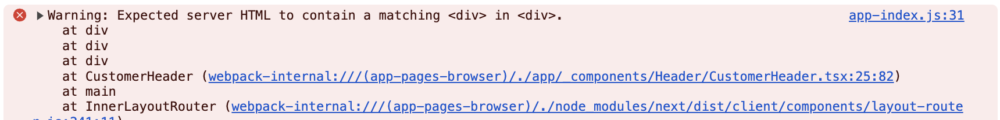

## Expected server HTML to contain a matching 관련 에러 해결하기

로그인 유무에 따른 컴포넌트 분기 처리를 하려고 하는 상황으로 코드는 다음과 같다.

```tsx
...
{loggedIn ? null : <Link href={pageRoute.customer.login()}>로그인</Link>}
...
```

그런데 다음과 같은 에러가 발생했다!



추측으로는 서버와 클라이언트 과정에서 HTML이 달라서 발생한 문제인 것 같다.

한 가지 의문인 것은 `use client`로 클라이언트 컴포넌트로 작성했는데도 발생했다는 것인데..

이 부분에서 아직 Next.js 13에 대한 개념이 부족하다는 것을 느낀다.

우선 기능적으로는 문제가 없어보이지만 해당 에러 메시지가 상당히 거슬린다..

### 처음 시도한 방식

해당 컴포넌트를 클라이언트에서만 렌더링되도록 하자!

```tsx
const [mounted, setMounted] = useState(false)

const { loggedIn } = useAuth()

useEffect(() => {
  setMounted(true)
}, [])

return (
  mounted && (loggedIn ? null : <Link href={pageRoute.customer.login()}>로그인</Link>)
)
```

`useEffect`와 `useState`를 활용해서 마운트가 된 이후에 컴포넌트가 렌더링되도록 했다.

서버에서는 무조건 컴포넌트가 `null`로 처리되는 느낌?

### 수정한 방식

공식 문서를 찾아보고 실마리를 찾은 것 같다.

사용되는 개념은 `Lazy Loading`으로 다음과 같이 코드를 수정했다.

**LoginHeader.tsx**

```tsx
const LoginHeader = () => {
  const { loggedIn } = useAuth()

  return loggedIn ? null : <Link href={pageRoute.customer.login()}>로그인</Link>
}
```

**Header.tsx**

```tsx
const LoginHeader = dynamic(() => import('./LoginHeader'), { ssr: false })
...
<LoginHeader />
```

얼추 느낌적인 느낌으로 이해는 되는데 사용되는 개념들이 많고 깊게 이해하지 못해서 설명을 전혀 못하겠다..

여기도 추가 공부하고 포스팅하기!

<br />

**사용되는 개념**

- **Lazy Loading**
- **Dynamic Imports**
- **code split**
- **streaming**
- **Server, Client Components**

### 공부할 부분

- [Lazy Loading](https://nextjs.org/docs/app/building-your-application/optimizing/lazy-loading)
- [Loading UI and Streaming](https://nextjs.org/docs/app/building-your-application/routing/loading-ui-and-streaming)
