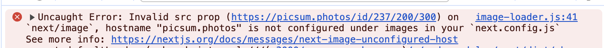
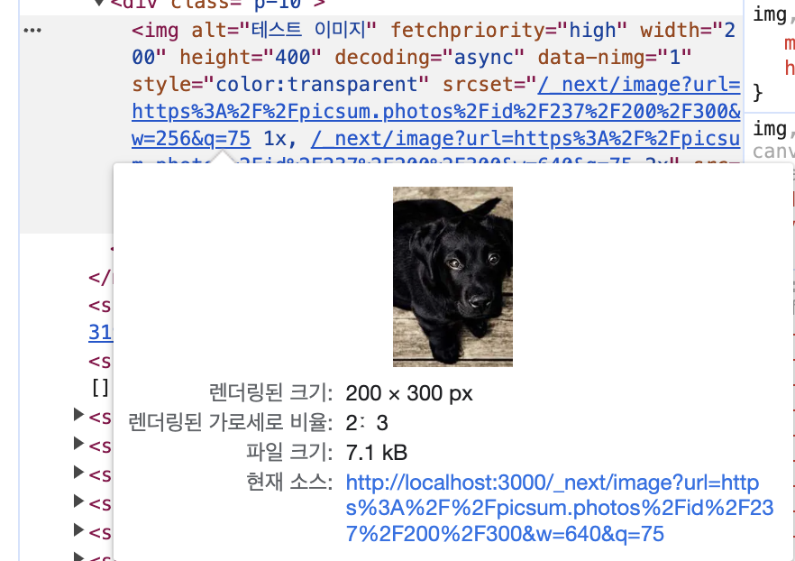

## Invalid src prop (…) on `next/image` 에러

mock 이미지로 외부 경로 이미지를 사용할 때 발생한 에러이다.



간단하게 `next.config.js` 에서 에러에 표시된 `hostname`을 추가해주면 된다.

**next.config.js**

```js
module.exports = {
  images: {
    domains: ['picsum.photos'],
  },
}
```

## 이미지 크기 모르는 경우

이미지 크기를 알고 있어서 정확한 값을 넣으면 상관 없지만 크기를 모르는 경우도 있다.

이때 다른 크기 값을 넣으면 다음과 같은 경고가 나온다.


작업을 하다보면 해당 경고문이 괜히 거슬린다..

그리고 생각대로 이미지가 변경되지 않는 경우가 있다.

**높이를 400px로 설정한 코드**

```tsx

```

**실제 렌더링된 이미지**



공식 문서를 참고했을 때는 다음과 같이 코드를 구성하면 원하는 크기대로 보여주는 것 같다.

- 부모 태그에 `position` 으로 `relative` or `fixed` or `absolute` 를 준다.
- `Image` 컴포넌트에 `fill`, `sizes` 속성을 추가한다.

**부모 태그를 적용해서 높이를 400px로 설정한 코드**

```tsx
<div className="relative h-[200px] w-[400px]">
  
</div>
```

**실제 렌더링된 이미지**


우선 이렇게 하면 얼추 대부분의 경우 잘 적용되는 것 같다.

이미지를 다루면서 느낀 점은 내가 디자인에 감각이 없어서인지 큰 차이가 아니면 다 똑같이 보여서 디테일한 부분을 잡기 힘들었다.

어렵다 어려워.. 😇

## 참고 문서

- [Image](https://nextjs.org/docs/app/api-reference/components/image)
