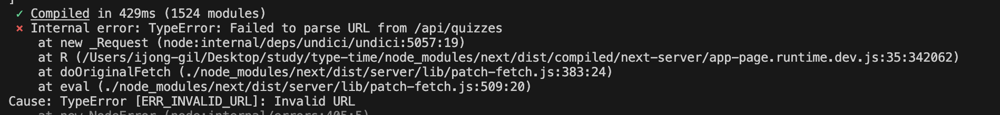

`SEO` 작업을 진행하면서 `route handler`를 사용하게 되었다.

처음에는 아무 생각없이 서버 컴포넌트에서 다음과 같이 API를 호출하려고 했다.

```ts
const res = await fetch(`/api/quizzes`)
```

하지만 에러가 발생한다.



에러가 발생한 이유는 서버에서는 `/api/quizzes` 이러한 상대 경로를 제대로 인식하지 못한다.
**절대 경로**로 호출할 필요가 있다.
`http://localhost:3000`도 포함시킨 형태로 변경해야 한다.

배포 환경도 신경써야 하니 `env`로 구성하자.

```ts
const res = await fetch(`${process.env.NEXT_PUBLIC_BASE_URL}/api/quizzes`)
```

## 참고 문서

- [NEXT JS TypeError: Failed to parse URL from /api/projects OR Error: connect ECONNREFUSED 127.0.0.1:3000 [duplicate]](https://stackoverflow.com/questions/74966208/next-js-typeerror-failed-to-parse-url-from-api-projects-or-error-connect-econ)
