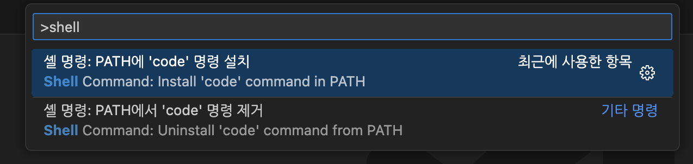
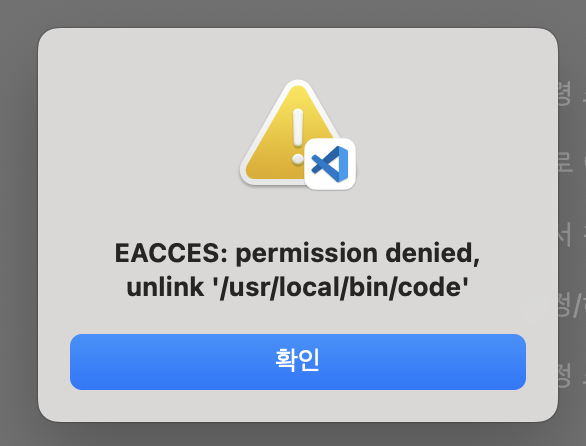
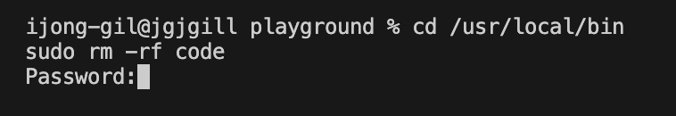

## zsh: command not found: code

세팅할 때마다 매번 검색하기 귀찮아서 한 번 정리하고자 한다.

VSCode에서 `Command Palatte`를 실행한다. (command + shift + p)

그 다음 `Shell Conmmand: Install 'code' command in PATH` 명령어를 실행한다.



### EACCES: permission denied, unlink '/usr/local/bin/code'

다음과 같은 에러가 발생했다.



해당 코드를 입력한다.

```bash
cd /usr/local/bin
sudo rm -rf code
```



다시 `Shell Conmmand: Install 'code' command in PATH` 명령어를 실행하면 제대로 넘어간다.

<div style={{ display: 'flex', justifyContent: 'center', gap: '10px' }}>
  <div>
    
  </div>
  <div>
    
  </div>
</div>
