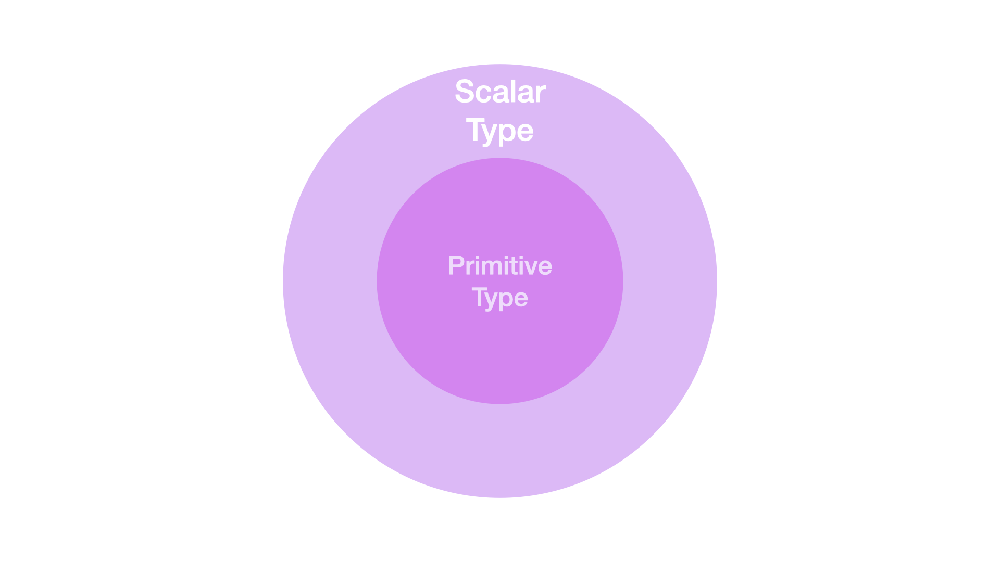

### Scalar

스칼라(scalar)는 하나의 숫자로만 표시되는 양으로 단지 크기만 갖고 있는 물리량을 의미한다.

수학에서 사용되는 용어인데 ‘이런 의미구나’ 하고 넘어가자 😇

### 프로그래밍에서

`scalar type`은 배열이나 객체와 같은 복잡한 데이터 구조와 달리 **단일 값을 나타낼 수 있는 데이터 타입**이다.

정수, 문자열 등과 같은 `primitive type`이 포함될 수 있다.

## Primitive Type과 다른 점은?

그럼 `scalar type`과 `primitive type`은 무엇이 다를까?

### 관심사와 반의어

`scalar`는 **단일 값인지, 복합적인 값인지** 구분하는 것에 집중한다.

`compound`와 대조된다.

 

반면 `primitive type`은 **직접적인 값인지, 실제 값을 포함하는 무언가에 대한 참조인지** 구분하는 것에 집중한다.

`reference type`과 대조된다.

### Scalar type과 Primitive Type의 구조

`primitive type`은 **프로그래밍 언어에 내장**되어 있다.
가장 기본적인 연산을 제공하는 **특정 유형의 스칼라 타입**인 것이다.

`scalar type`은 `primitive type`뿐만 아니라 **열거형이나 단일 값을 나타낼 수 있는 사용자 정의 유형의 다른 데이터 유형도 포함**될 수 있다.

 

즉 모든 원시 타입은 스칼라 타입이지만, 모든 스칼라 타입이 원시 타입이 되는 것은 아니다.

## 참고 문서

- [Scalar type](https://computersciencewiki.org/index.php/Scalar_type)
- [Scalar vs. primitive data type - are they the same thing?](https://stackoverflow.com/questions/6623130/scalar-vs-primitive-data-type-are-they-the-same-thing)
