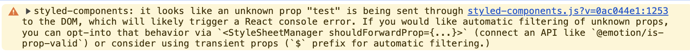
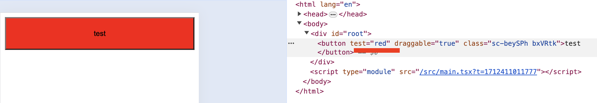
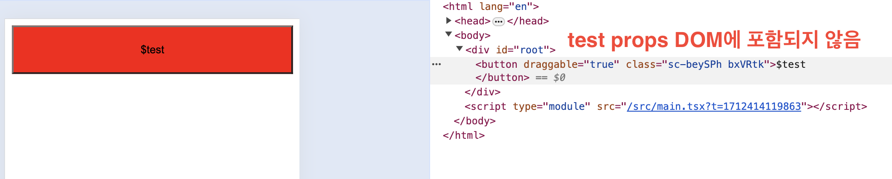

## 문제 상황

`styled-components`에 활용되는 `props`를 전달할 때 일반적인 `props` 형태로 전달하면 다음 경고가 발생한다.

```tsx
import styled from 'styled-components'

function App() {
  return (
    <Temp test="red" draggable>
      test
    </Temp>
  )
}

export default App

const Temp = styled.button<{ test: 'red' }>`
  background: ${(props) => props.test || 'skyblue'};
  ...
`
```



## 문제 원인

[관련 문서](https://styled-components.com/docs/basics#passed-props)에서 원인을 짐작할 수 있다.

> The styled function is smart enough to filter non-standard attributes automatically for you.

현재 사용된 `test`라는 이름의 임의의 `props`는 비표준 속성으로 `DOM`에 전달되지 않는 것이 바람직하다.

하지만 지금처럼 단순히 `test`로 네이밍하게 되면 `DOM`에 전달되게 된다.



## Transient props

버전 5부터 제공하는 기능으로 `Transient props`을 활용할 수 있다.
`$` 기호를 붙임으로써 리액트 노드 혹은 `DOM` 요소로 렌더링되는 것을 방지할 수 있다.

```tsx
import styled from 'styled-components'

function App() {
  return (
    <Temp $test="red" draggable>
      $test
    </Temp>
  )
}

export default App

const Temp = styled.button<{ $test: 'red' }>`
  background: ${(props) => props.$test || 'skyblue'};
  width: 100%;
  padding: 20px;
`
```



## 참고 문서

- [Transient props](https://styled-components.com/docs/api#transient-props)
- [Warning: Received `false` for a non-boolean attribute. How do I pass a boolean for a custom boolean attribute?](https://stackoverflow.com/questions/49784294/warning-received-false-for-a-non-boolean-attribute-how-do-i-pass-a-boolean-f)
