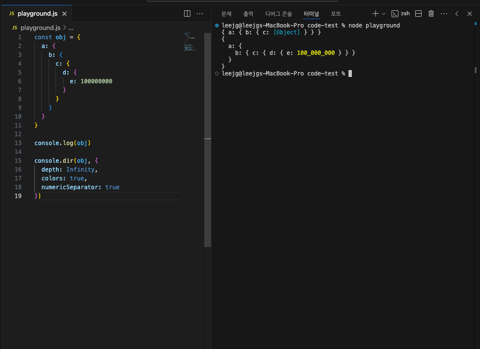

출근길에 본 재밌는 잡기술을 알게 되어 기록해본다.

<br />

보통 디버깅할 때 콘솔을 굉장히 많이 찍어본다.

간혹 뎁스가 깊은 데이터의 경우 콘솔에 `[Object]` 로 나와서 **사소한 불편함**을 느끼곤 했다.

이때 `console.dir`를 활용해볼 수 있다.

```ts
const obj = {
  a: {
    b: {
      c: {
        d: {
          e: 100000000,
        },
      },
    },
  },
}

console.log(obj) // { a: { b: { c: [Object] } } }

console.dir(obj, {
  depth: Infinity, // 데이터의 depth
  colors: true, // 콘솔 색상
  numericSeparator: true, // 숫자 가독성(_ 추가)
})
```



## 참고 문서

- [Going weirdly deep on console.log](https://www.youtube.com/watch?v=Ozg5UqaD5fg)
