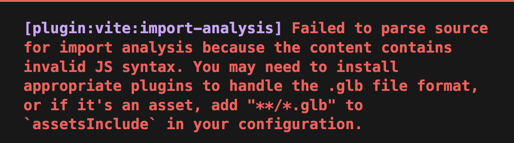

## Vite가 GLB 파일을 만났을 때

스토리북에서 3D 컴포넌트를 호출하고자 한다.

이때 3D 모델을 불러오기 위해 확장자명이 `.glb` 인 파일을 `import` 하려고 할 때 다음과 같은 에러가 발생한다.



에러 메시지를 보면 `invalid JS syntax`가 나오는데,

이는 `vite`가 `.glb` 파일을 `JS` 모듈로 해석하려고 해서 그렇다.

<br />

`vite` 에서는 기본적으로 `Static Asset` (이미지, 폰트, …) 을 처리하는 내장 기능을 제공한다.

<br />

그런데 `.glb` 확장자명은 미리 내장된 기능이 아니다.

그래서 다음과 같이 `?url` 쿼리를 통해 해당 파일을 `URL` 로 처리하는 것이 필요하다.

<br />

```tsx
import Tag from '../../asset/tag.glb?url'
```

<br />

그러면 `production` 환경에서 쓰이는 것처럼 `/asset/tag.glb` 로 처리되는 것을 확인할 수 있다.

또한 별도의 네트워크 요청으로 로드된다.


## 참고 문서

- [Static Asset Handling](https://vite.dev/guide/assets)
