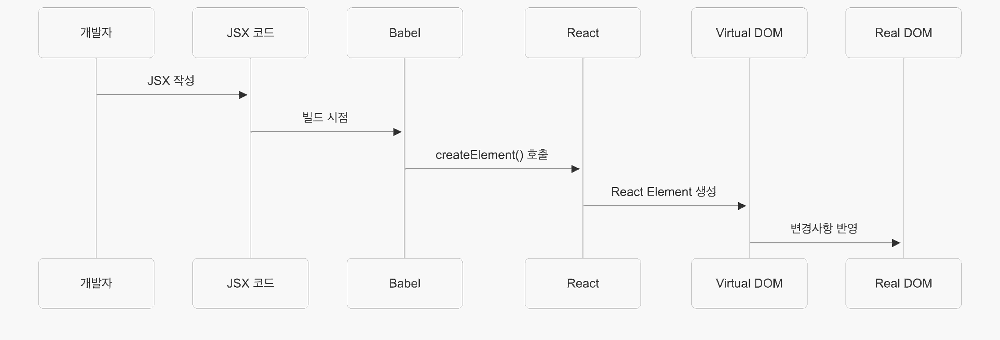

## 기본 개념

- JSX(JavaScript XML)는 JS에 XML을 추가한 확장 문법
- JSX 코드 내부에서 UI 구조를 직관적으로 표현할 수 있게 해줌
- React에서 컴포넌트의 렌더링 로직과 마크업을 함께 작성할 수 있도록 함

## 등장 배경

전통적인 웹 개발에서는 HTML, CSS, JS 가 분리되었다.

하지만 현대 웹 앱이 복잡해지면서 다음과 같은 문제가 발생했다.

- 관심사의 분리 vs 기술의 분리: 컴포넌트의 마크업과 로직이 다른 파일에 분산되어 유지보수가 어려움
- DOM 조작의 복잡성: `createElement()`, `appendChild()` 등을 반복적으로 사용하는 코드가 가독성이 떨어짐
- 템플릿 문자열의 한계: 백틱 템플릿은 타입 체크나 자동완성이 어려움

> JSX는 이러한 문제를 해결하기 위해 렌더링 로직과 마크업을 한 곳에 작성하되, 선언적이고 직관적인 문법을 제공한다.

## 동작 원리



### 1단계 - 작성

개발자가 JSX 문법으로 코드를 작성한다.

```jsx
const element = <h1 className="title">Hello</h1>
```

### 2단계 - 트랜스파일

BABEL 등이 JSX를 JS 함수 호출로 변환

```js
const element = React.createElement('h1', { className: 'title' }, 'Hello')
```

### 3단계 - 객체 생성

React Element 객체 생성

```js
{
  type: 'h1',
  props: {
    className: 'title',
    children: 'Hello'
  }
}
```

### 4단계 - 렌더링

Virtual DOM을 통해 실제 DOM으로 변환

## 개념 정리

### JSX란 무엇인가요?

JSX는 JavaScript XML의 약자로,
**JavaScript 안에서 HTML과 유사한 마크업을 작성할 수 있게 해주는 JavaScript의 확장 문법**입니다.

React에서 JSX를 사용하는 이유는 **렌더링 로직과 UI 마크업을 한 곳에서 관리**하기 위함입니다.
전통적인 방식처럼 HTML, CSS, JS를 기술별로 분리하는 대신, **컴포넌트 단위로 관심사를 분리**합니다.

JSX 동작 원리는 먼저 개발자가 JSX로 코드를 작성하면 Babel 같은 트랜스파일러가 이를 `React.createElement()` 함수 호출로 변환합니다.
`<h1>Hello</h1>`는 `React.createElement('h1', null, 'Hello')`로 변환됩니다.
최종적으로 type, props, children을 가진 React Element 객체를 생성합니다.

JSX는 템플릿 리터럴과 달리 **타입 체크가 가능**하고 **IDE의 자동완성 지원**이 우수해서 개발 생산성이 크게 향상됩니다.

### 핵심 문장

- JSX는 JavaScript 안에서 HTML 같은 마크업을 작성할 수 있게 해주는 문법입니다.
- Babel이 이를 React.createElement() 함수로 변환하고, 최종적으로 React Element 객체가 생성됩니다.
- 렌더링 로직과 UI를 한 곳에서 작성할 수 있어 컴포넌트 기반 개발에 적합하며, 타입 체크와 IDE 지원이 우수합니다.

## 참고 문서

- [Writing Markup with JSX](https://react.dev/learn/writing-markup-with-jsx)
- [What is JSX?](https://www.youtube.com/watch?v=9GtB5G2xGTY)
