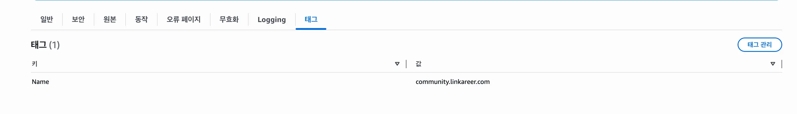
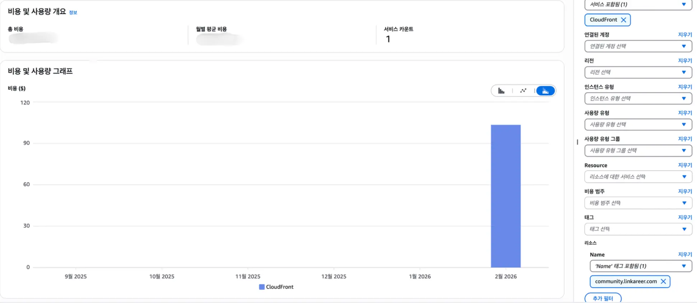

## 개요

CloudFront(CF) 배포가 여러 개인 상황이다.
이때 특정 CF 비용만 따로 확인하려면 CF 태그 설정과 Cost Explorer 필터링이 필요하다.

## CF 태그 구성

비용을 태그별로 분리하려면 CloudFront 배포에 태그를 먼저 설정해야 한다.

태그 키/값 예시: `Name: my-distribution`

## Cost Explorer로 확인

AWS 콘솔 → **결제 및 비용 관리 > 비용 및 사용량 분석 > Cost Explorer**

필터 영역에서 다음과 같이 설정한다.

- **서비스**: CloudFront
- **태그**: 앞서 설정한 Name 값 입력

## CF 요금 방식

[공식 페이지](https://aws.amazon.com/ko/cloudfront/pricing/pay-as-you-go/)

종량제(Pay-as-you-go)를 사용하고 있으며 CF 요청 1번에 최대 3가지 항목이 합산된다.

| 항목                          | 캐시 히트 | 캐시 미스 |
| ----------------------------- | --------- | --------- |
| Data Transfer Out to Internet | 발생      | 발생      |
| Data Transfer Out to Origin   | 없음      | 발생      |
| Request Pricing (per 10,000)  | 발생      | 발생      |

캐시 적중률이 높을수록 비용이 줄어든다.

### 무료 제공 (월별)

- 데이터 전송 1TB
- HTTP/HTTPS 요청 1,000만 건
- CloudFront Functions 실행 200만 건

### Data Transfer Out to Internet (GB당)

사용자에게 응답을 보낼 때 발생한다.
AWS 오리진 → CloudFront 구간은 **무료**이며,
CloudFront → 사용자 구간부터 과금된다.

월 1TB 무료 티어 초과분부터 적용된다.

| 지역                                    | 처음 1TB | 다음 9TB |
| --------------------------------------- | -------- | -------- |
| 미국/멕시코/캐나다                      | 무료     | $0.085   |
| 유럽                                    | 무료     | $0.085   |
| 일본                                    | 무료     | $0.114   |
| 한국, 홍콩, 싱가포르 등 (아시아 태평양) | 무료     | $0.120   |

### Data Transfer Out to Origin (GB당)

캐시 미스 시 CloudFront가 오리진에 요청을 보낼 때 발생한다.
캐시 히트면 발생하지 않는다.

| 지역                                    | GB당   |
| --------------------------------------- | ------ |
| 미국/멕시코/캐나다                      | $0.020 |
| 유럽                                    | $0.020 |
| 일본                                    | $0.060 |
| 한국, 홍콩, 싱가포르 등 (아시아 태평양) | $0.060 |

### Request Pricing (per 10,000)

HTTP/HTTPS 요청 건수에 따라 과금된다.
무료 티어(월 1,000만 건) 초과 후 10,000건 단위로 요금이 붙는다.

| 지역                                    | HTTP    | HTTPS   |
| --------------------------------------- | ------- | ------- |
| 미국/멕시코/캐나다                      | $0.0075 | $0.0100 |
| 유럽                                    | $0.0090 | $0.0120 |
| 일본                                    | $0.0090 | $0.0120 |
| 한국, 홍콩, 싱가포르 등 (아시아 태평양) | $0.0090 | $0.0120 |
