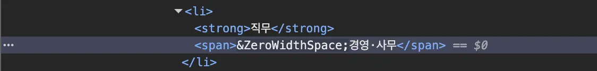

## 배경

Puppeteer로 웹 스크래핑부터 에디터 자동 입력까지 이어지는 자동화 작업에서 이상한 버그가 생겼다.

분명히 `"[서울/경영·사무] 채용 공고"` 를 입력하려 했는데,
실제로 입력된 값은 `"[서울/경영·사무] 채채용 공고"` 였다.
`채`가 두 번 입력된 것이다.

해당 이슈는 수동으로는 재현할 수가 없었다.
직접 타이핑해도, 복사 붙여넣기해도 에디터에는 정상적으로 입력됐다.
Puppeteer로 실행할 때만 에디터 이슈가 발생했다.

## 웹 스크래핑과 보이지 않는 문자

해당 텍스트는 외부 사이트에서 직무 정보를 스크래핑한 값이었다.
콘솔에 출력하면 `"경영·사무"` 처럼 보이지만,
실제로는 앞에 보이지 않는 문자가 붙어 있었다.



```ts
const duty = "​경영·사무"; // 눈에는 "경영·사무"로 보임
console.log(duty.length); // 6 (보이지 않는 문자 1개 + "경영·사무" 5개)
console.log(duty === "경영·사무"); // false
console.log(duty.trim() === "경영·사무"); // false — trim()으로 제거 안 됨
```

해당 현상은 **Zero-Width Space**로 인해 발생한 것이다.
유니코드 `U+200B`로 정의된 폭이 0인 보이지 않는 문자로,
웹 페이지에서 긴 단어의 줄바꿈 힌트 용도로 사용된다.
스크래핑 시 이 문자가 데이터에 그대로 섞여 들어온 것이다.

## Puppeteer에서 ZWS가 문제를 일으킨 이유

Puppeteer의 `page.keyboard.type()`은 텍스트를 한 글자씩 키 이벤트로 전송한다.
입력 데이터에 ZWS가 포함되어 있으면 해당 문자도 그대로 에디터에 전달된다.

Puppeteer는 **CDP(Chrome DevTools Protocol)** 를 통해 브라우저를 제어한다.
CDP는 Chrome이 외부 도구에 제공하는 디버깅 프로토콜로, 키 이벤트를 브라우저 내부에 직접 주입할 수 있다.
이 방식은 사람이 키보드로는 입력할 수 없는 문자까지 에디터에 직접 전달할 수 있다.

ZWS를 받은 에디터 내부에서 어떤 처리가 일어나는지는 에디터 구현에 따라 다르지만,
예상치 못한 문자를 받았을 때 상태가 불안정해지고 이후 입력에 영향을 줄 수 있다.
이번 경우에는 ZWS 이후 입력에서 글자가 중복되는 현상이 나타났다.

수동으로 재현이 안 됐던 이유도 여기에 있다.

| 재현 방법     | 재현 여부 | 이유                                                                           |
| ------------- | --------- | ------------------------------------------------------------------------------ |
| 직접 타이핑   | ❌        | 키보드로 ZWS를 입력할 방법이 없음                                              |
| 복사 붙여넣기 | ❌        | paste 이벤트는 텍스트를 한 번에 전달하므로 글자 단위 키 이벤트가 발생하지 않음 |
| Puppeteer     | ✅        | CDP로 키 이벤트를 직접 주입, ZWS가 그대로 에디터에 전달됨                      |

## 해결

스크래핑 시점에 ZWS를 제거했다.

```ts
// 수정 전
const duty = element?.text.trim() ?? "";

// 수정 후
const duty = element?.text.trim().replace(/\u200B/g, "") ?? "";
```

## 정리

**ZWS(Zero-Width Space)** 는 유니코드 `U+200B`로 정의된 보이지 않는 문자다.

- `.trim()`으로 제거되지 않음
- 문자열 비교(`===`)에서 예상과 다른 결과가 나옴
- 웹 스크래핑 데이터에 의도치 않게 포함될 수 있음

ZWS는 다음과 같이 명시적으로 제거할 수 있다.

```ts
// ZWS 제거
text.replace(/\u200B/g, "");

// 유사한 보이지 않는 유니코드 문자까지 넓게 제거하고 싶다면
text.replace(/[\u200B-\u200D\uFEFF]/g, "");
```
