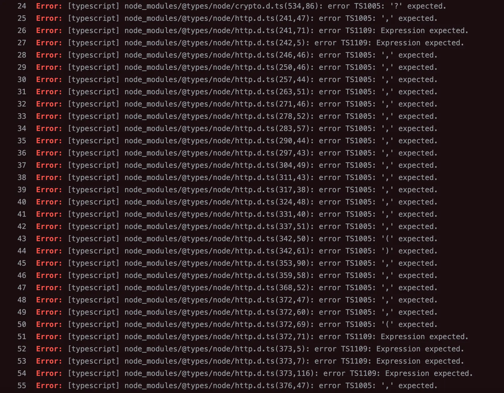

## 배경

프로젝트에 테스트 환경 구성을 위해 `vitest`를 설치했다.
그런데 설치 후 CI 린트 단계에서 갑자기 수백 개의 TypeScript 오류가 발생했다.

```
node_modules/@types/node/http.d.ts(241,47): error TS1005: ',' expected.
node_modules/@types/node/http.d.ts(242,5): error TS1109: Expression expected.
...
```



오류는 모두 `node_modules/@types/node`에서 발생하고 있었다.

## 원인

`vitest`를 설치하면서 peer dependency로 최신 `@types/node`가 함께 설치됐된 것이다.

> **peer dependency란?**
>
> 라이브러리가 직접 번들링하지 않고,
> 프로젝트에 이미 설치되어 있기를 기대하는 의존성이다.
> `vitest`는 Node.js 타입을 자신이 가져오지 않고,
> 프로젝트에 설치된 `@types/node`를 그대로 사용한다.
> `package.json`에 `@types/node` 버전이 명시되지 않은 경우 `npm install` 시 peer dependency를 충족하는 최신 버전이 자동으로 설치된다.

실제로 설치한 [`vitest@1.6.1`](https://www.npmjs.com/package/vitest/v/1.6.1?activeTab=code)의 `peerDependencies`를 확인해보면 다음과 같다.

```json
"peerDependencies": {
  "@types/node": "^18.0.0 || >=20.0.0"
}
```

`^18.0.0 || >=20.0.0` 조건을 충족하는 최신 버전인 `@types/node@25`가 자동으로 설치된 것이다.

이때 문제는 프로젝트의 TypeScript 버전이 `4.5.4`였다는 점이다.

```
@types/node@25  →  TypeScript 5.x 기준으로 작성
TypeScript 4.5.4  →  @types/node@18.x 이하와 호환
```

`@types/node@25`에는 TypeScript 4.x에서 지원하지 않는 `using` 키워드 등이 포함되어 있어 호환 오류가 발생했다.

## 해결

`package.json`에 `@types/node` 버전을 명시적으로 고정했다.

```json
"devDependencies": {
  "@types/node": "18.x"
}
```

`npm install` 후 `@types/node@18.x`로 고정되어 호환 이슈가 해결됐다.

## package.json에 히스토리를 남기는 방법

특정 버전으로 고정할 때 왜 고정했는지 이유를 함께 남겨두면,
나중에 팀원이 버전을 올리려 할 때 맥락을 파악하기 쉽겠다는 생각이 들었다.

그런데 JSON은 주석을 공식적으로 지원하지 않는다.
[How do I add comments to package.json for npm install?](https://stackoverflow.com/questions/14221579/how-do-i-add-comments-to-package-json-for-npm-install) 글에서 우회 방법에 대한 아이디어를 얻었다.

### 방법 1: `//` 키 사용

```json
"devDependencies": {
  "//": "아래 @types/node 버전을 올릴 경우 TypeScript 버전도 함께 확인하세요",
  "@types/node": "18.x"
}
```

단점: 키가 하나뿐이라 여러 패키지에 대한 개별 설명을 달 수 없다.

### 방법 2: `_comment` 키 사용

```json
"devDependencies": {
  "@types/node_comment": "vitest peer dep으로 @types/node@25 자동 설치 → TS4.x 호환 오류, 18.x 고정",
  "@types/node": "18.x"
}
```

단점: 패키지 이름을 변형하는 방식이라 직관적이지 않다.

### 방법 3: `devDependenciesComments` 키 사용 (채택)

```json
"devDependencies": {
  "@types/node": "18.x"
},
"devDependenciesComments": {
  "@types/node": "vitest 설치 시 peer dependency로 @types/node@25가 자동 설치되어 TypeScript 4.5.4와 호환 오류 발생 → 18.x로 고정"
}
```

npm은 알 수 없는 키를 무시하기 때문에 동작에 영향을 주지 않는다.

- 의존성 키와 1:1로 대응되어 어떤 패키지에 대한 설명인지 명확
- `dependencies`, `devDependencies` 각각 별도 관리 가능

## 정리

과거 설치된 패키지들을 보면 왜 의존성이 고정되었는지 의문이 생기는 경우가 많았다.
`devDependenciesComments`을 사용하면 미래의 나와 팀원 모두에게 빠르게 히스토리를 공유할 수 있게 된다.
