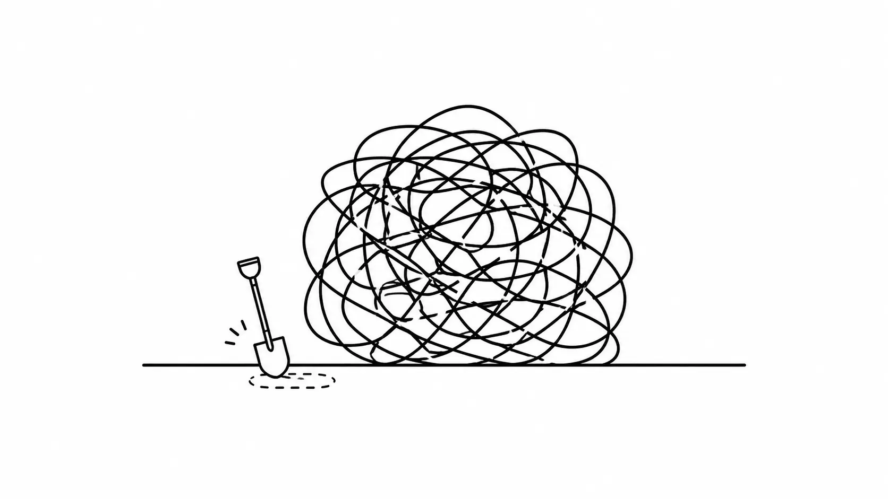
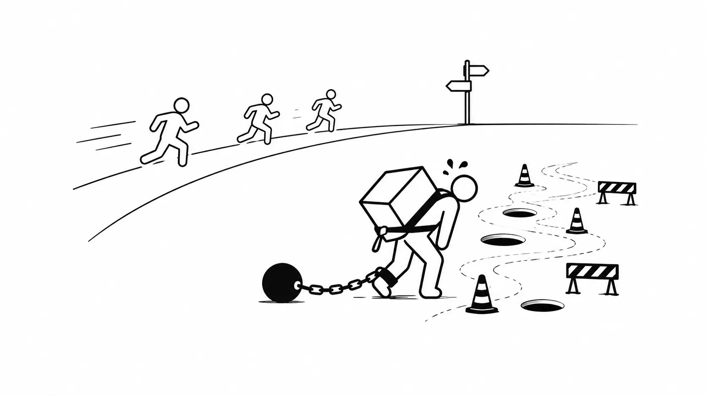
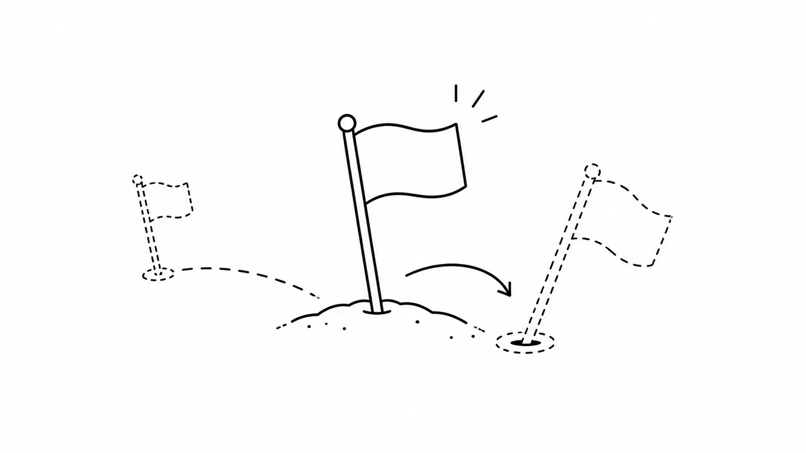
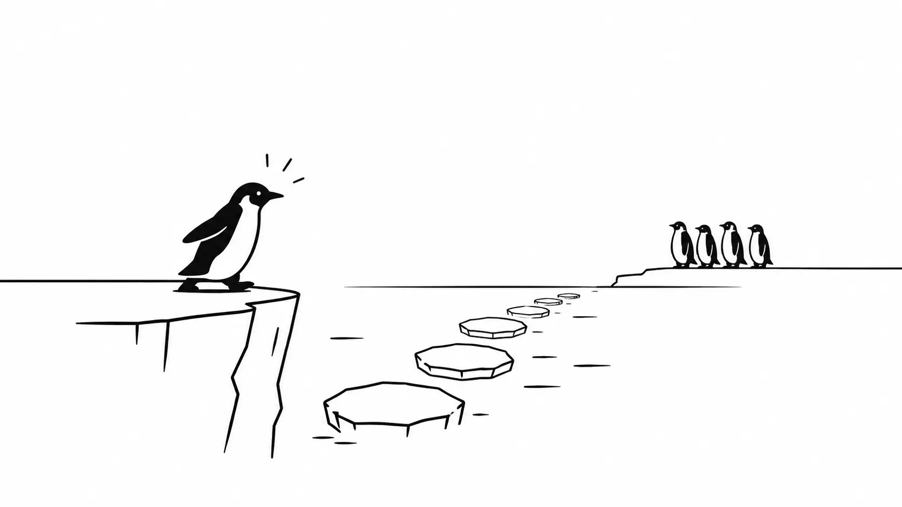

## 몇 달째 시작하지 못한 일

프로젝트 구조 전체를 바꿔야 하는 큰 작업이 있었다.

올해 초부터 이 변경이 필요하다고 줄곧 이야기해왔다.
지금의 구조로는 점점 커져가는 서비스를 감당하기 어렵게 느껴졌다.

그런데 막상 시작하려 하면 매번 같은 벽 앞에서 멈췄다.

- 작업 간의 싱크는 어떻게 맞추지
- 공수는 얼마나 들지
- 어디서 병목이 생길지
- 대체 얼마나 오래 걸릴지

이 질문들에 자신 있게 답할 수 없으니 시작도 못 한 채 몇 달이 흘렀다.

필요성은 알지만 첫 삽조차 뜨지 못하는 상황이었다.

## 남들은 뛰는데, 우리는 발이 묶여 있었다

그렇게 문제를 계속 안고 갔다.

땜질로 몸을 때우는 일이 반복됐다.
발에 채워진 족쇄로 정작 중요한 일이 아닌 곳에 시간을 흘려보내는 날이 늘어갔다.

남들은 가볍게 뛰어나가는데 우리는 무거운 환경을 끌고 다니느라 같은 거리를 가는 데도 몇 배의 힘을 썼다.
이게 손해라는 걸 알면서도 어쩌지 못하는 상황이 억울했다.
이 무게만 내려놓으면 훨씬 멀리 갈 수 있는데, 나는 정말 중요하다고 생각하는데, 대체 뭐 때문에 손도 못 대고 있는 걸까?

결국 홧김에, 거창한 계획도 완벽한 로드맵도 없이 일단 혼자서 시작해봤다.

## 버려질 각오로 꽂은 깃발

다짐의 첫 액션은 POC를 만드는 것이었다.

중요한 건 **버려질 각오를 하고 만들었다는 점**이다.

이 POC가 그대로 채택될지는 중요하지 않았다.
나는 이게 반드시 이루어져야 한다고 믿었고, 그래서 "언제든지 다시 만들어줄게"라는 마음으로 한 걸음 내디뎠다.

완성된 결과물을 내놓아야 한다는 부담 없이 언제든 다시 풀 수 있다는 가벼움으로 시작했다.

땅을 영원히 차지하는 깃발이 아니라, 언제든 뽑아 다시 꽂을 수 있는 깃발이었다.

## 두 번 푸는 게 정말 나쁠까

한 번 풀어본 시간은 그냥 사라지지 않는다.
직접 부딪쳐봐야 비로소 보이는 것들이 있다.
"어디서 막히는지, 무엇이 어려운지, 진짜 병목은 어디인지" 머릿속으로만 그리던 것들이 손에 잡히는 감각으로 바뀐다.

그렇게 두 번째 풀이는 첫 번째에서 배운 것 위에서 시작한다.

무엇보다 만들어진 결과물은 말보다 강하다.

필요하다고 말만 반복하던 상황에서 눈으로 볼 수 있는 결과물이 하나 생기자 설득의 힘이 실렸다.

## 이제 나는 코드를 쓰지 않는다

결정적으로, 이제 나는 코드를 직접 쓰지 않는다.

AI가 대신 코드를 써주니, 새로운 일을 시작하고 마이그레이션하고 레거시를 뜯어고치는 비용이 이전과 비교할 수 없을 만큼 내려갔다.

그러니 "한 번 만든 걸 버린다"는 게 예전만큼 아프지 않다.
실패해도 다시 시도하면 된다.
언제든지 다시 풀 수 있다는 마음으로 시작하면 된다.

실패의 비용이 내려갔다.
그러니 두려움만 갖지 않으면 AI와 함께 어떤 일도 할 수 있다.

## 맥락은 사라지지 않는다

AI와의 작업에서 중요한 건 코드 그 자체가 아니라 **맥락**이다.

"무엇을 왜 하려는지, 어떤 제약이 있는지, 어디서 막혔는지" 이 맥락을 잘 전달하고 유지하고 다듬으면 된다.
결과물을 한 번 버려도 처음부터 다시 시작하는 게 아니다.

코드는 버려져도 맥락은 남는다.

그래서 두 번째 풀이는 첫 번째보다 더 빠르고 정확하다.
첫 번째 시도에서 쌓인 맥락이 두 번째의 발판이 되기 때문이다.

버려지는 건 결과물이지, 그동안 쌓은 이해가 아니다.

## 퍼스트 펭귄의 자세

물론 공짜는 아니다. 싱크를 맞추고, 변경 사항을 반영하고, 갈라진 작업을 다시 합치는 비용은 분명히 감수해야 한다.

하지만 그 비용을 치르더라도,

- 한 번 풀어보며 실제 병목을 눈으로 확인할 수 있다.
- 막연했던 공수를 구체적인 숫자로 표현할 수 있다.
- "얼마나 걸릴지 모르겠다"가 "이만큼 걸린다"로 바뀐다.

**두 번째 풀이는 낭비가 아니라 가장 확실한 사전 조사**다.

한 번 뛰어들어 본 게 설령 버려지더라도, 그 길을 보고 나머지가 안심하고 따라올 수 있다.

"한 번에 완벽하게"를 기다리며 몇 달을 멈춰 있는 것보다, 일단 버려질 각오로 먼저 뛰어드는 게 훨씬 빠르게 답에 도달한다.

## 될 때까지 한다

중요하다고 생각하는 건 될 때까지 하자.

실패하면 다시 시도하면 된다. 첫 시도가 버려져도 맥락은 남고, 코드는 다시 써주면 되고, 두 번째는 더 빨라진다.

두 번 푸는 걸 두려워하지 않게 되니 그동안 "너무 커서 못 건드리겠다"며 미뤄둔 일들이 다르게 보이기 시작했다.
레거시도, 대규모 마이그레이션도, 결국 한 번 풀고 버리고 다시 풀면 되는 일이었다.

몇 달을 멈춰 세웠던 큰 작업이 비로소 움직이기 시작했다.
